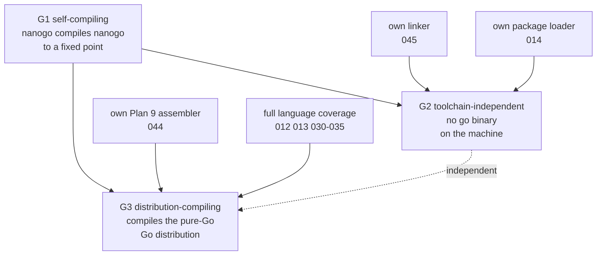
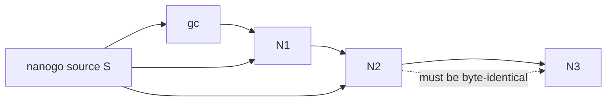

# Bootstrap gates

Implements [000](000-decisions.md) decision 2. "Bootstrap" names three different
properties. They are reached at different times, they need different work, and
one does not imply another. This spec defines them, gives each a mechanical
test, and says what each one costs.

## The three gates

G2 and G3 are siblings. Neither needs the other. G3 needs an assembler because
the runtime has hand-written `.s` files; G2 needs a linker and a package loader
because it must run with no `go` binary present. It is possible to compile the
whole distribution while still calling `go tool link`, and it is possible to be
free of the toolchain while still failing on the runtime.

### G1: self-compiling

nanogo compiles its own source, and the compiler that results is stable.

Allowed at G1: `go tool link` produces the executable. `go list` resolves the
import graph. Any standard-library package is in nanogo's own dependency set.
The build runs in **hosted mode** ([000](000-decisions.md) decision 10), so `gc`
still compiles the runtime and the packages nanogo has not reached. The
standard library may come as archives out of a nanogo distribution's own `pkg`
tree ([054](054-distribution.md)) rather than out of the installed toolchain;
that is where the archives are read from and not who compiled them. Only
`darwin/arm64` works.

The hosted-mode allowance is what separates G1 from G3. G1 asks whether nanogo
can compile *nanogo*. It does not ask whether nanogo can compile *everything*.

Not allowed at G1: any part of nanogo that `gc` can compile but nanogo cannot.

### G2: toolchain-independent

nanogo builds nanogo on a machine with no `go` binary, given only nanogo, a
linker it owns, and the source.

This is the gate that turns nanogo from a program that rides the Go toolchain
into a toolchain. Its cost is two specs: [045](045-linker.md) and
[014](014-package-loader.md). Neither is small, and neither is as large as it
sounds, because nanogo only has to link what nanogo emits.

`golang.org/x/tools/go/packages` shells out to `go list`. That makes it a G2
blocker and not a G1 one, and it is the reason the package loader is a spec of
its own rather than a paragraph.

### G3: distribution-compiling

nanogo compiles a checkout, the `src` tree of a Go distribution, in the
`CGO_ENABLED=0` configuration, and the result passes the distribution's own
tests. The checkout is an argument and this deck names no path to one
([062](062-distribution-build.md)).

The scale here is different in kind from G1. The runtime is 112,977 lines of
Go, with the hand-written assembly of the paragraph above beside that and not
in the figure. Every `//go:` pragma the runtime relies on must be honoured
exactly, `//go:nosplit` must actually be enforced, write barriers must be
elided in the places the runtime requires and present everywhere else, and
`//go:linkname` must resolve across package boundaries.

## The fixed point

G1's test is the three-stage build. It is the standard bootstrap protocol and it
is worth writing out, because the property it proves is easy to state loosely
and get wrong.

Let $C_{gc}$ be the compiler binary produced by compiling nanogo's source $S$
with `gc`, and let $\mathrm{compile}(K, S)$ be the binary that compiler $K$
produces from source $S$.

$$
\begin{aligned}
N_1 &= \mathrm{compile}(C_{gc},\ S) \\
N_2 &= \mathrm{compile}(N_1,\ S) \\
N_3 &= \mathrm{compile}(N_2,\ S)
\end{aligned}
$$

The gate is

$$
N_2 = N_3
$$

as an exact comparison of bytes.

### Why $N_2 = N_3$ and not $N_1 = N_2$

$N_1$ is nanogo's source compiled by a different compiler. It is nanogo's
semantics, but `gc`'s code generation, inlining choices, and layout. There is no
reason for its bytes to match anything nanogo produces, and requiring that would
be requiring nanogo to reproduce `gc`.

$N_2$ is the first binary that nanogo generated. $N_3$ is generated by $N_2$
from the same source. If nanogo is deterministic and correct, $N_2$ and $N_3$
are the same program compiled by the same compiler from the same input, so they
must be identical bytes.

An inequality $N_2 \ne N_3$ means one of three things, and they are
distinguishable:

1. nanogo is non-deterministic. Detect this first, by compiling $S$ twice with
   $N_1$ and comparing. [053](053-determinism.md) exists to keep this cause off
   the table.
2. $N_1$ and $N_2$ disagree on some program. Since both compiled $S$, and $N_2$
   came out of $N_1$, a miscompile in $N_1$ has propagated.
3. nanogo's output depends on something outside $S$, such as a path, an environment
   variable, a file order.

### A caveat that must not be skipped

$N_2 = N_3$ is a necessary condition and not a sufficient one. A compiler that
miscompiles a construct *that it does not itself use* reaches the fixed point
while being wrong. A compiler that miscompiles a construct in a way that
reproduces stably also reaches it. This is the reason
[000](000-decisions.md) decision 6 puts the external corpora ahead of the fixed
point, and the reason [004](004-conformance.md) is a foundation spec and not a
testing appendix.

This is not a hypothetical. `internal/audit`'s probe corpus compiles each probe
twice, once with nanogo and once with `gc`, runs both and compares, and three
probes are classed `wrong` today: `buildinfo-named`, `embed-directive` and
`panic-fires`. `internal/audit/testdata/ratchet.txt` names each with its
symptom. A fixed point reached while any of the three stands would prove
nothing about them, which is what the paragraph above says and what the corpus
is there to catch instead.

## The dependency retirement ladder

Each gate is defined by what is no longer present. This table is the checklist.

| | G1 | G2 | G3 |
| --- | --- | --- | --- |
| `gc` present | yes, seeds $N_1$ | seeds only | seeds only |
| `go tool link` | used | **gone** ([045](045-linker.md)) | used or gone |
| `go list` | used | **gone** ([014](014-package-loader.md)) | gone |
| `go tool asm` | used, via `gc` in hosted mode | used | **gone** ([044](044-plan9-assembler.md)) |
| Targets | `darwin/arm64` | `darwin/arm64` | + `linux/amd64` |
| `cgo` | no | no | no, by [000](000-decisions.md) decision 8 |
| Language coverage | what nanogo's own source uses | same | all of it |

The "what nanogo's own source uses" row is the one that hides work. It is a
large subset, because nanogo is a compiler: it uses generics in the `types2`
fork, and interfaces, closures, `defer`, maps, slices and `unsafe` in its
object writer. It is not the whole language. Measured over the non-test source
it has no reflection-heavy code, no assembly of its own, and neither a `go`
statement nor a `select`: nanogo compiles one package in one process today. The
per-function parallelism [002](002-architecture.md) plans will put both back on
this row, and the row is what nanogo's source uses, not what it is allowed to.

## What the seed means

nanogo is seeded by `gc` and this is not a compromise to be retired. A bootstrap
needs a first compiler that was not built by itself, and Go's own history is the
same shape: `gc` was C until Go 1.5, and the modern toolchain is seeded by an
older Go release.

The property that matters is not "no other compiler was ever involved". It is
that after $N_2$, no other compiler is *needed*. That is what the fixed point
establishes.

## Where the gates stand

No gate is reached, and none has a mechanical test in the repository. The
three-stage build above is a procedure nobody can run yet, for the reason
[060](060-selfhost.md) records: the number of nanogo's own packages that nanogo
compiles is zero. The refusals are the ones [060](060-selfhost.md) lists, led by
a package with assembly in it and by a declared type whose run-time descriptor
[032](032-type-descriptors-and-itabs.md) cannot write; a package-level variable
no longer refuses a package by itself, but one of type `error` still does.
[060](060-selfhost.md) carries the census over the 27 packages the closure of a
`func main() {}` holds, and the total on its own carries none of the
composition.

What exists is the ladder's first rung, and it is wider than the rung was.
`gc` seeds the build, `go list` resolves the import graph
([014](014-package-loader.md)'s G1 half), and `go tool link` produces every
executable the tests run. Two things have been added under that rung without
moving a gate:

- **Export data goes both ways** ([015](015-export-data.md)). nanogo reads
  `gc`'s and writes its own, and `gc` reads back what nanogo wrote for 296 of
  the 375 standard library packages, refusing none of the 296. The 79 it will
  not write are refused for a generic declaration. So a nanogo-compiled package
  and a `gc`-compiled one can import each other, which is what hosted mode
  needs.
- **A distribution is a tree nanogo can build against** ([054](054-distribution.md)).
  `nanogo build` reads the standard library archive by archive out of a nanogo
  distribution's `pkg/GOOS_GOARCH` tree when one resolves. That changes where
  the archives come from and not who compiled them: the tally line a build
  prints reads 0 of 27 packages compiled by nanogo, and until that number moves
  the distribution is `gc`'s work under a nanogo name.

Neither is a gate. G1 needs nanogo to compile nanogo, and `go list` and
`go tool link` are still on the machine for G2 to retire.

## Order

[003](003-sequencing.md) has the milestone order. The gates do not map one to
one onto milestones: G1 is reached at the end of a run of milestones, and G2 and
G3 are each reached inside one.

## What was wrong

**The G1 allowance named `go/types`, and nanogo does not import it.** The spec
listed `go/types` as a standard-library package in nanogo's dependency set. The
checker is the vendored fork `types2` ([000](000-decisions.md) decision 1), so
it is nanogo source, not a dependency. This was found by auditing the spec
against the import list of the non-test source: the only `go/*` packages the
compiler imports are `go/build` in `loader/constraint.go` and `go/constant` and
`go/token` inside the fork. The allowance still holds for the rest of the
standard library, which is what the sentence now says.

**G3 named one machine's path.** The gate read "nanogo compiles
`~/dev/go.dev/go`". Nothing in this repository holds that checkout or any
other, and [062](062-distribution-build.md) had already recorded the same
defect against itself. The gate names the tree by what it is.

**The runtime's 112,977 lines were said to be partly not Go.** The figure is
the runtime package's non-test Go files and nothing else. The hand-written
assembly the sentence was reaching for is real, is why G3 needs
[044](044-plan9-assembler.md), and is not in the count.
[000](000-decisions.md) decision 4 carried the same wording and is corrected
with it.

**"Where the gates stand" was a rung behind the tree.** It gave the G1 blocker
as a refusal of packages with assembly and of package-level variables, and
`ssagen` writes a package-level variable's data symbol now, so that half of the
reason had gone. It also listed only `gc`, `go list` and `go tool link` as what
exists, which was written before export data moved in both directions and
before [054](054-distribution.md)'s tree. Both are added, and both are marked
as what they are, work under the first rung rather than progress along the
ladder.

**The language-coverage row said nanogo's source uses goroutines.** It does
not. There is no `go` statement and no `select` in the non-test source of any
package, `types2` included, so the row named work that the gate does not
actually require yet. Both are struck from the list of what is used and stated
as what is absent, with the reason they will return.

**The G1 allowance did not say where the standard library comes from.** It
reads out of a nanogo distribution's `pkg` tree when one resolves and out of the
installed toolchain otherwise, and a reader who saw only the second could take
the first for a gate violation. It is not one: the archives in that tree are
`gc`'s.
