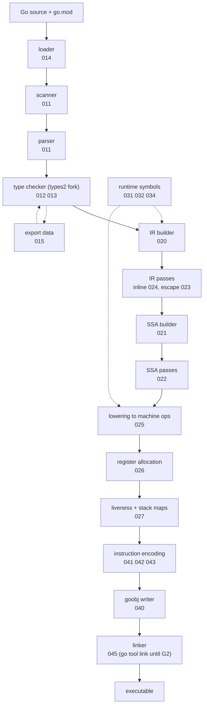

# Architecture

Implements [000](000-decisions.md) decision 5. This spec fixes the shape of the
compiler: what the stages are, what flows between them, and which package owns
each. Leaf specs fill in stages. None of them may add a stage.

## The pipeline



Two representations exist and no others.

**The typed IR** ([020](020-ir.md)) is a tree. It is the type-checked program
with Go semantics still visible: a range statement is a range statement, a map
index is a map index, a method value is a method value. Passes that need to
reason about Go rather than about machines run here — inlining
([024](024-inlining-and-devirtualization.md)) and escape analysis
([023](023-escape-analysis.md)).

**The SSA graph** ([021](021-ssa-construction.md)) is a control-flow graph of
basic blocks holding values in static single assignment form. It starts
target-neutral and ends target-specific. Nothing above it knows about registers;
nothing below it knows about Go statements.

The boundary between them is where Go semantics are lowered into operations and
runtime calls. After the SSA builder there is no such thing as a map index. There
is a call to `runtime.mapaccess1` ([031](031-runtime-lowering.md)).

## Why two and not one

A single IR would have to be both, and each half would pay. Escape analysis
needs to see that a value is assigned to a field of a heap object, which is a
statement about Go's object graph. Register allocation needs to see that a value
is live across a call, which is a statement about a machine. Encoding both in
one representation is the design that makes compilers unreadable, and
[000](000-decisions.md) decision 10 is a budget that will not survive it.

The cost is one lowering step that must be complete: every Go construct has to
be gone by the end of SSA construction. [020](020-ir.md) carries the list, and
the list being exhaustive is what makes the SSA layer simple.

## Package layout

```
golang.design/x/nanogo
├── cmd/nanogo/            driver, gc-compatible flags          050
├── syntax/                positions, scanner, parser, AST      011
├── types2/                forked type checker                  012 013
├── loader/                go.mod, build tags, import graph     014
├── export/                package export data                  015
├── ir/                    typed tree IR, IR passes             020 023 024
├── ssa/                   SSA values, blocks, passes           021 022 025 026 027
│   ├── rules/             lowering rules per target            025
├── abi/                   calling conventions, frame layout    030
├── rtsym/                 runtime symbol names and signatures  031 032 034
├── obj/                   goobj container writer               040
│   ├── arm64/             encoder                              041 042
│   └── amd64/             encoder                              041 043
├── asm/                   Plan 9 assembler (G3)                044
├── link/                  linker (G2)                          045
└── dwarf/                 debug info                           046
```

Two rules govern this layout, and they are the ones worth enforcing in review:

**`ir` does not import `ssa`, and `ssa` does not import `ir`.** The SSA builder
lives in `ssa` and takes the IR as input through an interface that `ssa`
declares. If that gets inverted, the two representations have merged and
decision 5 is gone.

**Nothing below `ssa` imports `types2`.** Types reach the backend as layout
facts — size, alignment, pointer map — not as `types2.Type` values.
[020](020-ir.md) defines the boundary type that carries them.

## Data that crosses the whole pipeline

Three things are threaded end to end and are specified once rather than in each
stage.

| Thread | Owner | Why it crosses everything |
| --- | --- | --- |
| Positions | [010](010-scanner-and-positions.md) | Every diagnostic, every DWARF line entry, and every `PCDATA` line table entry needs the source position of the thing being emitted. |
| Symbol names | [032](032-type-descriptors-and-itabs.md) | The linker's contract. Names are decided once, in one place, and the encoder never invents one. |
| Determinism | [053](053-determinism.md) | Any stage can break it with one map range. |

## Where the GPU target attaches

[070](070-gpu-target.md) consumes SSA after the target-neutral passes of
[022](022-optimization-passes.md) and before lowering
([025](025-lowering-and-rules.md)). It supplies its own lowering and its own
emitter, and it does not reach the register allocator, because a shading
language target does not allocate registers.

That is the whole attachment. If a GPU requirement ever needs a change above
that point, [000](000-decisions.md) decision 5 refuses it.

## Compilation unit and parallelism

The unit is the package, as it is for `gc`. Packages compile independently given
the export data of their imports, so the build is a topological walk over the
import graph with one nanogo process per package
([051](051-build-integration.md)).

Inside a package, functions are independent from SSA construction onward. That
is the parallelism boundary, and [053](053-determinism.md) constrains it: results
are merged in declaration order, never in completion order.
