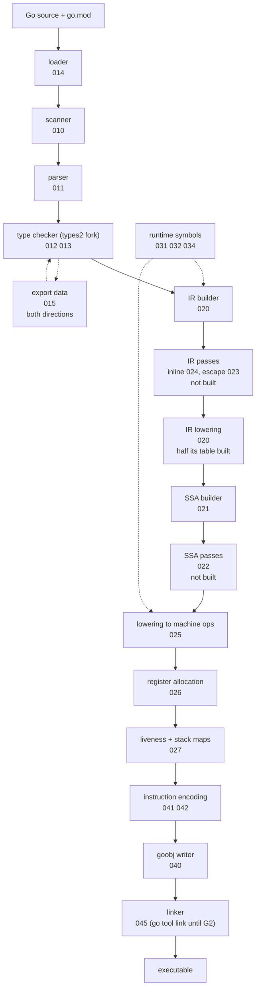

# Architecture

Implements [000](000-decisions.md) decision 5. This spec fixes the shape of the
compiler: what the stages are, what flows between them, and which package owns
each. Leaf specs fill in stages. None of them may add a stage.

## The pipeline



Two representations exist and no others.

**The typed IR** ([020](020-ir.md)) is a tree. It is the type-checked program
with Go semantics still visible: a range statement is a range statement, a map
index is a map index, a method value is a method value. Passes that need to
reason about Go rather than about machines run here: inlining
([024](024-inlining-and-devirtualization.md)) and escape analysis
([023](023-escape-analysis.md)).

**The SSA graph** ([021](021-ssa-construction.md)) is a control-flow graph of
basic blocks holding values in static single assignment form. It starts
target-neutral and ends target-specific. Nothing above it knows about registers;
nothing below it knows about Go statements.

The boundary between them is where Go semantics are lowered into operations and
runtime calls. `ir.Lower` is the pass that crosses it, and it runs over the
tree before construction sees it, so construction can refuse a Go-specific node
rather than handle one. After it there is no such thing as a map index. There is
a call to `runtime.mapaccess1` ([031](031-runtime-lowering.md)).

## Why two and not one

A single IR would have to be both, and each half would pay. Escape analysis
needs to see that a value is assigned to a field of a heap object, which is a
statement about Go's object graph. Register allocation needs to see that a value
is live across a call, which is a statement about a machine. Encoding both in
one representation is the design that makes compilers unreadable, and a
compiler nobody can read end to end is one nobody can correct.

The cost is one lowering step that must be complete: every Go construct has to
be gone before SSA construction. [020](020-ir.md) carries the list with a state
per row, and the list being exhaustive is what makes the SSA layer simple.

## Package layout

What exists today:

```
golang.design/x/nanogo
├── cmd/
│   ├── nanogo/            the process boundary                 050
│   └── nanogo-dist/       builds and audits a distribution     054
├── driver/                gc-compatible flags, toolexec        050 051
├── syntax/                positions, scanner, parser, AST      010 011
├── types2/                forked type checker                  012 013
│   ├── errors/            vendored error codes                 012
│   └── gen/               the generator that ports the fork    012
├── loader/                build tags, import graph, go list    014
├── export/                gc's export data, read and written   015
│   └── pkgbits/           the bit stream it codes              015
├── ir/                    typed tree IR, type layout, lowering 020
├── ssa/                   SSA values, blocks, passes, ABI      021 025 026 027 030
│   └── rules/             lowering rules per target            025 042
├── rtsym/                 runtime symbol names and signatures  031
├── rtype/                 type descriptor encoder              032
├── obj/                   goobj container writer               040
│   └── arm64/             encoder                              041 042
├── ssagen/                SSA to machine code, prologues       027 035 041
├── dist/                  distribution tree, manifest, tally   054
└── internal/              the gates
    ├── gotest/            Go's own test corpus                 004
    ├── covercheck/        the per-package coverage floor       004
    ├── e2e/               install, go build -toolexec, run     051
    ├── release/           a tarball is the release it claims   054
    ├── audit/             the probe corpus                     none
    └── hygiene/           checks over this repository's source none
```

The two rows reading `none` are gaps, not omissions. No spec names
`internal/audit`, and `internal/hygiene` is cited as a gate by
[051](051-build-integration.md) and [054](054-distribution.md) without either
owning it. Both are the shape [000](000-decisions.md) decision 5 names for
`ssagen`: a part of the tree that works and that nothing specifies.

Planned and not written. Each is named here so that a reader who looks for the
package and does not find it knows which spec owns the absence:

```
├── obj/amd64/             encoder                              041 043
├── asm/                   Plan 9 assembler (G3)                044
├── link/                  linker (G2)                          045
└── dwarf/                 debug info                           046
```

Three departures from the layout this spec first drew, each found by building
it:

**`abi/` was never created.** The calling convention is `ssa/abi.go`. A separate
package would have to import `ssa` for the value and block types the assignment
walk rewrites, and `ssa` would have to import it back to run the pass, which is
the cycle the rules below forbid. The convention is a pass over SSA, so it lives
with the passes.

**`ssagen/` was not in the layout at all.** The stage between the last SSA pass
and the object writer, which encodes instructions, builds the prologue, emits
relocations and attaches stack maps, had no package and no spec. It is 3,241
non-test lines. Three audits of the deck found the same gap independently.

**The IR passes of [023](023-escape-analysis.md) and
[024](024-inlining-and-devirtualization.md) do not exist**, so `ir/` holds the
tree and the type layout and nothing else.

Two rules govern this layout, and they are the ones worth enforcing in review:

**The dependency runs one way: `ssa` may import `ir`, and `ir` may not import
`ssa`.** An earlier version of this spec forbade both directions and had the
SSA builder take the IR through an interface `ssa` declared. That is stricter
than the design needs and it contradicted itself the moment anything in `ssa`
had to name `*ir.Type`, `*ir.Object` or an `ir.Op`, which the builder, the
address-taken decision and the verifier all do. What matters is that there is no
cycle, so that the two representations stay distinct and decision 5 holds.

**Nothing below `ir` imports `types2`.** This is the rule that keeps the
layering intact. Types reach the backend as layout facts, size, alignment and
pointer map, not as `types2.Type` values, and `*ir.Type` is the object that
carries them. [020](020-ir.md) defines it. If `types2` were reachable from the
backend, the boundary would exist only by convention.

## Data that crosses the whole pipeline

Three things are threaded end to end and are specified once rather than in each
stage.

| Thread | Owner | Why it crosses everything |
| --- | --- | --- |
| Positions | [010](010-scanner-and-positions.md) | Every diagnostic, every DWARF line entry, and every `PCDATA` line table entry needs the source position of the thing being emitted. |
| Symbol names | [032](032-type-descriptors-and-itabs.md) | The linker's contract. Names are decided once, in one place, and the encoder never invents one. |
| Determinism | [053](053-determinism.md) | Any stage can break it with one map range. |

## Where the GPU target attaches

[070](070-gpu-target.md) consumes SSA after the target-neutral passes of
[022](022-optimization-passes.md) and before lowering
([025](025-lowering-and-rules.md)). It supplies its own lowering and its own
emitter, and it does not reach the register allocator, because a shading
language target does not allocate registers.

That is the whole attachment. If a GPU requirement ever needs a change above
that point, [000](000-decisions.md) decision 5 refuses it.

## Compilation unit and parallelism

The unit is the package, as it is for `gc`. Packages compile independently given
the export data of their imports, so the build is a topological walk over the
import graph with one nanogo process per package
([051](051-build-integration.md)).

Inside a package, functions are independent from SSA construction onward. That
is the parallelism boundary, and [053](053-determinism.md) constrains it: results
are merged in declaration order, never in completion order.

Neither boundary is exploited yet. nanogo compiles a package's functions in
declaration order in one goroutine, and its non-test source holds no `go`
statement at all ([001](001-bootstrap-gates.md)'s coverage row). The merge rule
is stated before the parallelism exists so that it is not decided later by
whichever pass is made concurrent first.

## What was wrong

**`export/` was in both layout blocks at once.** It was listed as what exists,
as a reader, and again as planned and not written. The package exists, reads
`gc`'s export data and writes nanogo's, and `gc` reads back what it wrote for
275 of the 375 standard library packages ([015](015-export-data.md)). The
planned entry was a claim about a package that had already been built, so it is
gone from that block and the surviving entry says the package does both
directions. Nothing was removed to settle the contradiction: the reader half of
the old gloss is still there, with the writer half beside it.

**Parallelism read as built.** The boundary and the merge rule were stated
without saying that nothing runs concurrently: nanogo has no `go` statement in
its non-test source. The rule stays, as the rule it is, and the sentence after
it says the parallelism is not there yet.

**The layout was missing every package the distribution work added.** `dist/`
builds and audits a distribution tree and owns its manifest and tally,
`cmd/nanogo-dist/` is the command over it, and `internal/` had grown `audit`,
`gotest` and `release` since the line that named only `covercheck`, `hygiene`
and `e2e`. A reader looking for one of them found no entry and no spec named as
owning the absence, which is the failure the "planned and not written" block
exists to prevent. All are listed, `cmd/` is drawn as a directory with two
commands under it rather than as one path, and `internal/` as one with its six.
Four carry the spec that names them. `internal/audit` and `internal/hygiene`
carry `none`, because reading each spec that mentions them found no owner, and
guessing one would have been worse than the blank: the block exists so that a
reader can go from a package to the spec that answers for it.
