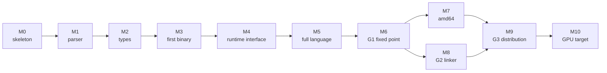

# Sequencing

The order of work. This is the file to read before picking anything up, and it
is not the order the specs are numbered in. It will change as milestones land;
the deviations are recorded at the bottom rather than edited away.

## Milestones

### M0: skeleton

Driver, flag parsing, package layout, CI. The spikes that
[000](000-decisions.md) decision 3 cites are run and kept.

**Done when** `nanogo -V=full` answers the `go` command's build-ID protocol
([050](050-driver.md)), a passthrough build with `-toolexec=nanogo` completes by
execing `gc` for everything, the package tree of [002](002-architecture.md)
exists with doc comments, and all three spikes run from a clean checkout.

The passthrough build is the first real gate. It proves the driver, the flag
parsing, and the `-V=full` protocol before any compilation exists, and
[`spikes/toolexec`](../spikes/toolexec) is the reference implementation of it.

### M1: parser

[010](010-scanner-and-positions.md), [011](011-parser-and-ast.md). The whole Go
grammar including generics. No type checking.

**Done when** nanogo parses every `.go` file that `go/parser` parses, over the
Go trees the corpus test reads, and rejects every file `go/parser` rejects.
Disagreements are enumerated, not tolerated.

This gate is worth its cost. The corpus is 16,293 files that exercise every
corner of the grammar, and it costs nothing to collect.

### M2: types

[012](012-type-checking.md), [013](013-generics.md), [015](015-export-data.md),
and the parts of [014](014-package-loader.md) that G1 needs. `types2` is
vendored and re-pointed at nanogo's syntax tree.

**Done when** nanogo type-checks every package in the distribution that
`go/types` checks, produces the same errors for `test/`'s `errorcheck` files,
and round-trips export data for every standard library package.

### M3: first binary

[020](020-ir.md), [021](021-ssa-construction.md),
[025](025-lowering-and-rules.md), [026](026-register-allocation.md),
[040](040-object-format.md), [041](041-instruction-encoding.md),
[042](042-arm64-backend.md). Enough of each to compile a program that uses
integers, control flow, and function calls.

**Done when** a single leaf package, compiled by nanogo under
`go build -toolexec=nanogo` while `gc` compiles everything else, links and runs
with its tests passing.

Hosted mode ([000](000-decisions.md) decision 10) is what makes this gate
narrow. The runtime, the standard library, and the linker are all `gc`'s. The
only new thing in the binary is one package's worth of nanogo code generation,
so a crash has one suspect.

This is the milestone where the object format decision is proved or disproved in
practice, so it is deliberately early.

### M4: runtime interface

[027](027-liveness-and-stackmaps.md), [030](030-abi.md),
[031](031-runtime-lowering.md), [032](032-type-descriptors-and-itabs.md),
[033](033-closures-defer-panic.md), [034](034-write-barriers.md),
[035](035-goroutines-and-stack-growth.md).

This is the largest milestone and the one that decides whether the project is
real. Everything in it is a contract with code nanogo did not write and cannot
change.

**Done when** `fmt.Println` works, a program that allocates under a
`GOGC=1` stress loop survives, `defer`/`panic`/`recover` behave, goroutines run
and the stack grows, and the GC scans nanogo-generated frames precisely.

The measure of progress inside M4 is the number of standard library packages
that compile with nanogo in hosted mode and still pass their own tests. It
starts at one and is tracked.

### M5: full language

Generics instantiation, `select`, complex numbers, the remaining conversions,
`//go:` pragmas, and everything else the specification requires but nanogo's own
source does not use.

**Done when** the `test/` corpus passes: `run`, `runoutput`, `errorcheck`,
`compile`, and `build` directives all honoured.

That gate is now measurable rather than aspirational. `internal/gotest` vendors
the corpus and carries out `run`, `compile` and `errorcheck` against `gc` as
the oracle ([004](004-conformance.md)), and
`internal/gotest/testdata/ratchet.txt` records what passes today. M5 is
finished when the refusals in that report are gone; the report's ranked
breakdown of refusal reasons is the work list, in the order that buys the most
files.

### M6: G1

Self-host. [060](060-selfhost.md).

**Done when** $N_2 = N_3$ byte for byte, per [001](001-bootstrap-gates.md).

### M7: amd64

[043](043-amd64-backend.md). The test of [000](000-decisions.md) decision 5.

**Done when** the same middle end serves both targets with no target name
appearing above [025](025-lowering-and-rules.md), and G1 holds on
`linux/amd64`.

### M8: G2

[045](045-linker.md), the rest of [014](014-package-loader.md).

**Done when** nanogo builds nanogo in a container with no `go` binary present.

### M9: G3

[044](044-plan9-assembler.md), [046](046-debug-info.md),
[062](062-distribution-build.md).

**Done when** nanogo compiles the `CGO_ENABLED=0` distribution and the
distribution's tests pass on the result.

### M10: GPU target

[070](070-gpu-target.md). Post-v1 and unscheduled.

## Where the risk is

Risks are listed with the milestone that retires them, not with a probability.

| Risk | Retired at | How it is retired |
| --- | --- | --- |
| The object format seam does not work | M3 | The first binary either runs or it does not. This is why M3 is narrow and early. |
| `gc` object compatibility is unmaintainable across a release | M3 | Detected the first time the pin is bumped. The fallback is whole-world mode, stated in [000](000-decisions.md) decision 10. |
| GC metadata is wrong in a way that only shows under load | M4 | Allocation stress with `GOGC=1` and `GODEBUG=gccheckmark=1`, not a unit test. |
| The forked type checker cannot be re-pointed at nanogo's syntax tree cheaply | M2 | [012](012-type-checking.md) names the interface it is re-pointed through. If the fork resists, the fallback is to keep `go/ast` under the checker and translate, at a cost stated in that spec. |
| Generics instantiation is a rewrite rather than a port | M5 | Deferred deliberately: nanogo's own source uses generics, so M6 cannot be reached without it, and M5 is where it is confronted with the corpus available. |
| `//go:linkname` and `//go:nosplit` semantics are subtler than documented | M9 | The runtime is the only consumer that cares, and M9 is where it is compiled. |

## Where the work stands

**M0 and M1 are complete. M2 is complete except for a generic declaration in
export data. M3 meets every clause of its gate but one. M4 is partly built and
its gate is not met.**

| Milestone | State | Gate |
| --- | --- | --- |
| M0 skeleton | done | a `go build -a -toolexec=nanogo` completes by delegating |
| M1 parser | done | 19,674 files agree with `go/scanner`, 16,293 with `go/parser` |
| M2 types | done, less a generic declaration in export data | 623 subtests, a 375-entry errorcheck corpus, checks nanogo's own source, reads and writes gc's export data |
| M3 first binary | **in progress** | a leaf package compiles under `go build -toolexec=nanogo`, links against `gc`-compiled code and the real runtime, and runs; the clause "with its tests passing" is unmet, because `go test -toolexec` is not run |
| M4 runtime interface | **in progress** | liveness, stack maps, the ABI and the stack growth check are built, and a nanogo-allocated object survives a collection. The type descriptors an allocation needs are written, and a package that declares a type whose method set the IR type does not hold is refused. `defer` and `go` of a function value run, a captureless closure runs, and a deferred call runs while the goroutine panics on a runtime-raised panic; a `panic` statement, a read of the value `recover` returns, itabs, write barriers and every capture are not built |
| M5 to M10 | not started | |
| the distribution | built, and reporting a zero | a tarball unpacks into a tree `driver.FindRoot` resolves, and its 27 archives account for themselves: 0 by nanogo, 27 by `gc` |

### What M3 reached, and what it did not

The pipeline runs from source text to a `goobj` file. `ssagen`'s
`TestLinkAndRun` takes 25 programs through all of it to a process that returns
the right answer, and several of them call into or are called from
`gc`-compiled code. That retired the milestone's stated risk: **`go tool link`
links a nanogo-written object against the real Go runtime into a binary that
runs.** [040](040-object-format.md) records the result, and the object format
decision of [000](000-decisions.md) decision 3 is no longer a judgement call.

M3's own gate is a leaf package compiled under `-toolexec`, and
`internal/e2e` meets most of it. A real `go build -toolexec=nanogo` over a
module nobody wrote for a harness gives nanogo the main package and `gc`
everything beneath it, the real linker joins the two, and the program runs and
returns the answer it computed. The programs that go that route grow with the
language, and each one is there for a claim:

| Program | What it proves |
| --- | --- |
| a counted loop | the assignment statement, a short variable declaration in a loop body, and a `for` post list |
| an integer division by zero | the traceback names both frames with the right file and line |
| a wide multi-value result | the ABI homes a result the register set cannot hold |
| a package that imports a `gc`-compiled library | `export/` reads `gc`'s export data ([015](015-export-data.md)) |
| a package that imports `math/bits` and `strconv` | the same, against archives the toolchain ships |
| a library nanogo compiled and an importer `gc` compiled | `gc` reads the export data nanogo *wrote* ([015](015-export-data.md)) |
| a library that declares no function at all | the archive is export data and nothing else, so nothing but the format is under test |
| `internal/goos` and `internal/goarch` on the allowlist | nanogo compiles two packages the closure of every Go program contains, and `gc` compiles the other 31 packages of that build against them, the runtime included. `internal/goarch` declares a type, so the object carries `type:internal/goarch.ArchFamilyType` and `cmd/link` resolves the runtime's reference to it ([032](032-type-descriptors-and-itabs.md)) |
| six library shapes, each linked and run | the seam holds one step past the cross-read, where a symbol the library owes is first observable |
| seven type declarations, each refused by name | a package an importer could not link against fails at compile time and not at link time ([032](032-type-descriptors-and-itabs.md)) |
| a variadic call | the slice literal allocates, and the descriptor `rtype` emitted is one `mallocgc` accepts |
| the same call under `runtime.GC()` | the collector follows the pointer mask nanogo wrote |
| a read of `os.Stdout` | the standard library's `init` ran, so the initialisation record reaches it ([040](040-object-format.md)) |
| a package's own `init` | the record runs the function `ir.Build` synthesised for it |
| two packages whose `init` order is fixed by an import | the ordering edges are the import graph's and not `cmd/link`'s lexicographic tie-break |
| a blank import | an import that nothing else links to still gets its edge |

Those last four are new in kind. Every program above them computes its answer
from its own instructions, so it runs the same whether or not any package was
initialised, and that is exactly why nanogo wrote no initialisation record for
as long as it did: no test in the repository could tell the difference. The
first program to touch something an `init` sets would have died with no nanogo
frame in the traceback.

The gate's last clause is unmet. It says "with its tests passing", and nothing
runs `go test -toolexec`, so no package's own tests have been compiled by
nanogo. Past the gate, and belonging to M4 rather than to M3, eight packages of
the bootstrap closure compile and the rest are refused: `internal/goarch`,
`internal/goexperiment`, `internal/goos`, `internal/profilerecord`,
`internal/asan`, `internal/msan`, `internal/race` and `internal/runtime/math`
reach for no construct nanogo refuses. [060](060-selfhost.md) owns that census
and the refusal each of the others gives.

The corpus says how much narrower. The IR builder produces a typed tree for
536 packages of the Go distribution, 41,354 functions and 4,245,532 nodes. The
reach past that point is two numbers, not one, because the driver runs
[020](020-ir.md)'s lowering pass before SSA construction and the corpus
measures both orders:

| Measurement | Functions |
| --- | --- |
| reach SSA construction with no lowering pass | 20,871 |
| get past construction once the lowering pass has run, which is what the driver does | 40,385 |
| lower completely to arm64 machine operations | 20,812 |
| carry a stack map | 20,812 |

**20,871 of those functions reach SSA construction** without the pass. 20,812
of the 20,871 carry a stack map, over 120,493 safepoints, and 10,727 of them
have a pointer bit set. 162 have a stack object.

Construction refuses the rest by name. The causes below are measured without
the lowering pass, so a cause the pass now performs does not reach construction
in a real compile; [020](020-ir.md)'s **State** column says which. The largest
are all rows of that table:

| Refused by | Functions |
| --- | --- |
| a composite literal | 4,841 |
| `len` | 2,800 |
| a conversion to an interface | 2,253 |
| `range` | 1,605 |
| a method selected out of an interface | 1,371 |
| a closure | 1,132 |
| the address of a composite literal | 1,052 |

The README carries the full table. [021](021-ssa-construction.md) owns the
pass and the gap, and [020](020-ir.md) owns the table.

### Why part of M4 was built before M3 was finished

M4 was reached out of order, the same way M3 was. [027](027-liveness-and-stackmaps.md),
[030](030-abi.md), part of [031](031-runtime-lowering.md) and the prologue half
of [035](035-goroutines-and-stack-growth.md) were built because M3's binary
needed them to run at all: a frame that the collector cannot scan and a call
that disagrees about where its arguments live do not survive `TestLinkAndRun`.

[032](032-type-descriptors-and-itabs.md) followed for the same reason. A
variadic call packs its arguments into a slice literal, the literal allocates,
and `runtime.newarray` takes the element type's descriptor, so the descriptor
half of that spec had to exist before the first allocating program could run.
The driver emits those descriptors into the object it writes. Itabs, the other
half of the spec, are not built.

[033](033-closures-defer-panic.md), [034](034-write-barriers.md) and the
`newproc` half of [035](035-goroutines-and-stack-growth.md) are untouched.

M4's own gate is unchanged and unmet. `fmt.Println` does not compile: `fmt`
declares `Formatter`, and a package that declares a type whose method set the IR
type does not hold is refused before any function body is reached
([032](032-type-descriptors-and-itabs.md)). What the gate did gain is its first
evidence: a nanogo-compiled frame holds a pointer live across `runtime.GC()`
and the collector reads the mask nanogo wrote. One
object in one frame is not the `GOGC=1` stress loop the gate asks for.

Measured coverage. The figures are rounded down, and the gate is 90% per
package:

| Package | Coverage | |
| --- | --- | --- |
| `syntax` | 99% | [010](010-scanner-and-positions.md), [011](011-parser-and-ast.md) |
| `types2` | excluded | [012](012-type-checking.md); gated by upstream's suite |
| `loader` | 98% | [014](014-package-loader.md), G1 half |
| `ir` | 91% | [020](020-ir.md); builds 536 packages of the distribution |
| `ssa` | 96% | [021](021-ssa-construction.md), with the verifier of that spec |
| `ssa/rules` | 97% | [025](025-lowering-and-rules.md), [042](042-arm64-backend.md) |
| `ssagen` | 90% | [027](027-liveness-and-stackmaps.md), [041](041-instruction-encoding.md) |
| `obj` | 98% | [040](040-object-format.md) |
| `obj/arm64` | 99% | [041](041-instruction-encoding.md), [042](042-arm64-backend.md) |
| `rtsym` | 100% | [031](031-runtime-lowering.md), [032](032-type-descriptors-and-itabs.md) |
| `rtype` | 91% | [032](032-type-descriptors-and-itabs.md) |
| `export` | 91% | [015](015-export-data.md) |
| `export/pkgbits` | 93% | [015](015-export-data.md) |
| `driver` | 95% | [050](050-driver.md), [051](051-build-integration.md) |
| `internal/covercheck` | 97% | the gate itself |
| `cmd/nanogo` | excluded | one statement; the reason is in the exclusions file |

## Deviations

Each entry records a departure from the plan above with the reason, so that the
plan stays honest instead of staying accurate.

**The distribution was built before any package of it could be nanogo's.**
[054](054-distribution.md) was not in any milestone. It was built because
`go install` gives a binary with no standard library beside it, and because the
moment a tarball exists it can be cited, mirrored, and believed. The tally on the first
tarball is 0 of 27, so every archive in it is `gc`'s work, and the point of
building the packaging now rather than later is that the counter which says so
is built into the format from the start. The zero is the release path's and not
a capability: `dist.Closure` takes every archive from the `go` command's build
cache and nothing sets a nanogo producer, while `nanogo build` run directly
compiles eight of those 27 ([054](054-distribution.md) separates the two).
A tally added after the first release is a tally nobody has reason to trust.

The reason it needed a record at all is worth carrying here, because it is not
obvious from either spec alone: `driver.writeOutput` writes `gc`'s object header
verbatim, since [051](051-build-integration.md)'s build is part nanogo and part
`gc` and the linker checks that header. So a nanogo object and a `gc` object are
indistinguishable by their bytes, and the producer has to be recorded by the
producer. [054](054-distribution.md) has the format and the three properties
that make it hard to fake.

**M2 was recorded as done and one third of its gate was never built.** M2's
scope names [015](015-export-data.md) and its gate says "round-trips export
data for every standard library package". Neither half of that existed. The
reader came first, because nanogo started at a `main` package, which imports
and is imported by nothing; the writer came second and closed the loop, so an
archive nanogo produces now carries a `__.PKGDEF` and can be imported.

The gate is still not met, and what is left of it is narrower than it was and
is measured: 275 of the 375 standard library packages round-trip, and `gc`
reads all 275 of them back. The other 100 are refused by name for a generic
declaration, which cannot be written without a function body.
[013](013-generics.md) owns that. The two other parts of the gate, type
checking the distribution and matching `errorcheck`, are met and gated.

The lesson is about which half to build first. Both directions are required and
neither is more fundamental, so the order is decided by where the allowlist
starts, not by the format. [015](015-export-data.md) states that rule.

**M3 was recorded as done and its gate was not met.** The first version of
this section marked M3 done in the table and said in the same paragraph that
its gate was not met. Both sentences were written honestly and they contradict
each other, which is how a status table rots: the table records enthusiasm and
the prose records the truth.

The rule that came out of it is that the table cell states the gate, so that a
cell and a paragraph cannot disagree without one of them being visibly wrong.
The cell above is written that way and it is why M3 is still `in progress`
after `internal/e2e` compiled, linked and ran a leaf package: the gate says
"with its tests passing" and no test has been run under `-toolexec`. The
milestone is one clause short, and one clause short is not done.

**The lowering measurement was stale by a factor of two, in the good
direction.** This section said 8,238 functions reached SSA and 4,755 lowered
completely. Decomposition was finished after that was written, and the corpus
reported 8,238 of 8,238. The claim that followed it, that the largest cause of
the remainder is values wider than a machine register, went with it.

**Then construction learned the assignment statement and both numbers moved
again.** `ssa/build.go` had no case for `ir.OAssign`, none for `ir.OCase`, and
read a `for` statement's post list out of `Else` rather than `Post`. The three
were 25,036 refusals and one miscompile. The corpus now reports 20,871 reaching
SSA and 20,812 lowering, so the identity that held while the accepted set was
small is gone: what is left undecomposed is 14 functions holding a wide
`SelectN`, 6 holding an array and 31 holding a struct, and 57 of them do not
lower.

**The end-to-end test could not have caught the miscompile, and the reason
generalises.** `ssagen`'s `TestLinkAndRun` recorded in its own comment that its
programs held no assignment statement, because construction refused one. A
program with no assignment has no counted loop, so nothing in the repository
ever ran one, and the dropped post list was invisible. A compiler's end-to-end
tests are written in the language the compiler accepts, so a construct it
refuses is a construct its gates cannot exercise. Widening what is accepted has
to be followed by widening what is run. `internal/e2e`'s first program is a
counted loop for that reason.

**The reach of the compiler was reported without its denominator.** "Every
function of the distribution's buildable packages compiles" was true of the
functions SSA construction accepts and read as a claim about the distribution.
It was one function in five and is two in five. The denominator was found
during the August 2026 documentation audit by counting `ssa.Build`'s refusals
across the same corpus, which nothing had measured because the corpus tests
skip a function they cannot build rather than counting it. The largest cause is
a composite literal, at 4,841 functions, and the table above carries the rest.

The lesson is about the measurement and not about the compiler. A corpus test
that reports what worked, and drops what did not, produces a number that only
ever goes up. `ssa/build_test.go` now holds a corpus test for construction that
counts the refusals by cause, and `ssa/decompose_test.go` and
`ssa/stackmap_test.go` count them too rather than returning silently.

**The numbers in this file are now gated.** `internal/hygiene` reads them out
of the prose and compares them against a checked-in record of what the tests
measured. Every stale number above was correct when it was written, which is
the whole difficulty: nothing about a stale number looks wrong.

**Four passes were built and none of them was wired into the driver.** The
driver's pass list started at `ssa.Build`, so [020](020-ir.md)'s lowering pass
never ran on a real compile; `rtype` produced type descriptors that no object
file carried; `export/` read `gc`'s export data and the importer did not call
it; and `ssagen` named a data symbol at the wrong ABI, so the linker resolved
a descriptor reference to nothing. Each pass had its own tests and each one
passed. The gap was between the passes, which is the place a per-package test
cannot look.

The four were found by one program: a variadic call, which needs all of them.
The builder packs the arguments into a slice literal, the literal is a
Go-specific node that only the lowering pass removes, the allocation takes a
descriptor, and the descriptor has to link. `internal/e2e` now runs that
program, and runs it a second time under `runtime.GC()`.

The lesson is about the shape of the test suite and not about the four bugs.
Every stage had a test that drove it directly, so every stage was green while
the compiler could not compile the program. A pipeline needs one test that
starts at the command line, and `internal/e2e` exists because of this.

**M0's gate was wrong and was replaced.** It said "`nanogo -V` prints a
version". The real protocol is `-V=full`, it is parsed by
`cmd/go/internal/work/buildid.go` with requirements the spec did not state, and
printing a version is not the thing that matters. The gate is now that a
passthrough `-toolexec` build of a real module completes. That gate exercises
the flag parser, the tool dispatch and the build-ID protocol before any compiler
exists, which is what M0 is for.

**M0 absorbed the quality gates.** CI, the per-package coverage tool and
`CONTRIBUTING.md` were not in any spec's scope and were built in M0 anyway. A
gate added after the code it measures is a gate calibrated to the code.

**The loader was started in M0, not M2.** [014](014-package-loader.md)'s G1 half
and its constraint evaluator are independent of the front end, and building them
early cost nothing and removed a dependency from M2.

**M3 was started from the back.** [040](040-object-format.md) and
[041](041-instruction-encoding.md) need nothing above them, so they were built
before the middle end rather than after it. That was worth doing for one reason:
the object format seam is this deck's largest untested assumption, and building
the writer first turned it into a linked binary that runs. A middle end built
first would have reached the same question three milestones later.

**Twelve IR nodes and one field were added by implementation, not by design.**
The count in this paragraph said eleven and was itself wrong, because the `for`
post statement is a field on the `for` node and not a node. The audit of
[020](020-ir.md) against `ir/node.go` found the real figure. The node set of
[020](020-ir.md) had no assignment, no case, no composite literal, no slice
expression, no `close`, `print` or `println`, and no `unsafe` intrinsics. Each
gap was found by a consumer reaching for a workaround: an assignment encoded as
a binary operation with no operator, a literal as `new`, an intrinsic as a call
to an invented symbol. The nodes exist now, and
[020](020-ir.md) records that its own claim, that a construct absent from its
table does not exist, was false when written.

The lesson is not that the spec was incomplete, which every spec is. It is that
a workaround inside an IR is invisible: the tree still type-checks, the tests
still pass, and the cost arrives later as a pass that must recognise an
intrinsic by matching a string.

**Two platform-divergent cgo bugs, and one data race, were found by CI and
could not be found locally.** They are recorded because they say something about
the test strategy rather than about the bugs: cgo file selection differs by
`GOOS`, so any code that decides which files are in a package is untested until
it runs on both platforms; and a concurrency contract stated only in a comment
is one the race detector finds violated. Both are now gated.
[014](014-package-loader.md) carries the first; [010](010-scanner-and-positions.md)
carries the second.
