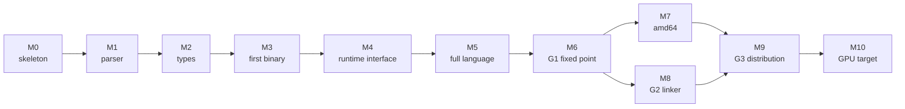

# Sequencing

The order of work. This is the file to read before picking anything up, and it
is not the order the specs are numbered in. It will change as milestones land;
the deviations are recorded at the bottom rather than edited away.

## Milestones

### M0 — skeleton

Driver, flag parsing, package layout, CI. The spikes that
[000](000-decisions.md) decision 3 cites are run and kept.

**Done when** `nanogo -V=full` answers the `go` command's build-ID protocol
([050](050-driver.md)), a passthrough build with `-toolexec=nanogo` completes by
execing `gc` for everything, the package tree of [002](002-architecture.md)
exists with doc comments, and all three spikes run from a clean checkout.

The passthrough build is the first real gate. It proves the driver, the flag
parsing, and the `-V=full` protocol before any compilation exists, and
[`spikes/toolexec`](../spikes/toolexec) is the reference implementation of it.

### M1 — parser

[010](010-scanner-and-positions.md), [011](011-parser-and-ast.md). The whole Go
grammar including generics. No type checking.

**Done when** nanogo parses every `.go` file in `~/dev/go.dev/go/src` that
`go/parser` parses, and rejects every file `go/parser` rejects. Disagreements are
enumerated, not tolerated.

This gate is worth its cost. It is a corpus of roughly 14,000 files that exercise
every corner of the grammar, and it is free.

### M2 — types

[012](012-type-checking.md), [013](013-generics.md), [015](015-export-data.md),
and the parts of [014](014-package-loader.md) that G1 needs. `types2` is
vendored and re-pointed at nanogo's syntax tree.

**Done when** nanogo type-checks every package in the distribution that
`go/types` checks, produces the same errors for `test/`'s `errorcheck` files,
and round-trips export data for every standard library package.

### M3 — first binary

[020](020-ir.md), [021](021-ssa-construction.md),
[025](025-lowering-and-rules.md), [026](026-register-allocation.md),
[040](040-object-format.md), [041](041-instruction-encoding.md),
[042](042-arm64-backend.md). Enough of each to compile a program that uses
integers, control flow, and function calls.

**Done when** a single leaf package, compiled by nanogo under
`go build -toolexec=nanogo` while `gc` compiles everything else, links and runs
with its tests passing.

Hosted mode ([000](000-decisions.md) decision 11) is what makes this gate
narrow. The runtime, the standard library, and the linker are all `gc`'s. The
only new thing in the binary is one package's worth of nanogo code generation,
so a crash has one suspect.

This is the milestone where the object format decision is proved or disproved in
practice, so it is deliberately early.

### M4 — runtime interface

[027](027-liveness-and-stackmaps.md), [030](030-abi.md),
[031](031-runtime-lowering.md), [032](032-type-descriptors-and-itabs.md),
[033](033-closures-defer-panic.md), [034](034-write-barriers.md),
[035](035-goroutines-and-stack-growth.md).

This is the largest milestone and the one that decides whether the project is
real. Everything in it is a contract with code nanogo did not write and cannot
change.

**Done when** `fmt.Println` works, a program that allocates under a
`GOGC=1` stress loop survives, `defer`/`panic`/`recover` behave, goroutines run
and the stack grows, and the GC scans nanogo-generated frames precisely.

The measure of progress inside M4 is the number of standard library packages
that compile with nanogo in hosted mode and still pass their own tests. It
starts at one and is tracked.

### M5 — full language

Generics instantiation, `select`, complex numbers, the remaining conversions,
`//go:` pragmas, and everything else the specification requires but nanogo's own
source does not use.

**Done when** the `test/` corpus passes: `run`, `runoutput`, `errorcheck`,
`compile`, and `build` directives all honoured.

### M6 — G1

Self-host. [060](060-selfhost.md).

**Done when** $N_2 = N_3$ byte for byte, per [001](001-bootstrap-gates.md).

### M7 — amd64

[043](043-amd64-backend.md). The test of [000](000-decisions.md) decision 5.

**Done when** the same middle end serves both targets with no target name
appearing above [025](025-lowering-and-rules.md), and G1 holds on
`linux/amd64`.

### M8 — G2

[045](045-linker.md), the rest of [014](014-package-loader.md).

**Done when** nanogo builds nanogo in a container with no `go` binary present.

### M9 — G3

[044](044-plan9-assembler.md), [046](046-debug-info.md),
[062](062-distribution-build.md).

**Done when** nanogo compiles the `CGO_ENABLED=0` distribution and the
distribution's tests pass on the result.

### M10 — GPU target

[070](070-gpu-target.md). Post-v1 and unscheduled.

## Where the risk is

Risks are listed with the milestone that retires them, not with a probability.

| Risk | Retired at | How it is retired |
| --- | --- | --- |
| The object format seam does not work | M3 | The first binary either runs or it does not. This is why M3 is narrow and early. |
| `gc` object compatibility is unmaintainable across a release | M3 | Detected the first time the pin is bumped. The fallback is whole-world mode, stated in [000](000-decisions.md) decision 11. |
| GC metadata is wrong in a way that only shows under load | M4 | Allocation stress with `GOGC=1` and `GODEBUG=gccheckmark=1`, not a unit test. |
| The forked type checker cannot be re-pointed at nanogo's syntax tree cheaply | M2 | [012](012-type-checking.md) names the interface it is re-pointed through. If the fork resists, the fallback is to keep `go/ast` under the checker and translate, at a cost stated in that spec. |
| Generics instantiation is a rewrite rather than a port | M5 | Deferred deliberately: nanogo's own source uses generics, so M6 cannot be reached without it, and M5 is where it is confronted with the corpus available. |
| The v1 line budget is exceeded | M4 | [000](000-decisions.md) decision 10's accounting already puts v1 at about 41,800 against 40,000. Counted at every milestone, not at the end, and the two named recovery points are [022](022-optimization-passes.md) and [015](015-export-data.md). |
| `//go:linkname` and `//go:nosplit` semantics are subtler than documented | M9 | The runtime is the only consumer that cares, and M9 is where it is compiled. |

## Where the work stands

**M0 and M1 are complete. M2 is complete. M3 is partly built.**

| Milestone | State | Gate met |
| --- | --- | --- |
| M0 skeleton | done | a `go build -a -toolexec=nanogo` completes by delegating |
| M1 parser | done | 19,674 files agree with `go/scanner`, 16,293 with `go/parser` |
| M2 types | done | 613 subtests, a 375-package corpus, checks nanogo's own source |
| M3 first binary | **partly** | the IR builder, SSA construction, the object writer and the arm64 encoder are built and gated; lowering, register allocation and liveness are not |

M3's gate, a leaf package compiled by nanogo under `-toolexec`, is not met. What
is met is the half of M3 that could be built without the middle end, and it
retired the milestone's stated risk: **`go tool link` links a nanogo-written
object against the real Go runtime into a binary that runs.**
[040](040-object-format.md) records that result. The object format decision of
[000](000-decisions.md) decision 3 is no longer a judgement call.

Measured coverage:

| Package | Coverage | |
| --- | --- | --- |
| `syntax` | 99.2% | [010](010-scanner-and-positions.md), [011](011-parser-and-ast.md) |
| `types2` | excluded | [012](012-type-checking.md); gated by upstream's suite |
| `loader` | 98.8% | [014](014-package-loader.md), G1 half |
| `ir` | 93.9% | [020](020-ir.md), [030](030-abi.md); builds 536 packages of the distribution |
| `ssa` | 98.1% | [021](021-ssa-construction.md), with the verifier of that spec |
| `obj` | 98.1% | [040](040-object-format.md) |
| `obj/arm64` | 98.8% | [041](041-instruction-encoding.md), [042](042-arm64-backend.md) |
| `driver` | 97.4% | [050](050-driver.md), [051](051-build-integration.md) |
| `internal/covercheck` | 97.6% | the gate itself |
| `cmd/nanogo` | excluded | one statement; the reason is in the exclusions file |

## Deviations

Each entry records a departure from the plan above with the reason, so that the
plan stays honest instead of staying accurate.

**M0's gate was wrong and was replaced.** It said "`nanogo -V` prints a
version". The real protocol is `-V=full`, it is parsed by
`cmd/go/internal/work/buildid.go` with requirements the spec did not state, and
printing a version is not the thing that matters. The gate is now that a
passthrough `-toolexec` build of a real module completes. That gate exercises
the flag parser, the tool dispatch and the build-ID protocol before any compiler
exists, which is what M0 is for.

**M0 absorbed the quality gates.** CI, the per-package coverage tool and
`CONTRIBUTING.md` were not in any spec's scope and were built in M0 anyway. A
gate added after the code it measures is a gate calibrated to the code.

**The loader was started in M0, not M2.** [014](014-package-loader.md)'s G1 half
and its constraint evaluator are independent of the front end, and building them
early cost nothing and removed a dependency from M2.

**M3 was started from the back.** [040](040-object-format.md) and
[041](041-instruction-encoding.md) need nothing above them, so they were built
before the middle end rather than after it. That was worth doing for one reason:
the object format seam is this deck's largest untested assumption, and building
the writer first turned it into a linked binary that runs. A middle end built
first would have reached the same question three milestones later.

**Eleven IR nodes were added by implementation, not by design.** The node set of
[020](020-ir.md) had no assignment, no case, no `for` post statement, no
composite literal, no slice expression, no `close`, `print` or `println`, and no
`unsafe` intrinsics. Each gap was found by a consumer reaching for a workaround:
an assignment encoded as a binary operation with no operator, a literal as
`new`, an intrinsic as a call to an invented symbol. The nodes exist now, and
[020](020-ir.md) records that its own claim, that a construct absent from its
table does not exist, was false when written.

The lesson is not that the spec was incomplete, which every spec is. It is that
a workaround inside an IR is invisible: the tree still type-checks, the tests
still pass, and the cost arrives later as a pass that must recognise an
intrinsic by matching a string.

**Two platform-divergent cgo bugs, and one data race, were found by CI and
could not be found locally.** They are recorded because they say something about
the test strategy rather than about the bugs: cgo file selection differs by
`GOOS`, so any code that decides which files are in a package is untested until
it runs on both platforms; and a concurrency contract stated only in a comment
is one the race detector finds violated. Both are now gated.
[014](014-package-loader.md) carries the first; [010](010-scanner-and-positions.md)
carries the second.
