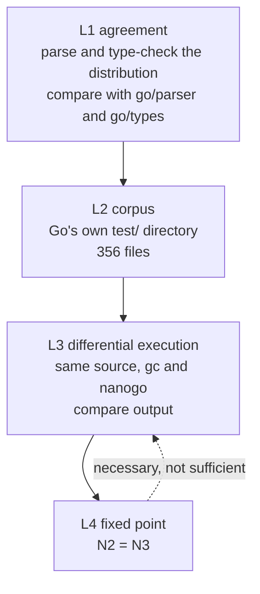
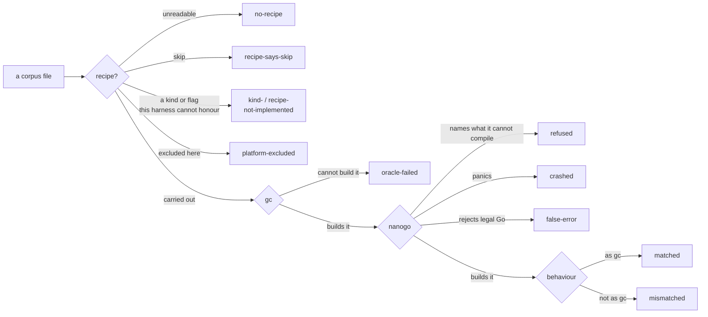

# Conformance

Implements [000](000-decisions.md) decision 6. A compiler is a program whose bugs
are invisible in its own output and visible only in someone else's. This spec
defines how nanogo is proved, and the guiding rule is that nanogo writes as
little test material as it can, because Go already has the material.

## The four levels

Each level catches a class the level above cannot.

**Two levels have a harness, one is partial, and one cannot be run.** L1 is
built and large for the front end, and does not reach the checker. L2 has a
harness for the single-file recipes: `internal/gotest` vendors Go's `test/`
directory and carries those out with `gc` as the oracle, and counts by class
every file whose recipe it cannot carry out. That harness is also the first
thing in the repository that performs L3 as decision 6 states it, building the
same program with both compilers and comparing the two outputs, so the two
levels now share a gate. L4 cannot be run until [060](060-selfhost.md) reports
otherwise. The table below is the state of each level, and each section says
what stands and what does not.

| Level | State | What runs today |
| --- | --- | --- |
| L1 agreement | built for the front end, partial for the checker | scanner, parser, build constraints and `go list`, over the distribution |
| L2 corpus | built for the single-file kinds | 356 files vendored; `internal/gotest` carries out the single-file recipes and puts every other file in a named class |
| L3 differential execution | partial | instruction encodings, runtime symbols, prologues, 18 mixed-toolchain link-and-run cases, and whole programs built through a real `go build -toolexec=nanogo` and run |
| L4 fixed point | **not built** | no stage is runnable, per [060](060-selfhost.md) |

### L1: agreement on accept and reject

For every `.go` file in the distribution, nanogo's front end must agree with the
standard library on whether the file is legal, and on where the first error is.

This is cheap, it is available from M1, and it exercises grammar and typing
corners that no hand-written suite reaches. The corpus is already on disk, and
the front end is now measured against it:

| Comparison | Corpus | Oracle |
| --- | --- | --- |
| Scanner token streams | 19,674 files of 19,691, 17 skipped, 0 failures | `go/scanner` |
| Parse accept and reject | 16,293 files, 14 documented exceptions | `go/parser` |
| Build-constraint selection | 6,821 files per platform, 0 mismatches | `go/build` |
| Package and file lists | 536 packages, the distribution and nanogo's own tree, 0 mismatches | `go list` |
| IR construction | 536 packages of 663, 39,947 functions | none; it is a build, not a comparison |

The type checker is the half that does not meet this level's bar. It agrees with
`go/types` on 14 standard-library packages ([012](012-type-checking.md)), not on
the distribution, and the vendored upstream corpus is what carries it instead.
Extending the agreement test to the tree is the work L1 still owes.

Agreement is on the *first* error position and the error's identity, not on
message wording. nanogo's messages are its own ([052](052-diagnostics.md)); its
judgements are not.

### L2: Go's test corpus

`$GOROOT/test` is 356 files driven by directive comments. They are vendored
into `internal/gotest/testdata/go/test`, verbatim, with Go's `LICENSE` and
`PATENTS` beside them, because a gate whose inputs come from whichever Go
happens to be installed changes under you and cannot be reproduced from a
checkout. A tag must be able to say which corpus it passed.

The directives, and what `internal/gotest` does with each:

| Directive | Asserts | State |
| --- | --- | --- |
| `// run` | compiles, runs, behaves as `gc`'s build of the same source does | carried out |
| `// compile` | compiles, is not run | carried out |
| `// errorcheck` | the compiler rejects, at the annotated position | carried out |
| `// runoutput`, `// build` | the program's output, and linking | counted, not carried out |
| the directory kinds | a package spread over several files | counted, not carried out; their inputs are the subdirectories of `$GOROOT/test`, which are not vendored |

**`gc` is the oracle, not a golden file.** Each program is built twice, from the
same source at the same path, and the two are compared on exit status and
output. An expectation derived from the installed toolchain on the spot cannot
go stale the way a recorded one can, and a recorded expectation for a corpus
this size would be a second corpus to maintain.

#### A refusal is not a failure

nanogo cannot compile most of Go yet. A file it refuses is recorded as refused,
with the message, and the sweep continues. What fails the build is narrower and
sharper:

$$
\mathrm{fail} \iff \exists P:\; \mathrm{run}(\mathrm{compile}(\mathrm{nanogo}, P)) \neq \mathrm{run}(\mathrm{compile}(gc, P))
$$

and, separately, any file that passed yesterday and does not today.

#### Every file lands in exactly one class

`Report.CheckTotals` asserts that the classes sum to the file count, and the
test fails when they do not. This is the point of the design, not a detail of
it. A corpus test that returns silently on the file it cannot handle produces a
number that can only rise, because the file it dropped left the denominator
instead of entering a category. This repository has been caught by that before
and [003](003-sequencing.md) records the occasion.

The four distinctions that make the corpus worth running, rather than a pass
count, are `mismatched` against `refused`, and `false-error` and
`wrong-position` against both. A refusal is a gap and is expected. A mismatch
is a miscompilation. A false error is nanogo rejecting legal Go, and a wrong
position is nanogo rejecting the right program at the wrong place. Merging any
of them into "did not pass" would hide the three that are bugs behind the one
that is not.

#### The ratchet

`internal/gotest/testdata/ratchet.txt` records what the corpus proved, and
records two things:

- the **pass set**, one line per file. A file that passed and no longer does
  fails the build. So does a pass that weakened: a file recorded as `matched`
  that only `compiled` today stopped being run, which is a claim withdrawn.
- the **census**, one count per recipe kind, and the file count. A harness that
  stopped finding files would otherwise go green having swept fewer of them,
  and a pass set alone cannot see that.

Growth never fails the build. nanogo is expected to compile more of Go every
week and a gate that failed on improvement is a gate people route around; a run
that proves new files says so and prints the refresh command. The file is
sorted by file name so that a refresh produces a diff and not a reshuffle
([053](053-determinism.md)).

#### What the corpus is for

The ranked breakdown, not the pass count. Every refusal is grouped by a
normalised reason and the groups are printed largest first, so the output ends
with a list of what to build next in the order that buys the most files. The
normalisation matters: nanogo's refusal repeats the function's name inside the
stage chain, so without it every file would be its own bucket and the ranking
would be a list of ones.

#### Where the numbers are

Not here. The counts move every week, and a number that was true once and is
wrong now is worse than no number. The run prints the class table and the
ranked reasons; `ratchet.txt` records the passes and the census. The two
structural numbers this document does state are gated against that file by
`TestTheSpecStatesWhatTheRatchetRecords`, so they cannot rot in silence:

- the corpus is **356** files.
- **87** of them pass.

The remaining 269 are not failures. They are refusals with a reason, kinds this
harness does not carry out, recipes whose compiler flags nanogo has no
equivalent of, and files this platform excludes. Every one of them is counted
and named in the report.

#### Not to be confused with the other errorcheck corpus

The 375-entry `errorcheck` corpus that also runs is a different corpus and the
two are easy to conflate. It is `types2/upstream/testdata`, vendored with the
fork, and it proves the checker against the checker it was forked from
([012](012-type-checking.md)). It says nothing about `$GOROOT/test`, and
`$GOROOT/test` says nothing about it.

#### What this level still owes

The directory kinds, `runoutput` and `build`, and the recipes that need
compiler flags. The last of those is the largest single group and it is not a
harness gap: those recipes ask for `-m`, `-l` and `-d=ssa/...`, which are
`gc` debug outputs nanogo has no equivalent of, so carrying them out would
require nanogo to grow the flags first. Skipping them **loudly**, with a count
and the flag printed, is the honest handling until then.

### L3: differential execution

The strongest level, and the only one that finds a miscompile in code that is
legal, compiles, and does the wrong thing.

For a program $P$, build with both compilers and compare:

$$
\mathrm{run}(\mathrm{compile}(gc, P)) \;=\; \mathrm{run}(\mathrm{compile}(\mathrm{nanogo}, P))
$$

comparing exit status, standard output, and standard error. A disagreement is a
nanogo bug until an argument shows otherwise, and the argument has to be written
down.

Three sources of $P$, in order of value:

1. **The standard library's own tests.** Compile a package and its test binary
   with nanogo, run it, compare against the same binary built by `gc`. This is
   the highest-value corpus in the project: it is large, it is adversarial, and
   it is maintained by someone else.
2. **nanogo's own tests**, for constructs the compiler generates but the corpora
   above do not stress, principally the interface contracts of M4.
3. **Generated programs.** A small random program generator over a grammar of
   expressions, integer widths, and conversions. Cheap to write and effective on
   exactly the class L1 and L2 miss: arithmetic edge cases, shift counts,
   overflow, and conversion rounding.

None of those three sources exists. What does exist at whole-program scale is
L2's `run` recipes, where `gc` is the oracle for behaviour and `ratchet.txt`
records how far they reach. Below that, `gc` is the oracle for a part of the
output rather than for a program's behaviour:

| Comparison | Scale | Oracle |
| --- | --- | --- |
| arm64 instruction encodings | 981,124, counted by the package itself | `go tool asm` |
| Runtime symbol signatures | 70 checked against 2,435 runtime functions | the runtime source |
| Function prologues | 101 instructions, 2 stack constants | `go tool asm`, `internal/abi` |
| Link and run | 18 cases, source text to a running process | the expected exit status, hand written |

The link-and-run cases are the closest thing to L3 the repository has, and they
are stronger than their number suggests: `gc` compiles the caller and nanogo
compiles the callee, so a disagreement about [030](030-abi.md) shows up as a
wrong number rather than as a passing test. They are still not L3. The oracle is
a constant written in the test, not the same program built by `gc`.

### L4: the fixed point

$N_2 = N_3$, defined in [001](001-bootstrap-gates.md). It is not runnable:
[060](060-selfhost.md) records why stage 1 does not start.

It is placed last and drawn with a dashed arrow back to L3 to make one point:
**it proves self-consistency, not correctness.** A compiler that miscompiles a
construct it does not use, or that miscompiles it reproducibly, passes L4. The
levels above it are the ones that find that bug.

## Metadata that no output check can see

Three properties are invisible to every level above, because a program can
produce correct output with all three broken and fail a week later.

| Property | How it is checked | State |
| --- | --- | --- |
| GC stack maps | Allocation stress with `GOGC=1`, plus `GODEBUG=gccheckmark=1` which makes the collector verify its own marking. The [`stackmap` spike](../spikes/stackmap) is the shape of the test. | built, `ssagen/gc_test.go`, under `gccheckmark=1,clobberfree=1` and `GOGC=1`; the corpus maps 17,758 of the 17,809 functions it lowers |
| Write barriers | `GODEBUG=gccheckmark=1` under concurrent mutation, and a targeted corpus of the elision cases [034](034-write-barriers.md) allows. | not built; nanogo emits no write barrier, so there is nothing to check |
| Stack growth | Deep recursion with large frames, forcing `morestack` at every frame size class, with pointers live across the growth. | built for one shape, a 200,000 frame recursion in `ssagen/ssagen_test.go`; the frame size classes are not swept |

These get their own tests because nothing else will produce them.

## Coverage

The target is stated in the repository's conventions: above 90%, with every
feature reached by an end-to-end test. For a compiler, "end to end" means source
in, executable out, executable run. A test that stops at the IR proves the IR.

The target is now a gate. `internal/covercheck` reads the profile and fails per
package, never on a repository average, because an average lets a well-tested
package carry an untested one and names nothing to fix. Every compiler package
is above the 90% line, and [003](003-sequencing.md) carries the figures. Four
packages
are excluded, each with a written reason in `internal/covercheck/exclusions.txt`
and each naming the gate that replaces the number.

The measure that matters more than the number is a rule: **every bug fix arrives
with the program that reproduced it**, added to L3's corpus, failing before and
passing after.

## What is not tested here

Performance of the generated code. nanogo is slower than `gc`, by
[000](000-decisions.md) decision 10, and there is no benchmark gate. Compile
*time* does get one, from M6 onward, because the fixed-point build is run
constantly and a compiler that takes an hour to compile itself stops being used.

## What was wrong

**L1's corpus was described as "roughly 14,000 files" and the level was
described as one thing.** It is two. The scanner and the parser are compared
against `go/scanner` and `go/parser` over the distribution, at 19,674 and 16,293
files, and the type checker is compared against `go/types` on 14 packages. The
count and the split were found by reading what the corpus tests report.

**L2 was written as though its harness existed, and for a long time it did
not.** The 356 files were read by nothing in the repository. This mattered more
than an ordinary gap because a reader who saw the 375-entry `errorcheck` corpus
passing would assume L2 was covered, and that corpus is upstream `types2`
testdata, which proves the fork rather than the compiler. `internal/gotest` now
carries out the single-file recipes and the corpus is vendored, so the harness
exists; the note stays because the confusion between the two errorcheck corpora
does not go away with it.

**The syntax slice of L2 was wired and the execution slice was not, and the
difference was invisible.** All 356 files were tokenised by
`syntax/scanner_test.go` and the `test/syntax/` errorcheck files were parsed
with their positions compared, which reads in a summary as "the corpus is
tested". Nothing had ever compiled one of those files or run it. The lesson is
the one this document keeps arriving at from a new direction: a corpus is
covered by the strongest thing done to it, not by the largest count reported
about it.

**L3 was listed as the strongest level and is the least built.** Its three
sources are all absent. What the deck can claim instead is differential against
`gc` at the instruction and the ABI boundary, which is a different and weaker
statement, so the section now states it separately rather than counting it
towards L3.
