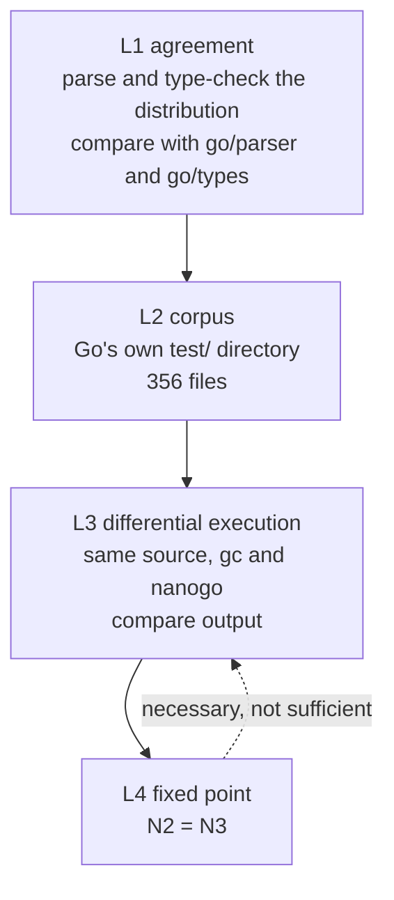

# Conformance

Implements [000](000-decisions.md) decision 6. A compiler is a program whose bugs
are invisible in its own output and visible only in someone else's. This spec
defines how nanogo is proved, and the guiding rule is that nanogo writes as
little test material as it can, because Go already has the material.

## The four levels

Each level catches a class the level above cannot.

**One level is built, one exists in a narrow form, and two do not exist.** L1 is
built and large for the front end. L3 runs as a differential against `gc` at the
instruction and the ABI boundary, not as whole programs built twice and run. L2
has no harness at all, and L4 cannot be run until [060](060-selfhost.md) reports
otherwise. The table below is the state of each level, and each section says
what stands and what does not.

| Level | State | What runs today |
| --- | --- | --- |
| L1 agreement | built for the front end, partial for the checker | scanner, parser, build constraints and `go list`, over the distribution |
| L2 corpus | **not built** | nothing reads `~/dev/go.dev/go/test` |
| L3 differential execution | partial | instruction encodings, runtime symbols, prologues, and 18 mixed-toolchain link-and-run cases |
| L4 fixed point | **not built** | no stage is runnable, per [060](060-selfhost.md) |

### L1: agreement on accept and reject

For every `.go` file in the distribution, nanogo's front end must agree with the
standard library on whether the file is legal, and on where the first error is.

This is cheap, it is available from M1, and it exercises grammar and typing
corners that no hand-written suite reaches. The corpus is already on disk, and
the front end is now measured against it:

| Comparison | Corpus | Oracle |
| --- | --- | --- |
| Scanner token streams | 19,674 files of 19,691, 17 skipped, 0 failures | `go/scanner` |
| Parse accept and reject | 16,293 files, 14 documented exceptions | `go/parser` |
| Build-constraint selection | 6,821 files per platform, 0 mismatches | `go/build` |
| Package and file lists | 520 packages, 0 mismatches | `go list` |
| IR construction | 536 packages of 663, 39,947 functions | none; it is a build, not a comparison |

The type checker is the half that does not meet this level's bar. It agrees with
`go/types` on 14 standard-library packages ([012](012-type-checking.md)), not on
the distribution, and the vendored upstream corpus is what carries it instead.
Extending the agreement test to the tree is the work L1 still owes.

Agreement is on the *first* error position and the error's identity, not on
message wording. nanogo's messages are its own ([052](052-diagnostics.md)); its
judgements are not.

### L2: Go's test corpus

`~/dev/go.dev/go/test` is 356 files driven by directive comments. The directives
that matter here:

| Directive | Asserts |
| --- | --- |
| `// run` | compiles, runs, exits 0 |
| `// runoutput` | the program's output matches the expected block |
| `// errorcheck` | the compiler rejects, at exactly the annotated position, with a message matching the annotated pattern |
| `// compile` | compiles, is not run |
| `// build` | compiles and links |

`errorcheck` is the strict one and the valuable one. It pins positions, which is
the part of a front end that silently rots.

nanogo runs this corpus with its own driver rather than the distribution's, so
that a failure names a nanogo spec. Known-unsupported files are listed in an
explicit exclusion file with a reason and the milestone that removes them.
An empty exclusion list is a gate for M5, not a starting condition.

**None of this is built.** No test in the repository reads
`~/dev/go.dev/go/test`, there is no driver for the directives above, and there is
no exclusion file. The 356 files are still there and still the right corpus; the
harness is the missing part.

The 375-entry `errorcheck` corpus that does run is a different corpus and it is
easy to conflate with this one. It is `types2/upstream/testdata`, vendored with
the fork, and it proves the checker against the checker it was forked from
([012](012-type-checking.md)). It says nothing about position agreement over the
distribution, which is what L2 asks for.

### L3: differential execution

The strongest level, and the only one that finds a miscompile in code that is
legal, compiles, and does the wrong thing.

For a program $P$, build with both compilers and compare:

$$
\mathrm{run}(\mathrm{compile}(gc, P)) \;=\; \mathrm{run}(\mathrm{compile}(\mathrm{nanogo}, P))
$$

comparing exit status, standard output, and standard error. A disagreement is a
nanogo bug until an argument shows otherwise, and the argument has to be written
down.

Three sources of $P$, in order of value:

1. **The standard library's own tests.** Compile a package and its test binary
   with nanogo, run it, compare against the same binary built by `gc`. This is
   the highest-value corpus in the project: it is large, it is adversarial, and
   it is maintained by someone else.
2. **nanogo's own tests**, for constructs the compiler generates but the corpora
   above do not stress, principally the interface contracts of M4.
3. **Generated programs.** A small random program generator over a grammar of
   expressions, integer widths, and conversions. Cheap to write and effective on
   exactly the class L1 and L2 miss: arithmetic edge cases, shift counts,
   overflow, and conversion rounding.

None of those three sources exists. What exists is differential against `gc`
lower down, where `gc` is the oracle for a part of the output rather than for a
program's behaviour:

| Comparison | Scale | Oracle |
| --- | --- | --- |
| arm64 instruction encodings | 981,124, counted by the package itself | `go tool asm` |
| Runtime symbol signatures | 45 checked against 2,435 runtime functions | the runtime source |
| Function prologues | 101 instructions, 2 stack constants | `go tool asm`, `internal/abi` |
| Link and run | 18 cases, source text to a running process | the expected exit status, hand written |

The link-and-run cases are the closest thing to L3 the repository has, and they
are stronger than their number suggests: `gc` compiles the caller and nanogo
compiles the callee, so a disagreement about [030](030-abi.md) shows up as a
wrong number rather than as a passing test. They are still not L3. The oracle is
a constant written in the test, not the same program built by `gc`.

### L4: the fixed point

$N_2 = N_3$, defined in [001](001-bootstrap-gates.md). It is not runnable:
[060](060-selfhost.md) records why stage 1 does not start.

It is placed last and drawn with a dashed arrow back to L3 to make one point:
**it proves self-consistency, not correctness.** A compiler that miscompiles a
construct it does not use, or that miscompiles it reproducibly, passes L4. The
levels above it are the ones that find that bug.

## Metadata that no output check can see

Three properties are invisible to every level above, because a program can
produce correct output with all three broken and fail a week later.

| Property | How it is checked | State |
| --- | --- | --- |
| GC stack maps | Allocation stress with `GOGC=1`, plus `GODEBUG=gccheckmark=1` which makes the collector verify its own marking. The [`stackmap` spike](../spikes/stackmap) is the shape of the test. | built, `ssagen/gc_test.go`, under `gccheckmark=1,clobberfree=1` and `GOGC=1`; the corpus maps 17,239 of the 17,285 functions it lowers |
| Write barriers | `GODEBUG=gccheckmark=1` under concurrent mutation, and a targeted corpus of the elision cases [034](034-write-barriers.md) allows. | not built; nanogo emits no write barrier, so there is nothing to check |
| Stack growth | Deep recursion with large frames, forcing `morestack` at every frame size class, with pointers live across the growth. | built for one shape, a 200,000 frame recursion in `ssagen/ssagen_test.go`; the frame size classes are not swept |

These get their own tests because nothing else will produce them.

## Coverage

The target is stated in the repository's conventions: above 90%, with every
feature reached by an end-to-end test. For a compiler, "end to end" means source
in, executable out, executable run. A test that stops at the IR proves the IR.

The target is now a gate. `internal/covercheck` reads the profile and fails per
package, never on a repository average, because an average lets a well-tested
package carry an untested one and names nothing to fix. Every compiler package
is above the 90% line, and [003](003-sequencing.md) carries the figures. Four
packages
are excluded, each with a written reason in `internal/covercheck/exclusions.txt`
and each naming the gate that replaces the number.

The measure that matters more than the number is a rule: **every bug fix arrives
with the program that reproduced it**, added to L3's corpus, failing before and
passing after.

## What is not tested here

Performance of the generated code. nanogo is slower than `gc`, by
[000](000-decisions.md) decision 10, and there is no benchmark gate. Compile
*time* does get one, from M6 onward, because the fixed-point build is run
constantly and a compiler that takes an hour to compile itself stops being used.

## Corrections

**L1's corpus was described as "roughly 14,000 files" and the level was
described as one thing.** It is two. The scanner and the parser are compared
against `go/scanner` and `go/parser` over the distribution, at 19,674 and 16,293
files, and the type checker is compared against `go/types` on 14 packages. The
count and the split were found by reading what the corpus tests report.

**L2 was written as though its harness existed, and it does not.** The 356 files
are read by nothing in the repository. This matters more than an ordinary gap
because a reader who sees the 375-entry `errorcheck` corpus passing will assume
L2 is covered, and that corpus is upstream `types2` testdata, which proves the
fork rather than the compiler. The confusion was found by tracing the corpus
constant in `types2/errorcheck_test.go` to `types2/upstream/testdata`.

**L3 was listed as the strongest level and is the least built.** Its three
sources are all absent. What the deck can claim instead is differential against
`gc` at the instruction and the ABI boundary, which is a different and weaker
statement, so the section now states it separately rather than counting it
towards L3.
