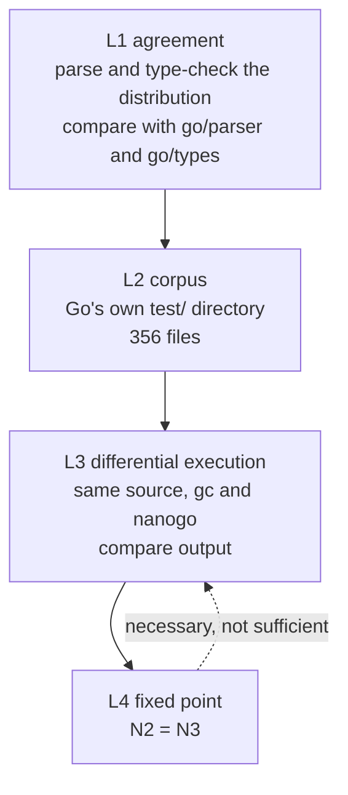

# Conformance

Implements [000](000-decisions.md) decision 6. A compiler is a program whose bugs
are invisible in its own output and visible only in someone else's. This spec
defines how nanogo is proved, and the guiding rule is that nanogo writes as
little test material as it can, because Go already has the material.

## The four levels

Each level catches a class the level above cannot.

### L1 — agreement on accept and reject

For every `.go` file in the distribution, nanogo's front end must agree with the
standard library on whether the file is legal, and on where the first error is.

This is cheap, it is available from M1, and it exercises grammar and typing
corners that no hand-written suite reaches. The corpus is roughly 14,000 files
and it is already on disk.

Agreement is on the *first* error position and the error's identity, not on
message wording. nanogo's messages are its own ([052](052-diagnostics.md)); its
judgements are not.

### L2 — Go's test corpus

`~/dev/go.dev/go/test` is 356 files driven by directive comments. The directives
that matter here:

| Directive | Asserts |
| --- | --- |
| `// run` | compiles, runs, exits 0 |
| `// runoutput` | the program's output matches the expected block |
| `// errorcheck` | the compiler rejects, at exactly the annotated position, with a message matching the annotated pattern |
| `// compile` | compiles, is not run |
| `// build` | compiles and links |

`errorcheck` is the strict one and the valuable one. It pins positions, which is
the part of a front end that silently rots.

nanogo runs this corpus with its own driver rather than the distribution's, so
that a failure names a nanogo spec. Known-unsupported files are listed in an
explicit exclusion file with a reason and the milestone that removes them.
An empty exclusion list is a gate for M5, not a starting condition.

### L3 — differential execution

The strongest level, and the only one that finds a miscompile in code that is
legal, compiles, and does the wrong thing.

For a program $P$, build with both compilers and compare:

$$
\mathrm{run}(\mathrm{compile}(gc, P)) \;=\; \mathrm{run}(\mathrm{compile}(\mathrm{nanogo}, P))
$$

comparing exit status, standard output, and standard error. A disagreement is a
nanogo bug until an argument shows otherwise, and the argument has to be written
down.

Three sources of $P$, in order of value:

1. **The standard library's own tests.** Compile a package and its test binary
   with nanogo, run it, compare against the same binary built by `gc`. This is
   the highest-value corpus in the project: it is large, it is adversarial, and
   it is maintained by someone else.
2. **nanogo's own tests**, for constructs the compiler generates but the corpora
   above do not stress, principally the interface contracts of M4.
3. **Generated programs.** A small random program generator over a grammar of
   expressions, integer widths, and conversions. Cheap to write and effective on
   exactly the class L1 and L2 miss: arithmetic edge cases, shift counts,
   overflow, and conversion rounding.

### L4 — the fixed point

$N_2 = N_3$, defined in [001](001-bootstrap-gates.md).

It is placed last and drawn with a dashed arrow back to L3 to make one point:
**it proves self-consistency, not correctness.** A compiler that miscompiles a
construct it does not use, or that miscompiles it reproducibly, passes L4. The
levels above it are the ones that find that bug.

## Metadata that no output check can see

Three properties are invisible to every level above, because a program can
produce correct output with all three broken and fail a week later.

| Property | How it is checked |
| --- | --- |
| GC stack maps | Allocation stress with `GOGC=1`, plus `GODEBUG=gccheckmark=1` which makes the collector verify its own marking. The [`stackmap` spike](../spikes/stackmap) is the shape of the test. |
| Write barriers | `GODEBUG=gccheckmark=1` under concurrent mutation, and a targeted corpus of the elision cases [034](034-write-barriers.md) allows. |
| Stack growth | Deep recursion with large frames, forcing `morestack` at every frame size class, with pointers live across the growth. |

These get their own tests because nothing else will produce them.

## Coverage

The target is stated in the repository's conventions: above 90%, with every
feature reached by an end-to-end test. For a compiler, "end to end" means source
in, executable out, executable run. A test that stops at the IR proves the IR.

The measure that matters more than the number is a rule: **every bug fix arrives
with the program that reproduced it**, added to L3's corpus, failing before and
passing after.

## What is not tested here

Performance of the generated code. nanogo is slower than `gc`, by
[000](000-decisions.md) decision 10, and there is no benchmark gate. Compile
*time* does get one, from M6 onward, because the fixed-point build is run
constantly and a compiler that takes an hour to compile itself stops being used.
