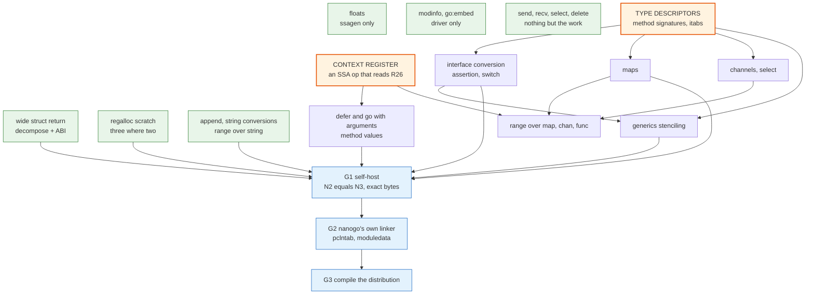

# The remaining work

[003](003-sequencing.md) gives the order of work as milestones M0 to M10. This
spec is narrower and more mechanical: it is the dependency graph of everything
that is still refused, so that work can run in parallel where the graph permits
it and in sequence where the graph does not.

It exists because the question "what is left" has an answer that a milestone
list does not give. A milestone says which stage the project is in. This graph
says which two pieces of work unblock the most, which pieces can start today,
and which file every one of them has to edit. That last part is the constraint
that decides how much can actually run at once.

## What done means

Four counters already in the tree, so that no new measure is invented for this
spec to grade itself against.

| Gate | Counter | Today | Done |
| --- | --- | --- | --- |
| G-A | `internal/audit` probe classes | 70 ok, 25 refused, 0 wrong | 95 ok |
| G-B | `internal/gotest` corpus passes | 119 of 356, 0 miscompilations | all passing |
| G-C | [020](020-ir.md) Go-specific rows | see the correction below | all built |
| G-D | bootstrap standard library closure | 8 of 27 packages | 27 |

G-A and G-B moved a long way in one sitting and the movement is recorded in
`internal/audit/testdata/ratchet.txt` and `internal/gotest/testdata/ratchet.txt`,
which are the files that decide these rows rather than this prose.

Then the three gates of [001](001-bootstrap-gates.md): G1 self-host, G2
toolchain independence, G3 the distribution.

G-A to G-D measure the language. They do not measure the executable. Today
nanogo writes object files and `go tool link` writes the program. Making nanogo
write the program is [045](045-linker.md) plus [014](014-package-loader.md)'s G2
half, and it is the largest single remaining item by volume. A reader who asks
"can nanogo compile Go programs into executables" is asking two questions, and
they have different answers and very different sizes.

## The graph

Tier 0 and the two keystones have no incoming edge. They can all start at once.
Everything in Tier 2 waits on a keystone or on nothing at all, and the column of
Tier 2 items with no incoming edge is the work that is available whenever a
builder is free.

## The two keystones

Nothing else in the graph unblocks as much.

**Type descriptors with method sets, and itabs.** Thirteen refused probes trace
here: every interface conversion, every type assertion, the type switch, method
values, `stdlib-fmt`, a `panic` whose operand is a concrete value, and a read of
the value `recover` returns. `ir.Type` does not carry a method set, so the
descriptor writer cannot emit an `UncommonType` tail for a type it is asked
about through the IR, and an itab cannot be built at all. [032](032-type-descriptors-and-itabs.md)
owns the design.

**The context register.** Eight refused probes trace here. The caller half is
built: `ssagen` writes the closure word into R26 before an indirect call. The
callee half does not exist. No SSA operation reads R26, `ir.Func` has no field
for a closure context, and the entry block materializes an argument only for a
declared parameter. [033](033-closures-defer-panic.md) owns the design.

The two are independent and run in parallel, with one caveat recorded in
[033](033-closures-defer-panic.md): a closure object's natural type is an
anonymous struct, which `ir/rtype.go` refuses, so the closure work synthesizes a
named type rather than waiting for the descriptor work.

## What the graph does not say, and the file that decides it

The graph orders the work by semantics. It does not order it by the file each
item edits, and that is the constraint that decides how much can run at once.

Almost every Tier 2 row is lowered in `ir/lower.go`. Two builders editing that
file at the same time conflict whatever the graph permits. So the practical rule
is to batch by file and not by feature: one builder takes `ir/lower.go` and
lands a related group of rows, while work in `obj/`, `rtype/`, `rtsym/`,
`export/` and `driver/` proceeds beside it.

## Corrections this graph already made

Six claims in circulation were wrong. They are recorded here so they are not
repeated, and because three of them mean [020](020-ir.md)'s own table oversells
what is left to do.

- **Three rows [020](020-ir.md) marks `not built` are built.** Multi-value
  assignment is built at `ir/build.go:1468` and `ssa/build.go:1039`, and the
  probe passes. Package initialisation is built at `ir/build.go:891`, and two
  probes pass. A method expression is built at `ir/build.go:1809` and has no
  refusal at all. What remains of the multi-value row is only a non-call source,
  which is the map, assertion and receive work under its own rows.
- **Struct and array comparison is built and bounded, not unbuilt.**
  `ssa/decompose.go:1114` rewrites an aggregate comparison into a chain over its
  parts. The limit is `MaxDecomposeParts = 4`. Above four leaves the value is
  never split, an `OpEq` on a struct type survives into `ssa.Lower`, and the
  compiler panics. There is no refusal string for it.
- **A missing lowering rule panics, it does not refuse.** `ssa/lower.go:206`
  panics with a `*LowerError`, and [025](025-lowering-and-rules.md) requires the
  crash. So complex arithmetic and a wide aggregate comparison are compiler
  crashes rather than honest refusals, which is the outcome
  `CONTRIBUTING.md` ranks worst after a wrong answer.

- The capture gap was said to account for nine probes. It accounts for eight.
  `go-stmt-closure` is refused first by `make(chan int)`, because
  `ir.LowerAndCollect` returns the first refusal in statement order, so the probe
  belongs to the channel row and not the closure row.
- Escape analysis was said to block the closure work. It does not.
  `ir/lower.go` already sends every allocation to the heap through
  `runtime.newobject`, which is correct and only slower than `gc`.
  [023](023-escape-analysis.md)'s analysis remains unbuilt, and the miscompile
  it owned, a pointer to an address-taken local outliving its frame, is closed:
  the interim rule that spec already stated is built, and a variable whose
  address the source takes lives in a heap cell like a captured one. What is
  still missing is the judgement that keeps such a variable in the frame.
- **`ir.Type` was said not to carry method sets. It does**, at
  `ir/type.go:258`, for every defined type. What is missing is the signature on
  `ir.Method`, and the two ABI wrappers `rtype/uncommon.go:170` names.
- **A type assertion and a type switch were said to refuse at `ssa.Build`.**
  Both refuse earlier, at `ir/lower.go:838`, because `ir.Lower` is the driver's
  first pass. [032](032-type-descriptors-and-itabs.md) carries the stale claim
  and so does a comment at `ssa/build.go:1045`.

## Two root causes the probe names hide

A probe is named for the Go construct it writes, and two of them are refused for
a reason that has nothing to do with that construct. Both deserve their own row
in any plan, because fixing the construct would not fix the probe.

- `array-local` declares a local array and is refused by the register
  allocator: `ssa/regalloc.go:166`, "needs %d scratch registers and the target
  reserves %d". [060](060-selfhost.md) states the shape, which is that an
  indexed store wants three integer scratch registers and the target reserves
  two. This belongs to [026](026-register-allocation.md), not to arrays.
- `go-stmt-closure` is refused first by `make(chan int)`, not by its closure,
  because `ir.LowerAndCollect` returns the first refusal in statement order.

## What the first build-out settled, and what it cost

Floating point, wide struct returns, closures with captures, `defer` and `go`
with arguments, interface construction and conversion, channels with `select`,
generated equality and hash functions, method wrappers and the stack objects
table are built. The probe corpus went from 45 passing with 3 wrong answers to
70 passing with none, and Go's own corpus from 87 files to 119.

Three defects came out of that work that neither corpus had reached before, and
they are the reason the two keystones were worth doing in the order they were
done. Each was found by a test that ran a program rather than by reading code.

- `runtime.gcbits.*` was written as `SNOPTRDATA` where `gc` writes `SRODATA`.
  The stack object record holds an offset the runtime resolves against
  `moduledata.rodata`, so the collector was scanning stack objects through
  whatever bits happened to lie at that address.
- The arguments bitmap covered the reserved words of register-passed
  parameters, which nothing on the ordinary path writes. It claimed a pointer
  in a word the function never wrote, and a caller's previous call had left a
  heap pointer exactly there.
- A type descriptor was written with `AddDef`. `cmd/link` deduplicates a
  duplicate-tolerant symbol only in the non-package space, so `type:*int32`
  survived beside the runtime's own copy and `runtime.SetFinalizer`, which
  compares descriptors by address, refused a finalizer whose type printed
  identically to the one it was given.

One file of Go's corpus moved backward on purpose. `uintptrescapes3.go` passed
only because the over-conservative arguments bitmap implemented
`//go:uintptrescapes` by accident. Narrowing the bitmap broke it, so the
directive is refused by name now. The hole that remains is recorded in
[016](016-directives-and-pragmas.md): a nanogo-compiled package calling an
imported `//go:uintptrescapes` function is still miscompiled, and the refusal
reads the declaration, so it cannot see that call.

## Write barriers are built

[034](034-write-barriers.md) records two corrections, and both were found by
running programs rather than by reading the spec.

The first: the spec claimed the gap was unreachable because every assignment
form that needs a barrier was refused. All of those forms compile. Assignment
to a local, to a global, to a struct field, to a slice element and through a
pointer each lower, and for as long as none emitted a barrier that was a
collector correctness bug no counter in the table above reported, because every
probe it would break was refused for some other reason first.

The second: the spec described `gc`'s *older* barrier, the one that performs
the store itself. Implementing that shape would have stored twice on one path
or not at all on the other. `gc`'s barrier is buffered, the store is
unconditional and stands on both paths, and the spec now takes the shape from
`gc`'s own disassembly.

`ssa/writebarrier.go` is the pass. Go's `test/gcgort.go` goes from 14 runs in
20 to 20 in 20 under `GOGC=1` with `GODEBUG=gccheckmark=1`. What remains is the
directive check: `//go:nowritebarrier` and its two relatives are parsed and
nothing reads them.

## The critical path to G1, which is longer than the graph suggests

The graph above orders the language work. G1 is not gated by the language as a
whole, only by what nanogo's own source uses, and that subset has one item in it
far larger than the others.

| Blocker | Owner | Size |
| --- | --- | --- |
| Descriptor encoder: a method's signature, a generated equality function, a function's signature | [032](032-type-descriptors-and-itabs.md) | in progress |
| An SSA operation that reads the context register | [033](033-closures-defer-panic.md) | in progress |
| **Export data body reader, and a generic stenciler** | [015](015-export-data.md), [013](013-generics.md) | **not started, two subsystems** |
| ABI0 wrappers for a package with assembly | [030](030-abi.md) | not started |
| The register allocator's scratch row | [026](026-register-allocation.md) | not started |

The generics row is the one to plan around. `export/writer.go` refuses a generic
declaration on purpose, and the reason it gives is the whole problem: stenciling
an instantiation in an importing package needs the function bodies that
[015](015-export-data.md)'s body reader would carry, and nanogo writes
declarations only. So G1 needs a body reader in export data before a stenciler
can exist, and nanogo's own `types2` fork is full of generic declarations.

Of the 28 packages a `func main() {}` needs, nanogo compiles 9 and refuses 19:
8 for assembly, 7 for a declared type's descriptor, 2 for register allocator
output, 1 for a package-level `error` variable, and 1 for `append`. The count of
nanogo's own packages that nanogo compiles is zero.

One caveat [001](001-bootstrap-gates.md) states about its own gate, repeated
here because it decides how much G1 is worth: $N_2 = N_3$ is necessary and not
sufficient. A compiler that miscompiles a construct it does not itself use
reaches the fixed point while being wrong, and so does one whose miscompile
reproduces stably. The three `wrong` probes are exactly that failure mode.

## What is not decided

`asm-package` is deferred to G3 by [044](044-plan9-assembler.md). **cgo has no
spec and no decision.** Until one is taken, "all Go programs" has no definition,
because a program that imports `"C"` is a Go program by the specification and
nanogo has never had a plan for it. This spec assumes cgo is out of scope and
records the assumption rather than hiding it.
