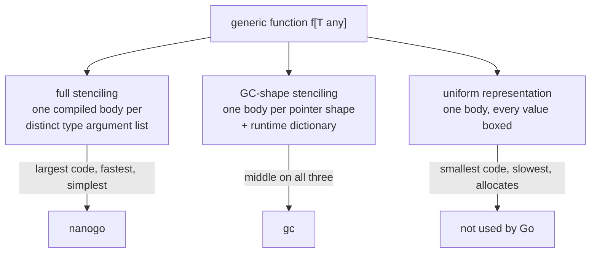

# Generics

Type *checking* of generic code arrives with the fork in
[012](012-type-checking.md): inference, constraint satisfaction, core types, and
instantiation of types are upstream's and are not rewritten. What does not
arrive with the fork is the decision this spec makes: how an instantiated
generic function becomes machine code.

nanogo's own source uses generics, so [001](001-bootstrap-gates.md)'s G1 cannot
be reached without this.

## The three strategies



**Full stenciling** compiles `f[int]` and `f[string]` as two unrelated
functions. Every type is known at compile time, so every operation is direct: no
indirection, no dictionary, no boxing.

**GC-shape stenciling**, which `gc` uses, compiles one body per *GC shape* —
types that are identical in size and pointer layout share a body — and passes a
dictionary holding the type descriptors and method tables the body cannot know
statically. It trades a smaller binary for an indirection on every operation that
depends on the type argument.

**Uniform representation** compiles one body and gives every value a pointer
representation. Java's erasure and OCaml's boxed representation are this. It
costs an allocation per value and Go does not use it.

## Decision: full stenciling

nanogo stencils fully. One compiled body per distinct list of type arguments.

Three reasons, in order of weight.

### 1. The language guarantees it terminates

The obvious objection to stenciling is that instantiation can recurse forever:

```go
func f[A, B any]() {
    type T int
    f[T, map[A]B]()   // each call instantiates with a strictly larger type
}
```

Go rejects this. `cmd/compile/internal/types2/mono.go` implements a type-flow
analysis that builds a weighted graph over type parameters and defined types, and
rejects a package whose graph has a cycle through an edge of weight 1. Its own
comment states the purpose: a package that fails this check "cannot be
statically instantiated".

That check arrives with the fork in [012](012-type-checking.md). **The set of
instantiations is finite by the language definition, and nanogo inherits the
proof.** Stenciling is not a gamble that programs will be well-behaved.

### 2. It removes an entire subsystem

Dictionaries are not a small feature. They need a layout, a construction pass, a
symbol per instantiation, a way to pass them that the ABI must accommodate, a
rule for what goes in them, and a story for methods reached through them. In
`gc` this is a substantial part of the generics implementation.

Under [000](000-decisions.md) decision 10 that subsystem has to justify itself
against a 40,000-line budget, and what it buys is binary size.

### 3. It is correct by construction

A stenciled body is an ordinary monomorphic function. Everything downstream —
[020](020-ir.md), [021](021-ssa-construction.md), escape analysis, the register
allocator — sees no generics at all. There is no second path to be wrong on.

## What it costs, stated plainly

| Cost | Size | Mitigation |
| --- | --- | --- |
| Binary size | A generic used at $n$ distinct type argument lists costs $n$ bodies. Real Go code has small $n$; `slices` and `maps` in a large program are the worst case. | Deduplication, below. None beyond it. |
| Compile time | Proportional to the same $n$. | Instantiation bodies are compiled in parallel with everything else. |
| Export data | The generic *body* must be exported, because an importer instantiates it. [015](015-export-data.md) carries it. | None; `gc` has the same requirement. |

nanogo will produce larger binaries than `gc` for generic-heavy code. That is the
trade and it is accepted.

## Mechanics

### Discovering the instantiation set

A worklist over the package being compiled:

1. Seed with every explicit or inferred instantiation the type checker recorded.
2. Take an instantiation, substitute the type arguments through the generic
   body, and type-check the result.
3. Any instantiation appearing in that body that is not already in the set is
   added.
4. Repeat until the set is stable. Termination is guaranteed by the mono check.

Substitution operates on the checked tree, not on source text. The type checker's
`subst.go` already performs it for types and comes with the fork; nanogo extends
it to function bodies.

### Identity and naming

Two instantiations are the same if their type argument lists are identical under
Go's type identity. That is the checker's `Identical`, unchanged.

The symbol name is the generic's name with the type arguments, each written in
its fully qualified form:

```
golang.design/x/nanogo/ssa.Map[int,*golang.design/x/nanogo/ir.Node]
```

The name must be **canonical and independent of which package triggered the
instantiation**, because two packages that both instantiate `slices.Sort[int]`
must produce one symbol that the linker merges rather than two that it keeps.
This is the same requirement [032](032-type-descriptors-and-itabs.md) places on
type descriptor names, and it is met the same way: one naming function, used
everywhere, deterministic by [053](053-determinism.md).

### Where the instantiation is compiled

In the package that triggers it, marked as a deduplicable definition. The linker
keeps one. This is simpler than assigning ownership to the defining package,
which would require a second pass over already-compiled packages when a new
importer appears.

### Methods

Go has no generic methods: a method may not declare its own type parameters. A
method on a generic *type* is instantiated with the type, so `List[int].Push` is
an ordinary method of the ordinary type `List[int]`.

This is why generics do not reach [032](032-type-descriptors-and-itabs.md) as a
special case. An instantiated type is a defined type, gets a descriptor like any
other, and satisfies interfaces by the same rules.

## What the rest of the compiler sees

Nothing. By the time [020](020-ir.md) receives a package, every generic
declaration has become zero or more monomorphic declarations, and the generic
declarations themselves are dropped. An uninstantiated generic function produces
no code.

This is the property that pays for the binary size, and it is worth stating as a
rule: **no spec numbered 020 or above may mention a type parameter.** If one
needs to, this decision was wrong.

## Testing

- Go's `test/typeparam` corpus, which is the reference implementation's own
  generics suite, run under [004](004-conformance.md) L2.
- Instantiation set closure: for a corpus of generic programs, assert the
  discovered set matches a hand-computed expected set. This is the part that
  fails silently by being too small.
- Cross-package deduplication: two packages instantiating the same generic must
  yield one symbol in the linked binary.
- Rejection: the `mono` corpus, asserting nanogo rejects unbounded recursive
  instantiation at the right position rather than looping.
