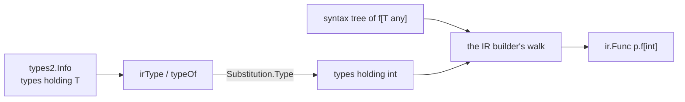
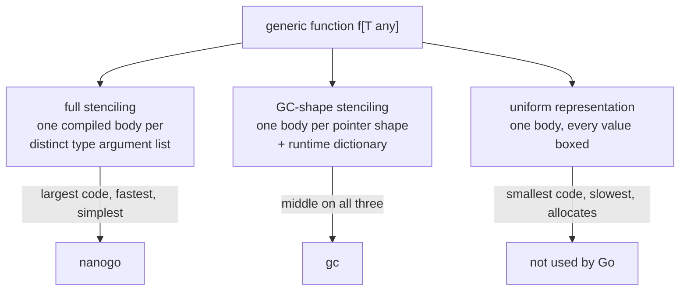

# Generics

Type *checking* of generic code arrives with the fork in
[012](012-type-checking.md): inference, constraint satisfaction, core types, and
instantiation of types are upstream's and are not rewritten. What does not
arrive with the fork is the decision this spec makes: how an instantiated
generic function becomes machine code.

nanogo's own source uses generics, so [001](001-bootstrap-gates.md)'s G1 cannot
be reached without this.

## What is built, and what is not

**The stenciler is built for a generic this package declares.** `ir/stencil.go`
compiles one monomorphic function per distinct list of type arguments, and the
declaration itself produces nothing, because a body with type parameters in it
has no run-time representation in the package that declares it and `gc` emits
none either.

`internal/audit/testdata/probes/generic-func` was the corpus's one refused
generic program and it is compiled and run now: the probe corpus is 91 ok, 4
refused and 0 wrong. `internal/e2e/generic_test.go` links a program holding
five generics at two type argument lists each and runs it, and reads the
symbols back out with `go tool nm`.

### How a body is instantiated

The IR builder already walks a syntax tree and asks the checker for the type of
every expression and the object of every name. A generic body is the same walk
with one difference: the checker's answers hold type parameters, and the answer
the stenciler wants is that answer with the type arguments in place of them. So
the substitution is applied at the doors every type comes through, `irType` and
`typeOf`, and no case of the walk is duplicated.



`types2.Substitution` is the door on the checker's own `subst.go`
(`types2/stencil.go`). Nothing re-derives substitution: it calls the method
`Instantiate` calls, with a nil `*Checker`, which is the mode `subst.go` is
already written for. `Instantiate` alone cannot serve, because it takes a
generic `*Alias`, `*Named` or `*Signature` and a body is made of `[]T`,
`map[K]V`, `*T` and `func(T)`.

An object declared inside the body is keyed by the instantiation as well as by
the checker object, because a local of type `T` holds an `int` in one
instantiation and a `string` in another, and one IR object cannot have two
types. An object declared at package scope keeps the one identity it had.

### Discovery

A call to a generic is discovered where the callee's name is resolved, which is
the one place both spellings reach: the explicit `F[int]` and the inferred
`F(1)` put the type arguments on the same `*syntax.Name`, in `Info.Instances`.
Discovery appends to a slice in walk order and never ranges over the map
([053](053-determinism.md)). The worklist is drained after the declared
functions, so an instantiation found inside an instantiated body is built too.

### What is refused, by name

Each of these produces no body, so accepting it would emit a call to a symbol
nothing defines. Each is reported with the declaration's name, which is what
replaces an undefined symbol carrying no source position.

| Refused | Why |
| --- | --- |
| a method with type parameters of its own | The third place the language binds a type parameter. Instantiating the receiver does not instantiate the method, so the key of the instantiation is not the list on the selector alone. The Methods section below states the question and does not close it. |
| an instantiation of a generic another package declared, function or type | The body is in that package's archive. [015](015-export-data.md) reads one and [020](020-ir.md) has no entry point that takes one, so there is no tree here to substitute through. `gc` has the same obligation and discharges it from the export data: it emits the method of every instantiation, `dupok`, in the package that instantiates. |
| a type declared inside a generic body that holds a type parameter | Substitution rebuilds a type literal and stops at a name, so `type S []T` inside `f[T any]` comes back unchanged and every instantiation of `f` would share one `S`. Instantiating `S` is instantiating a type the stenciler has no declaration to key by. The export writer refuses the same declaration for the same reason. |

**A method of a generic type this package declares is built.** The unit of
discovery is the *type* and not the call site, because a method of an
instantiation is reached by more than a call: an itab holds it, and a
descriptor names it in the `Method` array `reflect` indexes. So `ir/convert.go`
tells the stenciler about every instantiation it converts, which is the one
place every type a package names comes through, and the whole method set of
the instantiation is built.

Two things had to be true first. The symbol had to spell the receiver's type
arguments, or `L[int].Get` and `L[string].Get` would be one symbol and two
functions, and `ir.MethodSymbol` does that now
([032](032-type-descriptors-and-itabs.md)) for the stenciler and for the
descriptor row alike, so the two cannot disagree. And the substitution had to
be built from the *method's own copy* of the receiver's type parameters,
`Signature.RecvTypeParams`, which is the list the body's recorded types name.
The type's own list is a different set of `*TypeParam` values spelled the same
way.

Substitution stopping at a name is the one place the substitution is not total,
and it is why the refusal is checked rather than assumed:
`Substitution.Substitutes` answers whether a type still holds a type parameter
the substitution replaces, and the type declaration is the one construct that
can reach the IR still holding one.

### What is built, measured rather than imagined

These shapes are compiled and covered in `ir/stencil_test.go` and
`internal/e2e/generic_test.go`:

a value, a parameter and a result of the type parameter's type; an operation
whose instruction depends on the type argument; a local, including one a range
statement declares; `make`, `new` and a composite literal of a type built out of
the type parameter; a conversion; a comparison; a method reached through the
constraint, on a concrete type argument and on an interface one; a method
*value* reached through the constraint; a function literal, which becomes a
function of the package named after the instantiation; `defer`; a call to
another generic at the enclosing instantiation's type argument; and a generic
that calls itself.

Most are exercised at two type argument lists, so a body that shared a type
with the other body would show. The two that showed a wrong answer this way are
below.

### Two wrong answers the stenciler surfaced

Both were silent, and both were found by lifting the refusal rather than by
reading the code.

1. **A method reached through a constraint called the constraint's method.**
   `x.M()` on a value whose type is a type parameter resolves, in the checker's
   record, to the method of the *constraint*. Building that selection unchanged
   emitted a direct call to the interface's symbol, which nothing defines. The
   selection is looked up again against the substituted receiver now, so each
   instantiation calls its own concrete method.
2. **An unnamed result was shared between two instantiations.** An unnamed
   result variable is in no scope at all, so a rule that keyed an object by its
   parent scope gave `work[int]` and `work[string]` one result object, and the
   second body returned `[]int`. The kind of the object decides now, and the
   scope settles only where a name may be declared at package scope as well as
   inside a function.

A third was found in the naming. `type Alias = int` makes `Alias` and `int`
identical, so `id[Alias]` and `id[int]` are one instantiation, and a symbol
spelled from the source's word gave one body two symbols. `types2.Canonical`
resolves an alias at every depth, so the symbol is a function of the type's
identity.

**The type parameter guard still holds, and it stopped firing for the right
reason.** `ir/convert.go` rejects a type parameter outright and the test that
asserts it is unchanged. It no longer fires on an instantiation, because the
bodies are instantiated and not because they are skipped, which is what the
rule at the end of this file asked for.

**The reader and the builder are both built.** `export/body.go` decodes the
body of a generic another package declares, exactly, over every body element of
375 standard library packages, and `export/bodybuild.go` builds the same tree
out of `syntax`. So the input for the cross-package half exists. What does not
exist is the path from that tree to `ir`: `ir.Build` takes a package, its files
and an `Info`, and one decoded body is none of the three. That request stays
open on [020](020-ir.md).

**A generic function reaches a file, and `gc` instantiates it.**
`export/bodydict.go` numbers the slots a generic body names, and it is one
allocator: the builder fills the dictionary while it builds the body and
`objDict` writes the same lists out, so the slot the body names and the entry
the dictionary holds cannot disagree. `gc` reads a library of generic functions
nanogo wrote, stencils each at two concrete type arguments, and the program
links and runs ([015](015-export-data.md) has the measurement).

Four generic shapes are refused by the *writer*, each because its dictionary is
not the one a body carries: a generic type declaration and a method of one,
whose dictionary spans the type and every method it declares; a method with
type parameters of its own, whose dictionary holds the receiver's ahead of
them; a generic declaration of another package, whose body and dictionary live
in that package's archive; and a type declared inside a generic declaration,
whose every use carries the enclosing type parameters implicitly.

## The three strategies



**Full stenciling** compiles `f[int]` and `f[string]` as two unrelated
functions. Every type is known at compile time, so every operation is direct: no
indirection, no dictionary, no boxing.

**GC-shape stenciling**, which `gc` uses, compiles one body per *GC shape*
(types that are identical in size and pointer layout share a body) and passes a
dictionary holding the type descriptors and method tables the body cannot know
statically. It trades a smaller binary for an indirection on every operation that
depends on the type argument.

**Uniform representation** compiles one body and gives every value a pointer
representation. Java's erasure and OCaml's boxed representation are this. It
costs an allocation per value and Go does not use it.

## Decision: full stenciling

nanogo stencils fully. One compiled body per distinct list of type arguments.

Three reasons, in order of weight.

### 1. The language guarantees it terminates

The obvious objection to stenciling is that instantiation can recurse forever:

```go
func f[A, B any]() {
    type T int
    f[T, map[A]B]()   // each call instantiates with a strictly larger type
}
```

Go rejects this. `cmd/compile/internal/types2/mono.go` implements a type-flow
analysis that builds a weighted graph over type parameters and defined types, and
rejects a package whose graph has a cycle through an edge of weight 1. Its own
comment states the purpose: a package that fails this check "cannot be
statically instantiated".

That check arrives with the fork in [012](012-type-checking.md). **The set of
instantiations is finite by the language definition, and nanogo inherits the
proof.** Stenciling is not a gamble that programs will be well-behaved.

### 2. It removes an entire subsystem

Dictionaries are not a small feature. They need a layout, a construction pass, a
symbol per instantiation, a way to pass them that the ABI must accommodate, a
rule for what goes in them, and a story for methods reached through them. In
`gc` this is a substantial part of the generics implementation.

That subsystem has to justify itself, and what it buys is binary size.

### 3. It is correct by construction

A stenciled body is an ordinary monomorphic function. Nothing downstream sees a
generic at all: not [020](020-ir.md), not [021](021-ssa-construction.md), not
escape analysis, not the register allocator. There is no second path to be wrong on.

## What it costs

| Cost | Size | Mitigation |
| --- | --- | --- |
| Binary size | A generic used at $n$ distinct type argument lists costs $n$ bodies. Real Go code has small $n$; `slices` and `maps` in a large program are the worst case. | Deduplication, below. None beyond it. |
| Compile time | Proportional to the same $n$. | Instantiation bodies are compiled in parallel with everything else. |
| Export data | The generic *body* must be exported, because an importer instantiates it. [015](015-export-data.md) carries it. | None; `gc` has the same requirement. |

nanogo will produce larger binaries than `gc` for generic-heavy code. That is the
trade and it is accepted.

## Mechanics

### Discovering the instantiation set

A worklist over the package being compiled:

1. Seed with every explicit or inferred instantiation the type checker recorded.
2. Take an instantiation and build its body, substituting the type arguments
   through every type the checker recorded for it.
3. Any instantiation appearing in that body that is not already in the set is
   added.
4. Repeat until the set is stable. Termination is guaranteed by the mono check.

Step 2 says "build" and not "type-check the result", which is the one place the
built stenciler differs from what this section first said. There is no second
type check. The checker already resolved the instantiation, and what the
substitution supplies is the concrete type in place of each type parameter in
an answer the checker already gave. Re-checking would be a second answer to a
question that is answered, and the two would differ on exactly the bodies that
are hard to write.

Substitution operates on the checked tree, not on source text. The type
checker's `subst.go` performs it for types and comes with the fork.
`types2.Substitution` is the exported door on it, and `ir/stencil.go` applies it
where the builder reads a type.

### Identity and naming

Two instantiations are the same if their type argument lists are identical under
Go's type identity. That is the checker's `Identical`, unchanged.

The symbol name is the generic's name with the type arguments, each written in
its fully qualified form:

```
golang.design/x/nanogo/ssa.Map[int,*golang.design/x/nanogo/ir.Node]
```

The name must be **canonical and independent of which package triggered the
instantiation**, because two packages that both instantiate `slices.Sort[int]`
must produce one symbol that the linker merges rather than two that it keeps.
This is the same requirement [032](032-type-descriptors-and-itabs.md) places on
type descriptor names, and it is met the same way: one naming function, used
everywhere, deterministic by [053](053-determinism.md).

Canonical means under the type's identity and not under the source's word for
it. `type Alias = int` makes `Alias` and `int` identical, so a symbol spelled
from the source gives one instantiation two names. `types2.Canonical` resolves
an alias at every depth before the name is written.

### Why this name cannot collide with one gc wrote

Both compilers put functions into one binary, so the question is not whether
the spelling is reasonable but whether `gc` ever produces it. It does not, and
the evidence is `go tool nm` rather than a source file. For

```go
func pick[T any](a, b T, f bool) T
```

instantiated at `int`, at `string` and at two distinct one-pointer structs, the
symbols in the linked binary are

```
main.pick[go.shape.int]
main.pick[go.shape.string]
main.pick[go.shape.struct { main.p *int }]
main..dict.pick[int]
main..dict.pick[string]
main..dict.pick[main.S]
```

A body of `gc`'s carries `go.shape.` inside the brackets, because `gc` stencils
by GC shape. A dictionary of `gc`'s carries `..dict.` before the name. A full
stencil carries neither, so `main.pick[int]` is a name `gc` has no way to write.
`internal/e2e/generic_test.go` reads the symbol table of a linked program and
asserts it, on the symbols of the package nanogo compiled.

The two agree on how a type argument is spelled: `gc` writes its dictionary
through `types.LinkString` and nanogo writes `types2.TypeString` with no
qualifier, and both give every defined type its import path.

### Where the instantiation is compiled

In the package that triggers it, marked as a deduplicable definition. The linker
keeps one. This is simpler than assigning ownership to the defining package,
which would require a second pass over already-compiled packages when a new
importer appears.

The deduplicable mark is not written yet, and it cannot be needed yet. Only a
generic the package being compiled declares is instantiated, and only that
package can instantiate it, so no two objects can define one instantiation. The
mark becomes an obligation with the cross-package half, and `driver/compile.go`
already sets `obj.SymFlagDupok` on the wrapper it generates for the same
reason, so the mechanism is there and the caller is not.

### Methods

A method on a generic *type* is instantiated with the type, so `List[int].Push`
is an ordinary method of the ordinary type `List[int]`. An instantiated type is
a defined type, gets a descriptor like any other, and satisfies interfaces by
the same rules, so that half of the language reaches
[032](032-type-descriptors-and-itabs.md) as no special case at all.

That is built now for a generic type this package declares. Naming the type,
converting it, giving it a descriptor and building each of its methods are the
four pieces, and all four are in place: `ir.Type.TypeArgs` carries the
arguments, `ir.MethodSymbol` spells them, the descriptor is written under the
name that holds them, and `ir/stencil.go` builds the method set of every
instantiation the converter meets.

**What no program can use yet is the export data.** A package's own
declarations reach a file, and a method of a generic type is written into the
type's dictionary, after the underlying type and after every method declared
before it. `export.BodySource` numbers one dictionary per declaration, so it
refuses a method of a generic type by name and the writer refuses with it
([015](015-export-data.md)). A generic type with **no** method is written and a
generic type with one is not, so a package that declares `L[T]` with a method
does not compile, even though its bodies are built and correct. That is the one
piece left, and it is [015](015-export-data.md)'s rather than this file's.

A method may also declare its own type parameters. `types2/resolver.go` gates
the declaration on `go1_27` and names the feature "generic method",
`export/pkgbits`'s version `V4` encodes one as a standalone function object,
and `export/reader.go` reads one. So a method is a third place a type parameter
is bound, beside a function and a type, and instantiating the receiver does not
instantiate the method.

What that costs is still not settled. The discovery rule and the identity rule
above are both stated over functions and types, and neither says what the key of
an instantiated generic method is when the receiver is already concrete. The
stenciler refuses one by name rather than guessing the key.

## What the rest of the compiler sees

Nothing. By the time [020](020-ir.md) receives a package, every generic
declaration has become zero or more monomorphic declarations, and the generic
declarations themselves are dropped. An uninstantiated generic function produces
no code.

This is the property that pays for the binary size, and it is worth stating as a
rule: **no spec numbered 020 or above may mention a type parameter.** If one
needs to, this decision was wrong.

The rule holds and the enforcement is real, but it sits one level lower than the
sentence suggests. `ir.Convert` rejects a type parameter outright and a test
asserts the rejection. That guard was the measure a stenciler had to meet, and
it is met for a generic function this package declares: the guard stopped firing
on an instantiation because the body was instantiated and not because it was
skipped.

It still fires on the two shapes the stenciler refuses, and that is the honest
outcome rather than a gap papered over. A type parameter reaching the IR still
means an uninstantiated body arrived.

Two specs above 020 name a type parameter, and they name the guard rather than
the language: [032](032-type-descriptors-and-itabs.md) records that the refusal
of a descriptor for one comes from `ir/convert.go` and not from `rtype`, and
[060](060-selfhost.md) counts the bootstrap packages the guard refuses. Both are
readings of the guard. Neither is this spec's to rewrite, and both should be
re-read now that a generic function of the package being compiled no longer
reaches the guard.

## Testing

What is built:

- **A program that runs.** `internal/e2e/generic_test.go` builds a module with
  `nanogo build`, links it and runs it. The program holds five generics at two
  type argument lists each: a value of the type parameter's type, an operation
  whose instruction depends on the type argument, a local of a composite type
  built out of it, a method reached through the constraint on two types whose
  bodies differ, and a call to another generic. The exit status is the
  assertion, so a wrong value kills the process.
- **The naming, read out of the linked binary.** The same test runs
  `go tool nm` and asserts every expected symbol is there, and that no symbol of
  the package nanogo compiled carries `go.shape.` or `..dict.`.
- **The probe corpus.** `probes/generic-func` compiles, links, runs, and is
  compared against the same program compiled by `gc`. It was the corpus's one
  refused generic program.
- **Instantiation set closure**, in `ir/stencil_test.go`: the discovered set is
  compared against a hand-computed expected list, in order, for a nested chain
  of three generics at two type arguments and for a generic that calls itself.
- **Deduplication**, in the same file: two call sites at one type argument list
  are one body, and `id[Alias]` and `id[int]` are one body.
- **Determinism**: the same source is built nine times and the symbol list is
  compared, which [053](053-determinism.md) requires.
- **Rejection**: the `mono` corpus arrives with the fork and `mono_test.go`
  runs.

What is not:

- Go's `test/typeparam` corpus, which is the reference implementation's own
  generics suite, run under [004](004-conformance.md) L2. It is not vendored:
  `internal/gotest/testdata/go/test` holds the 356 top-level files of `test/`
  and none of its subdirectories. It is the next test to add, and it is what
  will find the shapes the list above was written by imagining rather than by
  measuring.
- Cross-package deduplication, which needs the cross-package half of the
  stenciler first.

## What was wrong

**The spec said a stenciler needs a per-function entry point on `ir`.** It
asked [020](020-ir.md) for one, on the ground that "`ir.Build` takes a package,
its files and an `Info`, and one decoded body is none of the three". That is
true for the cross-package half and it was stated as though it were true for
all of it. It is not: a generic this package declares has a syntax tree here
already, and the walk that builds it is the one that builds every other
function. So the stenciler for the same package needed nothing new from
[020](020-ir.md), and the request stands only for the half that reads a body out
of an archive.

**The spec planned a second type check per instantiation.** Step 2 of the
worklist said "substitute the type arguments through the generic body, and
type-check the result". The built stenciler does not type-check anything. The
checker resolved the instantiation before the IR is built, and what the
substitution supplies is the concrete type in place of each type parameter in
an answer the checker already gave.

**The spec said Go has no generic methods.** The sentence was "a method may not
declare its own type parameters", and it carried the conclusion that generics
reach [032](032-type-descriptors-and-itabs.md) as no special case, because
every method of an instantiated type is an ordinary method. Half of that
conclusion survives and the premise does not: Go 1.27 admits a generic method,
which the fork's own checker gates by version and the fork's own reader
decodes. The Methods section states both halves now, and it states the question
the change opens rather than closing it by assertion.
