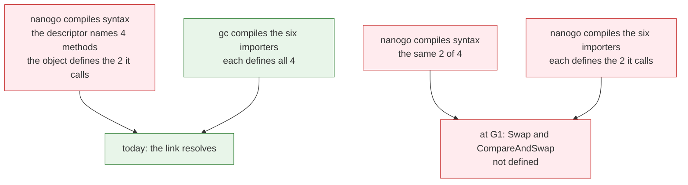
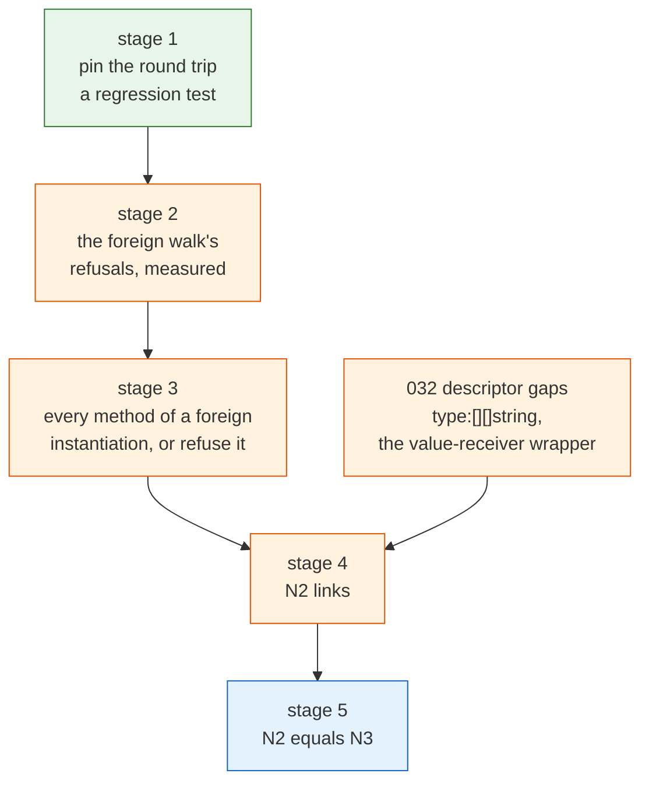

# Export data reading

[015](015-export-data.md) owns the format and both halves of it. This spec owns
one question that format spec cannot answer from inside itself: what happens
when the archive a compilation reads was written by nanogo rather than by `gc`.

That is the configuration G1 is defined in. [060](060-selfhost.md) asks for
$N_1 \to N_2 \to N_3$ with $N_2 = N_3$ byte for byte, and stage 1 is nanogo
compiling its own 19 packages against each other rather than against the
`gc`-built copies the measurement in [005](005-remaining-work.md) uses.

Everything below was measured with commands, and each measurement is quoted
where it is claimed. The one number this spec does not have is the one G1 is
graded on, because the executable does not link yet and $N_2$ does not exist.

Two conventions in the quoted output. `$fresh` stands for a `GOCACHE` directory
created for that run, because a cached compile action means `-toolexec` never
ran and the run proved nothing ([060](060-selfhost.md)). And a long symbol name
or a long temporary path is shortened with an ellipsis where the shortening
cannot be misread. Every other byte is what the command printed.

The measurements were taken against the working tree at the time of writing.
`ir/foreign.go` was under edit in that tree, so the coverage numbers below move
with it, and the `Sizeof` row in particular is expected to move: `ir/build.go`
folds `unsafe.Sizeof` for an instantiation now ([016](016-directives-and-pragmas.md))
and the foreign walk does not have that case yet.

## The finding that changes the shape of the work

Stage 1 runs. All 19 packages compile against nanogo-built dependencies, and
the reader reads every archive nanogo wrote.

`allow19.txt` holds the 19 library packages, one import path per line.

```console
$ GOCACHE=$fresh NANOGO_ALLOWLIST=allow19.txt NANOGO_LOG=log19.txt \
      go build -toolexec=./nanogo $(cat allow19.txt)
$ echo $?
0
$ grep -c '^compiled golang.design' log19.txt
19
```

The exit status proves nothing on its own, for the reason
[060](060-selfhost.md) states: `-toolexec` hands `gc` whatever nanogo declines,
so a build that passes may have compiled nothing. The 19 `compiled` lines are
the evidence, and the cache was fresh so no compile action was answered from
it. Every package after the first in dependency order read `-importcfg`
entries naming archives earlier lines of the same log say nanogo wrote.

So the sentence [005](005-remaining-work.md) carries, that the reading half has
not started and G1 does not close until the reader exists, is **stale**. The
reader exists, it reads what nanogo writes, and what G1 waits on is one
class of symbol the *back end* does not emit. The correction belongs in that
spec and this one records the measurement behind it.

### The reader, run over nanogo's own archives

`export.Reader.Read` followed by `export.Reader.Bodies` over the 17 archives
the `cmd/nanogo` build produced, which is every package in that binary's
closure:

```
golang.design/x/nanogo/cmd/nanogo      decls=0    bodies=0   generic=0  ok
golang.design/x/nanogo/dist            decls=35   bodies=19  generic=0  ok
golang.design/x/nanogo/driver          decls=65   bodies=32  generic=4  ok
golang.design/x/nanogo/export          decls=189  bodies=81  generic=4  ok
golang.design/x/nanogo/export/pkgbits  decls=142  bodies=72  generic=0  ok
golang.design/x/nanogo/ir              decls=185  bodies=57  generic=4  ok
golang.design/x/nanogo/loader          decls=26   bodies=20  generic=4  ok
golang.design/x/nanogo/obj             decls=162  bodies=40  generic=0  ok
golang.design/x/nanogo/obj/arm64       decls=291  bodies=136 generic=0  ok
golang.design/x/nanogo/rtsym           decls=23   bodies=5   generic=0  ok
golang.design/x/nanogo/rtype           decls=43   bodies=15  generic=0  ok
golang.design/x/nanogo/ssa             decls=394  bodies=184 generic=0  ok
golang.design/x/nanogo/ssa/rules       decls=2    bodies=0   generic=0  ok
golang.design/x/nanogo/ssagen          decls=35   bodies=14  generic=4  ok
golang.design/x/nanogo/syntax          decls=153  bodies=66  generic=4  ok
golang.design/x/nanogo/types2          decls=323  bodies=492 generic=4  ok
golang.design/x/nanogo/types2/errors   decls=153  bodies=1   generic=0  ok
```

17 archives, 0 read failures, 0 body decode failures. `cmd/nanogo` is on the
list at zero declarations, which is what a `main` package owes an importer and
is [015](015-export-data.md)'s own reason the reader was built before the
writer. The container's read
half, the declaration reader and the body decoder all take nanogo's own bytes.
Nothing in `export/pkgbits`, `export/read.go`, `export/reader.go`,
`export/body.go` or `export/bodyread.go` is on the critical path to G1.

### The round trip, end to end, with a program that ran

Two packages in one module, `a` declaring an ordinary function, a generic
function and a generic type with two methods, `b` naming all three, and a
`main` that prints. `nanogo build` refuses two packages where one imports the
other (`driver/help.go`), so this is `go build -toolexec` with an allowlist
naming all three and a fresh `GOCACHE`.

```go
// a/a.go
package a

func F(x int) int { return x + 1 }

func Max[T int | float64](a, b T) T {
	if a > b {
		return a
	}
	return b
}

type Box[T any] struct{ v T }

func (b *Box[T]) Set(x T) { b.v = x }
func (b *Box[T]) Get() T  { return b.v }
```

```go
// b/b.go
package b

import "xrt/a"

func G(x int) int {
	var bx a.Box[int]
	bx.Set(a.Max(a.F(x), 2))
	return bx.Get()
}
```

```console
$ GOCACHE=$fresh NANOGO_ALLOWLIST=allow.txt NANOGO_LOG=log.txt \
      go build -toolexec=./nanogo -o hello ./cmd/hello
$ cat log.txt
compiled xrt/a /var/.../b003/_pkg_.a
compiled xrt/b /var/.../b002/_pkg_.a
compiled main /var/.../b001/_pkg_.a
$ ./hello
G(40) = 41
```

`b` read `a`'s nanogo-written archive, resolved a generic function and a
generic type with methods out of it, stenciled both, and the program ran with
the right answer. That is the whole of what "a nanogo-compiled package is
importable by another nanogo compile" asks for, and it holds today.

## What is actually missing

`cmd/nanogo` itself, every package of it compiled by nanogo, gets to the
linker and stops there.

```console
$ GOCACHE=$fresh NANOGO_ALLOWLIST=allow19+main.txt NANOGO_LOG=logN2.txt \
      go build -toolexec=./nanogo -o nanogo-N2 ./cmd/nanogo
# golang.design/x/nanogo/cmd/nanogo
type:*sync/atomic.Pointer[[]*golang.design/x/nanogo/syntax.SrcFile]: relocation target sync/atomic.(*Pointer[[]*golang.design/x/nanogo/syntax.SrcFile]).CompareAndSwap not defined
type:*sync/atomic.Pointer[[]*golang.design/x/nanogo/syntax.SrcFile]: relocation target sync/atomic.(*Pointer[[]*golang.design/x/nanogo/syntax.SrcFile]).Swap not defined
type:[10][]string: relocation target type:[][]string not defined
type:golang.design/x/nanogo/export.bodyWriter: relocation target golang.design/x/nanogo/export.bodyWriter.bigInt not defined
type:golang.design/x/nanogo/export.bodyWriter: relocation target golang.design/x/nanogo/export.bodyWriter.scalar not defined
type:golang.design/x/nanogo/export.bodyReader: relocation target golang.design/x/nanogo/export.bodyReader.bigInt not defined
type:golang.design/x/nanogo/export.bodyReader: relocation target golang.design/x/nanogo/export.bodyReader.scalar not defined
$ grep -c '^compiled ' logN2.txt   # every package including main
17
```

Seven relocations in three classes. One of them is this spec's and two are
not, and the split is not obvious from the messages, so it was measured.

| Class | Symbol | Owner |
| --- | --- | --- |
| a method of an instantiation of a generic type another package declares | `sync/atomic.(*Pointer[…]).Swap`, `.CompareAndSwap` | **this spec** |
| an array descriptor's element descriptor | `type:[][]string` | [032](032-type-descriptors-and-itabs.md) |
| the value-receiver form of a promoted method | `export.bodyWriter.bigInt`, `.scalar` | [032](032-type-descriptors-and-itabs.md), [030](030-abi.md) |

### The one that is this spec's, isolated

The descriptor of an instantiated generic type names every method the
instantiation has. `ir/stencil.go` builds a method of a foreign instantiation
only where the method is **called**, and `instantiateType` says why:

> Building the method set of each would read an archive for every type the
> package's types transitively hold, most of which no code here calls.

So the descriptor promises four methods and the object holds two.

```console
$ go tool nm syntax/_pkg_.a | grep 'atomic.(\*Pointer\[\[\]\*.*SrcFile\])'
  100d8d T sync/atomic.(*Pointer[[]*…syntax.SrcFile]).Load
  100d1d T sync/atomic.(*Pointer[[]*…syntax.SrcFile]).Store
         U sync/atomic.(*Pointer[[]*…syntax.SrcFile]).Swap
         U sync/atomic.(*Pointer[[]*…syntax.SrcFile]).CompareAndSwap
```

`syntax` calls `Load` and `Store` and stencils exactly those two.

**Why this never surfaced before.** `gc` emits the whole instantiation,
methods included, in every package that reaches it, `dupok`. Running
`go tool nm` over every archive the link configuration names, in the build
where nanogo compiles `syntax` alone and `gc` compiles the rest:

| package, in that build | defines the descriptor | defines `CompareAndSwap` |
| --- | --- | --- |
| `syntax`, compiled by nanogo | yes | no |
| `driver`, compiled by `gc` | yes | yes |
| `export`, compiled by `gc` | yes | yes |
| `ir`, compiled by `gc` | yes | yes |
| `loader`, compiled by `gc` | yes | yes |
| `ssagen`, compiled by `gc` | yes | yes |
| `types2`, compiled by `gc` | yes | yes |

Six of the seven definitions are `gc`'s and the seventh, `syntax`, is
nanogo's and is the incomplete one. Put every importer on the allowlist and
the six definitions go away with them. The gap is not new at G1. It is
**revealed** at G1, because G1 is the first build in which no `gc`-compiled
package is left to cover for it.



### A ten-line reproduction

The whole-tree build is not needed to see it. One package that names an
instantiation of a foreign generic type without calling all of its methods is
enough, and no nanogo-written dependency is involved.

```go
// c/c.go
package c

import "sync/atomic"

type Cell struct{ p atomic.Pointer[[]int] }

func New() *Cell            { return &Cell{} }
func (c *Cell) Put(s []int) { c.p.Store(&s) }
func (c *Cell) Get() []int  { return *c.p.Load() }
```

```console
$ GOCACHE=$fresh NANOGO_ALLOWLIST=allowC.txt NANOGO_LOG=logC.txt \
      go build -toolexec=./nanogo -o helloC ./cmd/hello
# xrt/cmd/hello
type:*sync/atomic.Pointer[[]int]: relocation target sync/atomic.(*Pointer[[]int]).CompareAndSwap not defined
type:*sync/atomic.Pointer[[]int]: relocation target sync/atomic.(*Pointer[[]int]).Swap not defined
$ cat logC.txt
compiled xrt/c /var/.../b002/_pkg_.a
compiled main /var/.../b001/_pkg_.a
```

Add `Swap` and `CompareAndSwap` calls to `c` and the same program links and
runs:

```console
$ ./helloC
get 7
swapped old 7 now 9
```

So the bodies decode and the walk builds them. What is missing is not the
ability to build the method, it is the decision to build a method nothing
calls.

### What nanogo's reader must do that it does not

`gc`'s counterpart is `cmd/compile/internal/noder/reader.go`. Reading an
object of kind `ObjType` it reads the full method list and calls `funcExt`
for each, which queues each method's body for compilation:

```go
methods := make([]*types.Field, r.Len())
for i := range methods {
	methods[i] = r.method(rext)
}
…
if !r.dict.shaped {
	r.needWrapper(typ)
}
```

`needWrapper` then routes the type to one of two lists, and its comment is the
rule nanogo has not implemented:

> If a type was found in an imported package, then we can assume that package
> (or one of its transitive dependencies) already generated method wrappers
> for it. **Exception: If we're instantiating an imported generic type or
> function, we might be instantiating it with type arguments not previously
> seen before.**

That exception is the whole gap. For an ordinary imported type the defining
package owes the method symbols. For an *instantiation* of an imported generic
type, no package owes them, because the instantiation may exist nowhere but
here, so the instantiating package owes them. `MakeWrappers` emits them at the
end of the compilation.

| Obligation | `gc` | nanogo |
| --- | --- | --- |
| read every method of an imported generic type's declaration | `reader.go` `objIdx`, `ObjType` case | built (`export/reader.go` reads the declaration) |
| stencil the method a call names | `funcExt` queues the body | built (`ir/stencil.go` `checkMethodIsBuilt`, `ir/foreign.go` walks it) |
| stencil every method of an instantiation whose descriptor is emitted | `needWrapper` plus `MakeWrappers` | **not built** |
| skip that work for a non-generic imported type | `importedDef` | not needed, because nanogo does not emit those descriptors either |

## The generic case

`export/writer.go`'s `dictOf` refuses four shapes by name, and the reason each
is refused is that the dictionary a body was numbered against is not one the
writer can reconstruct. The four are separate questions and only one of them
is about reading.

| Refusal in `dictOf` | Still needed | What it would take to lift |
| --- | --- | --- |
| a method with type parameters of its own | yes | the format writes it as a declaration whose dictionary holds the receiver's type parameters ahead of the method's. `export/bodydict.go` has one allocator per declaration and no shape for two nested lists. Lifting it is a change to the allocator, not to the reader |
| a generic declaration of another package that no archive the build named holds | yes | the body and its numbering exist only in the declaring archive. If no archive holds it there is nothing to copy. The user's fix is the `-importcfg`, so the message says so |
| a generic declaration with no body built for it | yes | a generic without a body is a shape the format has no encoding for: `noder/linker.go` copies the stub extension data, which is `Bool(false)` and a body reference, and `gc`'s reader asserts on the other branch. A declaration written with no body is a file `gc` fails on at the first importer that instantiates |
| a generic declaration with no block | yes | the same encoding argument. Assembly or a linkname satisfies it and there is no body to write |

**None of the four is on G1's critical path**, and the reason is that nanogo's
own 19 packages declare three generic declarations in total:

```console
$ grep -rEn '^(func|type) [A-Za-z_]+\[[A-Za-z_]+ ' <the 19 package directories>
types2/predicates.go:566:func clone[P *T, T any](p P) P {
types2/subst.go:395:func substList[T comparable](in []T, subst func(T) T) (out []T) {
types2/trie.go:16:type trie[V any] map[int]any
```

All three are unexported and none is reachable from an exported declaration,
so none reaches export data at all. Neither `gc`'s archive for `types2` nor
nanogo's lists any of the three.

What *is* on the critical path is the copy path, and it works. Every archive
nanogo wrote for its own packages that reaches `sync/atomic.Pointer` carries
the four method bodies `export/foreign.go` copied out of `sync/atomic`'s
archive, and nanogo's own reader reads them back:

```
golang.design/x/nanogo/syntax  generic sync/atomic.(*Pointer).Load
golang.design/x/nanogo/syntax  generic sync/atomic.(*Pointer).Store
golang.design/x/nanogo/syntax  generic sync/atomic.(*Pointer).Swap
golang.design/x/nanogo/syntax  generic sync/atomic.(*Pointer).CompareAndSwap
```

**So the writer's refusal at `export/writer.go`'s `dictOf` is still needed and
lifting it naively would break the format**, and it is not what G1 waits on.
What G1 waits on is on the other side of the same feature: not writing a
generic declaration, but building every method of a generic declaration
already read.

### Where the reading half is genuinely narrow

`ir/foreign.go` is the walk from a decoded body into IR. Its two switches name
10 of the format's 15 statement codes and 11 of its 25 expression codes, and
every other code is refused by name. That is the measurable limit of the
reading half.

Over the 138 archives in `cmd/nanogo`'s closure, decoding every body reached
through a declaration's extension data, which is the generic path:

$$
\underbrace{317}_{\text{generic bodies}}
\qquad
\underbrace{96}_{\text{hold a code the walk does not name}}
\qquad
\underbrace{221}_{\text{within reach}}
$$

| Code the walk does not name | bodies holding it |
| --- | --- |
| expression: zero value | 78 |
| expression: composite literal | 21 |
| expression: `new` | 20 |
| statement: `go` or `defer` | 18 |
| expression: type assertion | 7 |
| expression: `make` | 6 |
| expression: `Sizeof` | 2 |
| expression: runtime helper | 2 |
| expression: function instantiation | 1 |

This is a static over-approximation and the spec says so rather than
overstating it. A body is walked only when something instantiates it, and two
codes the walk *does* build in one position are counted as refused when they
appear in another: a method value and a method receiver are built inside a
call, through `foreignMethodSel`, and refused elsewhere. Counting them as
built is where the 96 comes from. Counting them as refused gives 126. The
number that would settle it is the walk's own refusals over a real build,
which is stage 2 below.

`Sizeof`, `Alignof` and `Offsetof` fold in `ir/build.go` for an instantiation
now ([016](016-directives-and-pragmas.md)). The foreign walk does not have that
case, so the same operand refuses on this path and folds on the other. That
asymmetry is a stage 2 row and not a separate feature.

## Determinism

[053](053-determinism.md) requires byte-identical output and G1 is graded on
$N_2 = N_3$. That comparison cannot be attempted yet, because $N_2$ does not
link. What can be measured today is the property $N_2 = N_3$ rests on, which
is that one compiler binary compiling one source tree twice writes the same
bytes.

Two independent builds of the 19 packages, from a source tree copied to a
scratch directory so that nothing edited it between the runs, each with its own
`GOCACHE` and its own work directory:

```
packages=19 identical=19 differing=0
```

Byte for byte, archive for archive, including each `__.PKGDEF`. No determinism
defect is observed in the reader or the writer today.

**One false positive is recorded because it will happen again.** The same
comparison run against the live working tree reported `driver` differing by 129
bytes. The differing bytes were string constants of nanogo's own source, and
the cause was an edit landing between the two runs. Any determinism harness
for this must pin the source tree, or it will report the project's own commits
as compiler non-determinism.

What could still make $N_2$ and $N_3$ differ, named from the code rather than
guessed:

- **Archive search order.** `export/foreign.go` searches the declaring
  package's archive first and then every other archive in sorted import path
  order. Sorted, so this is fixed, and the comment names
  [053](053-determinism.md). A change that ranged a map here would be a
  silent regression.
- **String interning order.** `export/writer.go` interns one text as one
  element, so the element index of a string depends on the order strings are
  first reached. That order is the writer's walk order, which is the checker's
  object order, which is sorted. The risk is a future writer that reaches a
  string from a map.
- **The file name in a position base.** `driver/compile.go`'s `TrimPath` is
  the only path that reaches the export data. `gc` writes `objabi.AbsFile`'s
  form, which folds in the process working directory, and copying that would
  make the bytes depend on where the compiler ran.
- **The go command's own build ID.** Not the compiler's, and not in
  `__.PKGDEF`. A harness that compares whole archives rather than the export
  data member has to allow for it. The measurement above did not have to,
  because both runs read the same source and the same toolchain.
- **A miscompile of nanogo's own source that reproduces stably.** This one is
  in neither the reader nor the writer. $N_2 = N_3$ needs $N_1$, which `gc`
  built, and $N_2$, which nanogo built, to write the same bytes from the same
  source. A construct nanogo compiles wrongly but consistently passes the
  19-of-19 check above and still breaks stage 5.
  [001](001-bootstrap-gates.md) states the same caveat about its own gate.

The comparison G1 needs is not the one above. It is

$$
N_2 = N_3 \quad\text{where}\quad N_2 = N_1(\text{src}),\; N_3 = N_2(\text{src})
$$

and it needs a linked executable at stage 4.

## The staged plan

Each stage is independently testable and each is worth landing on its own.
The order is by what unblocks the measurement, not by size.



**Stage 1: pin what already works.** A nanogo-compiled package is importable
by another nanogo compile **today**, so the deliverable here is not a feature,
it is the test that stops it regressing. Two packages in a temporary module,
one importing the other, compiled in one `go build -toolexec` run with a fresh
`GOCACHE` and both on the allowlist, asserting on two `compiled` lines in
`NANOGO_LOG` and on the program's output. The generic function and the generic
type with methods are in package `a`, because those are the shapes the reader
carries and a test that used neither would pass without reading a body.

This is the stage that makes a nanogo-compiled package importable by another
nanogo compile. It is already met, and stage 1 is the assertion of it.

**Stage 2: measure the foreign walk, refusal by refusal.** Run
`ir/foreign.go`'s walk over every generic body of every archive a real build
reads and record the refusal for each, the way
`export/bodybuild_test.go`'s 6,150-element oracle records its own. The output
is a ratchet file with one line per refused body, so a code the walk starts
building shows up as a line leaving the file. Today's static approximation
says 96 of 317 bodies hold a code the walk does not name. Stage 2 replaces
that estimate with the walk's own answer.

The test that proves it: a ratchet under `internal/selfhost` or beside
`ir/foreign_test.go` that fails when a body that used to decode and walk stops
doing so, and that names each refusal by the code rather than counting them.

**Stage 3: every method of an instantiation of a foreign generic type.** For
each instantiated generic type whose descriptor this package emits, build every
method of the instantiation, not only the ones the package calls. `gc`'s
`needWrapper` and `MakeWrappers` are the shape. The cost is what
`instantiateType`'s comment warns about: an archive read per instantiated
foreign type the package's types transitively hold. Two things bound it. The
descriptor is already being emitted, so the set is the set of descriptors and
not the set of types. And the bodies are already cached per archive by
`export.Reader.Bodies`.

The test that proves it: the ten-line reproduction above, linked and run, plus
`go tool nm` asserting that all four `atomic.Pointer[[]int]` methods are
defined in the object.

**Stage 4: $N_2$ links.** Stage 3 plus [032](032-type-descriptors-and-itabs.md)'s
two descriptor gaps. The test is the `cmd/nanogo` build above with an exit
status of 0 and a `nanogo-N2 version` that answers.

**Stage 5: $N_2 = N_3$.** Build $N_3$ with $N_2$ and compare bytes. This is
[060](060-selfhost.md)'s gate and this spec ends at stage 4.

## What to refuse by name

The project's rule is that a silent wrong answer is worse than a refusal, and
each stage adds a refusal rather than a guess.

**Stage 1** adds no refusal. It asserts.

**Stage 2** keeps every refusal `ir/foreign.go` already writes, and each names
the code and the declaration it was met in:

    a use of <what> <n>, of <m> the body has
    the statement "go or defer"
    the expression "zero value"
    the expression "composite literal"
    the expression "Sizeof"
    a call of the builtin <name>
    a reference to the generic <name> outside an instantiation node
    a call naming subdictionary slot <n> of <m>

What stage 2 must not do is convert any of these into a fallback. A body the
walk half-builds is a wrong answer inside a function nobody in this repository
wrote.

**Stage 3** adds one refusal, and it is the one that matters most, because the
alternative to it is the failure this spec is about. When a method of an
instantiation cannot be built, the compiler must refuse the package by name
rather than emit the descriptor without the method:

    nanogo cannot compile <pkg>: the descriptor of <type> names the method
    <name> of an instantiation of <origin>, declared in <path>, and its body
    is <reason>

with `<reason>` one of three: the body is not in that package's archive, or
the foreign walk refuses it and the message names the code, or it is a generic
method, which
[013](013-generics.md) leaves open. The refusal has to name the *descriptor*
and not the call site, because there is no call site: that is the whole shape
of the bug.

The refusal that must **not** be written is the tempting one: emitting the
descriptor with a shortened method list. `reflect.Type.NumMethod` would then
answer with a number the source does not support, and a type switch or an
interface satisfaction check would take the wrong branch. That is a silent
wrong answer in a program that links.

**Stage 4** refuses nothing new. It is [032](032-type-descriptors-and-itabs.md)'s
two rows plus stage 3.

## What is not settled

**nanogo's export data holds a different object set from `gc`'s, in both
directions.** For `types2`, read back through nanogo's own reader:

| | `gc` | nanogo |
| --- | --- | --- |
| package-scope objects | 223 | 323 |
| bodies offered | 309 | 492 |

The 100 extra are unexported names, and the plausible cause is that nanogo
offers more bodies for inlining and an offered body drags its unexported
references into the file. **The divergence is not one-directional and it is not
uniform.** `gcArchSizes` is in `gc`'s file for `types2` and not in nanogo's.
`ssa/rules` is 17 bodies in `gc`'s file and 0 in nanogo's. `types2/errors` is 0
in `gc`'s and 1 in nanogo's. So no single rule explains the difference and none
of it is a defect on the evidence here, because both files are internally
consistent and both are read without complaint.

**`gc` does read nanogo's own archives, and it has done so twice.** With
`syntax` alone on the allowlist, `gc` compiled `types2`, `ir`, `loader`,
`driver`, `export` and `ssagen` against nanogo's `syntax` archive. With
`syntax` and `types2` on it, `gc` compiled the rest against both. Both builds
linked and both executables answered `nanogo version`. That is more than
nanogo's reader agreeing with nanogo's writer.

**What is still owed is the wide version of that check.**
`export/crossread_test.go`'s `TestGcReadsWhatNanogoWrote` compiles a file naming
every exported declaration of a package, which is what finds a declaration a
file omits rather than one a build happens not to reach. It runs over the
standard library and has never been pointed at nanogo's own 19 packages.

**Whether stage 3's cost is acceptable is not measured.** `instantiateType`'s
comment asserts that building the method set of every foreign instantiation
would read an archive for every type a package's types transitively hold. That
is an argument and not a measurement, and the set stage 3 needs is smaller than
the set the comment describes, because it is bounded by the descriptors the
package actually emits. What settles it is a compile time comparison on
`types2`, which is the largest of the 19.

**Whether the two [032](032-type-descriptors-and-itabs.md) classes are one bug
or two is not settled here.** `type:[10][]string` naming an undefined
`type:[][]string` is an array descriptor missing its element. The value-receiver
form of a promoted method, `export.bodyWriter.bigInt`, is undefined while
`export.bodyWriter.bigFloat` beside it is defined, so the wrapper generator
emits some and not others and the discriminator is unknown. Both were found by
the same link and both are recorded here because the link is this spec's
measurement, but neither is this spec's to fix.
