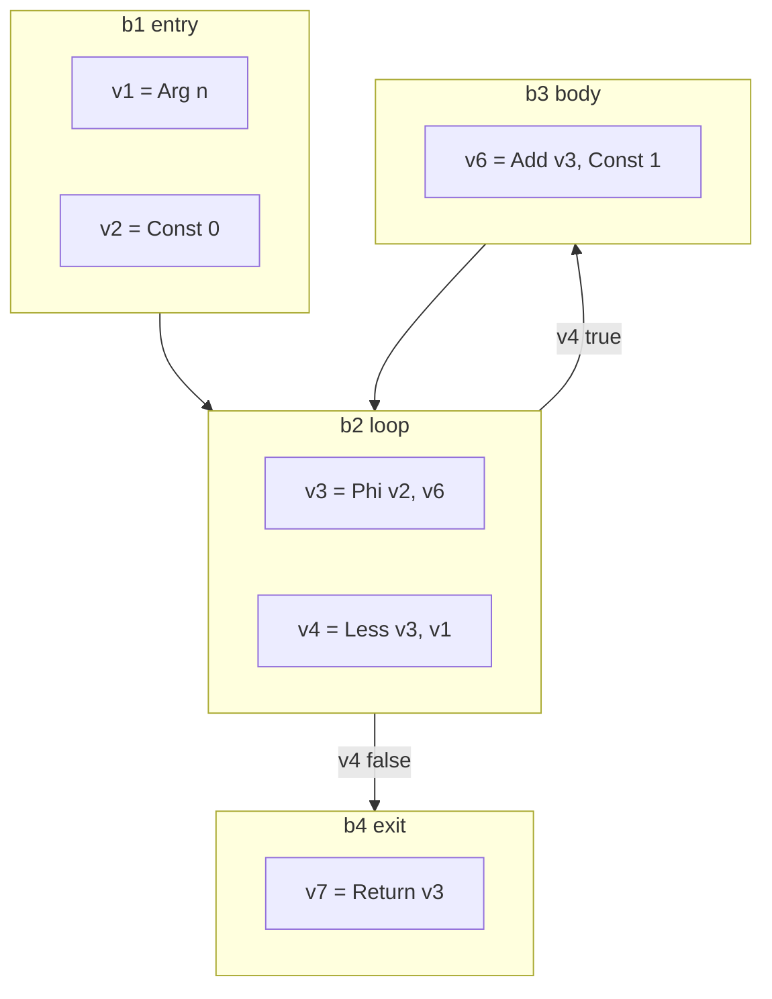

# SSA construction

The second representation of [002](002-architecture.md). A control-flow graph of
basic blocks holding values in static single assignment form, built directly
from the IR in one walk.

## The form

A **function** is a set of blocks with one entry. A **block** has a list of
values, a control value, and successors. A **value** has an operation, a type, a
list of argument values, and an auxiliary field for constants and symbols.

SSA's defining property is that each value is assigned once, so a value *is* its
definition and use-def chains are free. What SSA does not give for free is
ordering of side effects, which is the next section.

## Memory

Loads and stores are not pure, and SSA has no ordering between values other than
data dependence. The standard answer, and nanogo's, is to **make memory a
value**.

Every operation that reads or writes memory takes a memory value as an argument,
and every operation that writes memory produces a new one. A store is

$$
m_{i+1} = \mathrm{Store}(\mathit{addr},\ \mathit{val},\ m_i)
$$

and a load is $v = \mathrm{Load}(\mathit{addr},\ m_i)$, producing no new memory.

Two consequences make the whole middle end simpler:

1. Ordering of side effects is data dependence, so every pass that respects data
   dependence respects memory order without knowing it exists.
2. A block that merges control flow merges memory with an ordinary phi, so
   memory needs no special handling at joins.

Calls take memory and produce memory, which is what prevents a load from moving
across a call. That is not an optimisation choice; it is the correctness of every
pass that follows.

## Building phis

Phi placement is the one genuinely algorithmic part of construction. Two
approaches are standard.

**Dominance frontiers** (Cytron et al., 1991): compute the dominator tree,
compute for each block $b$ the set

$$
DF(b) = \{\, y : \exists\, p \in \mathrm{pred}(y),\ b \preceq p \ \wedge\ b \not\prec y \,\}
$$

and place a phi for variable $v$ in every block of $DF^{+}$ of the blocks that
assign $v$. It is the classical algorithm and it needs the dominator tree before
construction can finish.

**On-the-fly construction** (Braun et al., 2013): build blocks and values in one
pass, keeping a per-block map from IR variable to current SSA value. On reading a
variable in a block that has no definition, recurse into predecessors. If the
block is not yet closed, insert an incomplete phi and fill it when the block is
sealed. Redundant phis are removed as they are created.

**nanogo uses the on-the-fly algorithm.** It needs no dominator tree, no
dominance frontiers, and no separate placement pass, and it produces minimal SSA
for reducible graphs, which is what Go's grammar generates except through `goto`.
For a compiler under a line budget, removing the dominator computation from the
critical path of construction is worth more than the marginal phi quality.

The dominator tree is still needed afterwards, and `ssa/dom.go` computes it with
the iterative algorithm of Cooper, Harvey and Kennedy (2001), which is about
forty lines and is correct on the irreducible graph a `goto` can produce.

An earlier version of this paragraph said the tree is computed once, after
construction, for [022](022-optimization-passes.md)'s passes. Neither half
holds. `DomTree` is a snapshot that any change to the control-flow graph
invalidates, so each of the five consumers, the verifier, decomposition,
lowering, liveness and register allocation, computes its own. And
[022](022-optimization-passes.md)'s passes do not exist.

### Sealing and `goto`

A block is *sealed* when all its predecessors are known. The forward-only
structure of Go's statements seals almost every block immediately. Backward
`goto` and loop headers do not, so they carry incomplete phis until their last
predecessor is added.

`goto` into the middle of a block is impossible in Go, because a label is a
statement boundary, so a label always starts a block and the only work is
deferring the
seal.

## Variables that are not values

A local variable whose address is taken cannot live in an SSA value, because two
names would refer to one location. Such variables are allocated in the stack
frame and accessed by load and store through memory.

The decision is made per variable in one pass before construction, and it has
consequences well beyond this spec: an address-taken local is a stack object that
[027](027-liveness-and-stackmaps.md) must describe to the collector, and a
candidate that [023](023-escape-analysis.md) may force to the heap.

Being conservative here is safe and expensive. Being wrong is memory corruption.

## What construction also does

**Bounds and nil checks are inserted.** Every index and every dereference whose
safety is not already established gets an explicit check operation:
`OpBoundsCheck` in `indexAddr`, `OpNilCheck` in `nilCheck`. Removing them again
is [022](022-optimization-passes.md)'s job, and the asymmetry is deliberate:
inserting all of them and removing some is safe, inserting some is not.

An earlier version of this section claimed a second thing, that construction
performs the lowering of [020](020-ir.md)'s table. It does the opposite. See
the next section.

## What construction refuses

Construction does not lower a Go construct. It **rejects** one. `ssa.Build`
tests `ir.Op.IsGoSpecific` at the head of both the statement walk and the
expression walk, and a node in that set ends the function with the error
`<op> reached SSA construction`. Twelve further call sites of
`builder.unsupported` reject a form construction has no case for, with
`<op>: <what> is not built yet`.

The two together are the shape of the middle end today, and the number is the
one fact this spec most needs to carry:

**SSA construction accepts 8,238 of the 39,947 functions the IR builder
produces for the Go distribution, which is 20.6%.** Every one of those 8,238
lowers completely to arm64 machine operations. The claim that survives is
therefore narrow and true: *what construction accepts, the back end finishes.*

The refusals, by reason, over 536 packages:

| Functions refused | Reason |
| --- | --- |
| 24,031 | `assign: statement is not built yet` |
| 1,377 | `len reached SSA construction` |
| 992 | `switch: a switch whose clauses are not block nodes` |
| 984 | `range reached SSA construction` |
| 903 | `compositelit reached SSA construction` |
| 510 | `panic reached SSA construction` |
| 461 | `closure reached SSA construction` |
| 369 | `compositelit: an address is not built yet` |
| 222 | `typeswitch reached SSA construction` |
| 180 | `slice reached SSA construction` |
| 102 | `index: an index of map is not built yet` |
| 78 | `typeassert reached SSA construction` |
| 47 to 13 each | `append`, `print`, `new`, `select`, `make`, `send`, `cap`, `copy`, `recv`, `clear`, `close`, `defer` |
| the rest | conversions between named types, a field of an interface, addresses |

The first row is not a Go construct at all. `ir.OAssign` exists, and the
statement switch of `ssa/build.go` has no case for it: it still reads the
convention that preceded the node, an `ir.OBinary` with no operator. Three in
five of the distribution's functions contain a plain assignment, so that one
missing case is 24,031 of the 31,709 refusals. It is the cheapest fix in the
middle end and the largest.

Everything else in the table is [020](020-ir.md)'s lowering obligation, unpaid.
No pass performs it, so every construct in it arrives here intact and is
refused.

## What construction builds

Statements: block, if, for, switch over block clauses, return, label, goto,
break, continue, call, and the assignment convention above. Expressions:
constant, local, global, field, index, deref, address-of, unary, binary
including short-circuit and string concatenation, compare, convert, and a
direct call. Addresses: local, global, deref, field, index.

That set is what a fifth of the distribution is written in.

## Invariants

Checked by `ssa.Verify`. Each is a named `Invariant`, so a violation says which
property broke rather than "invalid function":

| Invariant | Property |
| --- | --- |
| `InvTyped` | Every value has a type. |
| `InvOpForm` | A value matches the shape its operation declares: argument count, memory argument last, memory result on a memory operation, phis at the start of the block. |
| `InvBlockControl` | Every block has exactly one control value, or none if it has one successor, and its successor count matches its kind. |
| `InvPhiArity` | Every phi has one argument per predecessor, in predecessor order. |
| `InvArgDominates` | Every value's arguments dominate it, except phi arguments, which dominate the corresponding predecessor's exit. |
| `InvMemChain` | Exactly one memory value is live at any point in a block. |
| `InvReachable` | No value is unreachable from the entry block. |
| `InvGoSpecific` | No Go-specific operation of [020](020-ir.md)'s table survives. |

`Verify` collects every violation rather than stopping at the first. A pass that
breaks one invariant usually breaks a second as a consequence, and a checker
that reported only the first would let a test claiming to exercise one
invariant pass on the strength of another.

The spec said the verifier runs after construction and after every pass. It
runs where `driver/compile.go` calls it, which is after the ABI assignment and
after lowering, unconditionally rather than only in a test build. It does not
run after `ssa.Build` or after `ssa.Decompose` in the driver; the corpus tests
of both run it there themselves.

The verifier is not a debugging aid. It is the reason a miscompile is found in
the pass that caused it rather than in the register allocator.

## Testing

`ssa` is above the 90% coverage gate.

- The verifier, on every function of every package in [004](004-conformance.md)
  L1's corpus. Partly built: `ssa/decompose_test.go` and `ssa/stackmap_test.go`
  both walk 536 packages and verify every function they build. Neither counts
  what `ssa.Build` refused; both return silently on the error. **There is no
  corpus test for construction itself**, which is why the acceptance rate above
  had to be measured by hand rather than read off a gate.
- Phi minimality on a corpus of loop and branch shapes, compared against a
  hand-computed expected set. Not written.
- `goto` and label programs from Go's `test/` corpus, which are the cases that
  break sealing. Not written.

## Deviations

The spec said construction lowers [020](020-ir.md)'s table and that no
Go-specific operation remains by the end. Construction refuses one instead:
`Build`'s own doc comment says every such construct "must be gone already; one
that is not is an error naming InvGoSpecific". Nothing makes them gone. This
was found by reading the two `IsGoSpecific` guards and the twelve
`b.unsupported` call sites in `ssa/build.go`, then counting the errors over the
IR corpus, which is where 8,238 of 39,947 comes from.

The deck read that number the other way round for a while. The reading to
avoid is "every function of the distribution compiles", which is true only of
the functions construction accepts and false of the distribution. One in five
is the honest fraction, and the missing `case ir.OAssign` is most of the other
four.
