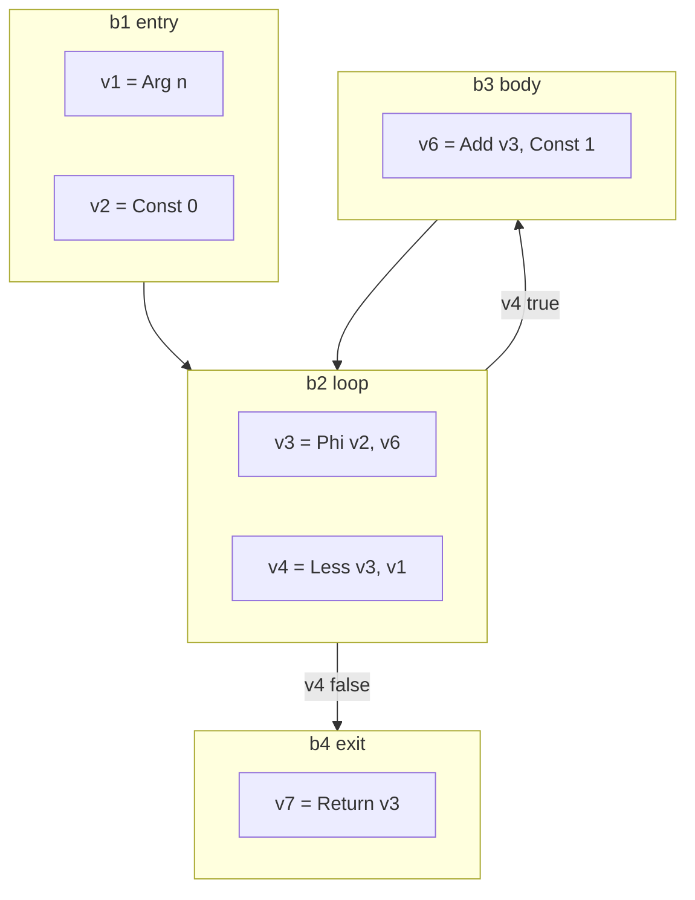

# SSA construction

The second representation of [002](002-architecture.md). A control-flow graph of
basic blocks holding values in static single assignment form, built directly
from the IR in one walk.

## The form

A **function** is a set of blocks with one entry. A **block** has a list of
values, a control value, and successors. A **value** has an operation, a type, a
list of argument values, and an auxiliary field for constants and symbols.

SSA's defining property is that each value is assigned once, so a value *is* its
definition and use-def chains are free. What SSA does not give for free is
ordering of side effects, which is the next section.

## Memory

Loads and stores are not pure, and SSA has no ordering between values other than
data dependence. The standard answer, and nanogo's, is to **make memory a
value**.

Every operation that reads or writes memory takes a memory value as an argument,
and every operation that writes memory produces a new one. A store is

$$
m_{i+1} = \mathrm{Store}(\mathit{addr},\ \mathit{val},\ m_i)
$$

and a load is $v = \mathrm{Load}(\mathit{addr},\ m_i)$, producing no new memory.

Two consequences make the whole middle end simpler:

1. Ordering of side effects is data dependence, so every pass that respects data
   dependence respects memory order without knowing it exists.
2. A block that merges control flow merges memory with an ordinary phi, so
   memory needs no special handling at joins.

Calls take memory and produce memory, which is what prevents a load from moving
across a call. That is not an optimisation choice; it is the correctness of every
pass that follows.

## Building phis

Phi placement is the one genuinely algorithmic part of construction. Two
approaches are standard.

**Dominance frontiers** (Cytron et al., 1991): compute the dominator tree,
compute for each block $b$ the set

$$
DF(b) = \{\, y : \exists\, p \in \mathrm{pred}(y),\ b \preceq p \ \wedge\ b \not\prec y \,\}
$$

and place a phi for variable $v$ in every block of $DF^{+}$ of the blocks that
assign $v$. It is the classical algorithm and it needs the dominator tree before
construction can finish.

**On-the-fly construction** (Braun et al., 2013): build blocks and values in one
pass, keeping a per-block map from IR variable to current SSA value. On reading a
variable in a block that has no definition, recurse into predecessors. If the
block is not yet closed, insert an incomplete phi and fill it when the block is
sealed. Redundant phis are removed as they are created.

**nanogo uses the on-the-fly algorithm.** It needs no dominator tree, no
dominance frontiers, and no separate placement pass, and it produces minimal SSA
for reducible graphs, which is what Go's grammar generates except through `goto`.
For a compiler under a line budget, removing the dominator computation from the
critical path of construction is worth more than the marginal phi quality.

The dominator tree is still computed, once, after construction, for the passes in
[022](022-optimization-passes.md) that need it.

### Sealing and `goto`

A block is *sealed* when all its predecessors are known. The forward-only
structure of Go's statements seals almost every block immediately. Backward
`goto` and loop headers do not, so they carry incomplete phis until their last
predecessor is added.

`goto` into the middle of a block is impossible in Go — a label is a statement
boundary — so a label always starts a block and the only work is deferring the
seal.

## Variables that are not values

A local variable whose address is taken cannot live in an SSA value, because two
names would refer to one location. Such variables are allocated in the stack
frame and accessed by load and store through memory.

The decision is made per variable in one pass before construction, and it has
consequences well beyond this spec: an address-taken local is a stack object that
[027](027-liveness-and-stackmaps.md) must describe to the collector, and a
candidate that [023](023-escape-analysis.md) may force to the heap.

Being conservative here is safe and expensive. Being wrong is memory corruption.

## What construction also does

Two things happen during construction rather than in a later pass, because doing
them later would need the information construction is throwing away:

1. **The lowering of [020](020-ir.md)'s table.** By the end, no Go-specific
   operation remains. The invariant check runs here.
2. **Bounds and nil checks are inserted.** Every index, slice, and dereference
   whose safety is not already established gets an explicit check operation.
   Removing them again is [022](022-optimization-passes.md)'s job, and the
   asymmetry is deliberate: inserting all of them and removing some is safe,
   inserting some is not.

## Invariants

Checked by a verifier that runs after construction and after every pass in test
builds:

- Every value's arguments dominate it, except phi arguments, which must dominate
  the corresponding predecessor's exit.
- Every block has exactly one control value, or none if it has one successor.
- Exactly one memory value is live at any point in a block.
- Every phi has one argument per predecessor, in predecessor order.
- No value is unreachable from the entry block.

The verifier is not a debugging aid. It is the reason a miscompile is found in
the pass that caused it rather than in the register allocator.

## Testing

- The verifier, on every function of every package in [004](004-conformance.md)
  L1's corpus.
- Phi minimality on a corpus of loop and branch shapes, compared against a
  hand-computed expected set.
- `goto` and label programs from Go's `test/` corpus, which are the cases that
  break sealing.
