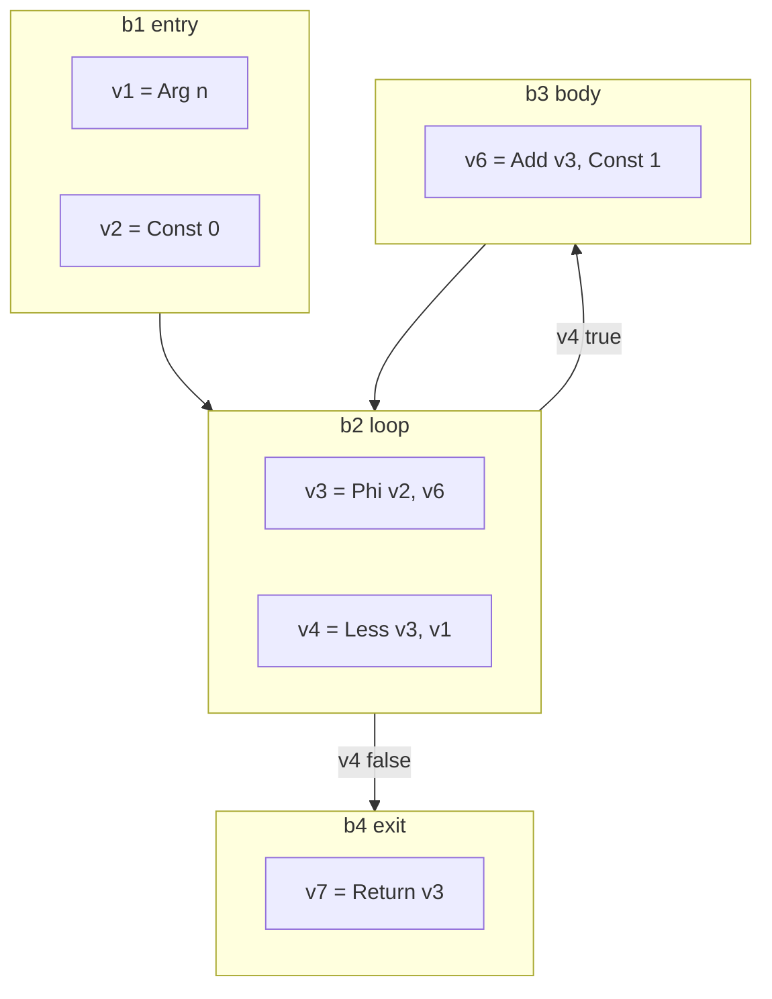

# SSA construction

The second representation of [002](002-architecture.md). A control-flow graph of
basic blocks holding values in static single assignment form, built directly
from the IR in one walk.

## The form

A **function** is a set of blocks with one entry. A **block** has a list of
values, a control value, and successors. A **value** has an operation, a type, a
list of argument values, and an auxiliary field for constants and symbols.

SSA's defining property is that each value is assigned once, so a value *is* its
definition and use-def chains are free. What SSA does not give for free is
ordering of side effects, which is the next section.

## Memory

Loads and stores are not pure, and SSA has no ordering between values other than
data dependence. The standard answer, and nanogo's, is to **make memory a
value**.

Every operation that reads or writes memory takes a memory value as an argument,
and every operation that writes memory produces a new one. A store is

$$
m_{i+1} = \mathrm{Store}(\mathit{addr},\ \mathit{val},\ m_i)
$$

and a load is $v = \mathrm{Load}(\mathit{addr},\ m_i)$, producing no new memory.

Two consequences make the whole middle end simpler:

1. Ordering of side effects is data dependence, so every pass that respects data
   dependence respects memory order without knowing it exists.
2. A block that merges control flow merges memory with an ordinary phi, so
   memory needs no special handling at joins.

Calls take memory and produce memory, which is what prevents a load from moving
across a call. That is not an optimisation choice; it is the correctness of every
pass that follows.

## Building phis

Phi placement is the one genuinely algorithmic part of construction. Two
approaches are standard.

**Dominance frontiers** (Cytron et al., 1991): compute the dominator tree,
compute for each block $b$ the set

$$
DF(b) = \{\, y : \exists\, p \in \mathrm{pred}(y),\ b \preceq p \ \wedge\ b \not\prec y \,\}
$$

and place a phi for variable $v$ in every block of $DF^{+}$ of the blocks that
assign $v$. It is the classical algorithm and it needs the dominator tree before
construction can finish.

**On-the-fly construction** (Braun et al., 2013): build blocks and values in one
pass, keeping a per-block map from IR variable to current SSA value. On reading a
variable in a block that has no definition, recurse into predecessors. If the
block is not yet closed, insert an incomplete phi and fill it when the block is
sealed. Redundant phis are removed as they are created.

**nanogo uses the on-the-fly algorithm.** It needs no dominator tree, no
dominance frontiers, and no separate placement pass, and it produces minimal SSA
for reducible graphs, which is what Go's grammar generates except through `goto`.
For a compiler meant to be read end to end, removing the dominator computation
from the
critical path of construction is worth more than the marginal phi quality.

The dominator tree is still needed afterwards, and `ssa/dom.go` computes it with
the iterative algorithm of Cooper, Harvey and Kennedy (2001), which is about
forty lines and is correct on the irreducible graph a `goto` can produce.

An earlier version of this paragraph said the tree is computed once, after
construction, for [022](022-optimization-passes.md)'s passes. Neither half
holds. `DomTree` is a snapshot that any change to the control-flow graph
invalidates, so each of the five consumers, the verifier, decomposition,
lowering, liveness and register allocation, computes its own. And
[022](022-optimization-passes.md)'s passes do not exist.

### Sealing and `goto`

A block is *sealed* when all its predecessors are known. The forward-only
structure of Go's statements seals almost every block immediately. Backward
`goto` and loop headers do not, so they carry incomplete phis until their last
predecessor is added.

`goto` into the middle of a block is impossible in Go, because a label is a
statement boundary, so a label always starts a block and the only work is
deferring the
seal.

## Variables that are not values

A local variable whose address is taken cannot live in an SSA value, because two
names would refer to one location. Such variables are allocated in the stack
frame and accessed by load and store through memory.

The decision is made per variable in one pass before construction, and it has
consequences well beyond this spec: an address-taken local is a stack object that
[027](027-liveness-and-stackmaps.md) must describe to the collector, and a
candidate that [023](023-escape-analysis.md) may force to the heap.

Being conservative here is safe and expensive. Being wrong is memory corruption.

### An operand that names no storage

Some of what construction reads through an address is not a variable at all. A
field of a struct, an element of an array and the header of a slice or a string
are read by address, because nothing in this pass takes a part out of a
composite value. Go does not require the operand of any of the three to name
storage: `hex[i]` indexes a constant and `f().x` selects a field of a call
result.

**Such an operand gets storage: a frame temporary holding a copy of its value.**
It is the answer `cmd/compile`'s walk gives, and the copy is what the language
already says, because an operand that names no place cannot be written through.
A slice element assigned through a copied header still writes the one array the
header points at.

The temporary is a frame object like every other, so it is laid out with them
and [027](027-liveness-and-stackmaps.md) describes it. It is also cleared at the
entry with them, and for the same reason: the analysis of
[027](027-liveness-and-stackmaps.md) has no definition point for a frame object,
so the object is live from the entry, and the words the collector reads before
the copy must be a zero rather than what the last call left in the slot. Only a
temporary whose type holds a pointer is cleared, which is the same question that
analysis asks to decide what it tracks.

The clear goes after the arguments and before the body, where the clear of a
local goes. Ahead of the arguments it would be a program: clearing a type that
holds a pointer is a call to `runtime.memclrHasPointers`, Go's convention leaves
no register standing across a call, and each argument would look dead until
after it, so a parameter still in its incoming register would be read back after
the call had overwritten it.

The spill is reached only where this pass needs an address to read a part of a
value. An address the program itself asks for is a different question. Go gives
`&x` only to what names storage, so `&f()` reaching construction is a tree
[020](020-ir.md)'s lowering did not finish, and it is still refused: a copy
there would answer with the address of storage nothing else knows the program
wrote to.

## What construction also does

**Bounds and nil checks are inserted.** Every index and every dereference whose
safety is not already established gets an explicit check operation:
`OpBoundsCheck` in `indexAddr`, `OpNilCheck` in `nilCheck`. Removing them again
is [022](022-optimization-passes.md)'s job, and the asymmetry is deliberate:
inserting all of them and removing some is safe, inserting some is not.

An earlier version of this section claimed a second thing, that construction
performs the lowering of [020](020-ir.md)'s table. It does the opposite. See
the next section.

## What construction refuses

Construction does not lower a Go construct. It **rejects** one. `ssa.Build`
tests `ir.Op.IsGoSpecific` at the head of both the statement walk and the
expression walk, and a node in that set ends the function with the error
`<op> reached SSA construction`. Twelve further call sites of
`builder.unsupported` reject a form construction has no case for, with
`<op>: <what> is not built yet`.

A third mechanism refuses one case and only one: an address taken of a local
that `classify` placed in an SSA value. That is not a language gap. `classify`
decides where every local lives before construction begins, so reaching the
case means the decision was made and then contradicted, and a repair there
would be the memory corruption this spec warns about further up.

The three together are the shape of the middle end today, and the number is the
one fact this spec most needs to carry:

**SSA construction accepts 20,871 of the 41,354 functions the IR builder
produces for the Go distribution, which is 50.4%.** 20,812 of those lower
completely to arm64 machine operations, so the older claim that *what
construction accepts, the back end finishes* is now 99.7% true rather than
100% true. The 59 exceptions are characterised below; the corpus test is what
lists them.

That figure measures construction alone, on a tree straight out of `ir.Build`,
and it is not what the compiler reaches. The driver runs [020](020-ir.md)'s
lowering pass first, which removes most of the Go-specific nodes in the table
below, and 40,385 functions then get past construction. Both numbers are
measured over the same corpus and each answers a different question: this one
says what construction itself accepts, and the other says how far a real
compile gets.

The refusals below are the first figure's, by reason, over 536 packages. A row
that [020](020-ir.md) lowers does not reach construction in a real compile:

| Functions refused | Reason |
| --- | --- |
| 4,841 | `compositelit reached SSA construction` |
| 2,800 | `len reached SSA construction` |
| 2,253 | `convert: a conversion from <T> to <interface>` |
| 1,605 | `range reached SSA construction` |
| 1,371 | `field <n> of <interface>` |
| 1,132 | `closure reached SSA construction` |
| 1,052 | `compositelit: an address is not built yet` |
| 934 | `panic reached SSA construction` |
| 903 | `slice reached SSA construction` |
| 843 | `make reached SSA construction` |
| 672 | `defer reached SSA construction` |
| 529 | `append reached SSA construction` |
| 450 | `assign: a multi-value assignment from typeassert` |
| 346 | `index: an index of map is not built yet` |
| 334 | `new reached SSA construction` |
| 318 | `the address of <name> is taken but it lives in a value` |
| 290 | `assign: a multi-value assignment from index` |
| 279, 276 | `typeassert`, `typeswitch` |
| 135 down to 2 each | `print`, `recover`, `copy`, `min`, `send`, `select`, `println`, `recv`, `cap`, `max`, `clear`, `real`, `close`, `delete`, `complex`, `imag`, `go`, and the five `unsafe` intrinsics |
| 71, 20, 15, 1 | the address of a call result, of a constant, of a type assertion, and of a `make` |
| 2 | `assign: a multi-value assignment from recv` |

Every row of that table that names a Go construct is a row of
[020](020-ir.md)'s lowering table. About half of those rows are now performed
by `ir/lower.go`, and the rest arrive here intact and are refused.
[020](020-ir.md)'s **State** column says which is which, and its own corpus
counts the rows that are still unpaid.

Five rows are gaps in construction itself and are in no lowering table. The
three multi-value assignment rows, the `field <n> of <interface>` row, and the
address rows, which are an address of a call result, of a constant, of a type
assertion and of a `make`, plus the separate refusal of an address taken of a
name that construction placed in a value.

Two of the address rows are gone. An operand that names no storage is now given
some, which is the rule above, and the address of a call result and the address
of a constant are what that rule is about. The two counts in the table are the
measurement that named them and predate the rule. The type assertion and the
`make` are Go-specific nodes, so each is refused by its own row before an
address of it is asked for.

The three multi-value rows left are a two-value type assertion, a two-value map
read and a two-value channel receive, and each is the corresponding
single-value form's refusal: none of the three forms is built.

A third such row is gone. Construction refused a multi-value assignment with
any result wider than a register, 2,191 functions, because `SelectN`'s index
means the result before decomposition and the machine word of the result area
after it, and `ssa/decompose.go` renumbered a part of result $i$ as word $i+j$,
which holds only when every result before $i$ is one word wide. The pass now
sums the widths of the earlier results, so the form is built:
[025](025-lowering-and-rules.md) carries the numbering. Lifting the refusal
moved 538 functions past construction and left the other 1,653 refused for a
reason they held as well, most of them a composite literal or a conversion to
an interface.

### What the assignment case cost and bought

The table above replaced one in which `assign: statement is not built yet` was
the first row at 24,031 functions, because `ir.OAssign` existed and the
statement switch had no case for it: it read the convention that preceded the
node, an `ir.OBinary` with no operator. Two more stale conventions were in the
same file. `switchCases` required an `ir.OBlock` clause, which `ir.Build` has
never produced since `ir.OCase` existed, and refused a further 992 functions.
`forParts` read a `for` statement's post list out of `Else`, and `ir.Build`
writes it to `Post`.

The third one was not a refusal. It was a miscompile in the 8,238 functions
construction already accepted: **every post statement of every `for` statement
in the corpus was silently dropped**, so a counted loop never advanced. A
second one sat beside it. An expression carries statements in `Init` where
there is no enclosing statement list to hold them, which `ir.Build`'s
conventions name as a loop condition and the right operand of `&&` and `||`,
and construction dropped those too, so every temporary they assign held the
zero the entry block wrote.

Neither was visible to any gate. The corpus tests measured what built, and both
faults are in code that builds.

## What construction builds

Statements: block, if, for including its post list, switch over `ir.OCase`
clauses with `fallthrough`, return, label, goto, break, continue, call, and
assignment. Expressions: constant, local, global, field, index, deref,
address-of, unary, binary including short-circuit and string concatenation,
compare, convert, and a direct call. Addresses: local, global, deref, field,
index, and an operand that names no storage, through the frame temporary above.

That set is what two functions in five of the distribution are written in.

A switch clause carries no statements of its own. `ir.Build` writes `Init` on a
clause only for a `select`, whose communication statement has to be evaluated
on entry to the `select`, and a `select` is refused here. A plain switch clause
and a type switch clause both carry case expressions and a body and nothing
else, so building the body is building the clause.

### Assignment

Every form of `ir.OAssign`. A destination that lives in an SSA value is written
into the variable map of Braun et al., and one that lives in the frame is
reached by an address and a store. Everything else follows from where the
address comes from: a pointer dereference, a field offset, an index with the
bounds check in front of it, or a global's symbol.

A multi-value assignment leaves `X` nil and lists its destinations in `Args`.
Only the call form is built. A two-value map read, a type assertion and a
channel receive are three rows of [020](020-ir.md)'s lowering table, and they
arrive here intact. The call form reads every result before it writes any
destination, and both halves of that matter: `SelectN` reads the call, which is
a memory value, so a read placed after a store would name a memory the store
has already superseded. It is also the order the specification requires.

Every result is read, including one assigned to the blank identifier. The code
generator places the results of a call together and names each one by the
`SelectN` that reads it, so a gap in the sequence is a result it cannot place.

### The per-iteration loop variable

Go 1.22 makes a variable a loop declares a new instance on each iteration.
`ir.Build` performs the transform: a loop variable whose address is taken is
replaced in the loop control by a carrier, the body opens by declaring the
variable again from the carrier, and the post list opens by copying it back.
Construction's obligation is to build that declaration where it stands, so it
runs on every iteration.

`syntax.Def` therefore builds the same thing a plain assignment builds. Treating
it as work the entry block's zeroing already did is what would put the pre-1.22
semantics back, because the body would then read whatever the previous
iteration left.

What construction does not emit is the lifetime marker. `OpVarDef` states that
a frame slot's previous contents are dead, which is the other half of "a new
instance each time";
[025](025-lowering-and-rules.md) owns the markers and `ssa/liveness.go` reads
them, so an object with no `OpVarDef` anywhere is live from the entry, which is
the conservative answer. An address-taken loop variable that outlives its
iteration still needs [023](023-escape-analysis.md), because one frame slot
serves every iteration and only a heap allocation per iteration separates them.

## Invariants

Checked by `ssa.Verify`. Each is a named `Invariant`, so a violation says which
property broke rather than "invalid function":

| Invariant | Property |
| --- | --- |
| `InvTyped` | Every value has a type. |
| `InvOpForm` | A value matches the shape its operation declares: argument count, memory argument last, memory result on a memory operation, phis at the start of the block. |
| `InvBlockControl` | Every block has exactly one control value, or none if it has one successor, and its successor count matches its kind. |
| `InvPhiArity` | Every phi has one argument per predecessor, in predecessor order. |
| `InvArgDominates` | Every value's arguments dominate it, except phi arguments, which dominate the corresponding predecessor's exit. |
| `InvMemChain` | Exactly one memory value is live at any point in a block. |
| `InvReachable` | No value is unreachable from the entry block. |
| `InvGoSpecific` | No Go-specific operation of [020](020-ir.md)'s table survives. |

`Verify` collects every violation rather than stopping at the first. A pass that
breaks one invariant usually breaks a second as a consequence, and a checker
that reported only the first would let a test claiming to exercise one
invariant pass on the strength of another.

The spec said the verifier runs after construction and after every pass. It
runs where `driver/compile.go` calls it, which is after the ABI assignment and
after lowering, unconditionally rather than only in a test build. It does not
run after `ssa.Build` or after `ssa.Decompose` in the driver; the corpus tests
of both run it there themselves.

The verifier is not a debugging aid. It is the reason a miscompile is found in
the pass that caused it rather than in the register allocator.

## Testing

`ssa` is above the 90% coverage gate.

- The verifier, on every function of every package in [004](004-conformance.md)
  L1's corpus. Built. `ssa/build_test.go`'s `TestBuildCorpus` walks 536
  packages, builds all 41,354 functions, verifies every one it accepts and
  counts every one it refuses by cause. The table above is that test's output.
  `ssa/decompose_test.go` and `ssa/stackmap_test.go` count the refusals too,
  which they did not before: both returned silently on the error, so both
  reported a number that could only ever go up and neither said what it was
  measured out of.
- Per form of assignment, the exact SSA produced, so that a local in a value
  and a local in the frame cannot be exchanged without a failure.
- The per-iteration loop variable, on the shape `ir.Build` produces, failing
  both when the declaration is hoisted into the entry block and when the post
  list is dropped.
- Phi minimality on a corpus of loop and branch shapes, compared against a
  hand-computed expected set. Not written.
- `goto` and label programs from Go's `test/` corpus, which are the cases that
  break sealing. Not written.

## What was wrong

The spec said construction lowers [020](020-ir.md)'s table and that no
Go-specific operation remains by the end. Construction refuses one instead:
`Build`'s own doc comment says every such construct "must be gone already; one
that is not is an error naming InvGoSpecific". Nothing makes them gone. This
was found by reading the two `IsGoSpecific` guards and the twelve
`b.unsupported` call sites in `ssa/build.go`, then counting the errors over the
IR corpus, which is where 8,238 of 39,947 came from. It is 20,871 of 41,354
now, and construction still refuses rather than lowers.

**Three of the refusals were stale conventions in this pass, not gaps in the
language it accepts.** `ir.OAssign`, `ir.OCase` and `Node.Post` all existed and
`ssa/build.go` read the conventions that preceded them. Two of the three
mattered only as refusals, at 24,031 and 992 functions. The third was a
miscompile: `forParts` read a `for` statement's post list out of `Else`, so
every counted loop of the corpus lost its post statement and never advanced.
Beside it, `expr` dropped the statements an expression carries in `Init`, which
are a loop condition's temporaries and the right operand of `&&` and `||`, so
each of those held the entry block's zero.

Neither miscompile was visible to a gate, and the reason is worth writing down.
`ssagen`'s `TestLinkAndRun` was the end-to-end test, and its own comment
recorded that its programs contained no assignment statement, because
construction refused one. A program with no assignment has no counted loop, so
nothing in the repository ever ran one. The gap in the language and the gap in
the gate were the same gap: the constructs a compiler refuses are also the
constructs its end-to-end tests cannot use. `internal/e2e`'s first program is a
counted loop, which is the rule that came out of it: widening what is accepted
is followed by widening what is run.

**The claim that what construction accepts the back end finishes is now 99.7%
rather than 100%.** `reached == lowered == 8,238` held because the accepted set
was small enough to be uniform. It is 20,812 of 20,871 now. The exceptions hold
an array or a struct that decomposition leaves whole, or name no operation the
corpus test can resolve. They were always going to appear as the accepted set
widened, and the corpus test is what lists them.

**A multi-value assignment was bounded by a pass below this one, and is not
any more.** Construction refused one whose call has any result wider than a
register, 2,191 functions, because `ssa/decompose.go` renumbered a part of
result $i$ as word $i+j$, which holds only when every result before $i$ is one
word. Building the reads anyway would have produced two of them naming one
word, and the code generator would then have placed one result over another.
The pass now sums the widths of the earlier results and the refusal is gone.
What this pass owes the numbering is the property the refusal hid: **every
result of a call is read, including one assigned to the blank identifier**,
because a width that is not there cannot be summed. `multiAssign` emits one
`SelectN` per result for that reason and for the code generator's.

**Map assignment and the two-value map read are refused for a reason outside
both specs.** `ir.Build` emits a plain `ir.OIndex` over a map-typed operand,
[020](020-ir.md)'s table says it becomes `runtime.mapassign` and
`runtime.mapaccess2`, and `rtsym` carries neither, nor any other map symbol,
nor the `*maptype` descriptor both take.
[032](032-type-descriptors-and-itabs.md) owns the descriptor and
[031](031-runtime-lowering.md) owns the symbol table, so the row cannot be
performed anywhere until both exist.

**The lowering table's performer arrived and this spec's headline number stayed
the same.** That is correct and it reads as though something was missed, so it
is written down. This spec measures construction on an unlowered tree, which is
what says how much of the language construction itself handles. What the
compiler reaches is the other measurement, 40,385 of 41,354 with the pass run
first, and [020](020-ir.md) owns it.

**The refusal table's tail understated how far the tail runs.** The row read
"135 to 11 each" and the smallest cause in it is a two-operand
`unsafe.SliceData` at 2. Beside it, "the rest" was given as the address of a
call result and of a constant, and the corpus reports four address causes, 71,
20, 15 and 1, plus a two-value channel receive at 2. The counts above are
`ssa/build_test.go`'s output for a corpus run of this spec's own gate.

**Two multi-value assignment rows were three.** A two-value channel receive is
refused with the two-value type assertion and the two-value map read, for the
same reason all three give: the single-value form is not built either. It is
the smallest row of the table, which is why it was read as absent.

**The count of `builder.unsupported` call sites disagreed with itself.** The
prose above said thirteen and the note below said twelve. `ssa/build.go` has
twelve, and this section now says so once.

**The 59 functions that construction accepts and lowering does not finish were
promised by name.** They are characterised, not listed. The list is the corpus
test's output and nothing here should copy it, for the reason
[020](020-ir.md) gives about a per-row count in prose.

The deck read the fraction the other way round for a while. The reading to
avoid is "every function of the distribution compiles", which is true only of
the functions construction accepts and false of the distribution.
