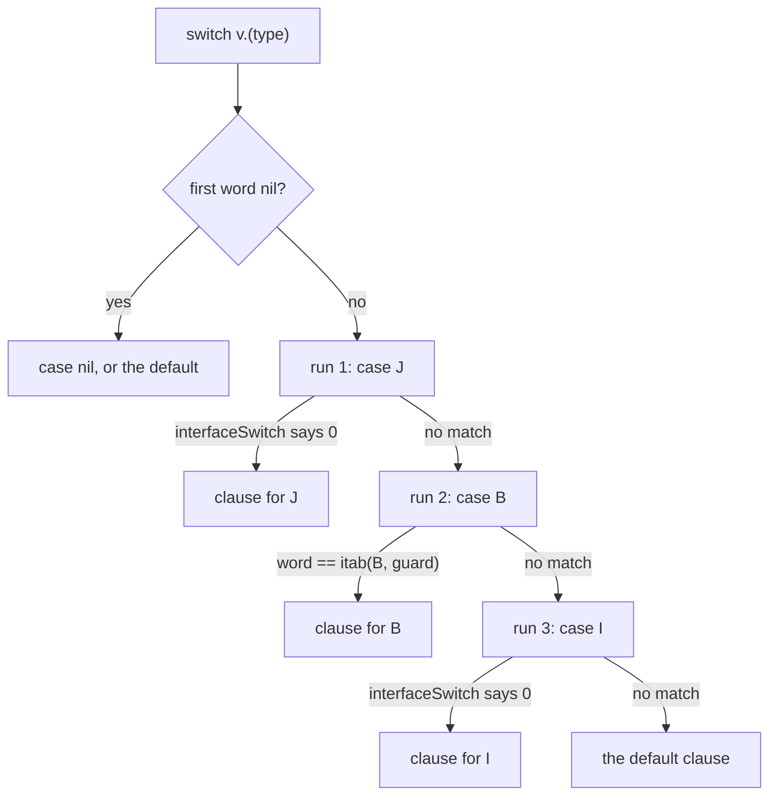

# Type descriptors and itabs

Go's runtime and `reflect` need a description of every type that reaches an
interface, a map, a channel, or reflection. The compiler emits those
descriptions as data symbols. Their layout is `internal/abi`'s, exactly, by
[000](000-decisions.md) decision 10.

This spec also owns the symbol namespace, because the linker's handling of these
symbols is keyed on their names, and because that keying is what killed the
text-assembly seam in [000](000-decisions.md) decision 3.

## What is built

**Descriptors, itabs and the two runtime caches are named, encoded, referenced
and written into the object. A program compiled by nanogo converts a value to
an interface with methods, calls a method through it, asserts a concrete type
or another interface out of it, and switches on its dynamic type over both
kinds of case.**

| Part | Where | State |
| --- | --- | --- |
| The canonical name, both spellings | `ir/rtype.go` | built; the expected spellings were read out of a `gc` object with `go tool nm`, and the hash below re-checks the link string against a running `gc` binary |
| The descriptor bytes | `rtype/` | built for the types below, including a defined type's `UncommonType` tail and a struct's field array, checked field by field against `reflect` |
| The reference from generated code | `ir/lower.go` | built for `new`, `&T{...}`, a slice literal and `make([]T, n)`, and the pass runs in a real compile |
| The interface value itself | `ssa/build.go` | built for a conversion to an interface with or without methods, and for a conversion of an interface with methods to an empty one |
| The reference from an interface conversion | `ssa/build.go` | built; the types are in `ssa.Func.Descriptors` and the pairs in `ssa.Func.Itabs`, and `driver/compile.go` reads both |
| The descriptor as a data symbol in the object | `driver/compile.go` | built; a named `dupok` definition, and the data it points at is hashed |
| A defined type's `Method` array | `rtype/uncommon.go` | built; `Mtyp` from `ir.Method.Sig`, `Ifn` and `Tfn` from the wrappers `ssagen` generates, `Xcount` from the exported prefix, checked entry by entry against the array `gc` wrote for the same type |
| The itab name and bytes | `ir/rtype.go`, `rtype/itab.go` | built; the name is checked against the symbol `gc` wrote for the same pair, read out of a `gc` object with `go tool nm` |
| The reference to an itab | `ssa/build.go`, `ir/lower.go` | built; `concreteToInterface` names the pair's itab as the type word, and a dynamic type test on a value that leads with an itab compares that word against the itab of the pair |
| The itab as a data symbol in the object | `driver/compile.go` | built; a named `dupok` non-package definition, written in the same two passes as the descriptors so that a relocation against `type:` resolves to this object's own definition |
| The call through an itab | `ssa/build.go` | built; `OpInterCall` loads the entry point from the itab at `Fun` plus the method's slot, which is the offset `rtype/itab.go` writes the array at |
| The two runtime caches, named | `ir/rtype.go` | built; `TypeAssertSymbol` and `InterfaceSwitchSymbol`, per function and per site, never canonical |
| The `*abi.TypeAssert` and `*abi.InterfaceSwitch` bytes | `rtype/switch.go` | built; the offsets are checked against `internal/abi`'s own declarations and the sizes against the symbols `gc` wrote for the same shapes |
| The reference from an assertion, a conversion and a type switch | `ir/lower.go` | built; the caches are in `ir.Collected.TypeAsserts` and `ir.Collected.InterfaceSwitches`, and `driver/compile.go` reads both |
| The caches as data symbols in the object | `driver/compile.go` | built; a **package** definition in a writable section carrying its own Go type, which is the opposite of every other row and is why |

The `gclocals·` and `go:string.` rows of the namespace table are produced
elsewhere. `ssagen/stackmap.go` builds the stack maps, `ssa/decompose.go` names
a string constant the way `gc` names it, and `ssagen/reloc.go` defines its
bytes in the object ([040](040-object-format.md)).

A type descriptor is not the only data symbol nanogo writes.
`ssagen/data.go` writes one per package-level variable, and it reads this
spec's writer for the pointer map: a variable whose type holds a pointer
carries its descriptor through an `AuxGotype` entry, so the writer gap below
refuses such a variable by name and position.

What reaches a running program: a variadic call, a slice literal, `make` of a
slice, `new` of a defined struct type, and a method call on a value or a
pointer receiver. Those compile, link against the real runtime and run, and
`internal/e2e` runs a collection over what one of them allocated.

Interface construction joins that list. `any` holding an `int` or a `string`,
`panic` of either, `panic` of an `error`, and `fmt.Println` all compile, link
and print what `gc` prints. `panic` of an interface with methods is the one
that proves the guarded load: the descriptor comes out of the itab, and the
value that used to reach the runtime made it die with "name offset out of
range" instead of printing.

So does the itab. A library nanogo compiles converts a concrete type to an
interface with two methods and returns the interface value; `gc` compiles an
importer that calls the second method through it and the program exits with
what that method returned (`internal/e2e/import_test.go`). Nothing in the
importer converts, so the itab in the link is nanogo's, the runtime registered
it out of `runtime.itablinks`, and a slot written at the wrong offset reaches
the other method.

A refusal from `rtype` arrives after the function it came from has compiled,
because lowering can name `main.point` without trouble and only the encoder
knows whether it can fill the bytes in. The same refusals reach the driver from
the other side, through the rule below that a package owes a descriptor for
every type it declares, and `driver/types.go` reports them per package.

Four wiring changes join the lowering pass to the object file. **What was
wrong** at the end of this file sets out all four, because two of them are not
what a reader following this design would predict.

### The two spellings

`gc` writes a type twice and the two strings differ.

- The **link string** qualifies a defined type by its import path. It is the
  symbol name after `type:`, and it is what the hash is computed over.
  `type:sync/atomic.Pointer[os.dirInfo]`.
- The **name string** qualifies by package name. It is the content of the
  descriptor's `Str` name data and it is what `reflect.Type.String` returns.
  `atomic.Pointer[os.dirInfo]`.

`Str` does not point at the name string. It points at `"*"` followed by it,
with `TFlagExtraStar` set, so that the descriptors of `T` and `*T` share one
string. A descriptor that pointed at the bare name would make `reflect` report
a name one character short.

### A type declared inside a function needs a third thing in the link string

Two functions of one package may each declare a type called `T`, and the two
are different types. Both name strings are `main.T`, because that is what
`reflect.Type.String` reports for either, so the name string cannot tell them
apart and must not try to: a compiler that printed `main.T·1` would answer a
question about a type with a name no program can write.

The link string has to tell them apart, because the linker deduplicates by it.
`gc` numbers each function-scoped type declaration of a package, in source
order over all its files, and writes `type:main.T·1`. `cmd/compile`'s collector
is the rule:

```go
// Assign a unique ID to function-scoped defined types.
if c.withinFunc {
	*c.typegen++
	d.gen = *c.typegen
}
```

Two parts of that walk change every number after them. An alias declares no
type and takes no number. And the counter runs over the package rather than
over each function, so a type's number depends on how many function-scoped
declarations the files before it hold.

`ir.Type.Gen` carries the number, `ir.LocalTypeGens` computes it from the
package's files, and `ir.TypeLinkString` is the one place it is spelled. It
reaches the type hash and interface identity with the link string, which is the
same fact rather than a second one.

### Naming and encoding are two questions, and the second is harder

A type may have a canonical name and still have no writer for its bytes. That
is not an inconsistency: a descriptor for a type defined in another package is
that package's to emit, and this package only needs to name it. So the
lowering pass refuses a row when the type cannot be *named*, and `rtype`
refuses separately when the contents cannot be *filled in*.

The name is a function of the `ir.Type`, and **no** Go distinction is left that
does not survive [020](020-ir.md)'s type boundary. The table is empty.

Four rows left it. A channel's direction, a function's signature and a literal
interface's method list are all in `ir.Type` now, so each has a spelling, and
what each refuses is the zero value of the field it reads: a channel whose
`ChanDir` is `InvalidDir`, a function whose `Params` or `Results` is nil, an
interface with no method list. Those are types built below the type boundary and
never converted, and a zero read as a fact is what [020](020-ir.md)'s second
rule forbids.

The fourth row was a **literal struct**, and it was in the table for a reason
that turned out not to be true. `gc` spells an embedded field renamed through a
type alias as `struct{ Int = int }`, and `ir.Converter` unaliases, so the alias
is gone before the name is asked for. But `gc` does not read the alias either.
`types.fldconv` writes the field's own name in front of its type, with `" = "`
between them, and leaves the name out when it is the name the language would
have given the field, which is the embedded type's own name without its package
and without a pointer. Both of those are in the `ir.Type`: `ir.Field` carries
`Name`, `Pkg`, `Tag` and `Embedded`, and the embedded type carries `Name` and
`PkgPath`. So `struct{ Int }` is spelled `struct { Int = int }` and
`struct{ int }` is spelled `struct { p.int = int }`, and the two differ exactly
where the language says they are different types.

The two spellings differ here more than anywhere else, and both halves are
`gc`'s:

| | link string | name string |
| --- | --- | --- |
| an unexported field name | qualified by the declaring package | bare |
| an embedded field's name | written when it is not the type's name | never written |
| a field tag | `strconv.Quote`d after the type | the same |
| a field the compiler synthesised | no package to qualify with | bare |

A **defined** type is exempt from every row, because its name is its identity:
`type S func(int)` is `type:p.S` and no signature is needed to say so.

A **generic instantiation** is the one defined type whose name is not its
identity, and it was refused by neither half. `ir/convert.go` names
`atomic.Pointer[os.dirInfo]` as `sync/atomic.Pointer`, dropping the type
arguments, so two instantiations of one generic type shared one name and the
linker merged their descriptors.

`ir.Type.TypeArgs` carries the arguments beside the name now, and both
spellings write them exactly as `gc` does: the qualified name, a bracket, each
argument by the rule of the string it is in, a comma with no space between
them, and a closing bracket. `main.pair[string,int]` and
`main.box[main.box[int]]`, in the link string and in the name string alike,
because `reflect` prints the second. A type declared inside a function carries
the arguments *before* the number that separates two declarations of one name,
which is `type:main.L[int]·1`.

A method of an instantiation is spelled the same way, by the same function:
`ir.MethodSymbol` writes `xpkg/lib.(*Box[int]).Get`, with the arguments inside
the parentheses. One naming function, so the symbol the descriptor's `Tfn`
names and the symbol the stenciler defines cannot disagree.

An `ir.Type` that says it is an instantiation and carries no arguments is one
built by hand below the type boundary, because `Converter` fills the flag and
the slice together. It is refused rather than shortened.

### What `rtype` can fill in

A predeclared basic type, a slice, an array, a pointer, a struct, a **channel**,
a **function**, an **interface** and a defined type over any of those, with the
`UncommonType` tail and the `StructType`, `ChanType`, `FuncType` or
`InterfaceType` header and array that each needs.
`ir.Type.Methods` is what makes the tail writable: a defined type's method set,
set for every defined type with the empty set included, so an empty set is a
fact rather than an absence. `TFlagUncommon` and the tail are one decision, because `gc` gives a
tail to every type that has a name and a flag without a tail makes the runtime
read past the end of the descriptor.

Two things stop a descriptor, and each names itself in the refusal:

| Stop | What is missing |
| --- | --- |
| a struct or an array whose parts do not compare as one region of memory | the `Equal` closure, which points at code |
| a map whose key needs a generated hash | the *body* of that hash. `ssagen` writes one and `driver/compile.go` finds it by scanning a descriptor's own relocations for its own type's `type:.hash.` symbol, and a map's `Hasher` names the **key's**, so nothing generates it. Refusing here is what keeps that from becoming an unresolved `type:.hash.K` at link time |

A method used to be a fourth stop. It is not one now, and the three facts that
closed it are each easy to get wrong in a way nothing reports:

- **`Xcount` is the length of the exported prefix.** `reflect.Type.NumMethod`
  on a type that is not an interface returns it, and
  `reflect.Type.Method` indexes the array by it, so the array has to be in
  `gc`'s order: exported names first, then by name, then by the package path
  that qualifies an unexported one. That is `types.CompareSyms`, and it is not
  byte order by name. The two agree for every ASCII identifier and disagree on
  `Ärger`, which is exported and whose first byte is above every lower-case
  ASCII letter. `ir.MethodOrder` is the one rule and `ir.Converter` sorts both
  method sets with it.
- **`Mtyp`, `Ifn` and `Tfn` are three consecutive `R_METHODOFF` relocations.**
  `cmd/link`'s deadcode pass reads them as one group, three at a time, and
  panics with "expect three consecutive R_METHODOFF relocs" when anything
  separates them. The `Name` before them is an `R_ADDROFF` and does not.
- **`Ifn` is not `Tfn`.** An itab call passes a one-word receiver, which is the
  value itself when the type is stored directly in an interface and a pointer
  to it otherwise. `rtype/uncommon.go` draws the table, which is `gc`'s
  `methodWrapper(rcvr, m, forItab)` with the receiver replaced by a pointer for
  the itab call. Both spellings exist and both take one word, so naming the
  wrong one is a call with a value where a pointer belongs and nothing between
  the descriptor and the call notices.

Writing a tail that claims a type has no methods is the failure this used to be:
`reflect` would report an empty method set, and an itab built against it would
find no functions.

**A descriptor asks to be marked used in an interface.** `cmd/link` collects a
type's `Method` array only when the type carries `SymFlagUsedInIface`, so every
entry of an unmarked type resolves to the sentinel `-1` and
`runtime.getitab` installs `runtime.unreachableMethod` in its place. The program
links and dies with "unreachable method called. linker bug?" the first time a
value of the type reaches an interface. `gc` knows which types are converted,
because `walkConvInterface` emits an `R_USEIFACE` marker from the converting
function. nanogo collects no such fact, so `rtype.Symbol.UsedInIface` is set on
every descriptor and `driver/compile.go` puts the flag on the symbol. The cost
is a method of a type nothing converts staying in the binary.

**A function that asks `reflect` for a method says so.** A method found by
`reflect.Value.Method` is reached by no call, so `cmd/link` cannot decide it is
live. `SymFlagReflectMethod` is what tells the linker to stop deciding and keep
every exported method of every type used in an interface.

The question is asked in `ir/build.go`, over the selection, and the answer is
`ir.Func.ReflectMethod`. `gc` asks it in the same place, `walk.usemethod`, and
by the same test: the selector is `Method` or `MethodByName`, it takes one
argument of the kind that name implies, it returns one or two values, and the
first of them is `reflect.Method` or `reflect.Value`. The three call shapes
`gc` covers are covered: through an interface, on a concrete value, and as a
method expression that is called.

It was asked one level down before, over the symbols a compiled function
references, and that rule could not see the case that matters most.
`reflect.Type.MethodByName` is an interface method and an interface call names
no symbol at all, so `test/reflectmethod7.go` linked and then jumped into
`runtime.unreachableMethod`. A rule that reads a reference list cannot answer a
question about a selection.

One case of `gc`'s is still not reproduced: `MethodByName` with a constant
argument gets an `R_USENAMEDMETHOD` relocation naming the one method, and only
a non-constant argument sets the flag. nanogo always sets the flag, which keeps
more methods alive and never keeps fewer.

A struct with an unexported field is **not** a stop, and it is worth saying
because the shape looks like one. `gc` puts the declaring package's path in the
struct descriptor's own `PkgPath`, once for the whole struct rather than once
per field, and `ir.Converter` sets `Field.Pkg` on every unexported field, so
`rtype/name.go` has what it needs. The two refusals that file carries, a field
with no package and fields from two packages, are unreachable from the checker,
because the fields of one struct literal are declared in one file. They guard
an IR built by hand.

One stop is above `rtype` rather than in it. A type parameter has no run-time
representation, so `ir/convert.go` refuses the conversion before a descriptor
is asked for, and the refusal names `ir` and not `rtype`. It closes with
[013](013-generics.md)'s stenciler, which replaces the parameter with the
argument, and not with anything here.

**An itab has both sides.** The concrete side is `ir.Type.Methods` and the
interface side is the same field on the interface type, which `ir/convert.go`
sets for a literal interface as well as for a defined one. `rtype/itab.go`
writes the bytes and `ir.ItabSymbol` names them.

**A type assertion and a type switch are built for a concrete target, and
neither is a runtime call.** `ir/lower.go` lowers `OTypeAssert` into a
comparison of the interface's first word against the target's descriptor and
`OTypeSwitch` into an `ir.OSwitch` on that same word, so both are gone before
SSA construction sees them. The one-value assertion calls
`runtime.panicdottypeE` in the failing arm and falls through in the other,
which needs no join because the symbol does not return. `cmd/compile`'s
`dottype1` builds the same comparison for the same case.

`runtime.typeAssert` and `runtime.interfaceSwitch` answer one question only:
which itab implements a non-empty interface for a value's dynamic type. That is
a search over a method set, which is why it is a call and why the runtime
caches it in the `*abi.TypeAssert` and `*abi.InterfaceSwitch` the compiler
allocates. `gc` reaches them for an interface target or an interface case and
for nothing else, so neither descriptor is on the path of the rows built here.
An interface target and an interface case are refused, and both refusals name
the itab, because that is what the answer is. The itab is written now, so what
those two still lack is the `*abi.TypeAssert` and `*abi.InterfaceSwitch`
descriptors and the call, and their messages in `ir/lower.go` say the itab is
unwritten and are false in that half.

`runtime.assertI2I` does not exist in `go1.27`. `runtime.typeAssert` is what an
interface-to-interface assertion reaches, and `rtsym` carries both it and
`interfaceSwitch` with signatures checked against the installed runtime.

**One program does reach an itab, and it is a conversion and not an
assertion.** `var c coder = seven{}` converts a concrete type to an interface
with methods, and the type word of that value is the itab of the pair.
`ssa/build.go` still refuses it, and the wall is now one rather than two:
`main.seven`'s descriptor is written, and `rtype.Itab` writes the itab, so what
is left is `concreteToInterface` naming the symbol and `driver/compile.go`
writing it into the object. The refusal message names both walls and half of it
is false.

## The interface value in SSA

An interface is two words and no arm64 instruction holds one, so it is built as
a value and specs/025's decomposition takes it apart before selection. Three
operations of `ssa/op.go`, and none of them survives that pass:

| Operation | Meaning |
| --- | --- |
| `IMake(word, data)` | the interface value the two words are |
| `ITab(iface)` | the first word |
| `IData(iface)` | the second word |

Which word the first one is does not appear in the operations. It is an `*itab`
for an interface with methods and a `*_type` for one without, and the fact is
the value's type, `ir.Type.EmptyIface`. An operation that named one of them
would leave the other with no operation to be built from.

`CheckDecomposed` names a survivor. The three have no machine form, so one that
reaches lowering is a bug in the pass that owed its removal, and lowering finds
it only by panicking.

### The two words of a concrete conversion

The shape is `cmd/compile`'s `walkConvInterface`, minus the cases that only
avoid an allocation.

The type word is the concrete type's descriptor, named by `ir.TypeSymbol`. The
data word is `dataWord`'s answer:

| The value | The data word |
| --- | --- |
| one machine word wide, and that word holds a pointer | the value itself |
| a string | `runtime.convTstring` |
| a slice | `runtime.convTslice` |
| a scalar 8, 4 or 2 bytes wide, aligned to its width | `runtime.convT64`, `convT32`, `convT16` |
| anything else | `runtime.convT` or `convTnoptr`, with the address of the operand |

The first row is `types.IsDirectIface`, which is width and pointerness and not
a kind test. A `uintptr` is one word and holds no pointer, so it is boxed. A
one-field struct holding a pointer is not pointer shaped and is not boxed.

A float is reinterpreted before the call. `convT64` declares `uint64`, and
[030](030-abi.md) places an argument by the type of the value, so a float left
as a float is written to a floating-point register and read out of an integer
one.

`ir.IfaceDataWordOf` is that table, as one function, because two passes read it
and neither can act on the answer alone.

### The last row needs two passes, and that is why the table is a function

`runtime.convT` and `convTnoptr` copy from a pointer the caller supplies, so
the value has to be somewhere an address can point at. Construction cannot put
it there: [021](021-ssa-construction.md)'s `classify` decides where every local
lives before any expression is built, and a slot introduced after that decision
is one no bitmap describes. [025](025-lowering-and-rules.md)'s pass owns the
frame and can, so it gives the operand a home and marks it address-taken.

Construction cannot be replaced either, because the IR has no node that makes
an interface value out of two words. `OpIMake` is construction's, so the call
is built there, where the operand is already addressable.

The two halves have to agree exactly. A value spilled and not boxed is a
temporary nothing reads, and a value boxed and not spilled is the address of
storage that does not exist. One function answers for both, and construction
keeps the refusal for an operand it cannot address, which is the tree that
reached it without the lowering pass.

### `convT` against `convTnoptr` fails in two directions and only one is quiet

The choice is the source type's pointer map. `convT` allocates an object the
collector scans and `convTnoptr` one it does not.

A pointer-holding type through `convTnoptr` is caught by the runtime at the
allocation, which throws `objects with pointers must be zeroed` out of
`mallocgc`. A pointer-free type through `convT` is correct and only wasteful.

What is quiet is the descriptor rather than the helper. Both read the size and
the pointer map out of the descriptor they are given, and it is the **source**
type's whatever the destination interface is: a non-empty destination leads
with an itab, which says nothing about how to copy the value. A copy made with
the wrong descriptor is a heap object whose pointers the collector does not
know about, the pointee is freed while the interface still reaches it, and no
message appears anywhere. `internal/e2e` holds a finaliser on such a pointee
under `GODEBUG=gccheckmark=1,clobberfree=1` and `GOGC=1`, which is the harness
[027](027-liveness-and-stackmaps.md) uses for the same class of mistake.

One shape still names itself. A one-byte type is `runtime.staticuint64s`
indexed by the value in `cmd/compile`, and here it is a copy through
`convTnoptr` like any other value no helper takes by value: correct, and one
allocation where `gc` makes none.

### An interface with methods becomes an empty one by a load

```
typeWord := unsafe.Pointer(itab)
if typeWord != nil {
    typeWord = itab.Type
}
e = iface{typeWord, data}
```

The data word is carried across unchanged. The type word is not: the source
leads with an `*itab` and the destination leads with a `*_type`, and the
descriptor is the itab's **second** word, `internal/abi.ITab.Type`. A test
reads that offset out of the installed runtime's `internal/abi/iface.go`
rather than trusting the constant, because a wrong offset hands the runtime the
`*InterfaceType` where it reads the `*Type` and every field it reads after that
is another field.

The guard is not optional. A nil interface has a nil first word and reading a
field through it faults. The join is an ordinary phi over an ordinary variable,
which is what `&&` and `||` already build in `ssa/build.go`.

The other direction is refused. An `*itab` is the method table of one
(interface, concrete type) pair, so nothing in an interface value holds one
that was not put there and the conversion is a runtime lookup rather than a
load. `cmd/compile` gives it to `runtime.typeAssert`.

### Identity between two interfaces is the link string

Every interface is two words of one width and reports one kind, so "same kind,
same size" is true of every pair and says nothing. Two facts separate a pair
and neither is visible below the IR: which word the value leads with, and which
interface an `*itab` was built for. An itab lists the concrete type's methods
in the order its own interface declares them, so an itab built for
`io.ReadWriter` has two entries where `io.Reader` reads one.

`ir.TypeLinkString` is therefore the test, because two types have one link
string exactly when they are one type. `walkConvInterface` answers the same
question the same way: it reaches its I2I path for every pair that is not
identical, whatever the method sets are.

### The set a package owes is two sets, and only one is collected

`ir.LowerAndCollect` reports the descriptors the lowering table names. A
conversion to an interface reaches no row of that table, so the descriptors
construction names are a second set, carried on `ssa.Func.Descriptors` in
first-use order.

`driver/compile.go` does not union that field into `needed` yet. Until it does,
a conversion of a type the runtime already carries a descriptor for links, and
a conversion of any other type reaches the linker as

    main.main: relocation target type:main.myInt not defined

The fix is one line where `compileFunc` returns: the types the built function
named join the types the lowered tree named.

## The type descriptor

```go
type Type struct {
    Size_       uintptr
    PtrBytes    uintptr   // prefix bytes that can contain pointers
    Hash        uint32    // type hash, used by maps and type switches
    TFlag       TFlag
    Align_      uint8
    FieldAlign_ uint8
    Kind_       Kind
    Equal       func(unsafe.Pointer, unsafe.Pointer) bool
    GCData      *byte     // pointer bitmask, or a pointer to one
    Str         NameOff   // string form
    PtrToThis   TypeOff   // descriptor for *T, or zero
}
```

A descriptor for a composite type is this struct followed by kind-specific
fields: element type for slices and pointers, key and element for maps, fields
for structs, methods for interfaces, in and out for functions.

Four fields are worth calling out because each has a way of being subtly wrong:

- **`PtrBytes`** is a prefix length, not a size, as [030](030-abi.md) states. Too
  small and the collector misses pointers. Too large and it reads garbage as
  pointers.
- **`GCData`** is the pointer bitmask, or past `MaxPtrmaskBytes*8` pointer
  words a word the runtime fills the mask into. Either way it is the same
  information as the IR type's `PtrBits` from [020](020-ir.md) and must be
  computed from it, not recomputed, so that the two cannot disagree. The
  section below says which of the two forms and where the choice is not free.
- **`Hash`** must match **`gc`'s**, not the runtime's. `gc` computes it at
  compile time and the runtime only compares it, so the requirement is that two
  compilers agree. `gc` hashes the *link string* with `cmd/internal/hash.Sum32`,
  which is sha256 with the first byte inverted, and takes the first four bytes
  little-endian. Reproducing it is also a check on the link string: a hash that
  matches proves the two compilers spell the type the same way.
- **`Equal`** is the generated function of
  [The generated functions](#the-generated-functions) for a struct or an array
  whose parts do **not** compare as one region of memory. Every other comparable type reaches
  a function the runtime already has, and a region of memory whose size is not
  one of the fixed widths reaches `runtime.memequal_varlen`, which takes the
  size out of the closure and needs no generated function either. The field
  holds a **func value**, so it points at a one-word closure symbol and never
  at the code: pointing it at the function makes the runtime call whatever the
  first instruction encodes.

`PtrToThis` names the descriptor of `*T` for a defined type this package owns,
and is zero for everything else. `rtype.PointerToThis` is the one rule and
`rtype.Referenced` reads it as well, so the symbol the field points at is in
the closure and the object that writes `T` writes `*T` too.

The field is what `reflect.PointerTo` reads. Without it `reflect` builds a
descriptor for `*T` at run time, and a built one carries no method set, so
`reflect.PointerTo(T).NumMethod()` answered zero for a `T` that has methods.
Go's own `test/reflectmethod7.go` is that program.

Half of `gc`'s rule is left out on purpose. `gc` writes the field for every
type that is not a pointer and makes the reference *weak* unless the type has a
name or `*T` has methods. A weak reference does not keep its target alive, so
the weak half would be a descriptor this object emits, the linker drops, and a
field that reads as zero again, which is where the field started. A pointer is
left out because `gc` leaves it out: `**T` is a type nothing asks `reflect`
for, and writing it would make the closure of one descriptor grow without end.
A type the runtime owns is left out because its descriptor is the runtime's and
so is its `PtrToThis`.

**Where `GCData` diverges from `gc`.** `ir.scalarPtrBits` marks both words
of an interface as pointers and `cmd/compile/internal/typebits` marks only the
second: an itab is in `persistentalloc` space and a compile-time `_type` is in
the read-only section, so the first word keeps nothing alive. `rtype` emits the
wider mask, because this spec requires `GCData` to come from `PtrBits` and
correcting it in the encoder would be the second computation that requirement
forbids. The mask is safe and it is not `gc`'s, so a descriptor for a type
holding an interface names a different `runtime.gcbits` symbol from `gc`'s and
the two do not merge. The fix is in `ir.scalarPtrBits`, and it moves the stack
maps as well.

`NameOff` and `TypeOff` are offsets relative to the module's data section, not
pointers. The linker resolves them. A compiler that emits pointers where offsets
belong produces a binary that fails at load.

## The generated functions

Three of a descriptor's fields point at code that no declaration defines. The
code is generated, it is `ssagen`'s, and the driver compiles it through the
same passes a declared function goes through: a generated function that took a
shorter path would be a second code generator, and the first bug it hit would
be one the pipeline already handles.

| Field | Symbol | Shape |
| --- | --- | --- |
| `Method.Tfn`, `Method.Ifn` | `p.(*T).M` | `func (p *T) M(a ...) (r ...) { return T.M(*p, a...) }` |
| `Type.Equal` | `type:.eq.<link string>` | `func(p, q *T) bool` |
| `MapType.Hasher` | `type:.hash.<link string>` | `func(p *T, h uintptr) uintptr` |

Each name is a function of the type alone, so two packages that need one
produce one symbol and the linker keeps one copy. Each text symbol is
duplicate-tolerant for the same reason. Each function carries `ir.Func.Wrapper`,
so its `funcID` is `abi.FuncIDWrapper` and `runtime.gorecover` does not count
its frame: a `recover` below a wrapper must recover, and a panic raised inside
a generated comparison belongs to the map operation that reached it.

### The method wrapper

A method of `T` with a value receiver produces exactly one generated function,
`(*T).M`, which loads the receiver through the pointer and calls the method.
Four fields can name a function and each names either the method or that
wrapper:

| descriptor | receiver | `Tfn` | `Ifn` |
| --- | --- | --- | --- |
| `T` | value | `T.M` | `T.M` if `T` is one pointer word, else `(*T).M` |
| `*T` | value | `(*T).M` | `(*T).M` |
| `*T` | pointer | `(*T).M` | `(*T).M` |

A pointer receiver method is already spelled `(*T).M` by the front end, so the
bottom row needs nothing generated. `gc` emits an `OTAILCALL` and leaves no
frame; nanogo has no tail call, so the frame exists and the `Wrapper` mark is
what keeps `recover` working across it.

`gc` emits a call to `runtime.panicwrap` for a nil receiver so that the message
names the method. [031](031-runtime-lowering.md) is the only place a runtime
symbol may be spelled and `panicwrap` is not in it, so the deref of a nil
pointer faults into the ordinary nil-pointer panic instead. The behaviour is
the same and the message is shorter.

### The equality and hash functions

They are one decision made twice. Two values that compare equal must hash alike
or a map loses keys it holds, so the set of types that needs a generated
equality function is the set that needs a generated hash function, and both are
`rtype`'s `algSpecial`: a struct with padding, a struct with a blank field, or
a struct or array with a part that is a string, a float or an interface.

The equality function is a chain of comparisons with an early return, which is
`gc`'s shape, and the short circuit is the point of it: a comparison that can
panic, which an interface field can, must not run after a comparison that
already answered false. A field is compared by its own kind and a nested struct
or array is walked rather than compared whole, so padding and blank fields are
skipped by construction rather than by arithmetic.

The hash function is `runtime.typehash`'s own walk: one call per leaf, in field
order, with the function chosen by the leaf's kind. Every leaf is one scalar,
so its width is one the runtime declares and `memequal_varlen` never applies.

`gc` collapses a run of adjacent memory-comparable fields into one `memequal`
or `memhash` call above a cost threshold and walks field by field below it
(`cmd/compile/internal/compare`, `EqStruct` and `Memrun`). nanogo always walks.
That changes how many instructions the function takes and not what it answers.

**What `rtype` has to do to use them.** Two hooks, and neither needs an IR
field:

1. `equalClosure` and `hashClosure`, for a type whose algorithm is
   `algSpecial`, name a closure `type:.eqfunc.<link string>` or
   `type:.hashfunc.<link string>` holding one word that relocates to
   `type:.eq.<link string>` or `type:.hash.<link string>`. The runtime-owned
   path stays as it is; `algClosure` refuses a name `rtsym` does not hold, and
   a generated name is not one.
2. `uncommonTail` and `uncommonMethods` write the `Method` array: `Mcount`,
   `Xcount`, `Moff`, and one sixteen-byte entry per method holding `Name` as a
   `NameOff`, `Mtyp` as a `TypeOff` to `ir.Method.Sig`, and `Ifn` and `Tfn` as
   `R_METHODOFF` relocations against the names in the table above. `Referenced`
   grows each method's `Sig`, so the closure the driver emits covers them.
   Both are built.

   `hasUncommon` reads the method set and not the name alone. A pointer to a
   defined type has no name of its own and carries the whole of the pointee's
   method set, so the name alone would put those methods in a descriptor with
   nowhere to hold them.

The driver decides the wrapper set from the closed descriptor list, which is
where `gc` decides it too, and it will find the equality and hash functions the
same way: a descriptor names the symbol and whoever writes the descriptor
defines it.

## Itabs

```go
type ITab struct {
    Inter *InterfaceType
    Type  *Type
    Hash  uint32       // copy of Type.Hash, for type switches
    Fun   [1]uintptr   // variable sized; Fun[0] == 0 means Type does not implement Inter
}
```

An itab exists per (interface, concrete type) pair that the program converts. The
compiler emits it, the linker fills in `Fun` from the concrete type's method set,
and the runtime registers it at startup.

**Itab identity is pointer identity.** Two interface values with the same dynamic
type and interface compare equal because they share one itab. If a program ends
up with two itabs for one pair, interface comparison breaks and type switches
become unreliable. That is why the naming rules below are not cosmetic.

`ir.ItabSymbol` is the name, `rtype.Itab` is the bytes and
`rtype.ItabReferenced` is the pair of descriptors the itab points at.
`ssa.Func.Itabs` and `ir.Collected.Itabs` are the pairs a function named, and
`driver/compile.go` unions them over the package: the two descriptors join the
roots before the descriptor set is closed, because the method wrappers an
itab's `Fun` entries name are decided by that closed set. Three decisions in the
encoder are not obvious from the layout:

- **`Fun` is in the interface's order, not the concrete type's.** The runtime
  reads a slot by the interface's index, so an itab built for `io.ReadWriter`
  holds two entries where `io.Reader` reads one. Both lists are in
  `ir.MethodOrder`, so the intersection is one pass, which is what `writeITab`
  does. Slots that are swapped each hold a function of the right shape and the
  wrong method.
- **Each slot holds the method's `Ifn`**, the entry point that takes a one-word
  receiver, because that is the receiver an itab call passes. The descriptor's
  `Method` array and the itab name one function between them.
- **The references are strong where `gc`'s are weak.** `gc` writes each entry
  with a weak relocation and keeps the method alive with an `R_USEIFACEMETHOD`
  relocation at every interface call site. nanogo emits none, so a weak entry
  would resolve to zero and the call would jump to address zero. The weak form
  becomes available on the day an interface call names the interface and the
  method it selects.

`Fun` carries `GoFunc` on each relocation, and `driver/compile.go` resolves it
through `targetABI`. A method is a Go function and therefore `ABIInternal`, and
its name does not say so: the method of a type the package declares is not in
the generated set, because nothing generated it. A path around `targetABI`
references the method under ABI0 and the link fails with "not defined for
ABI0".

The itab is a named `dupok` non-package definition, as the descriptor is, so
`cmd/link` merges two copies by name. `gc` writes an itab into the hashed index
space instead and gets the same single copy from a content hash. The two
mechanisms do not merge with each other, so a pair converted by a nanogo package
and by a `gc` package in one binary would have two itabs. That needs a `gc`
package to name a nanogo package's type, which the hosted model of
[000](000-decisions.md) decision 10 does not produce: the standard library
imports nothing a user wrote.

## The two runtime caches

An assertion, a conversion and a type switch all ask one question the compiler
cannot answer: which itab implements a given interface for a dynamic type that
is not known until the value is. That is a search over a method set, so it is a
call, and the runtime caches the answer inside a symbol the compiler wrote.

```go
type TypeAssert struct {
    Cache   *TypeAssertCache
    Inter   *InterfaceType
    CanFail bool
}

type InterfaceSwitch struct {
    Cache  *InterfaceSwitchCache
    NCases int
    Cases  [1]*InterfaceType   // variable sized, NCases entries
}
```

`runtime.typeAssert(*abi.TypeAssert, *_type) *itab` answers the first.
`runtime.interfaceSwitch(*abi.InterfaceSwitch, *_type) (int, *itab)` answers the
second and returns the index of the first case the dynamic type implements.
`ir.TypeAssert` and `ir.InterfaceSwitch` are what a lowered function reports,
`ir/rtype.go` names the symbols and `rtype/switch.go` writes the bytes.

### These are caches, and the section follows from that

Everything else this spec writes is read-only, canonical and duplicate
tolerant. A cache is none of those, and the reason is one sentence: **the
runtime stores into it.** Both entry points build a table of the answers they
computed and install it with a compare-and-swap on the symbol's first word.
Four consequences follow and not one of them is a choice.

- **`obj.SDATA`, not `obj.SRODATA`.** A read-only page faults on the store.
- **Aligned to a pointer.** The install is an atomic compare-and-swap on the
  first word, and an unaligned one does not execute on arm64.
- **It carries the linker name of its own Go type,** through an `AuxGotype`
  entry naming `type:internal/abi.TypeAssert` or
  `type:internal/abi.InterfaceSwitch`. `cmd/link` builds the pointer map of the
  data section out of each symbol's Go type, so without one the link stops:

      runtime.gcdata: missing Go type information for global symbol
      main.f..typeAssert.0: size 24

  The descriptors are in `internal/abi`'s own object, which every program with
  a runtime links, so the reference resolves without this package writing
  bytes. The `InterfaceSwitch` type covers `Cache`, `NCases` and one case while
  the symbol is one word longer per case after the first. That is deliberate
  and it is `gc`'s reasoning too: only the first pointer has to be scanned,
  because every later one is the address of a descriptor in static data that
  the collector never traces.
- **A package definition, added with `obj.AddDef`.** This is the opposite of a
  descriptor and of an itab, and it follows from the same rule those two follow
  from: `cmd/link` deduplicates by name in the non-package index space. These
  must not be deduplicated. Two sites sharing one symbol would be two questions
  writing one table.

The `Cache` word starts at `runtime.emptyTypeAssertCache` or
`runtime.emptyInterfaceSwitchCache`, never at nil: both entry points read
`oldC.Mask` before they read anything else, so a nil there is a nil
dereference. `rtsym` holds both names, and their types are read out of the
composite literals the runtime declares them with.

### The name is the site, not the type

`ir.TypeAssertSymbol` and `ir.InterfaceSwitchSymbol` spell
`<function>..typeAssert.<n>` and `<function>..interfaceSwitch.<n>`. `gc`
numbers per package, which needs a package-wide counter; a lowering pass sees
one function at a time, and a function symbol is already unique within a
package, so the pair is unique without one.

The canonical-name rule of the namespace table below does not apply here and
must not. A canonical name is what lets the linker merge two copies, and
merging is exactly what a cache must not do.

### The order of the cases is the answer



A dynamic type is at most one of a list of concrete cases, because two
identical cases are a compile error, so a switch over concrete types alone is
one switch on the first word and the order does not matter. An interface case
breaks that. A `B` satisfies `J` and is also `case B`, and the specification
runs the clause the source wrote first.

So the tests choose a clause and the clauses are a switch on the choice.
Consecutive cases of one kind are one test, and a test that matches nothing
falls into the next through its own default clause, which is what keeps the
runs in source order. The clauses stay in one `ir.OSwitch`, which is what keeps
a `break` inside a clause bound to the switch it is written in; a chain of
gotos would give it nothing to bind to.

`gc` groups differently, every concrete case before every interface one, and it
is correct there because `walkSwitchType` has already removed a case that a
preceding one shadows. Nothing removes one here, so the order is kept instead.

Three more rules fall out of the same picture.

- **The nil test runs before any case test.** `runtime.interfaceSwitch` calls
  `runtime.getitab`, which does not take a nil type. An interface holding
  nothing also matches `case nil` and matches nothing else, so the test is the
  answer and not only a guard. An assertion tests it too, and calls
  `runtime.panicnildottype` rather than letting the lookup panic, because the
  two messages differ and the specification asks for the first.
- **The empty interface is neither run.** Every non-nil dynamic type is a value
  of it, so `case any` matches with no test and every case written after it is
  unreachable.
- **The variable of a clause naming one interface binds the itab the call
  returned.** Its type is that interface, so its first word is an itab built
  for that interface. The word the operand carries was built for the guard's,
  and an itab holds the concrete type's methods in the order its own interface
  lists them, so passing the operand along unchanged calls through a slot that
  holds another method. A clause listing several types keeps the guard's type
  and its value, because that is the type the checker gave the variable.

### `CanFail` is a byte and not a second entry point

The comma-ok form asks the runtime to return a nil itab where it would
otherwise panic. The flag is in the cache, so both forms are one call site. A
conversion between two interfaces sets it as well, and `walkConvInterface` says
why: the language guarantees the conversion succeeds, but the guarantee is
about the static types, and a source holding nothing has no dynamic type to
search for. The result is then the zero of the destination, which is what a nil
interface converts to.

## The symbol namespace

| Prefix | Contents | Linker behaviour |
| --- | --- | --- |
| `type:` | type descriptors | deduplicated by name; collected into `runtime.typelinks` |
| `go:itab.` | itabs | deduplicated; collected into `runtime.itablinks` |
| `go:string.` | string literal data | deduplicated by content |
| `go:func.` | function value symbols | deduplicated |
| `gclocals·` | stack maps | deduplicated by content hash |

Two properties are required of every name in this table:

1. **Canonical.** The name is a function of the type alone, not of which package
   emitted it. Two packages that both convert `*bytes.Buffer` to `io.Writer` must
   produce the same itab name so the linker merges them.
2. **Deterministic.** [053](053-determinism.md), without exception. A name that
   depends on map order breaks the G1 fixed point.

One naming function, in one package, used by everything. The encoders never
build a name.

### Why the text-assembly seam died here

The Plan 9 assembler rejects a symbol name containing a colon:

```
./s2_arm64.s:2: expect two operands for DATA      // DATA type:main.Obj(SB)/8, $7
```

recorded in [`spikes/symbolnames`](../spikes/symbolnames) (the offending file is kept there as
`s2_arm64.s.txt`, because a file that must not assemble cannot sit in a package
that is built). Every prefix in the
table above uses one. A text-assembly emitter would have to rename them, the
linker would stop collecting them, `runtime.itablinks` would be empty, itabs
would not be registered, and a dynamic conversion would build a second itab for a
pair that already had one. That is the pointer-identity failure above.

## What must be emitted, and when

A descriptor is emitted for a type when the program needs it at run time:
conversion to an interface, use as a map key or element, use as a channel
element, reflection, and a type assertion's target.

The set is collected by the lowering pass and returned per function, by
`ir.LowerAndCollect`. Deduplication is the linker's, so a descriptor emitted by
two packages is not an error.

For types defined in another package, the descriptor is emitted by the defining
package and referenced. For composite types built from them, such as
`[]*pkg.T`, the
descriptor is emitted by whichever package needs it, under the canonical name, and
merged.

### A declared type needs one whether the declaring package uses it or not

The rule above is what the *compiling* package needs, and it is not the whole
rule. gc emits a descriptor for **every type a package declares**, used or not:
`gc/main.go`'s `ir.OTYPE` case calls `reflectdata.NeedRuntimeType` for each
package-scope type declaration. The reason is that the descriptor is owed to an
importer, which refers to the type twice over: directly, where its code needs
the descriptor at run time, and through DWARF, where a variable of that type
names `go:info.<path>.<Type>`. `cmd/link` resolves neither by itself. Its
`ld/dwarf.go` builds the DWARF entry out of the descriptor, looking up
`"type:"+name`, so a missing descriptor surfaces as

    sym 5: relocation target go:info.<path>.<Type> not defined

which names neither the package that owes the symbol nor the fix. This is not a
[046](046-debug-info.md) gap: the entry is generated by the linker and the
compiler owes only the descriptor.

`driver/types.go` walks the same closure and refuses the package when any type
in it hits one of the three stops above, naming the type, the position and the
stop. It walks the closure and not the declaration list because `cmd/link`'s
`defgotype` follows a struct descriptor into the type of every field, so a
package owes a descriptor for every type its own descriptors reach. Nothing
about the declaring package tells the two cases apart: the same library links
against one importer and not against another, depending on whether the importer
puts the type on a local variable ([015](015-export-data.md) has the
measurement).

## Testing

Every bullet but the last is built, and the second is built by half.

- Layout: emit a descriptor with nanogo, read it back with `reflect` in a
  `gc`-compiled program running in the same binary. Hosted mode
  ([000](000-decisions.md) decision 10) makes this direct. `rtype`'s test does
  this by reading the `*abi.Type` out of a `reflect.Type`'s interface word,
  because `reflect` exposes no accessor for `Hash`, `TFlag`, `PtrBytes` or the
  bitmask. Every field of every type in its corpus agrees with `gc`'s.
- The method array: emit a descriptor with nanogo and compare it entry by entry
  with the array `gc` wrote for the same type, read out of `gc`'s own
  descriptor through the interface word. `Mcount`, `Xcount` and `Moff` are the
  three numbers every reader navigates by. The running proof is Go's own
  `test/reflectmethod4.go`, which reaches a method through
  `reflect.ValueOf(v).Method(0)`: `reflect` reads nanogo's array in
  `gc`-compiled code and calls through `Ifn`. `test/const3.go` is the same
  proof through an itab, because `runtime.getitab` builds one from nanogo's
  array and `fmt` then calls `String`.
- Itab identity: convert the same concrete type to the same interface in two
  packages, one compiled by nanogo and one by `gc`, and assert the interface
  values compare equal. Half of this is built: `rtype`'s test compares the itab
  symbol nanogo names with the one `gc` wrote for the same pair, by name and by
  size, read out of a `gc` object with `go tool nm`. The other half needs
  `ssa/build.go` to reference an itab, which it does not.
- Dynamic type: box a value, assert it back out and switch on it, in one
  program that nanogo compiled end to end. Both sides of the comparison are
  things this compiler produced, so a descriptor with wrong contents still
  compares equal to itself and only a running program says the pair agrees.
  `internal/e2e/iface_test.go` runs the three shapes: an assertion that
  succeeds, one that fails and is recovered, and a type switch that picks each
  arm, `case nil` and `default` included.
- The runtime caches: nanogo compiles a library that asserts and switches, `gc`
  compiles the importer, and the search therefore runs through symbols nanogo
  defined. `internal/e2e/typeassert_test.go` reads the `Cache` word of one
  symbol of each kind by linkname, before and after, and fails when it did not
  move. That test is the only one that can say anything about the section and
  the Go type: the runtime installs a table about one time in a thousand, so a
  single assertion proves the call works and proves nothing about the symbol.
  Between passes it collects and allocates, so a table the collector could not
  see would already be handed out by the time the next pass reads it. The same
  program pins the ordering rule twice over, an interface case before a
  concrete case the same type satisfies and the reverse, and checks that two
  interface runs separated by a concrete case are two symbols of one case each.
- `GCData` against `PtrBits` for every type in a corpus, and against the
  collector's own view under `GODEBUG=gccheckmark=1`. The first half is built
  and the mask is asserted to be exactly what `PtrBits` says, so that a second
  computation cannot creep in. It is also compared with `gc`'s, where a bit
  `gc` sets and nanogo does not is always a failure and the interface type word
  is the one permitted difference.
- Generated equality functions used as map keys, for structs and arrays of every
  comparable field type, including nested and padded ones. Padding bytes must not
  be compared.

## What was wrong

### The clause variable of a single interface case was already wrong

The refusal on an interface case hid a second bug in the same file.
`typeSwitchCase` bound a clause variable whose type is an interface to the
guard's value unchanged, and its comment names the three clauses that reach
it: the default, a clause listing several types, and `case nil`. For all three
the variable's type **is** the guard's, so the value is right. A clause naming
exactly one interface has the case's type instead, and that branch caught it
too.

Nothing reported it, because such a clause was refused before it got there.
Lifting the refusal without moving the binding would have put an itab built for
the guard into a slot typed as the case's interface, and a method call through
it would have jumped to whatever the guard's itab holds at that slot. That is a
silent wrong answer of exactly the kind `convertInterface`'s own comment
describes for a conversion, in a row that looked finished.

The rule is one sentence and it is worth stating once for both:
**an itab holds the concrete type's methods in the order its own interface
lists them, so an itab is never carried between two interfaces.** The value a
clause naming one interface binds is built from the itab
`runtime.interfaceSwitch` returned for that case, and for the empty interface
from the dynamic type's descriptor.


### The seam between lowering and the object file

Nothing wrote a descriptor into an object file and nothing ran the lowering
pass in a real build. This spec named three changes that would close that seam.
Two of them were wrong and a fourth was missing, so the record is kept: a
reader who follows the same reasoning again makes the same two mistakes.

1. **`driver/compile.go` now calls `ir.Lower`.** It is the first stage of
   `compileFunc`'s pass list, ahead of `ssa.Build`, and it is named `ir.Lower`
   rather than "lowering" because `ssa.Lower` is in the same list and the two
   are different decks. The corpus now measures what the pass buys rather than
   what it would buy: 40,385 of 41,354 distribution functions get past
   construction with the pass, and 20,871 without it.
2. `emitPackage` collects `ir.LowerAndCollect`'s per function lists, unions
   them in first-use order, calls `rtype.Descriptor` on each, and resolves each
   `rtype.Reloc` target by name. **The descriptor itself is `AddNonPkgDef`, not
   `AddHashedDef`, and this spec was wrong to say otherwise.** `cmd/link` reads
   no name for a symbol in the hashed index space, so a hashed descriptor is
   nameless to the linker: no reference from another object resolves to it and
   nothing collects it into `runtime.typelinks`. `gc` agrees. It sets
   `AttrContentAddressable` on `type:.importpath.`, `type:.namedata.`,
   `runtime.gcbits.` and itabs, and never on the descriptor. So the descriptor
   is a named `dupok` definition and the data it points at is hashed, which is
   what `rtype` documents when it returns the descriptor first.

   **It is a non-package definition, and `AddDef` was the second mistake here.**
   A descriptor is `dupok` because every package that names a type writes one,
   and `cmd/link` deduplicates a `dupok` symbol by name in the non-package index
   space only. `loader.addSym` takes a package definition as unique by
   construction, overwrites the name table entry and keeps both copies:

   ```
   case pkgDef:
       // Defined package symbols cannot be dup to each other.
       l.symsByName[ver][name] = i
       addToGlobal()
       return i
   ```

   `gc` states the same rule from the writer's side, in `obj.isNonPkgSym`: a
   `dupok` symbol is a non-package symbol, so that it is deduplicated by name.
   A descriptor written as a package definition is therefore a second
   `type:*int32` in a binary that already holds the runtime's. Both copies are
   byte-identical and both are reachable, one by name and one by index from the
   parameter array of `type:func(*int32)`, and `runtime.SetFinalizer` compares
   two descriptors by address:

   ```
   fatal error: runtime.SetFinalizer: cannot pass *int32 to finalizer func(*int32)
   ```

   The two types in that message read the same because they are the same type.
   `internal/gotest/testdata/go/test/tinyfin.go` is the corpus file that found
   it and `internal/e2e/rtype_test.go` is the claim stated on its own.
3. `ssagen/reloc.go`'s `symbolName` prefixed `pkg.Path + "."` onto any global
   whose name held no dot. `type:p.T` survived that and `type:int`,
   `type:[]int` and `type:interface {}` did not. It leaves a `type:` name
   alone.
4. **A fourth change this spec did not name.** A symbol's identity is its name
   *and* its ABI, and `cmd/link` resolves a by-name reference with both:
   `abiToVer` maps `ABIInternal` to one version and everything else to
   another, and `regabiwrappers` is always on for arm64, so the two versions
   are not the same. `gc` gives a data symbol no ABI, so a descriptor is ABI0,
   and `ssagen` referenced every global at `ABIInternal`. With changes 1 to 3
   and not this one the link reports

   ```
   main.main: relocation target type:int not defined for ABIInternal (but is defined for ABI0)
   ```

   which was measured, not predicted. The reference now follows the object's
   class: `ClassGlobal` is ABI0 and a text symbol is `ABIInternal`. The
   equality routine a descriptor's `Equal` closure points at is the one target
   that is not data, and `rtsym` is what says so.

The ordering the seam had was still the right one. A program that reached one
of these rows was refused at compile time before change 1, and after change 1
without change 2 it compiles and reports the descriptor as undefined at link
time, which is loud rather than silent. That is why the lowering rows were
built ahead of the writer: a row blocked on a writer in another package should
not be counted as a row blocked on the lowering table.

### The method array arrived and two standing bugs arrived with it

A descriptor whose `Mcount` was always zero hid three facts about `cmd/link`,
and each surfaced as a program that built, linked and then died. They are
recorded because none of them is visible from `internal/abi`'s layout.

1. **A type has to be marked used in an interface or every method is pruned.**
   Go's own `test/const3.go` formats a defined type with a `String` method
   through `fmt`, and it died with "unreachable method called. linker bug?"
   until the descriptor carried `SymFlagUsedInIface`. The linker collects the
   `Method` array only for a marked type, so an unmarked one has every entry
   resolved to `-1` and `runtime.getitab` installs
   `runtime.unreachableMethod`. `gc` marks precisely, from an `R_USEIFACE`
   relocation the converting function emits. nanogo marks every descriptor,
   because nothing in it collects the fact.
2. **A function that reaches a method through `reflect` has to say so.**
   `test/reflectmethod4.go` calls `reflect.ValueOf(v).Method(0)` and died the
   same way, because no call reaches the method and the linker decides
   liveness by following calls. `SymFlagReflectMethod` on the calling function
   is what makes the linker keep every exported method of every marked type.
3. **`Mtyp`, `Ifn` and `Tfn` are read as a group of three.** The deadcode pass
   walks a type's relocations and skips two after each `R_METHODOFF`, and it
   panics outright when the three are not consecutive.

### A pointer to a declared type had no descriptor, and an importer needs one

Fixed. Found while the method array was being tested, and not caused by it.
nanogo emitted `type:<path>.<Type>` for every type a package declares and never
`type:*<path>.<Type>`. `gc` emits both, because `PtrToThis` names the second and
because an importer that takes the address of such a value needs it. So

```go
// lib, compiled by nanogo
type Point struct{ X, Y int }

// main, compiled by gc
p := lib.Point{X: 20, Y: 22}
var v any = &p
```

fails at link time with

    panic: R_USEIFACE in main.main references type:*<path>.Point which is not
    a type or itab

which is `cmd/link` saying the symbol is defined nowhere. A type with a pointer
receiver method reaches it every time, because such a type is only usable
through `*T`, and the failure that landed was the DWARF half of it:

    sym 6: relocation target go:info.*nanogo.example/shape/lib.Counter not
    defined

The fix is in `driver/types.go`'s closure walk, which decides the set a package
emits: a declared type is a root and so is the pointer to it. `rtype` wrote that
descriptor already, so nothing was missing but the root.

### The itab was wired, and three standing bugs came out with it

`concreteToInterface` names the pair's itab, `driver/compile.go` writes it, and
`ir/lower.go` compares against it. Three constructs the itab does not touch
were unreachable until it landed and were wrong when they became reachable.
Each is recorded where its own spec can find it, and each has a test that fails
without the fix.

- **A call through an interface was never built.** `OpInterCall` was in the
  operation set, lowered by the arm64 rules and given a place by the ABI
  assignment, and `ssa.Build` had no case for it: the call reached the closure
  case, took the address of the selection and stopped at "field 0 of
  main.coder". [021](021-ssa-construction.md) owns the shape; the offset is
  this spec's, and it is `Fun` plus the method's slot.
- **The data word of a zero-sized value.** A type declared only to carry methods
  is a struct with no fields, and its data word still has to be a pointer the
  collector scans. `gc` writes the address of `runtime.zerobase` without a call.
  `rtsym` holds no row for that variable and [031](031-runtime-lowering.md)
  makes `rtsym` the one place a runtime symbol is spelled, so the allocation is
  made rather than its answer named: `runtime.newobject` of a zero-sized type is
  `mallocgc(0)`, and that is the same word. A row for `runtime.zerobase` is what
  would remove the call.
- **An empty pointer map read as a missing one.** `ssa/rules/arm64.go` chose
  between `memclrNoHeapPointers` and `memclrHasPointers` by "the map is empty
  and the type is at least a word wide", and `ir.Layout` leaves `PtrBits` nil
  for every pointer-free type whatever its size. The guess is not the safe half:
  `memclrHasPointers` calls `bulkBarrierPreWrite`, which throws when the size is
  not a multiple of the pointer size, so every clear of a pointer-free region of
  twelve or twenty bytes was a fatal error at run time.

Two more came out of Go's own corpus once the files that use interfaces
compiled, and neither belongs to this spec. A method call evaluated its receiver
after its arguments ([020](020-ir.md)), and a declaration with no initialiser
emitted no statement, so a `var` in a loop body kept the previous iteration's
value ([021](021-ssa-construction.md) writes the zero from `ir.ODeclare` now).

### Three claims the encoder disproved

**The hash is `gc`'s, not the runtime's.** This spec said `Hash` must match
"what the runtime computes". The runtime computes no type hash. The field above
carries the correction and the method.

**`Equal` is sometimes a runtime helper.** This spec said it is never one. Every
comparable type whose parts compare as one region of memory reaches a function
the runtime already has, and a region whose size is not a fixed width reaches
`runtime.memequal_varlen`.

**The reference set is collected by lowering, not by SSA construction.** This
spec named construction, and construction is the wrong pass: every reference is
introduced by lowering, and construction refuses every node that would
introduce one.

### Every defined type was refused, and the reason was the type boundary

This spec explained every refusal of a defined type by [020](020-ir.md)'s type
boundary dropping the method set, and said that extending the boundary was the
work that unblocked both descriptors and itabs. The boundary was extended:
`ir.Type` carries `Methods`, `PkgPath` and `Basic`, and `ir.Field` carries
`Tag`, `Embedded` and `Pkg`. A defined type's descriptor followed, with its
`UncommonType` tail and a struct's field array, and `new(T)` and a method call
on either receiver now run.

The prediction that stood is that itabs and a defined type's descriptor were
blocked on the same thing. The prediction that did not is that closing the
boundary alone would finish both: `Ifn` and `Tfn` are `TextOff`s into generated
code, so the descriptor's `Method` array waited on `ssagen` generating the
wrapper, and the itab's `Fun` array waited on the same wrapper. Both arrays are
written now. What is left of this section's list is the equality function for a
struct that compares field by field, which `ssagen` generates, and the map slot
group, which `rtype/map.go` writes. Both are closed as well, so the sections
above carry three stops and not four.

**One of the four was already closed when it was written down.** The stop list
carried "a struct with an unexported field", on the reasoning that the IR type
does not say which package declared each field. The same boundary work that
added `Methods` added `Field.Pkg`, so the converter sets it on every unexported
field and `rtype/name.go` reads it. A package declaring an exported struct with
an unexported field compiles. The stop list names the pointer-mask limit in its
place, and the paragraph below the table says what the unexported field is
not, because the shape reads like a stop and a reader who skips the paragraph
will assume it is one.

### A channel's direction crossed the boundary

The table above listed a channel beside a map and a function, on the grounds
that [020](020-ir.md)'s type boundary drops the direction. `ir.Type` carries
`ChanDir` now, populated by `Converter` from the checker, and `rtype/chan.go`
writes the `ChanType` header: an element pointer and the direction as a full
word, which is what `internal/abi` spells it as.

The zero value is `InvalidDir` and **not** `chan T`. A channel type built below
the boundary by hand carries no direction, and the encoder refuses it by name
rather than defaulting to bidirectional, because a default is the field being
supplied by the encoder instead of by the checker and that is what the second
rule at the top of `ir/type.go` forbids. What it would cost is the failure this
spec already names: `<-chan int` written under `chan int`'s name, one symbol
for two types, merged by the linker without a diagnostic.

**A channel literal is named now.** `ir.ChanDir.String` returns the whole
prefix (`chan`, `chan<-`, `<-chan`), so `typeName` writes it before the
element's and the three directions are three symbols. One case needs a
parenthesis: `chan (<-chan T)`, because `chan <-chan T` reads back as
`chan<- chan T`, which is a different type. A slice literal of channels is
lowered as a consequence, and `InvalidDir` is still refused.

### A function's signature crossed the boundary

`ir.Type` carries `Params`, `Results` and `Variadic`, and `rtype/func.go`
writes the `FuncType` header and the array that follows it. A defined function
type gets a descriptor.

The array is **one** array for both lists, split by the two counts, and the
receiver would come first if there were one. `reflect` reads `In(i)` from the
first `InCount` entries and `Out(i)` from the rest, so an array written in the
wrong order reports a function's results as its parameters and nothing in the
bytes says so. The variadic flag is the top bit of `OutCount`, which is why
`OutCount` holds one bit fewer than `InCount`.

The header is eight bytes for four bytes of content. The padding is not slack:
what follows is an array of `*Type` addressed from the end of the header, so a
four-byte header would put every pointer in it at an offset that is not
pointer-aligned.

**A function literal is named now.** `ir/rtype.go`'s `signatureName` writes the
parameter list and the result list, with one result bare and several
parenthesised and a variadic last parameter written from the slice's *element*,
because `func(...int)` and `func([]int)` have the same `Params`. No parameter
name is in it: two functions differing only in a parameter's name are one type.
The leading `func` is the caller's, because `gc` writes it for a function type
and leaves it out for an interface method, and the part after the name is the
same string. `new` of a function type and a closure capturing one are lowered as
a consequence.

### An interface's method list crossed the boundary, and the block moved

`ir.Type.Methods` is set on a **literal** interface now as well as on a defined
one, and each entry carries its signature, so `rtype/iface.go` writes the
`InterfaceType` header and the `Imethod` array: a package path, a method slice
pointing inside the descriptor's own symbol, and one eight-byte entry per
method holding a `NameOff` and a `TypeOff`.

The array's order is `gc`'s and not the IR's. `gc` sorts with
`types.CompareSyms`, which puts every exported name ahead of every unexported
one and then orders by name and package path; the IR sorts by name alone. The
runtime and `reflect` binary-search the array, so an array in a different order
is one a lookup misses. The two rules agree for every ASCII identifier and are
not the same rule, so the encoder sorts.

**A bug this replaced.** Every interface got thirty-two zero bytes, on the
reasoning that an empty interface has a nil package path and an empty method
slice. That is true of `any` and of `error`, whose descriptors the runtime
owns, and false of a **named** empty interface: `gc` writes the declaring
package's path and `reflect.Type.PkgPath` reads it. `type E interface{}`
reported no package for a type that has one.

**The block is gone.** An `Imethod`'s `Typ` is an offset to the descriptor of
the method's signature, that signature is a function literal, and the naming
function spells one now. An interface with methods reaches a descriptor,
defined or literal, and `internal/e2e` links and runs a gc-compiled importer
against a nanogo-compiled library declaring one.

A literal interface's own spelling is `interface {` and one `Name(sig)` per
method. An unexported method name is qualified by the package that declares it,
by import path in the link string and by package name in the name string,
because two packages may declare an unexported method of one name and they are
different methods.

**The order is one definition, not two.** The spelling and the `Imethod` array
are the same list read twice, so `ir.InterfaceMethodOrder` holds `gc`'s order
and `rtype/iface.go` calls it. `ir.ExportedName` holds the one exportedness
rule, which decides the qualifier, the sort and the flag byte of an
`internal/abi.Name`. A method named `Ärger` is exported and its first byte is
`0xC3`, so plain byte order puts it after every unexported name and `gc` puts it
before them. `gc`'s own spelling of that interface,
`interface { Read() int; Ärger() int; example.com/outer.flush() int }`, was read
out of a compiled object rather than reasoned about.

### The map's group type is synthesised, and nothing about it is missing now

This spec said a map was refused because its descriptor "names the runtime's
group type, which specs/032 does not carry". Two things in that sentence were
wrong. The group type is not the runtime's: `gc` **synthesises** it, because
the collector needs a pointer map for a group and only a type carries one, and
it is written nowhere in the runtime's source. And nothing stopped this spec
from carrying it, because everything it is built from is already at the
boundary.

`rtype/map.go` builds it now. Go's map is a swiss table from 1.24 on, so the
group is

```go
type group struct {
    ctrl  uint64
    slots [abi.MapGroupSlots]struct {
        key  K
        elem E
    }
}
```

with `K` replaced by `*K` when the key is larger than `abi.MapMaxKeyBytes`, and
the same for the element. The substitution is in the *type* and not only in the
`MapIndirectKey` flag, because the group is what the collector scans: a group
built from a 200-byte array with the flag set has the collector read that array
as a pointer.

Every computed field of the `MapType` header follows from that one layout, and
they are computed together for a reason. The runtime finds a key with
`KeysOff + i*KeyStride` and an element with `ElemsOff + i*ElemStride`, so an
offset derived apart from its stride is a read at the wrong address rather than
a wrong answer anything reports. `GroupSize`, `KeysOff`, `KeyStride`,
`ElemsOff`, `ElemStride`, `ElemOff` and `Flags` are checked against the
descriptor `gc` emitted for the same map type, for eight map types covering an
indirect key, an indirect element, a zero-size element, an interface key and a
struct key.

`Hasher` is a func value like `Equal` and is chosen by the same algorithm, for
the reason [031](031-runtime-lowering.md) gives: two values that compare equal
must hash alike or a map loses keys it holds. A nil `Hasher` is **not** the
option a nil `Equal` is. The runtime calls it on every operation, so a key with
no hash is a map this compiler cannot describe rather than one that fails when
used.

**The group is named now, and the two spellings are not the two this spec
said.** `gc`'s link string is `map.group[K]V` and the *symbol* is
`type:noalg.map.group[K]V`, because `types.TypeSymName` is `LinkString` plus the
prefix and `typehash` is over `LinkString` alone. A link string carrying the
prefix would produce a hash `gc` never computed, and a type switch compares
hashes before it compares types.

Two facts on `ir.Type` carry it. `MapGroup` is the map the group belongs to, and
the spelling reads the *map's* key and element rather than the slot's: a key
past `abi.MapMaxKeyBytes` is a pointer in the slot and is itself in the name, so
`map[[200]byte]int` is `map.group[[200]uint8]int`. `NoAlg` marks a type the
compiler synthesised and gave no algorithms, and `TypeSymbol` adds the prefix
for it. The mark reaches a type built out of a marked one the way `gc`'s does,
through a struct's fields, an array's element and a pointer's element, and not
through a slice, which `gc` gives no equality algorithm to begin with. The
prefix is not decoration: without it the group's descriptor would merge with the
descriptor of a struct a program declared with the same two fields, and that
struct would be left with a nil `Equal`.

**The one spelling below the group is written.** The group's slots are a
literal struct, and a literal struct is spelled now, so `mapEmittable` asks the
group for its descriptor and gets one. `mapEmittable` still asks the group
rather than restating the reason, because a shallower check is a second opinion
that can disagree with the writer.

**A synthesised type has no equality function at all, and that is the mark and
not the kind.** `gc`'s `ANOALG` has the highest priority of any algorithm and
implies `ANOEQ`, so a type carrying the `NoAlg` mark is not comparable and its
`Equal` is nil. The slot group of `map[string]int` holds a string, so without
the rule `rtype` would ask for the generated field-wise comparison of a type
`gc` generates none for, and the two compilers would disagree about a symbol the
linker merges. `ir.NoAlgType` is the one predicate, exported because the mark
decides the symbol's prefix in `ir` and the `Equal` field in `rtype`.

### The naming function was the last block, and it is not one now

All four spellings this spec asked for are written, and each was checked against
`gc` rather than against reasoning. The oracle is the running binary: `rtype`'s
corpus hashes the link string with `gc`'s own algorithm and compares the result
with the hash `gc` put in the descriptor `reflect` is reading in the same
process, so a spelling that differs from `gc`'s by one character fails as a hash
mismatch. Every channel, signature, literal interface and slot group added here
is a corpus row.

The literal struct is checked from the other end, because a literal struct has
no hash in a running program to compare against: twenty spellings were read out
of a `gc`-compiled object with `go tool nm` and are rows of `ir/rtype_test.go`'s
name corpus. The rows that matter are the ones no reasoning would have produced:
`struct{ byte }` is `struct { p.byte = uint8 }`, `struct{ error }` is
`struct { p.error = error }`, and `struct{ _ int }` is `struct { p._ int }`.

**Two refusals moved out of the tables and became linked programs.** An
interface with methods is compiled, linked and run against a gc-compiled
importer. A channel literal, `new` of a function type and a closure capturing
one are lowered.

**Four refusals in `ir/lower.go` named symbols that exist.** `rtsym` grew from
70 rows to 120 and the messages were not read again. `runtime.chanlen`,
`runtime.chancap`, `runtime.makemap` and `runtime.mapclear` are all in `rtsym`,
so what is missing for each is the lowering row that calls it. One of the four
named the wrong symbol: a range over a map said `runtime.mapiterinit`, which a
swiss map does not use. `mapiterinit` survives only as a `//go:linkname` shim
taking a `*runtime.linknameIter` rather than a `*maps.Iter`, and the two layouts
differ, so a row built for that name would write past the end of the frame slot.
[031](031-runtime-lowering.md) already recorded the correction and the refusal
contradicted it. [020](020-ir.md)'s row table still names `mapiterinit` and
`mapiternext` and is not corrected here.

### `PtrToThis` was blamed on a relocation that exists, and then written

This spec said the field is left zero because "the alternative is a weak offset
relocation, and `obj` declares no weak type". `obj/obj.go` declares `R_WEAK`,
`R_WEAKADDR` and `R_WEAKADDROFF`, so the reason was a writer that does not
exist and not a relocation type that does not exist.

The writer exists now, and it needs no weak relocation at all: the half of
`gc`'s rule that a weak reference serves is the half where a dropped reference
and no reference are the same zero. The section above states the rule.

### One spelling was two

The first draft of this spec did not separate the link string from the name
string. `gc` writes a type twice and the two differ, and a descriptor built
from one where the other belongs makes `reflect` report a name one character
short. The two spellings are set out above.

### Two types shared one symbol, and the corpus said so before a probe did

The link string's own comment said two types have the same link string exactly
when they are the same type. That was false for a type declared inside a
function: `main.T` named both, one descriptor stood for two layouts, and
`cmd/link` kept one of them.

Go's own `test/append.go` is where it surfaced. `verifyStruct` declares
`type T struct{ a, b, c string }` and `verifyInterface` declares
`type T interface{}`, and `reflect.DeepEqual` read three string headers out of
an interface value, so the program died inside `fmt` on a pointer that was
never a pointer. No probe in `internal/audit` declared a type inside two
functions, so nothing there could see it either. `test/append.go` did not
report it while nanogo refused the file: the file was counted as a refusal and
no program ran. `ssagen: a frame object past the ADD immediate needs the R27
expansion` lifted that refusal, and the bug came out with it, which is how
every silent wrong answer this project has found came out.

The number above is the fix. `internal/e2e` now declares a `T` in each of three
functions and compares the names and the values against `gc`.

### The data word that needed an address was refused for two years of commits

The table above ended in "**refused**, by name" for everything wider than the
by-value helpers, and the reason given was that construction has no frame slot
to make. That was true of construction and not of the compiler: the pass below
it owns the frame and had a spill for exactly this.

It was the largest single refusal of Go's own test corpus and it blocked three
of nanogo's own packages. Closing it moved the corpus from 170 files to 179 and
the refusals from 55 to 44, and `obj` became the third package nanogo compiles.

Two costs came with it and both are recorded above rather than in a commit
message. The source type's descriptor is now named for every such conversion,
including a conversion to a non-empty interface, so a package can owe a
descriptor it did not owe before. And `test/cmp.go` stopped being refused and
started reaching [025](025-lowering-and-rules.md)'s assertion, which is a panic
naming a `Load` no rule lowered. That class was already there, in `test/const.go`,
and is one of the functions this spec's own count calls "still wider than a
register".

### `GCData` has two forms and only one of them is a mask

Past `internal/abi.MaxPtrmaskBytes*8` pointer words, which is 128, `gc` stops
writing the bitmask into read-only data. It points `GCData` at one word in BSS,
named `type:.gcmask.<link string>`, and sets `TFlagGCMaskOnDemand`. The runtime
fills the word in the first time it needs the mask, from a `persistentalloc`
block, and the word is declared as holding no pointer because the block is not
the collector's to follow.

The flag and the symbol are one decision, the way `TFlagUncommon` and the tail
are. Set with a bitmask behind `GCData`, the runtime writes a mask pointer over
the first word of the bits. Clear with the word behind it, the collector reads
a zeroed word as the mask of a type that holds pointers and scans nothing in
it.

**The bound is on the descriptor and on nothing else.** The bitmask form has no
upper size, which is what lets a stack object of any type have one.
`reflectdata.GCSym` takes an `onDemandAllowed` argument for this, and the one
caller that passes false is `liveness`, which describes stack objects. A stack
object's record holds the offset of its mask from the start of the section and
the runtime resolves that offset against `moduledata.rodata`, so a word in BSS
is read at an address that is not a mask and the object is scanned by whatever
bits are there.

`rtype.StackObjectMask` is the bitmask form, exported for
[027](027-liveness-and-stackmaps.md)'s writer, and `Descriptor` is the only
caller that may choose the other. `ssagen` used to take the mask out of the
descriptor's own `GCData` relocation, on the reasoning that naming it twice
could disagree. That reasoning inverts here: the descriptor's `GCData` is
exactly what a stack object must not use, so both callers go through one
function that returns the bits and neither reads the descriptor.

`obj/arm64.regNames` is 129 pointer words and was what this closed. It did not
start compiling: it moved to the generated equality function for `[65]string`,
which is the row above.

### The generated walk of a long array is a loop

`ssagen`'s equality and hash generators walk a type's structure: a struct is
its fields, an array is its elements, and everything else is one comparison or
one call to a runtime hasher. Both refused an array longer than sixteen, on the
reasoning that a second shape above a threshold would be a code path nothing
exercised.

Both shapes are written now and both are tested. Past the bound the walk is

```go
for .i := 0; .i < n; .i++ {
	<the element's own walk, spelled with x[.i]>
}
```

with one index local per array, so a long array of long arrays is a loop inside
a loop with two counters rather than one walking two lengths.

`gc` bounds by bytes rather than by elements: `reflectdata`'s `unrollSize` is
32, so it compares about that many bytes per iteration and runs the remainder
directly. One element per iteration is the same answer with more branches, and
the bound is in elements here because this generator walks a type and not a
size.

`obj/arm64.regNames` is `[65]string` and this is what let it compile. In Go's
own corpus it took `closure.go`, `gc2.go` and `init1.go` from refused to
running, and the first of the three then failed: it reads `runtime.MemStats`
around two calls to a function returning a literal with no captures, and nanogo
allocated a `funcval` where `gc` uses a static symbol.
[033](033-closures-defer-panic.md) records that fix. A refusal removed is a
refusal that stops hiding whatever is behind it.
