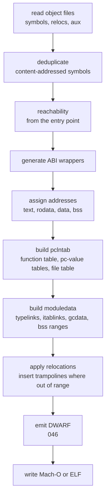

# Linker

**This spec describes unbuilt work.** There is no `link` package. nanogo's
objects are linked by `go tool link`, and that is the one external dependency
this deck most depends on being kept: `ssagen`'s `TestLinkAndRun` calls it 18
times to turn compiled source into a running process, and
[040](040-object-format.md)'s whole proof rests on it accepting the object.
This was found by listing the tree against [002](002-architecture.md)'s package
layout.

So the reader should hold two facts together. Every claim below about what a Go
linker must build, `pclntab` and `moduledata` and the ABI wrappers, is
knowledge nanogo has acted on from the writing side: the object carries the
`AuxFuncInfo`, the pc-value tables and the funcdata that a linker assembles
into those structures, and `cmd/link` reads them. None of the reading side
exists.

The gate for G2 ([001](001-bootstrap-gates.md)): nanogo cannot claim toolchain
independence while `go tool link` produces its executables.

`cmd/link` is 44,067 lines. nanogo's is smaller because its scope is smaller: one
output format per platform, no dynamic linking, no external linker, no plugins,
no shared libraries, no `cgo`.

## What a Go linker does that a C linker does not

A C linker resolves symbols, lays out sections, applies relocations, and writes
an executable. A Go linker does that and then builds the data structures the Go
runtime needs to exist at all.

The `pclntab` and `moduledata` steps are the ones with no counterpart elsewhere,
and they are the bulk of the work.

### pclntab

A table mapping every program counter in the binary to its function, and per
function to its pc-value tables. Every traceback, every panic message, every
`runtime.Caller`, every garbage collection stack scan reads it.

It is assembled from the `AuxFuncInfo` records [040](040-object-format.md)
attaches to each function symbol, and from the pc-value tables that are
auxiliary symbols of their own rather than contents of that record, which is a
correction [040](040-object-format.md) carries and which this spec inherits. The linker's job is to concatenate,
deduplicate the file and function name tables, and build the index the runtime
binary-searches.

A wrong `pclntab` is a program whose stack traces are wrong and whose garbage
collector reads the wrong stack map for a frame.

### moduledata

One structure per module, holding the address ranges of every section, the
pointers to `pclntab`, the type links, the itab links, the garbage collection
data for globals, and the module's own bounds. The runtime walks it at startup
and it is how the runtime finds everything else.

`typelinks` and `itablinks` are the collected `type:` and `go:itab.` symbols of
[032](032-type-descriptors-and-itabs.md). This is the step that the text-assembly
seam would have made impossible.

### ABI wrappers

A Go function called from assembly uses ABI0; the same function called from Go
uses ABIInternal ([030](030-abi.md)). Where both callers exist, the linker
generates a wrapper that moves arguments between the two conventions.

The compiler records each symbol's ABI and each reference's expected ABI. The
linker generates a wrapper for every mismatch it finds.

### Trampolines

A branch whose target is beyond the instruction's displacement range is
redirected through a trampoline that loads the full address. The scratch
registers [030](030-abi.md) reserves (R16 and R17 on `arm64`, R12 on `amd64`)
exist for this, which is why they are never allocatable.

## Scope, stated as exclusions

| Excluded | Consequence |
| --- | --- |
| Dynamic linking, shared objects | Static binaries only |
| External linking through the system linker | No `cgo`, by [000](000-decisions.md) decision 8 |
| Plugins, shared build mode | Not supported |
| Link-time dead code elimination beyond reachability | Larger binaries |

Reachability-based elimination is kept because without it every binary contains
the whole standard library that was compiled into the archives.

## Output formats

Mach-O for `darwin`, ELF for `linux`. Both are written directly. Neither needs
the full generality of its format: one architecture, static, a fixed set of
sections, and a fixed load layout.

## Testing

- Link nanogo's own objects and run the result. This is G2's gate and it is the
  test that matters.
- Compare against `go tool link` on the same objects: same entry point, same
  section contents modulo addresses, same symbol set.
- `pclntab` verified through the runtime: a panic deep in a call chain must print
  the correct stack with correct line numbers, and `runtime.Callers` must agree
  with the source.
- Trampoline insertion forced by a generated binary large enough to exceed branch
  range.
