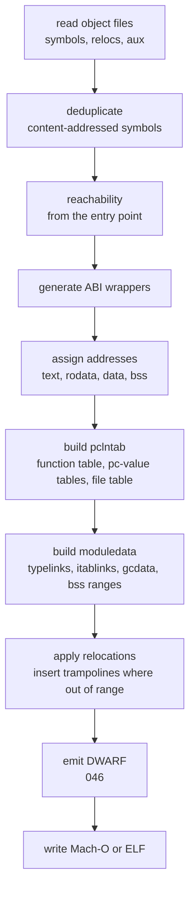
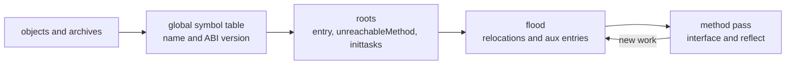

# Linker

**This spec describes unbuilt work.** There is no `link` package. nanogo's
objects are linked by `go tool link`, and that is the one external dependency
this deck most depends on being kept: `ssagen`'s `TestLinkAndRun` calls it 25
times to turn compiled source into a running process, and
[040](040-object-format.md)'s whole proof rests on it accepting the object.
Every `nanogo build` says so on the way out, on success and on failure alike:
`nanogo: the executable was written by go tool link; nanogo has no linker
(specs/045-linker.md)`. The line names this file, so a reader who wonders what
wrote the binary arrives here.

So the reader should hold two facts together. Every claim below about what a Go
linker must build, `pclntab` and `moduledata` and the ABI wrappers, is
knowledge nanogo has acted on from the writing side: the object carries the
`AuxFuncInfo`, the pc-value tables and the funcdata that a linker assembles
into those structures, and `cmd/link` reads them. None of the reading side
exists.

The gate for G2 ([001](001-bootstrap-gates.md)): nanogo cannot claim toolchain
independence while `go tool link` produces its executables. This spec is one of
the two things in the way and not the only one. `nanogo build` runs the `go`
command for two purposes, and with no `go` on `PATH` it stops before it compiles
anything: `nanogo build needs the go command to resolve the packages you name
and to link them`. Linking is this spec's half. Resolving is
[014](014-package-loader.md)'s, whose own frontmatter carries G2 for it. An
unpacked distribution therefore describes and audits itself with no toolchain
present, and cannot build with none.

`cmd/link` is 44,067 lines. nanogo's is smaller because its scope is smaller: one
output format per platform, no dynamic linking, no external linker, no plugins,
no shared libraries, no `cgo`.

## What a Go linker does that a C linker does not

A C linker resolves symbols, lays out sections, applies relocations, and writes
an executable. A Go linker does that and then builds the data structures the Go
runtime needs to exist at all.

The `pclntab` and `moduledata` steps are the ones with no counterpart elsewhere,
and they are the bulk of the work.

### pclntab

A table mapping every program counter in the binary to its function, and per
function to its pc-value tables. Every traceback, every panic message, every
`runtime.Caller`, every garbage collection stack scan reads it.

It is assembled from the `AuxFuncInfo` records [040](040-object-format.md)
attaches to each function symbol, and from the pc-value tables, which are
auxiliary symbols of their own and not contents of that record. The linker's
job is to concatenate, deduplicate the file and function name tables, and build
the index the runtime binary-searches.

A wrong `pclntab` is a program whose stack traces are wrong and whose garbage
collector reads the wrong stack map for a frame.

### moduledata

One structure per module, holding the address ranges of every section, the
pointers to `pclntab`, the type links, the itab links, the garbage collection
data for globals, and the module's own bounds. The runtime walks it at startup
and it is how the runtime finds everything else.

`typelinks` and `itablinks` are the collected `type:` and `go:itab.` symbols of
[032](032-type-descriptors-and-itabs.md). This is the step that the text-assembly
seam would have made impossible.

### ABI wrappers

A Go function called from assembly uses ABI0; the same function called from Go
uses ABIInternal ([030](030-abi.md)). Where both callers exist, the linker
generates a wrapper that moves arguments between the two conventions.

The compiler records each symbol's ABI and each reference's expected ABI, and
that half is built: `obj`'s `Symbol.ABI` travels in the object, and `ssagen`'s
`callee` in `ssagen/reloc.go` carries the ABI a reference expects, because a
reference with the wrong one resolves to nothing or to a wrapper. The linker
generates a wrapper for every mismatch it finds.

### Trampolines

A branch whose target is beyond the instruction's displacement range is
redirected through a trampoline that loads the full address. On `arm64` a `BL`
reaches 128MB either way, so a large binary needs them, and
[030](030-abi.md) reserves R16 and R17 for the purpose, which is why they are
never allocatable. On `amd64` a call's displacement is 32 bits, `cmd/link` has
no trampoline pass for the target, and nanogo needs none: this section is an
`arm64` obligation and not a general one.

## How it gets built, and what proves each stage

The pipeline above is the design. This is the order to build it in, and the
reason for the order is that nanogo starts from an unusual position: it already
**writes** every structure a Go linker consumes, and `cmd/link` accepts all of
it. The reading side is what does not exist. So each stage below has an oracle
that is already in the tree, and none of them needs the stage after it.

| Stage | What proves it |
| --- | --- |
| Read a `goobj` archive back into symbols, relocations and aux records | Round trip: read what `obj` wrote and compare against the structures that produced it. `go tool nm` and `go tool objdump` are the second opinion, and both already read nanogo's objects |
| Reachability from the entry point | The set nanogo keeps against the set `cmd/link -dumpdep` reports for the same program |
| Address assignment over text, rodata, data and bss | Section sizes against `cmd/link`'s for the same objects, which [040](040-object-format.md)'s tests already link |
| `pclntab` | A panic deep in a call chain prints the same stack, with the same line numbers, as the `cmd/link` build of the same source. `runtime.Callers` agrees |
| `moduledata` | The runtime starts. Nothing subtler is needed: a wrong `moduledata` does not boot |
| Mach-O, then ELF | The program runs, and `otool`/`readelf` agree with the same tool run on `cmd/link`'s output |

Two things make this tractable that would not be true for a linker written
against a format nobody else reads.

The first is that **every stage can be checked against `cmd/link` on the same
input**, because both linkers consume the same objects. A stage that disagrees
is wrong, and the disagreement names itself.

The second is that **`pclntab` is the only stage whose failure is quiet**. A
wrong reachability set fails to link. A wrong layout fails to link or faults at
the first call. A wrong `moduledata` does not reach `main`. But a wrong
`pclntab` produces a program that runs correctly until something asks where it
is, and then lies: a traceback with the wrong function, a collector reading
another frame's stack map. It is the stage to build with the most evidence per
line, and the only one where "the program works" proves nothing.

## The object reader

The first stage is a reader for the format [040](040-object-format.md)
writes. It is the one stage with no output of its own. Everything after it
reads what it produces, so a field it drops is a field no later stage can
ask for, and the stage that needed the field is then written against a
picture that is missing it with nothing to say so.

### The object does not name its own package

An object carries the paths of the packages it *references*, in the PkgIdx
block, where index 0 is the invalid package. It does not carry its own
path. `cmd/link` takes that path from the import configuration and from the
archive the object came out of, and it needs the path twice: to expand a
`PkgIdxSelf` reference into a global identity, and to compute the content
hash of a hashed symbol, which mixes the defining package's path in.

The reader therefore takes the path from its caller and records it beside
the blocks it parsed. A reader that guessed the path from a symbol name
would guess wrong for every symbol a `//go:linkname` directive renamed.

### Complete accounting, or a refusal

An object this reader cannot account for completely is refused. This is
[015](015-export-data.md)'s rule for export data bodies, applied to the
object: a body that leaves a byte of its element unread, or a reference no
field resolved, is a refusal and not a partial parse.

The rule is checkable rather than aspirational, because almost every block
is an array of fixed-width records and three index blocks state the lengths
of the three variable ones. Write $N$ for the number of *defined* symbols,

$$N = n_\text{def} + n_\text{hashed64} + n_\text{hashed} + n_\text{nonpkgdef}$$

which excludes NonPkgRefs. A reference has no relocations, no auxiliary
symbols and no data, so the index blocks skip it, and a reader that counted
it would slice every later block one entry short.

| Identity the reader requires | What a violation is |
| --- | --- |
| The header is exactly `len(Magic) + 8 + 4 + 4·NBlk` bytes | Not this format |
| Block offsets do not decrease, and `offsets[BlkEnd]` is within the file | A truncated or reordered object |
| `RelocIdx`, `AuxIdx` and `DataIdx` each hold $N+1$ entries | A reader and a writer that disagree on $N$ |
| Each index array starts at 0 and does not decrease | A symbol whose records overlap its neighbour's |
| `RelocIdx[N]·23`, `AuxIdx[N]·9` and `DataIdx[N]` are the three block lengths | Records the writer wrote and no symbol claims |
| The two hash blocks hold one entry per hashed definition | Content addressing reads another symbol's identity |
| Every string reference lies inside the string region | A name read out of unrelated bytes |
| Every symbol reference resolves in its index space | The read past the end of an array that [040](040-object-format.md) puts in the writer |
| Every auxiliary type is one the format defines | A record whose meaning the reader invented |

Two facts are measured rather than refused, because a refusal for either
one would refuse objects `cmd/link` accepts.

The first is the string region. Every byte between the header and the
Autolib block should belong to some string a later block references, and a
gap would be a string the reader never resolved. The reader reports the
covered fraction, and the corpus test states it over every archive of a
real build. A refusal follows once the measurement says the coverage is
total.

The second is trailing bytes. gc pads its objects past `offsets[BlkEnd]`,
so the bytes after the last block are not part of the format. The reader
counts them and ignores them.

### What a symbol carries out of the reader

The reader returns the record as it stands in the file: name, ABI, kind,
both flag bytes, size, alignment, data, relocations and auxiliary entries.
It resolves nothing. A relocation keeps the `SymRef` index pair the file
holds, because the pair is meaningful only against the object it came from,
and flattening it to a name at read time would lose the distinction between
a package definition and a non-package one.

That distinction is the one a reader is most likely to flatten. `cmd/link`
deduplicates by name in the non-package index space only. A package-scope
definition is unique by construction and is never merged, which is why
[040](040-object-format.md) refuses a duplicate-tolerant package
definition on the write side. A reader that keyed every definition by name
would merge two symbols the linker keeps apart.

### Archives

A package reaches the linker as an `ar` archive. One member is
`__.PKGDEF`, which is export data and not an object, and `cmd/link` skips
it. The other members are objects: the compiler's `_go_.o` and one per
assembly file. A member name of sixteen characters is truncated, so a name
that long is taken as an object rather than tested for a `.o` suffix,
which is the rule `cmd/link` applies and the reason `rt0_darwin_arm64.o`
loads at all.

## Reachability

The second stage marks what the program uses, from the entry point, by
following relocations and auxiliary entries.

Identity is a name and a version, where the version is 0 for ABI0, 1 for
ABIInternal, and a number unique to the object for a file-static symbol. A
static is never entered in the name table, so two files may hold a static
of the same name and the two stay apart.

The roots are not only the entry symbol. `runtime.unreachableMethod` is a
root because the linker redirects pruned methods to it, and the
initialisation task list is a root because the whole init chain hangs off
it. That list is a symbol the linker synthesises before this stage runs, by
sorting every `..inittask` over the `R_INITORDER` edges
[040](040-object-format.md) describes, so reachability cannot be built
without it.

The oracle is `cmd/link -dumpdep`, which prints one line per edge the same
pass traverses. The comparison is over the symbol *set* and not the edge
list, because the edge list depends on the order a work queue pops and two
correct implementations may differ there. Three normalisations make the two
sets comparable: a symbol with no name is printed by neither side, a name
in the dump carries an attribute suffix that is stripped before the compare
and checked separately, and two statics of one name are one line.

## Scope, stated as exclusions

| Excluded | Consequence |
| --- | --- |
| Dynamic linking, shared objects | Static binaries only |
| External linking through the system linker | No `cgo`, by [000](000-decisions.md) decision 8 |
| Plugins, shared build mode | Not supported |
| Link-time dead code elimination beyond reachability | Larger binaries |

Reachability-based elimination is kept because without it every binary contains
the whole standard library that was compiled into the archives.

## Output formats

Mach-O for `darwin`, ELF for `linux`. Both are written directly. Neither needs
the full generality of its format: one architecture, static, a fixed set of
sections, and a fixed load layout.

## Testing

- Link nanogo's own objects and run the result. This is G2's gate and it is the
  test that matters.
- Compare against `go tool link` on the same objects: same entry point, same
  section contents modulo addresses, same symbol set.
- `pclntab` verified through the runtime: a panic deep in a call chain must print
  the correct stack with correct line numbers, and `runtime.Callers` must agree
  with the source.
- Trampoline insertion forced by a generated binary large enough to exceed branch
  range.

## What was wrong

- Trampolines were said to use "the scratch registers
  [030](030-abi.md) reserves (R16 and R17 on `arm64`, R12 on `amd64`)".
  [030](030-abi.md) describes `arm64` only and reserves R16 and R17 there.
  It says nothing about `amd64`, where R12 is a permanent scratch register and
  no trampoline pass exists in `cmd/link`. The amd64 register description lives
  in [043](043-amd64-backend.md).
- The `pclntab` section carried the correction that produced it, that the
  pc-value tables are auxiliary symbols rather than contents of the
  `AuxFuncInfo` record. [040](040-object-format.md) owns that correction and
  states it once. This spec states the shape and not its history.
- The absence of a `link` package was found by listing the tree against
  [002](002-architecture.md)'s package layout.
