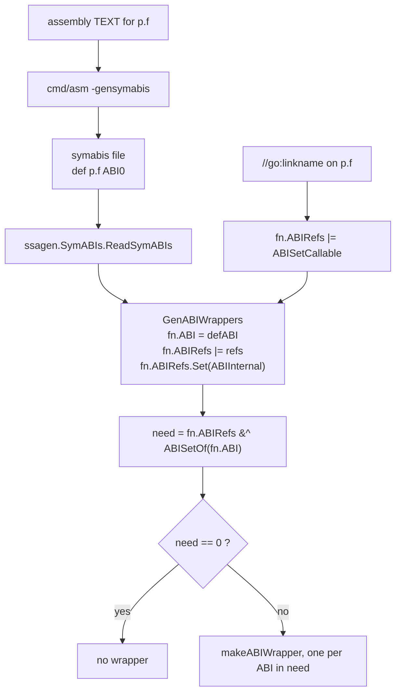

# ABI wrappers

nanogo already emits ABI0 **references**. `ssagen.morestackCallee` names
`runtime.morestack_noctxt` under ABI0, and `globalCallee` names every data
symbol under ABI0. What nanogo has never emitted is an ABI0 **definition**.
That one sentence is the whole gap this spec closes.

Eight of the twenty-seven standard library archives a minimal `func main() {}`
needs are refused by `driver.checkAssembly`, and all eight give one message.
They are `internal/abi`, `internal/bytealg`, `internal/chacha8rand`,
`internal/cpu`, `internal/runtime/atomic`, `internal/runtime/maps`,
`internal/runtime/sys` and `runtime`. That is the largest single group of
refusals in the closure, and it is one refusal covering four separate pieces of
missing work.

Everything below was measured against the installed toolchain, `go1.27.0` on
`darwin/arm64`, with `go tool compile -S`, `go tool nm`, `cmd/asm -gensymabis`,
and the sources in `GOROOT`. Nothing here is recalled. [030](030-abi.md)
records what a remembered ABI rule cost the project once already.

## What ABI0 is

ABI0 is the stack-only convention. Every receiver, argument and result is in
memory, at an offset in the callee's incoming argument area, and no register
carries a value across the boundary. `cmd/compile/abi-internal.md` states the
relationship directly:

> The ABI assignment algorithm above is equivalent to Go's stack-based ABI0
> calling convention if there are zero architecture registers.

That sentence is the design of this spec's first half. ABI0 is not a second
convention. It is [030](030-abi.md)'s convention with both register sets empty.

### The layout recurrence

Read `abi-internal.md`'s assignment algorithm with `NI = NFP = 0`. Every
register assignment fails, so step 4 fires for every value, and what is left is
this walk over the declared lists:

```
off ← 0
for each of the receiver, then each argument, in declaration order:
    off ← roundUp(off, align(T))
    place the value at off
    off ← off + size(T)

off ← roundUp(off, 8)               // the pointer-alignment field

for each result, in declaration order:
    off ← roundUp(off, align(T))
    place the value at off
    off ← off + size(T)

argsize = roundUp(off, 8)           // the trailing pointer-alignment field
```

There is no spill part. The spill part of [030](030-abi.md)'s argument area
holds one slot per value that travelled in a register, and in ABI0 no value
does.

The pointer-alignment field between the arguments and the results is not
cosmetic and it is not derivable from the types. `func g1(a int8) (r int8)`
places `a` at 0 and `r` at **8**, not at 1, and its area is 16 bytes and not 2.
A walk that ran the results straight on from the arguments would put every
result of every ABI0 function at the wrong offset whenever the arguments do not
end on a word.

### The measured cases

Each row is the ABI0 area of a real function, read out of `go tool compile -S`
by the offsets a `gc`-generated wrapper loads and stores, and cross-checked
against the `args=` field of the wrapper's `TEXT` line.

| Signature | Placement | `argsize` |
| --- | --- | --- |
| `getisar0() uint64` | `ret` 0 | 8 |
| `g1(a int8) (r int8)` | `a` 0, `r` 8 | 16 |
| `g2(a int8, b int8) (r1 int8, r2 int32)` | `a` 0, `b` 1, `r1` 8, `r2` 12 | 16 |
| `sysctlEnabled(name []byte) bool` | `name` 0, 8 and 16, `~r0` 24 | 32 |
| `g4(a ...int) int` | `a` 0, 8 and 16, `~r0` 24 | 32 |
| `f(a int8, b int64, c string, d float64) (r1 int32, r2 [3]int64)` | `a` 0, `b` 8, `c` 16 and 24, `d` 32, `r1` 40, `r2` 48 | 72 |

The last row is worth following through the recurrence, because it exercises
every clause. `a` at 0 leaves `off` at 1. `b` needs 8-byte alignment, so it
goes to 8 and leaves `off` at 16. The string is two words at 16 and 24. `d` is
at 32 and leaves `off` at 40, which is already a multiple of 8, so the
pointer-alignment field adds nothing. `r1` is at 40 and leaves `off` at 44.
`r2` needs 8-byte alignment, so it goes to 48 and leaves `off` at 72. The area
is 72 bytes, which is `0x48`, and that is what `gc` prints:

```
p.gof STEXT dupok nosplit size=96 align=0x0 args=0x48 locals=0x68 funcid=0x17
	TEXT	p.gof(SB), DUPOK|NOSPLIT|ABIWRAPPER|LINKNAME, $112-72
	MOVB	p.a(FP), R0
	MOVD	p.b+8(FP), R1
	MOVD	p.c+16(FP), R2
	MOVD	p.c+24(FP), R3
	FMOVD	p.d+32(FP), F0
	CALL	p.gof(SB)
	...
	MOVD	R4, p.r2+64(FP)
	MOVW	R0, p.r1+40(FP)
```

**Variadic is not a special case.** `g4(a ...int) int` places one `[]int` at 0,
8 and 16 and the result at 24. The convention sees a slice parameter and
nothing else. `makeABIWrapper` sets `call.IsDDD` from
`fn.Type().IsVariadic()`, so the wrapper passes its own slice through rather
than building a second one.

### The zero-size rule, and where nanogo's walk already parts from `gc`

`abi-internal.md`'s assignment step 2 is explicit and is the one clause a
reader skips:

> If T has zero size, add T to the stack sequence S and return.

with the reason stated in the same document: this is what makes the algorithm
ABI0-equivalent, and such a value "does result in alignment padding on the
stack in ABI0."

`ssa.abiAssigner.place` does not do this. `ABILeaves` of a zero-size type
returns no parts and reports the flatten complete, so the `fits` loop never
runs, `fits` stays true, and the value is recorded as register-assigned with a
zero-width spill slot. It never reaches `as.stack`, so it contributes no
alignment.

The divergence is measurable, and it is measurable **today, in ABIInternal**,
before any of this spec is built:

```go
func f1(a [3]int8, b [0]int64, c [3]int8) int8   // gc: a at FP+0, c at FP+8
func f2(a [3]int8,               c [3]int8) int8 // gc: a at FP+0, c at FP+3
```

`gc` compiles the first to `MOVB z.c+8(FP), R2` and the second to
`MOVB z.c+3(FP), R2`. The zero-size `[0]int64` moves `c` by five bytes because
it forces the running offset up to the next multiple of 8. nanogo's walk skips
it and would place `c` at 3 in both. In ABI0 the same signature gives an area
of 24 with the zero-size parameter and 16 without, and every result moves with
it.

The rule the walk needs is one clause and not a rewrite: a value whose type has
zero size takes a stack slot at `roundUp(off, align(T))` of width zero, in both
ABIs, and takes no register and no spill slot. Adding it is a prerequisite of
this spec and a fix to [030](030-abi.md)'s existing pass.

### The arm64 frame the offsets are relative to

`abi-internal.md`'s arm64 section gives the frame, and the ABI0 area sits
inside the caller's:

```
   higher addresses
        ...
   +----------------------------+
   | caller's locals            |
   +----------------------------+
   | outgoing argument area     |  ← the callee's ABI0 offset 0 is here,
   |   [RSP+8, RSP+8+argsize)   |    at RSP+8 of the caller
   +----------------------------+
   | caller's return PC         |  ← RSP after the caller's prologue
   +----------------------------+
   | caller's frame pointer     |  ← RSP-8
   +----------------------------+
        ...
   lower addresses
```

The arm64 `CALL` does not move `RSP`. It puts the return address in R30 and
the callee's prologue subtracts its own frame size. So the callee's pseudo-`FP`
resolves to `RSP_callee_after_prologue + framesize + 8`, which is the caller's
`RSP + 8`, which is where the caller wrote the arguments. The identity
`FP == caller RSP + 8` is what makes the wrapper's `MOVB R0, 8(RSP)` and the
assembly's `MOVD R0, ret+0(FP)` name the same word, and it was checked against
`internal/cpu.getisar0` and against the six-argument case above.

`abi-internal.md` states that this stack layout "is used by both register-based
(ABIInternal) and stack-based (ABI0) calling conventions", so the frame is not
a second layout either.

## Which direction each wrapper goes

A wrapper exists because a symbol's name is claimed under two ABIs. The ABI is
half of a symbol's identity in `goobj` and in `cmd/link`, so `p.f` under ABI0
and `p.f` under ABIInternal are two symbols, and a reference under the wrong
one resolves to nothing.



`ssagen.GenABIWrappers` in `cmd/compile/internal/ssagen/abi.go` is the whole
decision. Three lines of it carry the rule:

- `fn.ABI = defABI` where the symabis file has a `def` for the symbol, and the
  declaration has an empty body. A `def` for a declaration that also has a Go
  body is the error `%v defined in both Go and assembly`.
- `fn.ABIRefs.Set(obj.ABIInternal, true)` unconditionally, with the comment
  "Assume all functions are referenced at least as ABIInternal, since they may
  be referenced from other packages."
- `fn.ABIRefs |= obj.ABISetCallable` when `sym.Linkname != ""` and the symbol
  is defined in this package and is not cgo-exported.

`forEachWrapperABI` then computes `need := fn.ABIRefs &^ obj.ABISetOf(fn.ABI)`
and calls `makeABIWrapper` once per ABI still in `need`. Two shapes come out.

### A Go caller calling an assembly function

The declaration is bodyless, the symabis file says `def p.f ABI0`, so
`fn.ABI` is ABI0 and the unconditional ABIInternal reference is what `need`
holds. The wrapper's **own** ABI is ABIInternal. It takes its arguments in
registers, stores them into the outgoing area at ABI0 offsets, calls the
assembly, and reads the results back out of the area into registers.

```
internal/cpu.getisar0 STEXT dupok nosplit size=32 args=0x0 locals=0x18 funcid=0x17
	TEXT	internal/cpu.getisar0(SB), DUPOK|NOSPLIT|ABIWRAPPER|ABIInternal, $32-0
	MOVD.W	R30, -32(RSP)
	MOVD	R29, -8(RSP)
	SUB	$8, RSP, R29
	FUNCDATA	$0, gclocals·g5+hNtRBP6YXNjfog7aZjQ==(SB)
	FUNCDATA	$1, gclocals·g5+hNtRBP6YXNjfog7aZjQ==(SB)
	PCDATA	$0, $-2
	PCDATA	$1, $0
	CALL	internal/cpu.getisar0(SB)
	MOVD	8(RSP), R0
	MOVD	-8(RSP), R29
	MOVD.P	32(RSP), R30
	RET	(R30)
	rel 12+4 t=R_CALLARM64 internal/cpu.getisar0+0
```

The `CALL` prints the same name as the `TEXT`. The relocation resolves to the
ABI0 symbol because the reference carries the ABI, not because the name
differs.

### An assembly caller calling a Go function

The Go function has a body, so `fn.ABI` is ABIInternal, and the ABI0 entry in
`need` comes from one of two places: a `ref p.f ABI0` line the assembler
recorded because an assembly file names the symbol, or `ABISetCallable` from a
`//go:linkname`. The wrapper's **own** ABI is ABI0. It loads its arguments out
of its own ABI0 area, calls the Go function under ABIInternal, and writes the
results back into the ABI0 area.

That is the `p.gof` listing quoted above. All twenty-one ABI0-own wrappers in
the seven packages other than `runtime` carry `LINKNAME`, so `//go:linkname` is
what triggers this direction in practice. `runtime`'s 328 were not inspected,
and its symabis file has 261 `ref ... ABI0` lines, so a large part of them
probably come from the `ref` path instead.

### The wrapper is a Go function, and `gc` compiles it as one

`makeABIWrapper` builds an `ir.Func` whose body is one call and one return,
runs it through `typecheck`, and lets the ordinary pipeline compile it. It sets
`SetABIWrapper(true)`, `SetDupok(true)` and `fn.Pragma |= ir.Nosplit`, and it
emits a tail call only when the signature has no receiver, no parameters and no
results.

The consequence is visible in `internal/runtime/atomic`. All forty-nine of its
wrappers reach `-S` with **no** `CALL` in them, because
`internal/runtime/atomic.Xadd` and its neighbours are `gc` intrinsics and the
call inside the wrapper was intrinsified away. The wrapper is an ordinary
function that the ordinary optimiser rewrote.

`ir.Func.Wrapper` is already set by every function `ssagen/wrapper.go` builds,
so the `funcID` is `abi.FuncIDWrapper` and `runtime.gorecover` skips the frame.
An ABI wrapper needs the same mark for the same reason [030](030-abi.md) gives.

## What `cmd/asm` actually refuses

[030](030-abi.md) says "`cmd/asm` refuses the `<ABIInternal>` marker outside
the runtime, so every assembly definition in an ordinary package is ABI0."
**That is false**, and the measurement below depends on the correct rule.

`asm/internal/asm.Parser.symRefAttrs` accepts `<ABI0>`, `<ABIInternal>` and
`<>` and rejects a selector only when `p.allowABI` is false. `allowABI` is
`objabi.LookupPkgSpecial(ctxt.Pkgpath).AllowAsmABI`, and the list in
`cmd/internal/objabi/pkgspecial.go` is:

```
runtime, reflect, syscall,
internal/bytealg, internal/chacha8rand,
internal/runtime/syscall/linux, internal/runtime/syscall/windows,
internal/runtime/startlinetest, internal/runtime/maps
```

Assembly in any of those packages may define a symbol directly as ABIInternal,
and then no wrapper is needed for the Go-calls-assembly direction at all. There
is one further rule: `cmd/asm` errors with `TEXT %q: ABIInternal requires
NOSPLIT` for an ABIInternal definition without the flag, because `obj` needs a
fixed frame size for such a symbol.

This is why `internal/chacha8rand` needs zero wrappers and `internal/bytealg`
and `internal/runtime/maps` need only the ABI0 direction.

## `symabis`

The `go` command compiles a package with assembly in two passes. It writes an
empty `go_asm.h`, runs the assembler with `-gensymabis` to produce a symabis
file, runs the compiler with `-symabis` and `-asmhdr`, then runs the assembler
again for real against the header the compiler wrote. The logged command line
for `internal/cpu` is:

```
echo -n > $WORK/b001/go_asm.h
asm -p internal/cpu -I $WORK/b001/ -I $GOROOT/pkg/include \
    -D GOOS_darwin -D GOARCH_arm64 -shared -std -gensymabis \
    -o $WORK/b001/symabis ./cpu.s ./cpu_arm64.s
compile ... -symabis $WORK/b001/symabis ... -asmhdr $WORK/b001/go_asm.h <go files>
asm ... -o $WORK/b001/cpu.o ./cpu.s
asm ... -o $WORK/b001/cpu_arm64.o ./cpu_arm64.s
go tool pack r $WORK/b001/_pkg_.a $WORK/b001/cpu.o $WORK/b001/cpu_arm64.o
```

### The format

`ReadSymABIs` documents it and the file confirms it: whitespace-separated
fields, one record per line, blank lines and lines starting with `#` skipped.
The first field is `def` or `ref`, the second is the linker symbol name, the
third is the ABI name that `obj.ParseABI` accepts, which is `ABI0` or
`ABIInternal`. Any other verb is a fatal error, and so is a line whose field
count is not three.

Two real files, generated by the commands above:

```
def internal/cpu.getisar0 ABI0
def internal/cpu.getisar1 ABI0
def internal/cpu.getpfr0 ABI0
def internal/cpu.getMIDR ABI0
```

```
def internal/runtime/maps.memHash32AES ABIInternal
ref internal/runtime/maps.aeskeysched ABI0
def internal/runtime/maps.memHash64AES ABIInternal
ref internal/runtime/maps.aeskeysched ABI0
def internal/runtime/maps.memHashAES ABIInternal
ref internal/runtime/maps.aeskeysched ABI0
```

A `ref` may name a data symbol, as `aeskeysched` does. Such a line reaches
`s.refs` and is then never matched against a function, because
`GenABIWrappers` walks `typecheck.Target.Funcs` and looks each function's own
name up. A `ref` for a name that is not a function in this package has no
effect.

### What the compiler must do with it

Three things, and only the first is about wrappers.

1. Set the ABI of each declaration the file `def`s, and take the reference set
   from the `ref` lines, so that `need` can be computed.
2. Treat a `def` for a name that has a Go body as an error. It is the source
   of `%v defined in both Go and assembly`.
3. Treat a `def` for a name with no Go declaration at all as nothing. It
   happens: `internal/abi`'s `abi_test.s` defines
   `internal/abi.FuncPCTestFn`, whose only Go declaration is in
   `export_test.go`, which is not in the ordinary build. The compiler writes no
   wrapper and no argument map for it, and `go tool nm` over the built archive
   shows `internal/abi.FuncPCTestFn.args_stackmap` as **U**, undefined. It
   never resolves in an ordinary link because the symbol is unreachable.

## `-asmhdr`

The header exists because an assembly file cannot compute a Go struct's field
offsets. `runtime/asm_arm64.s` writes `MOVD (g_stack+stack_lo)(g), R2`, and
`g_stack` and `stack_lo` are `#define`s the compiler produced from the Go
declaration of `type g struct`.

`gc.dumpasmhdr` in `cmd/compile/internal/gc/export.go` is short, and the rule
is exactly what it does. It walks `typecheck.Target.AsmHdrDecls`, which
`noder` fills with **every** package-scope name whose `Op` is `OLITERAL` or
`OTYPE`, collected only when `-asmhdr` is set. For each:

- a blank name is skipped
- a constant of float or complex kind is skipped, and every other constant
  becomes `#define const_<Name> <ExactString of the value>`
- a type that is not a struct, or is a map's internal struct, or is a
  function's argument struct, is skipped. Every other struct becomes
  `#define <Name>__size <size>` followed by
  `#define <Name>_<Field> <offset>` per non-blank field

Nothing is filtered by whether the assembly refers to it. Real output, from
`go tool compile -asmhdr` on `internal/cpu`:

```
// generated by compile -asmhdr from package cpu

#define CacheLinePad__size 128
#define option__size 32
#define option_Name 0
#define option_Feature 16
#define option_Specified 24
#define option_Enable 25
#define const_CacheLinePadSize 128
```

and the first lines of `internal/abi`'s, which is 251 lines:

```
// generated by compile -asmhdr from package abi

#define RegArgs__size 392
#define RegArgs_Ints 0
#define RegArgs_Floats 128
#define RegArgs_Ptrs 256
#define RegArgs_ReturnIsPtr 384
#define const_IntArgRegs 16
#define const_FloatArgRegs 16
```

Sizes for the eight packages are 251, 12, 15, 9, 30, 57, 19 and 2622 lines, in
the order they are listed at the top of this spec.

Two details a writer gets wrong. The header names the package by its **name**
and not its path, so `internal/cpu` prints `package cpu`. And a string constant
is written with `constant.Value.ExactString`, which is a Go-quoted string, so
`internal/runtime/sys` emits `#define const_ntz8tab "\b\x00\x01\x00..."` for a
256-byte table. A writer that spells a constant differently from `gc` produces
an assembly file that assembles to different code, and nothing reports it.

The header must be written even for a package that owes no wrapper. It is the
input to the second assembler run, and the assembler fails to find the
`#define` otherwise.

## `args_stackmap` and `arginfo`, the fourth piece

[030](030-abi.md) names three missing pieces. There are four.

`cmd/internal/obj/plist.go` appends, to **every** ABI0 text symbol the
assembler produces under the package's own prefix that does not already have
one, a `FUNCDATA $FUNCDATA_ArgsPointerMaps` reference to
`<symbol>.args_stackmap`. The assembly object therefore holds an undefined
reference to a symbol only the compiler can define. `runtime.addmoduledata` is
the single exception, and a symbol whose ABI is not ABI0 is skipped with the
comment "better to have no stackmap than an incorrect/lying stackmap".

`gc/compile.go` defines it. For a bodyless declaration whose `fn.ABI` is ABI0,
it calls `liveness.WriteFuncMap` and `ssagen.EmitArgInfo`. `WriteFuncMap`
writes, into `<symbol>.args_stackmap`, marked `RODATA|LOCAL` and linkname-
visible so that assembly may name it:

```
uint32  nbitmap        // 2 when the function has results, else 1
uint32  bv.N           // bits, which is ArgWidth / PtrSize
bitvec  args           // pointer words of the ABI0 argument part
bitvec  args + results // only when nbitmap is 2, and it is cumulative
```

The second map is cumulative because `WriteFuncMap` keeps writing into the same
`bitvec`. `internal/cpu.getisar0.args_stackmap` is 10 bytes, which is
`4 + 4 + 1 + 1` for a function with one word of area and no pointer in it.

**Every package with an ABI0 `def` needs this**, whether or not it needs a
wrapper. By the measurement below that is `internal/cpu`,
`internal/runtime/atomic`, `internal/runtime/sys`, `internal/abi` and
`runtime`. Without it the link fails on an undefined symbol, which at least is
loud. With a wrong map the collector follows a word that is not a pointer,
which is not.

## What each of the eight packages actually needs

Measured by compiling each package with the real `gc` under the exact command
line the `go` command sends, and counting `ABIWRAPPER` symbols in `-S` output.
A wrapper whose `TEXT` flags include `ABIInternal` has ABIInternal as its own
ABI and therefore calls ABI0 assembly. One whose flags do not is an ABI0
definition and is called from assembly.

| Package | `def` ABI0 | `def` ABIInternal | wrappers, Go→asm | wrappers, asm→Go |
| --- | --- | --- | --- | --- |
| `internal/abi` | 1 | 0 | 0 | 0 |
| `internal/chacha8rand` | 0 | 1 | 0 | 0 |
| `internal/cpu` | 4 | 0 | 4 | 1 |
| `internal/runtime/sys` | 3 | 0 | 3 | 0 |
| `internal/runtime/atomic` | 49 | 0 | 49 | 0 |
| `internal/bytealg` | 0 | 10 | 0 | 3 |
| `internal/runtime/maps` | 0 | 3 | 0 | 17 |
| `runtime` | 112 | 17 | 144 | 328 |

`internal/abi`'s single ABI0 `def` is the `export_test.go` case above, so it
produces nothing. `internal/runtime/atomic`'s forty-nine wrappers match its
forty-nine ABI0 defs one for one, with no unmatched name in either direction.

## The design for nanogo

### ABI0 is `ABIWalk` with empty register sets, and not a second walk

`ssa.ABIWalk` already takes the register sets off the `Target`
(`t.ArgRegs`, `t.ResultRegs`). Give the walk an ABI parameter that selects
between the target's register sets and empty ones, and ABI0 falls out. The
three conditions that make this exact rather than approximate:

- The pointer-alignment field between the arguments and the results is already
  there. `ABIWalk` does `as.stack = abiRoundUp(as.stack, ir.PtrSize)` between
  the two `placeAll` calls, and that is the field measured by `g1`.
- The trailing pointer-alignment field is already there. `finish` returns
  `abiRoundUp(base+as.spill, ir.PtrSize)`, and with nothing spilled that is
  `roundUp(stack, 8)`.
- The zero-size rule is **not** there, and the section above says what to add.

This keeps [000](000-decisions.md) decision 5 intact. The ABI stays a target
parameter and no second placement walk exists to drift from the first.

The alternative considered and rejected is a separate `ABI0Walk` that lays out
a signature directly from the type list. It is ten lines and it is wrong for
one reason: it would be a second statement of the same rule, and the two would
be checked against each other by nothing. [030](030-abi.md)'s record of what
happened the last time one boundary had two placements is the argument.

### Who owns what

| Piece | Owner | State |
| --- | --- | --- |
| the ABI0 register sets | `ssa.Target.ABI0Target` | built, stage 2 |
| the zero-size rule | `ssa/abi.go` | built, before stage 2, in `abiAssigner.place` |
| a function's own ABI | `ir.Func` | not built and not needed until stage 3; every symbol nanogo emits is ABIInternal |
| a call's callee ABI | `ir.Object.Assembly`, in a call's `Aux` | built, stage 2; no field beside `Sig` was needed |
| building the wrapper as IR | `ssagen.ABIWrapper` | built, stage 2, through `finishWrapper` |
| the runtime-package property | `driver/runtimepkg.go` | built, stage 0; checked against `GOROOT` |
| the per-function directive gate | `driver.RuntimeDirective` | built, stage 0 |
| reading the symabis file | `driver/symabis.go` | built, stage 1 |
| writing the assembly header | `driver/asmhdr.go` | built, stage 1; byte-identical to `gc` over all eight packages |
| refusing a package that owes a wrapper | `driver.checkABIWrappers` | built, stage 1; the decision is taken and refused |
| the `//go:linkname` name model and `ABISetCallable` | `driver/linkname.go` | built, stage 2 |
| emitting a definition under a renamed symbol | `driver`, `ir` | not built; refused by name in a package with assembly |
| `<sym>.args_stackmap` and `<sym>.arginfo0` | `ssagen/argmap.go` | built, stage 2; byte-identical to `gc` over a fixed corpus |
| the ABI on the emitted text symbol | `ssagen.Options.ABI` | **declared and ignored**; stage 3 is where it has to be read |
| ABI0 references to runtime symbols | `rtsym`, `ssagen/reloc.go` | built |

`ssagen.Options.ABI` is documented as "the calling convention the symbol is
defined with" and `driver.compileFunc` passes `obj.ABIInternal` into it, but
`emitter.result` hardcodes `ABI: obj.ABIInternal` and never reads the field. It
is a declared-and-unread field of the kind [050](050-driver.md) records for six
driver flags. It must be read before any of this works.

### The one new SSA need

A wrapper's own ABI decides how `AssignABI` places its parameters and results.
That is one field on `ir.Func`, threaded to the pass.

The **callee's** ABI decides how the wrapper's outgoing area is laid out, and
nothing in the graph carries it. `ssa.Value.Sig` carries the callee's signature
already, which is what [030](030-abi.md) added to size the outgoing area from
the callee rather than from the call site's reads. It needs one more piece of
the callee's identity beside it. Without it the ABIInternal wrapper sizes and
lays out its outgoing area by the ABIInternal walk while the assembly reads
ABI0 offsets, which is a caller writing arguments where the callee reads none.
That failure is silent inside a nanogo-only program for the same reason every
entry in [030](030-abi.md)'s "What was wrong" list is silent.

### The wrapper is built as IR and compiled by the ordinary pipeline

`ssagen/wrapper.go` builds method wrappers as `ir.Func` with a body of one call
and one return, and `driver.addGenerated` compiles them through `compileFunc`
with every other function. An ABI wrapper is the same shape with a different
ABI on the symbol, so `finishWrapper` is close to the whole body already.

This is also the answer to a correctness question that is easy to miss. A
pointer argument of an ABIInternal wrapper is live across the inner call, so
the collector must find it. `gc` spills it into the wrapper's own ABIInternal
spill slot and the arguments bitmap covers it:

```
	MOVD	R2, p.c+40(FP)      // the string's pointer, into its spill slot
	...
	CALL	p.asmf(SB)
```

nanogo's register allocator would spill the same value into a frame slot and
[027](027-liveness-and-stackmaps.md)'s locals bitmap would cover it. Both are
correct, and neither needs a special case, because the wrapper went through the
ordinary liveness pass. A wrapper emitted by a shortcut path would need the
whole question answered again.

The mirror question is the ABI0 wrapper's own arguments bitmap. Every argument
of an ABI0 function is in memory at a known offset for the whole call, so the
arguments bitmap has to describe the ABI0 area with every pointer word marked.
[027](027-liveness-and-stackmaps.md) builds that map from the ABI placement, so
it follows from the placement being right.

### `NOSPLIT`, resolved rather than noted

`makeABIWrapper` sets `ir.Nosplit` on every wrapper, with a comment saying the
author could not make `all.bash` pass without it. [035](035-goroutines-and-stack-growth.md)
used to forbid nanogo from claiming the property, and `ssagen.result`
deliberately did not set `SymFlagNoSplit`.

That conflict is resolved, in favour of setting the flag, and 035 now says so:
`ssagen.Options.NoSplit` sets it for a function that carries the directive, and
a wrapper is the same case. `cmd/link`'s
`doStackCheck` in `ld/stackcheck.go` runs unconditionally over `ctxt.Textp`,
reads `ldr.IsNoSplit(sym)` off the symbol, walks the call graph, and compares
each height against `objabi.StackNosplit(race) - callSize - 8` on arm64. It
does not care which compiler produced the object. Setting the flag therefore
**delegates** the check to the linker rather than skipping it, and an overflow
is a link error naming the chain. [035](035-goroutines-and-stack-growth.md)'s
objection is to an unchecked claim, and this claim is checked.

The reverse choice is also not silent. A wrapper without `NOSPLIT` emits the
stack-growth prologue, and reaching it from a context where the stack may not
grow throws `morestack on g0` at run time. Loud, but at run time and far from
the cause. The flag is the better answer and the linker is why.

**Stage 2 took the reverse choice anyway, and the reason is narrower than the
argument above.** `ssagen.result` does not set `SymFlagNoSplit` for any
function, and making the ABI wrapper the one exception would be a claim taken
in one place about a budget nanogo computes nowhere. The cost is one frame and
one check per wrapper, and the two packages the stage 2 wrapper is for are
held by [035](035-goroutines-and-stack-growth.md) anyway. The flag belongs
with the budget, and both belong to that spec.

### What nanogo refuses by name in the first version

Each of these is a shape `gc` handles and nanogo will not, and each is refused
with a message naming this spec. A silent wrong answer is worse than a
refusal.

| Refused | Why |
| --- | --- |
| a wrapper for a method | `makeABIWrapper` errors with `makeABIWrapper support for wrapping methods not implemented`, so refusing costs no compatibility |
| `//go:cgo_export_static` and `//go:cgo_export_dynamic` | the cgo branch of `GenABIWrappers` rewrites the pragma and suppresses the wrapper; cgo is out of scope by [000](000-decisions.md) decision 8 |
| `//go:cgo_unsafe_args` | it pins the function to ABI0 and propagates the linkname attribute to the ABI0 symbol, and it exists because the callee walks arguments by offset |
| a `def` line whose ABI is neither `ABI0` nor `ABIInternal` | `obj.ParseABI` is the only accepted spelling and a fourth value would be guessed |
| a constant whose kind the header writer cannot spell exactly as `gc` does | an approximation reaches the assembler as a different number |
| `runtime` itself | it needs the write barriers of [034](034-write-barriers.md), the nosplit budget of [035](035-goroutines-and-stack-growth.md), and 472 wrappers |

### The runtime detection gate, which is not optional

`driver.checkSupported` refuses "the runtime" when the `-+` flag is present.
**The `go` command never sends `-+`.** There is no occurrence of the flag in
`cmd/go`, and `gc` derives the property instead:

```go
// cmd/compile/internal/base/flag.go
if Flag.Std && objabi.LookupPkgSpecial(Ctxt.Pkgpath).Runtime {
    Flag.CompilingRuntime = true
}
```

All eight packages in this spec are in `objabi.runtimePkgs`, so `gc` compiles
all eight with the runtime rules on, and nanogo's refusal fires for none of
them. Today the assembly refusal hides that. The hole is already open for a
runtime package with no assembly in it, and `internal/byteorder`,
`internal/goarch` and `internal/runtime/math` are three that nanogo reaches
without meeting either refusal.

A blanket refusal of `objabi.runtimePkgs` is the wrong repair, for two reasons.
It would refuse packages nanogo compiles today, and it is far coarser than the
property that matters. What `Flag.CompilingRuntime` changes in `gc` is mostly
optimization and instrumentation policy at `base/flag.go:366`. The two clauses
that decide a program's meaning are `noder.noder.pragma`, which permits
`//go:systemstack`, `//go:nowritebarrier`, `//go:nowritebarrierrec` and
`//go:yeswritebarrierrec` only in a runtime package, and
`liveness.plive.go:504`, which treats every function in a runtime package as
though it were nosplit.

So the gate is per directive and per function, which is where
[016](016-directives-and-pragmas.md) and
[035](035-goroutines-and-stack-growth.md) already put it. Counted over the
files each package actually builds on `darwin/arm64`:

| Package | `//go:nosplit` | write-barrier, `systemstack`, `uintptr*` |
| --- | --- | --- |
| `internal/abi` | 2 | 0 |
| `internal/bytealg` | 0 | 0 |
| `internal/chacha8rand` | 1 | 0 |
| `internal/cpu` | 0 | 0 |
| `internal/runtime/atomic` | 50 | 0 |
| `internal/runtime/maps` | 1 | 0 |
| `internal/runtime/sys` | 1 | 0 |
| `runtime` | 418 | 204 |

Two rows were re-counted while stage 0 was built and were wrong in the first
draft. `internal/chacha8rand` has one directive and not two, and
`internal/runtime/sys` has one and not three. The extra counts were prose:
`chacha8.go` writes "Next is //go:nosplit to allow its use in the runtime" in
a comment above the directive, and `intrinsics.go` writes an indented
`//go:nosplit` inside an example. A count over lines holding the text is not a
count of directives, and only the second is what the gate reads.

The cut is clean. `runtime` is the only package that carries a write barrier or
`systemstack` directive, and it is out of scope for every stage of this spec
anyway. None of the other seven carries one, so none of them needs
[034](034-write-barriers.md) built before it compiles correctly.

`//go:nosplit` is a different matter and it is not this spec's to close.
[035](035-goroutines-and-stack-growth.md) records that nanogo emits a
stack-growth check in a function marked `//go:nosplit`, and
`TestDirectivesAreRecordedButNotHonoured` gates the gap rather than a refusal.
Five of the seven carry the directive, so lifting the assembly refusal makes
that gap reachable for the first time. It must become a refusal by name before
those five compile, and the refusal belongs to
[035](035-goroutines-and-stack-growth.md) and reads the function's own pragma.
`internal/bytealg` and `internal/cpu` carry none and are unaffected.

## The staged plan

Each stage is independently testable and independently valuable, and each names
the packages whose assembly refusal it lifts. Lifting that refusal is not the
same as the package compiling: [035](035-goroutines-and-stack-growth.md)'s
`//go:nosplit` gate stands behind it for five of the seven, and each stage says
so. `runtime` is out of scope for all of them.

### Stage 0: the runtime gate

Derive "compiling a runtime package" from `-std` and the package path rather
than from the `-+` flag the `go` command never sends. Transcribe
`objabi.runtimePkgs` and gate the copy against `GOROOT` the way `rtsym` gates
its symbol table. Then refuse two things by name and nothing else: `runtime`
itself, and a function carrying a directive nanogo cannot honour. The second
refusal is [035](035-goroutines-and-stack-growth.md)'s and covers
`//go:nosplit`, and [034](034-write-barriers.md)'s and covers the write barrier
and `systemstack` directives, which only `runtime` uses.

**Test.** A compile of `runtime` is refused naming the runtime rules, on the
command line the `go` command actually sends, with no `-+` on it. A compile of
a package that is in `runtimePkgs` and carries no such directive is **not**
refused by this gate, which is what keeps `internal/byteorder` and
`internal/goarch` compiling. A drift test reads `runtimePkgs` out of `GOROOT`
and fails when the transcribed list disagrees.

**Lifts the assembly refusal for** nothing. It repairs a refusal that fires for
no package today, and it decides per package which of the eight are gated by
something other than assembly. Five of the seven are gated by `//go:nosplit`,
and closing that is [035](035-goroutines-and-stack-growth.md)'s work rather
than this spec's.

**Built.** `driver/runtimepkg.go` holds the transcribed list and
`Config.RuntimeRules`, which is `gc`'s own disjunction of `-+` and `-std` with
the path. `TestRuntimePkgsMatchesTheToolchain` parses
`objabi.runtimePkgs` out of `GOROOT` with `go/parser` and fails on drift.
`checkSupported` refuses `runtime` by name, and `driver.RuntimeDirective`
refuses a function in a runtime package that carries `//go:nosplit`,
`//go:systemstack` or one of the three write-barrier directives. The gate is
applied in `emitPackage`, after the bodyless branch: a bodyless declaration
carrying `//go:nosplit` needs nothing, because nanogo emits no code for it and
`cmd/asm` honours `NOSPLIT` on the definition the assembly file writes.

One clause of the property this gate does **not** cover, and it is worth
recording rather than leaving implicit. `liveness.IsUnsafe` is
`base.Flag.CompilingRuntime || f.NoSplit`, so `gc` marks every point in every
function of a runtime package unsafe, and not only the ones that carry the
directive. The per-directive gate is therefore narrower than the property, and
the thirteen runtime packages that compile today compile with ordinary safe
points where `gc` would emit none. Nothing links yet, so nothing observes it.
Closing it belongs with [035](035-goroutines-and-stack-growth.md)'s nosplit
budget, which is the same clause read the other way round.

### Stage 1: symabis, the header, and the argument map

Read `-symabis` into a def and ref table. Write `-asmhdr` from the package's
constants and struct types. Emit `<sym>.args_stackmap` and `<sym>.arginfo0` for
every bodyless declaration whose recorded ABI is ABI0. Lift
`driver.checkAssembly` for a package that needs no wrapper, and keep refusing
one that does.

**Test.** Byte-compare nanogo's `go_asm.h` against `gc`'s for each of the eight
packages, which is a fixed set of eight files and catches the whole class.
Compare the `args_stackmap` bytes against `gc`'s for a signature with a pointer
in the arguments, one with a pointer only in the results, and one with none.
Build `internal/abi` and `internal/chacha8rand` under a real
`go build -toolexec=nanogo` and run a program that uses them.

**Lifts the assembly refusal for** `internal/abi` and `internal/chacha8rand`,
which need no wrapper. Both carry `//go:nosplit`, so both still wait on
[035](035-goroutines-and-stack-growth.md).

**Built, with two of the three pieces and not three.** `driver/symabis.go`
reads the file, `driver/asmhdr.go` writes the header, and
`driver.checkABIWrappers` takes `GenABIWrappers`'s decision and refuses where
`need` is not empty instead of making the wrapper. `TestAsmHdrMatchesGc`
compares the header byte for byte against `go tool compile -asmhdr` for all
eight packages, `runtime`'s 2622 lines included, and all eight match. The
oracle needs the assembler's first pass as well as the compiler:
`internal/abi.FuncPCABI0` checks a named function's definition ABI against the
symabis defs, so `gc` refuses `runtime` outright without `-symabis`.

`<sym>.args_stackmap` and `<sym>.arginfo0` are **not** built, and this staging
is wrong to have asked for them here. The two are inseparable from stage 2's
wrapper, by the same four facts the spec states above:
`cmd/internal/obj/plist.go` appends the reference for every ABI0 text symbol,
`gc/compile.go` defines the symbol only where `fn.ABI` is ABI0, `fn.ABI` is
ABI0 only from a symabis `def ... ABI0` that matched a Go declaration, and
`GenABIWrappers` then sets `ABIInternal` in `ABIRefs` unconditionally while
`buildcfg` pins `RegabiWrappers` on for arm64. **An ABI0 `def` that matches a
Go declaration owes exactly one wrapper and exactly one argument map, never one
without the other.** There is therefore no package that needs the map and does
not need the wrapper, and one gate covers both. Stage 2 owns the map.

**Lifted the assembly refusal for all eight**, and lifted no package to
compiling. The closure measurement stays at 20 of 28 and every one of the
eight moved to a narrower refusal, which is the useful part of the reading:

| Package | now refused for |
| --- | --- |
| `internal/abi` | `//go:nosplit` on `IntArgRegBitmap.Get`, [035](035-goroutines-and-stack-growth.md) |
| `internal/chacha8rand` | `//go:nosplit` on `State.Next`, [035](035-goroutines-and-stack-growth.md) |
| `internal/cpu` | `//go:linkname` |
| `internal/bytealg` | `//go:linkname` |
| `internal/runtime/atomic` | `//go:linkname` |
| `internal/runtime/maps` | `//go:linkname` |
| `internal/runtime/sys` | a Go call to `EnableDIT`, which the assembly defines under ABI0: stage 2 |
| `runtime` | the runtime, by name |

### Stage 2: the ABIInternal wrapper, Go calling assembly

Add the ABI0 register sets and the zero-size rule to `ssa.ABIWalk`. Add the ABI
to `ir.Func` and to the call site. Read `ssagen.Options.ABI`. Generate one
ABIInternal wrapper per bodyless declaration the symabis file `def`s as ABI0,
and, for the same declaration and from the same placement, the
`<sym>.args_stackmap` and `<sym>.arginfo0` symbols stage 1 turned out not to be
able to own. It must also build the `//go:linkname` model, because
`internal/cpu` and `internal/runtime/atomic` are held by that refusal and not
by this one.

**Test.** The differential test [030](030-abi.md) already uses: compile the
middle of three packages with nanogo and the other two with `gc`, where the
middle package declares a function defined in a hand-written ABI0 `.s` file and
calls it. Compare every line of output against an all-`gc` build. Cover the six
measured signatures of the table above, plus the zero-size case, because each
of them is silent inside a nanogo-only program.

**Lifts the assembly refusal for** `internal/runtime/atomic` (49 wrappers),
`internal/runtime/sys` (3), and four of `internal/cpu`'s five. nanogo has no
intrinsics, so its `atomic` wrappers are real calls into the ABI0 assembly
where `gc`'s are intrinsified. Slower, and the same answer. `atomic` and `sys`
still wait on [035](035-goroutines-and-stack-growth.md).

**Built, in three pieces, and one of the three was smaller than the staging
said.**

The `//go:linkname` model is `driver/linkname.go`. It decodes both spellings
and both shapes, fills the target in with the default object symbol name for
the one-argument form as `noder.pragma` does, and gives the decision two
separate booleans: whether the directive was written, and whether it renames
the symbol. They are not one question. `sym.Linkname != ""` is true for the
one-argument form as well, so a model that read only the rename would leave
`internal/runtime/atomic`'s forty-nine assembly declarations out of
`ABISetCallable` and give every Go call to `atomic.Xadd` a symbol nothing
defines.

The **rename half** is refused by name and it is refused narrowly: a directive
whose target differs from the default name, over a function or a package-level
variable **this package defines**, in a package with assembly. nanogo derives
every symbol from the declaration in `ir.Build`, so a renamed definition would
be emitted under the name the source wrote. A bodyless declaration passes the
fence, which is what `internal/bytealg` needs: its
`//go:linkname abigen_runtime_cmpstring runtime.cmpstring` stands over a
declaration the assembly defines, and matching `def runtime.cmpstring
ABIInternal` against the new name is the whole of what that package asks for.

The ABI0 walk is `ssa.Target.ABI0Target`, which is the target with both
register sets emptied, and `ssa.ABITargetOf`, which picks it at a call
boundary. **No field beside `ssa.Value.Sig` was needed.** The spec asked for
one and the graph already carries the answer: `OpStaticCall`'s `Aux` is the
callee's `*ir.Object`, which is what `ssagen.callTarget` already reads to name
the symbol, so `ir.Object.Assembly` puts the convention beside the name it
belongs to. `ir.Func` needed no ABI field either, for a reason the staging did
not see: the wrapper's own convention is ABIInternal, which is what nanogo
emits for every function, so `ssagen.Options.ABI` is still declared and
unread and stage 3 is where it has to be read.

`ssagen.ABIWrapper` builds the wrapper as an `ir.Func` with a body of one call
and one return, through the same `finishWrapper` the method wrappers use, and
`driver.addABIWrappers` compiles it with `compileFunc` like any other
function. That is `makeABIWrapper`'s own shape and it is not a convenience: a
pointer argument of the wrapper is live across the inner call, and the
collector finds it because the wrapper went through the ordinary liveness
pass.

The wrapper's symbol carries three of the four attributes `gc` sets on it:
`DUPOK`, `ABIWRAPPER`, and the linkname attribute of the declaration it wraps.
`NOSPLIT` is the fourth and nanogo does not set it, for the reason below.

The linkname attribute is not cosmetic and this spec's risk list already said
so. `cmd/link`'s `loader.checkLinkname` reads it, and it reads it off the
**wrapper** rather than off the assembly: for a reference to another package's
assembly symbol it computes `otherABI := 1 - abiToVer(...)`, looks the same
name up under that version, and tests `IsLinkname` and `IsLinknameStd` on what
it finds. The comment in the loader says it outright: "For an assembly symbol,
check if there is a linkname applied to its ABI wrapper." A wrapper that lost
the attribute turns a legitimate pull into a link error naming neither the
directive nor the function.

The two bits are exclusive and `gc` prints them that way.
`internal/runtime/atomic.Xadd`'s wrapper is
`DUPOK|NOSPLIT|LEAF|NOFRAME|ABIWRAPPER|LINKNAMESTD|ABIInternal` and
`internal/cpu.sysctlEnabled`'s is `DUPOK|NOSPLIT|ABIWRAPPER|LINKNAME`, so
`//go:linkname` sets the first and `//go:linknamestd` sets the second and
neither sets both. `internal/runtime/atomic.Xchg8`, which carries no directive,
gets neither.

`ssagen/argmap.go` writes `<sym>.args_stackmap` and `<sym>.arginfo0` from the
same ABI0 placement, so the offsets the map describes and the offsets the
wrapper stores at cannot disagree. `TestArgMapsMatchGc` compares the bytes
against `go tool compile -S` over thirteen signatures, and
`TestArgMapsMatchGcForTheStandardLibrary` compares them over `internal/cpu`'s
four declarations and `internal/runtime/sys`'s three. All match.

`EmitArgInfo`'s encoding **is** reproducible byte for byte, which the "What is
not settled" section above left open. The corpus covers a struct, an array, a
slice, a string, a complex and twelve scalars, and every stream agrees.

**Lifted the assembly refusal for `internal/runtime/atomic` and
`internal/runtime/sys`, and lifted no package to compiling.** The closure stays
at 20 of 28 and five of the eight moved to a narrower refusal:

| Package | before stage 2 | after stage 2 |
| --- | --- | --- |
| `internal/abi` | `//go:nosplit` | unchanged |
| `internal/chacha8rand` | `//go:nosplit` | unchanged |
| `internal/cpu` | `//go:linkname` | an ABI0 wrapper for `sysctlEnabled`, stage 3 |
| `internal/bytealg` | `//go:linkname` | an ABI0 wrapper for `abigen_runtime_cmpstring`, stage 3 |
| `internal/runtime/atomic` | `//go:linkname` | `//go:nosplit` on `Load`, [035](035-goroutines-and-stack-growth.md) |
| `internal/runtime/sys` | the ABIInternal wrapper | `//go:nosplit` on `Len64`, [035](035-goroutines-and-stack-growth.md) |
| `internal/runtime/maps` | `//go:linkname` | a `//go:linkname` that renames a definition nanogo emits, `zeroVal` |
| `runtime` | the runtime, by name | unchanged |

`internal/runtime/atomic` and `internal/runtime/sys` are the two the wrapper
was for, and both now pass this spec's gate entirely: what holds them is
[035](035-goroutines-and-stack-growth.md) and nothing here.
`internal/runtime/maps` moved to the rename refusal rather than to stage 3,
because the rename is what fires first and it is as true and as unbuilt as the
wrapper behind it. Its seventeen `//go:linkname ... runtime.*` directives stand
over functions with Go bodies, and one more, `//go:linkname zeroVal
runtime.zeroVal`, stands over a package-level variable, which is the first the
gate reaches.

**Evidence.** `internal/e2e.TestGcAndNanogoAgreeOnAnABIInternalWrapper` is the
differential build the stage asked for: a package of seven bodyless
declarations and a hand-written ABI0 `.s` file, compiled by nanogo, called from
a `main` package compiled by `gc`, linked and run, and its output compared
against an all-`gc` build of the same module. The signatures are the six
measured rows of the table above. The program also calls in a loop that
allocates, so a collection runs while the wrapper's frame and the assembly's
frame are both on the stack.

The differential test is the only execution evidence there is, and it had to be
written: `checkABIWrappers` refuses `internal/cpu`, `internal/bytealg` and
`internal/runtime/maps` before the wrapper code runs, and the `//go:nosplit`
gate refuses `internal/runtime/atomic` and `internal/runtime/sys` after it. Not
one line of the wrapper is reached by the closure measurement.

### Stage 3: the ABI0 wrapper, assembly calling Go

Emit a text symbol whose own ABI is ABI0. Compute `ABIRefs` from the symabis
`ref` lines and from `//go:linkname`, and generate one ABI0 wrapper per
function still in `need`.

**Test.** The same three-package differential build, with a hand-written `.s`
file that calls a Go function under ABI0 and prints what it got. A separate
check that the object holds two definitions of one name under two ABIs and that
`go tool nm` prints both.

**Lifts the assembly refusal for** `internal/bytealg` (3),
`internal/runtime/maps` (17), and the `sysctlEnabled` wrapper that completes
`internal/cpu`.

Seven of the eight after stage 3, and two of those seven compile from that
point. `internal/bytealg` and `internal/cpu` carry no `//go:nosplit` and are
held by nothing else this spec knows of. The other five are held by
[035](035-goroutines-and-stack-growth.md) alone, which is a smaller gate than
the one they are behind today and is one gate rather than five.

**Built, and one pre-existing miscompile had to be fixed to build it.**

The wrapper itself is small, because stage 2 put every piece in place. What
stage 3 adds is which side of the boundary is ABI0.

`ir.Func.ABI0` and `ssa.Func.ABI0` say that a function's *own* convention is
the stack-only one. `abiPass.own` reads it and hands `ABIWalk` the ABI0 target
for the function's own placement alone. Every other use of the target in that
pass is a call boundary, where the convention is the callee's and `ABITargetOf`
reads it off the callee. Passing the ABI0 target in as the pass's target
instead is one line away and would place the wrapper's own boundary correctly
while laying the outgoing area of its ABIInternal inner call out with no
registers, which is a caller writing its arguments into memory the callee never
reads.

`ssagen.Options.ABI` is now read, and it is a boolean rather than `obj.ABI`.
`obj.ABI0` is that enum's zero value, so the declared-and-unread field the
staging left here would have made any caller that forgot it emit an ABI0
definition with no diagnostic. `emitter.result` also refuses a symbol whose
claimed convention disagrees with the placement `ssa.Func.ABI0` produced,
because each half is silent on its own.

`ssagen.ABI0Wrapper` builds the wrapper through the same `finishWrapper` as
every other generated function. Its callee is never marked
`ir.Object.Assembly`: that field says the callee is ABI0, and this callee is
ABIInternal whether the definition behind it is Go or assembly.
`internal/bytealg` is the case that proves the distinction matters, because its
assembly writes `TEXT runtime·cmpstring<ABIInternal>(SB)` and the wrapper this
builds is the ABI0 half that pairs with it.

The callee is always the wrapper's own symbol under ABIInternal, in every shape
that reaches here, which is why no case analysis survives into the code. A Go
body gives the ABIInternal definition; an ABIInternal assembly `def` gives it;
an ABI0 `def` would have put ABI0 in `fn.ABI` and left `need` without it.

**One name, two text symbols, and the auxiliary symbols had to follow.**
`internal/cpu.sysctlEnabled` is a Go function under ABIInternal and an ABI0
wrapper under the same name, both in one object. `gc` leaves its DWARF and
`FuncInfo` symbols unnamed, because a linker resolves them through the text
symbol's auxiliary entry and never by name, and nanogo names them only because
`obj.checkSym` rejects an empty name. So `emitter.auxName` appends the
convention for an ABI0 definition. `gc` has the same problem in the one place
it names an auxiliary symbol after a function and takes the same answer:
`EmitArgInfo` spells `"%s.arginfo%d"` with the function's own ABI, and
`internal/cpu.sysctlEnabled` carries both `.arginfo0` and `.arginfo1`.

No `args_stackmap` is written for an ABI0 wrapper and none is owed.
`cmd/internal/obj` appends that `FUNCDATA` reference to every ABI0 text symbol
*the assembler* produces, and this one the compiler produced. The wrapper's
arguments bitmap is the ordinary `FUNCDATA $0` gclocals symbol
[027](027-liveness-and-stackmaps.md) builds, over the same ABI0 placement.

### The zero-size parameter was still a miscompile, on the callee side

[030](030-abi.md) rule 2 was fixed in stage 2, inside `abiAssigner.place`.
That is the walk. It is not the list the walk is given, and the list was wrong.

`abiPass.collectArgs` built the parameter list by scanning the entry block for
`OpArg` values. Decomposition deletes the `OpArg` of a zero-size parameter,
because there is no word to decompose it into, so such a parameter never
reached the walk and the alignment it forces was lost. For
`func(a [3]int8, b [0]int64, c [3]int8) int8` nanogo placed `c` at 3 where `gc`
places it at 8, and the result at 8 where `gc` puts it at 16.

This was reachable **before** stage 3 and in **both** conventions. The existing
`internal/e2e` zero-size test compiles the library with `gc` and the program
with nanogo, so it covers nanogo as the *caller* and the callee side had no
test at all. Worse than the divergence from `gc`: nanogo did not agree with
itself, because a call site places the operands from the declared types and
gets the alignment right, so a nanogo caller wrote `c` at 8 and a nanogo callee
read it from 3.

The fix is the declaration. `ssa.Func.Params` records the receiver and the
declared parameters, `ssa.Build` fills it, and `collectArgs` seeds the list from
it before attaching the `OpArg` values. It mirrors `declaredResults`, which
already walks the declared result list and falls back to the values when the
signature is absent. `TestAssignABIPlacesTheFunctionsOwnZeroSizeParameter` is
the regression, in both conventions, against `gc`'s own numbers.

### What is refused by name

A method, in this direction as in the other, for the reason
`makeABIWrapper` gives.

A declaration with no Go body and no assembly definition whose `need` holds
ABI0. `gc` builds the wrapper anyway and leaves the link to report an undefined
ABIInternal target, which names neither the declaration nor the line that asked
for it.

`NOSPLIT` is still not set, following stage 2 and
[035](035-goroutines-and-stack-growth.md). `gc`'s own comment in
`makeABIWrapper` says this is the direction where omitting it "could cause
problems when building the runtime (since there may be calls to asm routine in
cases where it's not safe to grow the stack)". Nothing in the two packages this
stage lifts reaches such a context, and the failure mode is a run-time throw
naming `morestack on g0` rather than a wrong answer.

### The two maps the spec warned about are discharged

`driver.declaredSyms` and the `generated` set are `map[string]bool`, and the
risk list said an ABI0 definition entered into either would make a descriptor
reference resolve under the wrong ABI. Neither is entered: `addABIWrappers`
does not touch them, and an ABI0 wrapper is never a descriptor target, because
a func value and a method entry both name the ABIInternal definition. It was
checked rather than left open.

The arguments bitmap is checked against `gc`'s own bytes rather than against a
rule restated in a test. `TestABI0WrapperArgumentsBitmapMatchesGc` reads the
word set out of the `gclocals·` symbol each of five `gc` ABI0 wrappers names
and compares it with what nanogo marks. The half that is easy to get wrong and
that both obey: **a result that sits in the area is not marked.** It is written
after the last safepoint, so at every safepoint those words still hold whatever
the previous frame left, and marking them would make the collector follow it.
`gc`'s map for `func(p *int, s string) *int` leaves word 3 clear, and word 3 is
the pointer result.

One divergence is recorded rather than hidden. `gc` sizes the map to the last
word that can hold a pointer, counting a pointer result. `ssa.LayoutFrame`
sizes it to the end of the last value in the area whether or not that value
holds a pointer, and describes a result by an opaque type of the same width. The
two disagree by a word in both directions: 1 against `gc`'s 0 for
`func(int8) int8`, and 3 against `gc`'s 4 for `func(*int, string) *int`. Neither
changes what is scanned, because every word the two widths differ over is
unmarked in both. A width that was too small would not be silent either:
`ssa.BuildStackMaps` refuses a marked word outside the map with an error naming
the argument.

### A renaming `//go:linkname` breaks a Go *reference*, not only a definition

`checkLinknameRenames` let a bodyless declaration through, and its comment gave
the reason: nanogo emits no definition for one, so no definition is named
wrongly. That covers the definition and it does not cover the reference.

nanogo derives a callee's symbol from the declaration in `ir.Build`, which
knows nothing about the directive, so a Go call to such a declaration names the
symbol the source wrote and not the one the directive renamed it to.
`internal/bytealg` is exactly that shape: `CompareString` calls
`abigen_runtime_cmpstring`, whose directive renames it to `runtime.cmpstring`.
The package compiled, and the link failed with

```
strings.Compare: relocation target internal/bytealg.abigen_runtime_cmpstring not defined
```

This is the one outcome worse than a refusal, and it was found by linking and
running a real program rather than by the closure measurement, which stops at
compiling. The Go call is now refused by name, and only the Go call: the walk
asks whether this package's own IR names the declaration's default symbol, so
`internal/bytealg`'s two `memequal` declarations still pass, because the
compiler emits `runtime.memequal` itself and no Go call in that package names
them. The reference half of `//go:linkname` is a feature of its own and it is
not this spec's.

**Lifted `internal/cpu` to compiling. The closure moved from 23 of 28 to 24 of
28.**

| Package | before stage 3 | after stage 3 |
| --- | --- | --- |
| `internal/cpu` | an ABI0 wrapper for `sysctlEnabled` | compiles, links and runs |
| `internal/bytealg` | an ABI0 wrapper for `abigen_runtime_cmpstring` | a Go call to a declaration `//go:linkname` renames |
| `internal/runtime/atomic` | a generic method with no body, [017](017-export-data-reading.md) | unchanged |
| `internal/runtime/maps` | a `//go:linkname` that renames `zeroVal` | a Go call to `bootstrapRand`, which the same directive renames |
| `runtime` | the runtime, by name | unchanged |

Two of the staging's claims above are wrong and are corrected here.
`internal/runtime/maps` was said to be lifted by this stage; it is not, and its
seventeen ABI0 wrappers are built and unreachable behind a `//go:linkname`
refusal. `internal/bytealg` was said to be lifted; its three wrappers are built
and correct, and what holds the package is the reference half of the same
directive. One package moved, not three, and the ABI0 wrapper is not what holds
the other two.

**Evidence.**
`internal/e2e.TestGcAndNanogoAgreeOnAnABI0Wrapper` is the differential build:
eight Go functions carrying `//go:linkname`, a hand-written `.s` file whose
ABI0 `CALL` reaches each one, compiled by nanogo, called from a `main` package
compiled by `gc`, linked, run, and its output compared against an all-`gc`
build of the same module. One call crosses the boundary four times: `gc`, the
stage 2 ABIInternal wrapper, the assembly, the stage 3 ABI0 wrapper, the Go
function. The signatures are the measured rows of the table above plus the
zero-size case, and the program calls in a loop that allocates and collects
while a pointer argument and a pointer result are live in the wrapper's
incoming area.

`internal/e2e.TestABI0WrapperObjectHoldsBothConventions` reads the archive with
`go tool nm` and checks that three names each carry two `T` definitions, one
per convention, and that the stage 2 `args_stackmap` symbols are still there.

The emitted code was read out of the linked binary with `go tool objdump`
rather than reasoned about. `sZeroSize`'s wrapper loads `a` from incoming 0 and
`c` from 8 and stores the result at 16; `sPtrThrough`'s loads from 0, 8 and 16
and stores at 24, 32 and 40; `sMix`'s loads from 0, 8, 16, 24 and 32 and stores
at 40 and 48. Every one is `gc`'s own offset for the same signature.

`internal/cpu` itself was linked and run, which is what the synthetic build
cannot stand in for. A program that sorts, compares and hashes strings was
built with `-toolexec=nanogo` and an allowlist naming `internal/cpu` alone, run,
and its output compared against an all-`gc` build of the same program. The two
are byte-identical. `internal/bytealg` is proven to compile its three wrappers
and is **not** proven to run: the reference refusal above stands in front of it.

Two divergences from `gc` are recorded rather than closed. The first is the
arguments bitmap width above. The second is the auxiliary symbol name: reverting
`emitter.auxName` does not fail the link on `darwin`, because `cmd/link`'s DWARF
pass runs only under the dwarf5 experiment, which `internal/buildcfg` turns off
for `darwin`, `ios` and `aix`. The duplicate `go:info.` symbol is latent there
and would surface where that pass runs, so the change is defended by
`ssagen.TestABI0WrapperIsDefinedUnderABI0` and not by the end-to-end link.

### Stage 4: not this spec

`runtime` needs 472 wrappers, the write barriers of
[034](034-write-barriers.md), the nosplit budget of
[035](035-goroutines-and-stack-growth.md), and the 2622-line header. It is the
only one of the eight that carries a write barrier or `systemstack` directive,
204 of them. It is named here so that the seven are not described as eight.

## The risks that produce a silently wrong program

Every entry here compiles, links, and prints a plausible answer.

**Zero-size arguments.** Measured above. A `[0]int64` between two parameters
moves every parameter after it by up to seven bytes, in both ABIs, and nanogo's
current walk skips it. The failure is a callee reading its second argument from
the wrong word. Nothing reports it, and a nanogo-only program is
self-consistent.

**The callee's ABI at a call site.** If the outgoing area of the ABIInternal
wrapper is laid out by the ABIInternal walk, the assembly reads offsets nothing
wrote. Registers hold the values instead and the assembly never looks there.

**Wide arguments and results.** [030](030-abi.md)'s own hard cases do not go
away in ABI0, they change shape. In ABI0 every value is in the area, so there
is no register file to run out of and no all-or-nothing decision. What is left
is the alignment recurrence, and one missed `roundUp` moves everything after
it. This is the reason the six measured signatures are in this spec rather than
a description of them.

**The receiver.** `abi-internal.md` assigns the receiver before the arguments,
so an ABI0 method places the receiver at offset 0. nanogo's
`abiCallArgTypes` recovers a receiver by trying two operand lists and taking
whichever the span walk consumes exactly, which is a heuristic
[030](030-abi.md) already names as a bound. Refusing a method wrapper by name
keeps the heuristic out of this path entirely.

**`NOSPLIT` and the frame size.** An ABI0 wrapper always allocates a frame,
because it copies register values into a stack area. `gc` marks it `NOSPLIT`
anyway and lets the linker check the budget. A wrapper marked `NOSPLIT` whose
frame nanogo computed differently from `gc`'s would push a nosplit chain over
the limit, and that is a link error rather than a silent fault. A wrapper *not*
marked `NOSPLIT` that is reached from a nosplit context throws at run time.
Neither is silent, which is why this is a risk and not a blocker.

**Stack maps across an ABI0 frame.** Two maps have to be right at once. The
wrapper's own maps, which [027](027-liveness-and-stackmaps.md) builds from the
placement, and the callee's `args_stackmap`, which the compiler writes from the
Go signature and the assembly references without checking. A wrong bit in the
second makes the collector follow a non-pointer word or miss a live pointer,
and the symptom is a crash in a later collection with no connection to the
function that caused it. The mitigation is a byte comparison against `gc`'s
symbol, which is cheap and exhaustive over a fixed corpus.

**The linkname attribute on the wrapper.** Closed in stage 2, and the loader's
own code says why it had to be. `makeABIWrapper` copies `IsLinkname` and
`IsLinknameStd` from the wrapped symbol onto the wrapper's symbol, and
`loader.checkLinkname` reads them off the wrapper: for a reference to another
package's assembly symbol it looks the same name up under the other ABI and
tests the attribute there. `driver.addABIWrappers` copies both and
`TestABIWrapperCarriesTheFlagsGcSets` reads them back out of the object.

**Two symbols with one name.** The wrapper and the wrapped function share a
name and differ only by ABI. `ssagen.symbols.index` is keyed by the
`callee` pair of name and ABI, so non-package references are safe.
`obj.Package.AddDef` appends and does not deduplicate by name, so two
definitions coexist. What is **not** safe is `driver.declaredSyms` and the
`generated` set that `driver.targetABI` reads, both of which are
`map[string]bool`. A wrapper entered into either would make a descriptor
reference to the wrapped function resolve under the wrong ABI. Those two maps
have to become ABI-aware before an ABI0 definition exists.

## What is not settled

**Whether `EmitArgInfo`'s encoding must match `gc` byte for byte.** Settled in
stage 2, and the answer is that it does and it does. `ssagen.EmitArgInfo` is
reproducible from its own source, and `TestArgMapsMatchGc` compares the stream
against a dump of `gc`'s own `.arginfo0` symbols over thirteen signatures and
over `internal/cpu` and `internal/runtime/sys`. A wrong stream would give a
wrong traceback and not a wrong program, so this was the one byte comparison
here that was not a correctness requirement, and it costs nothing to hold.

**Whether a `def` line may name a symbol that is not in the compiled package's
own prefix.** `internal/bytealg`'s file has `def runtime.cmpstring ABIInternal`
and `def runtime.memequal ABIInternal`, which are not `internal/bytealg`
symbols. `GenABIWrappers` looks each function up by
`sym.Linkname` first and `sym.Pkg.Prefix + "." + sym.Name` second, so the
match happens through the linkname. Whether nanogo's symbol naming reaches the
same answer for those two was not checked. Compiling `internal/bytealg` and
comparing the defined symbol set against `gc`'s with `go tool nm` settles it.

**Whether `runtime`'s 129 assembly definitions include shapes the ABI0 walk
cannot place.** Only the seven non-runtime packages were surveyed in detail.
The count of 472 wrappers is measured, but the signatures behind them were not
read. It does not block stages 0 to 3, and stage 4 must start by reading them.

## What building stages 0 and 1 corrected in this spec

**`//go:linkname` is a fourth blocker and the staging did not name it.** It is
described above, in the section on which direction each wrapper goes, and it
is treated there as the thing that triggers the ABI0 direction. It is more
than that. `GenABIWrappers` matches a symabis `def` and `ref` against
`sym.Linkname` first and against `sym.Pkg.Prefix + "." + sym.Name` second, and
it adds `obj.ABISetCallable` to `ABIRefs` for a symbol the package defines
under one. nanogo models neither, so a package that writes the directive
cannot have its wrapper decision taken at all, and stage 1 refuses one by
name. Four of the eight are now held by that refusal rather than by a wrapper:
`internal/cpu`, `internal/bytealg`, `internal/runtime/atomic` and
`internal/runtime/maps`. Stage 3 must build the linkname model before it can
build its wrapper, and stage 2 must build it before `internal/cpu` and
`internal/runtime/atomic` compile.

The refusal is scoped to a package with assembly, because that is where the ABI
decision reads the directive, and the same scoping applies to
`//go:cgo_export_static`, `//go:cgo_export_dynamic` and `//go:cgo_unsafe_args`.
A package that writes one of the four and has no assembly is unchanged: it
still compiles with the directive recorded and dropped, which is
[016](016-directives-and-pragmas.md)'s gap and not this spec's. A reader of the
closure table should not conclude that `//go:linkname` is refused everywhere.
It is refused where this spec's decision would otherwise be taken against the
wrong symbol name.

**Stage 1's own test plan asked for something stage 0 forbids.** It says to
build `internal/abi` and `internal/chacha8rand` under a real
`go build -toolexec=nanogo` and run a program that uses them. Both carry
`//go:nosplit` on a function with a body, so stage 0's own gate refuses both,
which the stage description says two paragraphs later. The two statements
cannot both hold. What stands in its place is the unit evidence: the header is
compared byte for byte against `gc`'s for all eight packages, the symabis
reader is checked against the eight real files `cmd/asm -gensymabis` writes,
and the wrapper decision is checked clause by clause. The `-toolexec` build
belongs to whichever stage lifts the last refusal in front of those two
packages, and that is [035](035-goroutines-and-stack-growth.md)'s.

**A call to a bodyless declaration was already correct for the ABIInternal
case.** `ssagen.callTarget` names a static callee under `obj.ABIInternal` and
`driver.declaredSyms` already counts a bodyless declaration, so
`internal/chacha8rand.block`, which the assembly defines as ABIInternal, is
referenced under the ABI that defines it. This was checked rather than
assumed, because the reverse would have been a silent link failure the moment
stage 1 lifted the refusal. It says nothing about the ABI0 case, which has no
definition to reach until stage 2 writes the wrapper.

## What building stage 2 corrected in this spec

**The one new SSA need was not new.** The design above asks for the callee's
ABI as a field of `ssa.Value` beside `Sig`, and it is not needed. `Aux` on a
static call is already the callee's `*ir.Object`, and `ssagen.callTarget`
already reads it to name the symbol, so the convention travels with the name
by putting one field on the object. The general point stands and only its
place changed: without the callee's ABI at the call site the wrapper lays its
outgoing area out with the wrong register sets. Removing `ABITargetOf` and
rebuilding makes the differential program print
`addone 103121712496641 103121712496641` and then fault, which is what a
caller writing its arguments into registers the callee never reads looks like.

**`ir.Func` needs no ABI field for stage 2 and `ssagen.Options.ABI` need not
be read.** Both are in the design because the staging did not separate the
wrapper's own convention from the callee's. The ABIInternal wrapper's own
convention is ABIInternal, which is what `emitter.result` already hardcodes,
so the declared-and-unread field stays unread until stage 3 emits a text
symbol whose own ABI is ABI0. That also keeps a trap shut: `obj.ABI0` is 0, so
reading the field would make every `Options` literal that omits it emit ABI0.

**`ir.Type.PtrBits` marks both words of an interface and `gc`'s `typebits`
marks one.** Found by comparing the argument map against `gc`'s.
`typebits.Set` clears the first word with the comment "The first word of an
interface is a pointer, but we don't treat it as such": it is an itab in
`persistentalloc` space, or a `_type` in the read-only section, or a
reflect-allocated `_type` that reflect itself holds. `gc` uses that one walk
for the heap mask as well, in `reflectdata.fillptrmask`, so the divergence is
not confined to stack maps.

nanogo's field is read by the locals and arguments bitmaps of
[027](027-liveness-and-stackmaps.md) and by a type descriptor's `GCData`, so
the divergence is nanogo-wide and predates this spec. It is conservative and
not wrong: a bit set over a pointer into memory outside the heap is ignored,
because `runtime.findObject` returns nothing for such an address, and a bit
set over a reflect-allocated `_type` keeps alive an object reflect is already
holding. The failure a stack map can produce is the other direction.

The argument map is derived from `ir.Type.PtrBits` and not from a second walk
beside it, which keeps nanogo's one statement of the rule one statement.
Closing the divergence means changing that field, and that changes every
descriptor and every stack map nanogo writes. It belongs to
[027](027-liveness-and-stackmaps.md).
`driver.TestArgMapMarksBothWordsOfAnInterface` holds the gap open and states
the direction it is safe in.

**The `//go:linkname` refusal splits in two and only one half is a gap.** The
name a symabis line is matched against is a rule, and stage 2 states it.
Emitting a definition under a renamed symbol is the gap, and it is what
`internal/runtime/maps` is now held by. The stage 1 note that four packages
were held by "the `//go:linkname` refusal" was true of the refusal and not of
the directive: three of the four needed only the matching.

**The directive names a function by its identifier and a package-level
variable by its object symbol.** `ir.Build` spells a function's `Name` as the
bare identifier and keeps the linker symbol in `Sym`, and it spells a
package-level variable's `ir.Object.Name` with the package prefix already on
it. So the rename fence looks a function up by `l.Local` and a variable up by
the default object symbol name, and the two lookups are not interchangeable. A
fence that used the identifier for both found no variable at all and let
`//go:linkname zeroVal runtime.zeroVal` through, which is a definition emitted
under the name the source wrote. Found by a test that asserted the refusal and
did not get it.

## What this spec corrects

**[030](030-abi.md) states the `cmd/asm` rule wrongly.** It says the
`<ABIInternal>` marker is refused outside the runtime. The rule is
`objabi.LookupPkgSpecial(pkgpath).AllowAsmABI` over a nine-package list that
includes `reflect`, `syscall`, `internal/bytealg`, `internal/chacha8rand` and
`internal/runtime/maps`. Three of the eight packages this spec is about rely on
it, and one of them needs no wrapper at all because of it.

**[030](030-abi.md) names three missing pieces and there are four.** The
wrapper, the symabis reader and the assembly header are named. The
`args_stackmap` and `arginfo0` symbols are not, and the assembler emits an
undefined reference to the first of them for every ABI0 text symbol it
produces.

**The `-+` refusal is dead.** [050](050-driver.md) lists `-+` under "sent
conditionally, when compiling the runtime". `cmd/go` contains no occurrence of
the flag. `gc` derives the property from `-std` and the package path, so
nanogo's refusal fires for none of the eight packages, and the assembly
refusal is the only thing standing between nanogo and compiling `runtime`
without the rules of [034](034-write-barriers.md) and
[035](035-goroutines-and-stack-growth.md).

**[045](045-linker.md) shows "generate ABI wrappers" as a linker stage.** It is
not one on this target. `buildcfg` sets `regabiAlwaysOn` for `arm64`, so
`RegabiWrappers` cannot be turned off, `abiInternalVer` stays 1, and
`cmd/link` keeps the two ABIs apart rather than collapsing them.
[030](030-abi.md)'s own record already corrected the same claim in its own
text.
