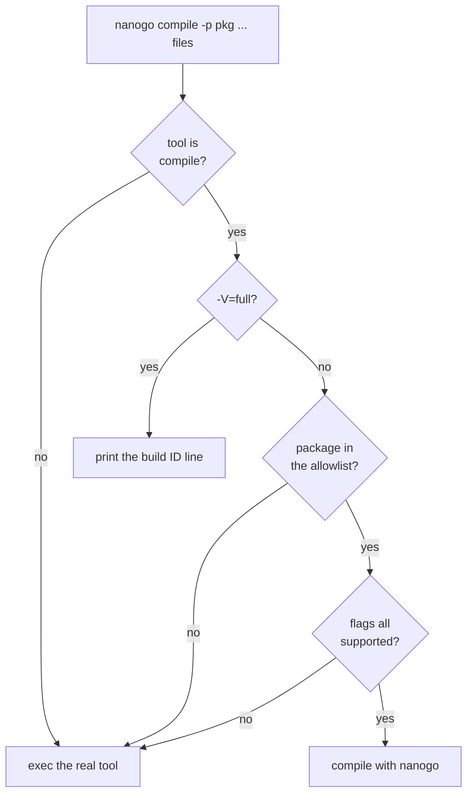

# Build integration

The mechanism that makes [000](000-decisions.md) decision 11 pay: a build in
which nanogo compiles some packages and `gc` compiles the rest, producing one
working binary.

Without it, the first program that runs requires the front end, the middle end,
the backend, the runtime interface, and the object format all to be correct
simultaneously, and a crash has no suspect.

## What is built

The substitution is built and gated. `driver.Run` implements the flowchart
below, `cmd/nanogo/main_test.go` drives a real `go build -toolexec=nanogo` over
a two-package module and runs the result, and a second test puts a package on
the allowlist and asserts the build stops with that package named.

The payload is no longer empty. `driver.Compile` runs the pipeline of
[002](002-architecture.md) and writes the archive `-pack` asks for, and
`internal/e2e` runs a real `go build -toolexec=nanogo ./...` over a module whose
`main` package is on the allowlist. nanogo compiles it, `gc` compiles the
standard library beneath it, the real linker joins them, and the program runs.
A second program in the same shape divides by zero, and the traceback the
runtime prints names both nanogo-compiled functions with the file and the line
each one is on.

What that build compiles is small, and the size is set above the driver.
`driver.Compile` refuses a package that imports another one, because
[015](015-export-data.md) has no reader, and it refuses a composite literal,
because nobody performs [020](020-ir.md)'s lowering table. No allowlist file is
committed, so a checkout still compiles nothing until a build names one.

## `-toolexec`

```
go build -toolexec=nanogo ./...
```

The `go` command runs `nanogo <tool> <args...>` in place of each toolchain
invocation. [`spikes/toolexec`](../spikes/toolexec) measures this on a real
build: 110 invocations for a two-package module, 59 of them `compile`, and a
passthrough that logs and execs produces a working binary. Substitution is per
invocation, which is what makes the allowlist below possible.

The spike also produced the flag set [050](050-driver.md) tabulates, and the
`-V=full` build-ID protocol that the caching claim below depends on. nanogo inspects the tool and the arguments and decides:



The version query comes before flag parsing because `-V=full` is not a compile
flag, and package selection comes before it because a package nanogo does not
own must reach `gc` even when a flag nanogo has never seen appears later on the
line. `driver.scanCompile` therefore reads `-p` and `-fallback` and validates
nothing else.

Everything that is not a `compile` invocation, the assembler, the linker,
`cgo` and `pack`, is passed through to the real tool.

## The allowlist

A file listing the packages nanogo compiles, one import path per line, `#` for a
comment. It starts with one package and grows.

The file is named by the environment variable `NANOGO_ALLOWLIST` and is not in
the repository. The spec said "a file, in the repository", and the variable is
what the driver reads. The reason is that a build selects its own list: a
regression hunt wants one package, CI wants the whole list, and a bisection
wants a list that is not a commit. Two rules follow from the variable being the
interface, and `driver/allowlist.go` states both:

- An unset variable is an empty list, so nanogo compiles nothing and every
  package reaches `gc`. That is the safe state, and it is the state a checkout
  is in today.
- A variable that names a file nanogo cannot read is an **error**, not an empty
  list. A mistyped path would otherwise turn nanogo off silently and for ever,
  which reads exactly like a passing build.

This is the project's actual progress metric, and it is better than a milestone
list because it is mechanical:

| Measure | Read from |
| --- | --- |
| How much of Go nanogo compiles | the allowlist's length |
| Whether it is correct | the tests of those packages, passing |
| What is next | the smallest package not on the list |

That metric reads zero today. Nothing stops a package being listed, and a listed
package that nanogo cannot compile fails by name, which is the mechanism working
as designed. What is missing is a package worth listing: the refusals in
[050](050-driver.md) catch imports, package-level variables and `init`
functions, and a real leaf package has at least one of the three. Until then the
honest measures are the corpus counts in
[004](004-conformance.md): 536 packages of the distribution reach the IR builder
and 17,367 functions reach SSA construction. Neither is a package compiled end to
end, and the allowlist is what will say when one is.

The list is ordered by dependency depth, so early entries are leaves with no
imports and no assembly. `runtime` is last, and reaching it is G3.

### `-p main` is not a package name

The `go` command sends `-p main` for **every** main package, in every module.
This was found by building with the driver in place, not by reading the flags.

So an allowlist of import paths cannot name one main package without claiming
all of them. The rule is therefore: **`main` is never matched by an allowlist
entry.** A main package is compiled by `gc` until nanogo can compile every main
package, which is a later and separate switch.

The cost is that the program's own top-level package is the last thing nanogo
compiles rather than a convenient early target. The alternative, matching on the
output path or the source directory, makes the allowlist depend on the build's
temporary directory layout, which is not something to build a gate on.

**The rule is not enforced, and enforcing it today would leave nanogo with
nothing to compile.** `Allowlist.Has` matches `main` like any other entry, so a
list with `main` on it claims every main package in every module. That was read
out of `driver/allowlist.go` against the rule above, and the first reading of it
was that the check belongs in `Has`.

Building the compiler said the opposite. `main` is the only package a whole
`go build` can hand to nanogo, and the reason is
[015](015-export-data.md), not this rule:

| Direction | What is needed | State |
| --- | --- | --- |
| nanogo compiles a package with an import | an export data **reader** | unbuilt |
| `gc` compiles a package that imports nanogo's | an export data **writer** | unbuilt |

A main package is the one package in a build that neither imports nor is
imported, so it is the only one both columns leave alone. `internal/e2e` builds
a module with `main` on the allowlist, and the program nanogo compiles runs.
Enforcing the rule in `Has` would turn that back into zero compiled packages.

So the rule is a constraint on the **repository's** allowlist file, where `main`
would claim every main package in the Go corpus, and not a mechanism in the
driver. The driver's protection is different and already in place: a package it
owns and cannot compile is an error that names the package, never a silent hand
back to `gc`, so a `main` entry that claimed a main package nanogo cannot
compile stops the build loudly. Reconsider putting the check in `Has` when
[015](015-export-data.md) has a writer, because a non-main package becomes a
better first entry the day it does.

Note which half of [015](015-export-data.md) each step proves. A leaf package
reads no export data, but `gc` compiles its test binary and therefore reads what
nanogo wrote, so the first entry proves the **writer**. The reader is first
exercised one step up, at the first package with an import.

## Why this is better than a self-contained test suite

A package's own tests are adversarial, maintained by someone else, and cover
constructs a compiler author would not think to test. Compiling `strconv` with
nanogo and running `strconv`'s tests is a stronger statement than any corpus
nanogo could write, and it costs nothing to obtain.

It also localises blame precisely. If the binary works with package $P$ compiled
by nanogo and fails when $Q$ is added, the bug is in what $Q$ uses.

## Whole-world mode

The second mode of [000](000-decisions.md) decision 11, for G2 and G3: nanogo
compiles every package including the runtime, and `go build` is not involved.

It uses the same object format, the same export data, and the same ABI. The
difference is only who drives, and the driver is nanogo's own build orchestrator
over the package graph from [014](014-package-loader.md), compiling in
topological order with one process per package.

Unbuilt. `driver.Run` compiles one package per invocation and nothing
orchestrates. The graph half exists: [014](014-package-loader.md)'s G1 loader
returns packages sorted by import path and agrees with `go list` over 520
packages.

## Caching

nanogo does not implement a build cache. In hosted mode the `go` command's cache
applies and is correct **provided nanogo answers `-V=full` with its own
identity**, per [050](050-driver.md). The `go` command derives the compiler's
build ID from that one line and mixes it into every cache key, so a nanogo change
invalidates the affected packages and switching a package between `gc` and nanogo
invalidates it too.

An implementation that echoed the real compiler's version string would build once
and then silently reuse stale objects, which is the failure this paragraph exists
to prevent.

`driver.VersionLine` does answer with nanogo's own VCS revision, so the claim
holds for a stamped build. It does not hold for an unstamped one, where the
identity is the constant `unknown`; [050](050-driver.md) records that gap under
`-V=full`.

In whole-world mode, rebuilds are from scratch. [053](053-determinism.md) makes a
cache possible later; nothing depends on it existing.

## Testing

What runs today, all of it about the mechanism and none of it about a compiled
package:

- `cmd/nanogo/main_test.go` builds the real binary and runs
  `go build -toolexec=nanogo ./...` over a module, then runs the program. The
  passthrough path is therefore gated end to end.
- The same file runs a build with `NANOGO_ALLOWLIST` naming a package and
  asserts the build fails with the package named. That is the selection wiring
  proved in the real binary rather than in process.
- `driver/driver_test.go` covers the branches of the flowchart in process, and
  `driver/allowlist_test.go` covers the file format and the unset and unreadable
  cases.
- `spikes/toolexec` runs in CI and asserts the `go` command still sends
  `compile` invocations and still asks for `-V=full`.

What is still owed, and what the allowlist is for:

- The allowlist itself as the test suite. CI compiles every listed package with
  nanogo and runs that package's own tests. There is no such CI job, because
  there is no package to list.
- A regression gate: a package may not be removed from the allowlist to make CI
  pass. Removal requires a recorded reason, in the same manner as
  [003](003-sequencing.md)'s deviations.
- Both modes build nanogo itself, from M6 onward.
