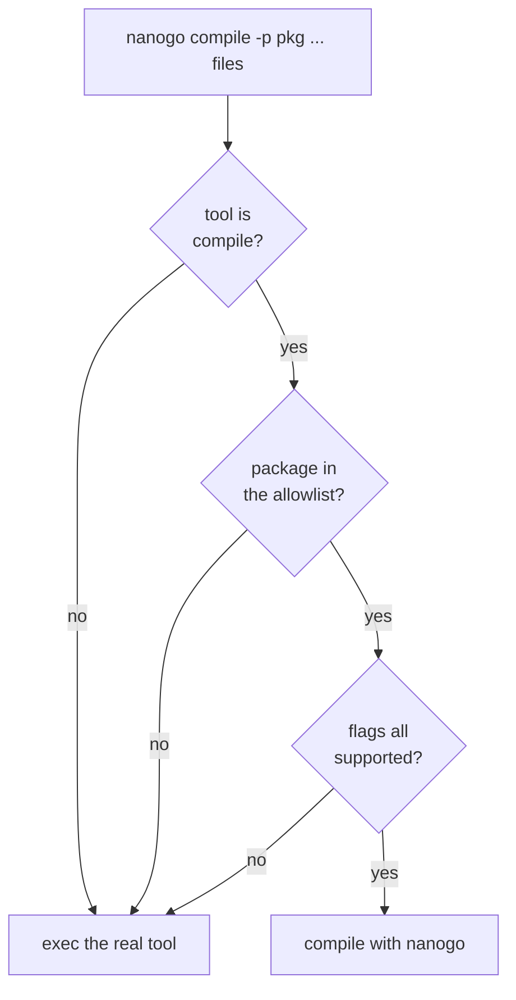

# Build integration

The mechanism that makes [000](000-decisions.md) decision 11 pay: a build in
which nanogo compiles some packages and `gc` compiles the rest, producing one
working binary.

Without it, the first program that runs requires the front end, the middle end,
the backend, the runtime interface, and the object format all to be correct
simultaneously, and a crash has no suspect.

## `-toolexec`

```
go build -toolexec=nanogo ./...
```

The `go` command runs `nanogo <tool> <args...>` in place of each toolchain
invocation. [`spikes/toolexec`](../spikes/toolexec) measures this on a real
build: 110 invocations for a two-package module, 59 of them `compile`, and a
passthrough that logs and execs produces a working binary. Substitution is per
invocation, which is what makes the allowlist below possible.

The spike also produced the flag set [050](050-driver.md) tabulates, and the
`-V=full` build-ID protocol that the caching claim below depends on. nanogo inspects the tool and the arguments and decides:



Everything that is not a `compile` invocation — the assembler, the linker,
`cgo`, `pack` — is passed through to the real tool.

## The allowlist

A file, in the repository, listing the packages nanogo compiles. It starts with
one package and grows.

This is the project's actual progress metric, and it is better than a milestone
list because it is mechanical:

| Measure | Read from |
| --- | --- |
| How much of Go nanogo compiles | the allowlist's length |
| Whether it is correct | the tests of those packages, passing |
| What is next | the smallest package not on the list |

The list is ordered by dependency depth, so early entries are leaves with no
imports and no assembly. `runtime` is last, and reaching it is G3.

### `-p main` is not a package name

The `go` command sends `-p main` for **every** main package, in every module.
This was found by building with the driver in place, not by reading the flags.

So an allowlist of import paths cannot name one main package without claiming
all of them. The rule is therefore: **`main` is never matched by an allowlist
entry.** A main package is compiled by `gc` until nanogo can compile every main
package, which is a later and separate switch.

The cost is that the program's own top-level package is the last thing nanogo
compiles rather than a convenient early target. The alternative, matching on the
output path or the source directory, makes the allowlist depend on the build's
temporary directory layout, which is not something to build a gate on.

Note which half of [015](015-export-data.md) each step proves. A leaf package
reads no export data, but `gc` compiles its test binary and therefore reads what
nanogo wrote — so the first entry proves the **writer**. The reader is first
exercised one step up, at the first package with an import.

## Why this is better than a self-contained test suite

A package's own tests are adversarial, maintained by someone else, and cover
constructs a compiler author would not think to test. Compiling `strconv` with
nanogo and running `strconv`'s tests is a stronger statement than any corpus
nanogo could write, and it costs nothing to obtain.

It also localises blame precisely. If the binary works with package $P$ compiled
by nanogo and fails when $Q$ is added, the bug is in what $Q$ uses.

## Whole-world mode

The second mode of [000](000-decisions.md) decision 11, for G2 and G3: nanogo
compiles every package including the runtime, and `go build` is not involved.

It uses the same object format, the same export data, and the same ABI. The
difference is only who drives, and the driver is nanogo's own build orchestrator
over the package graph from [014](014-package-loader.md), compiling in
topological order with one process per package.

## Caching

nanogo does not implement a build cache. In hosted mode the `go` command's cache
applies and is correct **provided nanogo answers `-V=full` with its own
identity**, per [050](050-driver.md). The `go` command derives the compiler's
build ID from that one line and mixes it into every cache key, so a nanogo change
invalidates the affected packages and switching a package between `gc` and nanogo
invalidates it too.

An implementation that echoed the real compiler's version string would build once
and then silently reuse stale objects, which is the failure this paragraph exists
to prevent.

In whole-world mode, rebuilds are from scratch. [053](053-determinism.md) makes a
cache possible later; nothing depends on it existing.

## Testing

- The allowlist itself is the test suite. CI compiles every listed package with
  nanogo and runs that package's own tests.
- A regression gate: a package may not be removed from the allowlist to make CI
  pass. Removal requires a recorded reason, in the same manner as
  [003](003-sequencing.md)'s deviations.
- Both modes build nanogo itself, from M6 onward.
