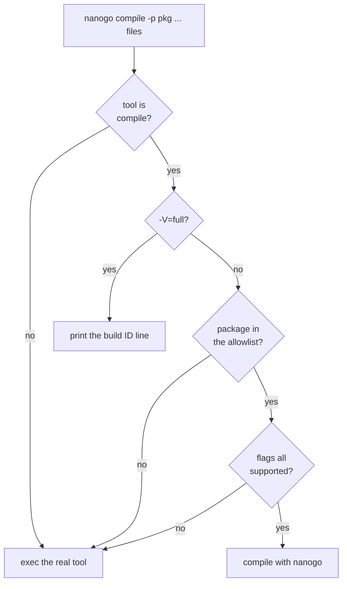

# Build integration

The mechanism that makes [000](000-decisions.md) decision 11 pay: a build in
which nanogo compiles some packages and `gc` compiles the rest, producing one
working binary.

Without it, the first program that runs requires the front end, the middle end,
the backend, the runtime interface, and the object format all to be correct
simultaneously, and a crash has no suspect.

## What is built

Two build paths are built and gated, and they are for different people.

`nanogo build` is the user's. It takes no allowlist and no environment
variable, and it takes no standard library archive from the `go` command when a
distribution is installed. It still runs the `go` command three times, to read
`GOROOT` and the release, to resolve the packages the user named, and to link.
The section further down says so rather than leaving a reader to find out.

The substitution is the compiler developer's. `driver.Run` implements the
flowchart below, `cmd/nanogo/main_test.go` drives a real
`go build -toolexec=nanogo` over a two-package module and runs the result, and
a second test puts a package on the allowlist and asserts the build stops with
that package named.

The payload is no longer empty. `driver.Compile` runs the pipeline of
[002](002-architecture.md) and writes the archive `-pack` asks for, and
`internal/e2e` runs a real `go build -toolexec=nanogo ./...` over a module whose
`main` package is on the allowlist. nanogo compiles it, `gc` compiles the
standard library beneath it, the real linker joins them, and the program runs.
[003](003-sequencing.md) lists the programs that go that route and what each
one proves. One of them divides by zero, and the traceback the runtime prints
names both nanogo-compiled functions with the file and the line each one is on.
Another makes a variadic call under `runtime.GC()`, so the object it allocated
is scanned with the pointer mask nanogo emitted.

What that build compiles is small, and the size is set above the driver.
`driver.Compile` refuses by name whatever any pass in the list refuses, and
every pass narrows the set. Of the Go distribution's 39,947 functions, 24,508
get past SSA construction once [020](020-ir.md)'s lowering pass has run
([003](003-sequencing.md) counts them). Getting past construction is not
compiling. On the corpus measured without that pass, 17,905 functions reach
construction and 17,809 of them lower completely to arm64 operations, so
lowering is where the next refusals are. Code generation narrows it again and
no corpus counts that: `ssagen` has no floating-point encoder and no
floating-point register allocation, so a function holding a `float64`
parameter, local or constant is refused there. A package that imports is no
longer refused: `export/` reads `gc`'s export data, and `internal/e2e` compiles
a package that imports one of its own and a package that imports `math/bits`
and `strconv`. No allowlist file is committed, so a checkout still compiles
nothing until a build names one.

## `-toolexec`

```
go build -toolexec=nanogo ./...
```

The `go` command runs `nanogo <tool> <args...>` in place of each toolchain
invocation. [`spikes/toolexec`](../spikes/toolexec) measures this on a real
build: 110 invocations for a two-package module, 59 of them `compile`, and a
passthrough that logs and execs produces a working binary. Substitution is per
invocation, which is what makes the allowlist below possible.

The spike also produced the flag set [050](050-driver.md) tabulates, and the
`-V=full` build-ID protocol that the caching claim below depends on. nanogo inspects the tool and the arguments and decides:



The version query comes before flag parsing because `-V=full` is not a compile
flag, and package selection comes before it because a package nanogo does not
own must reach `gc` even when a flag nanogo has never seen appears later on the
line. `driver.scanCompile` therefore reads `-p` and `-fallback` and validates
nothing else.

Everything that is not a `compile` invocation, the assembler, the linker,
`cgo` and `pack`, is passed through to the real tool.

## The allowlist

A file listing the packages nanogo compiles, one import path per line, `#` for a
comment. It starts with one package and grows.

The file is named by the environment variable `NANOGO_ALLOWLIST` and is not in
the repository, because a build selects its own list: a regression hunt wants
one package, CI wants the whole list, and a bisection wants a list that is not a
commit. Two rules follow from the variable being the interface, and
`driver/allowlist.go` states both:

- An unset variable is an empty list, so nanogo compiles nothing and every
  package reaches `gc`. That is the safe state, and it is the state a checkout
  is in today.
- A variable that names a file nanogo cannot read is an **error**, not an empty
  list. A mistyped path would otherwise turn nanogo off silently and for ever,
  which reads exactly like a passing build.

This is the project's actual progress metric, and it is better than a milestone
list because it is mechanical:

| Measure | Read from |
| --- | --- |
| How much of Go nanogo compiles | the allowlist's length |
| Whether it is correct | the tests of those packages, passing |
| What is next | the smallest package not on the list |

The allowlist's length still reads zero, because no list is committed. What
nanogo can compile does not. A `func main() {}` needs 27 dependency packages,
and 5 of them reach for no construct nanogo refuses: `internal/goos`,
`internal/runtime/math`, `internal/asan`, `internal/msan` and `internal/race`.
The main package itself compiles too, so 6 of the 28 compile when each is named
on its own command line. Each figure comes from running `nanogo build` on that
one import path, so it is a census and not what one build does: a build reports
one package compiled by nanogo, because nanogo compiles what is named. None of
these figures is gated by `internal/hygiene`, so each moves with a Go release.
[060](060-selfhost.md) owns the census.

What holds the other 22 back is four separate gaps, and the largest is not the
only one:

| Refused by | Packages |
| --- | --- |
| [032](032-type-descriptors-and-itabs.md)'s method set gap, on a declared type an importer would need a descriptor for | 11 |
| [030](030-abi.md)'s missing wrapper, for a package with assembly in it | 8 |
| a package-level variable of type `error`, which needs a function's signature in the IR type (`math/bits`) | 1 |
| a function body no pass accepts | 2 |

The last row holds the one that fits no other bucket. `internal/byteorder` is
an ordinary lowering gap, on `append`. `internal/stringslite` is a register
allocator failure, `no move from s6 to s4` in `Index`, which is neither a
descriptor, an assembly, a data nor a lowering gap
([026](026-register-allocation.md) owns it).

The corpus counts in [004](004-conformance.md) are the second measure, one
level below a package: 536 packages of the distribution reach the IR builder,
and the function counts above say how far past it they get.

The list is ordered by dependency depth, so early entries are leaves with no
imports and no assembly. `runtime` is last, and reaching it is G3.

### `-p main` is not a package name

The `go` command sends `-p main` for **every** main package, in every module.
This was found by building with the driver in place, not by reading the flags.

So an allowlist of import paths cannot name one main package without claiming
all of them. The rule is therefore: **`main` is never matched by an allowlist
entry.** A main package is compiled by `gc` until nanogo can compile every main
package, which is a later and separate switch.

The cost is that the program's own top-level package is the last thing nanogo
compiles rather than a convenient early target. The alternative, matching on the
output path or the source directory, makes the allowlist depend on the build's
temporary directory layout, which is not something to build a gate on.

**The rule is a constraint on the allowlist file and not a mechanism in the
driver.** `Allowlist.Has` matches `main` like any other entry, so a list with
`main` on it claims every main package in every module. Nothing in
`driver/allowlist.go` stops that.

Putting the check in `Has` is now worth reconsidering.
[015](015-export-data.md) reads and writes export data, so a package with
imports compiles and a package nanogo compiled can be imported, which makes a
non-main package a usable first entry. While that was not true, `main` was the
only package a whole `go build` could hand to nanogo, and a `Has` that refused
it would have left nanogo compiling nothing.

The driver's protection is separate and already in place: a package it owns and
cannot compile is an error that names the package, never a silent hand back to
`gc`, so a `main` entry that claimed a main package nanogo cannot compile stops
the build loudly.

## Why this is better than a self-contained test suite

A package's own tests are adversarial, maintained by someone else, and cover
constructs a compiler author would not think to test. Compiling `strconv` with
nanogo and running `strconv`'s tests is a stronger statement than any corpus
nanogo could write, and it costs nothing to obtain.

It also localises blame precisely. If the binary works with package $P$ compiled
by nanogo and fails when $Q$ is added, the bug is in what $Q$ uses.

## `nanogo build`, which is the user's path

`-toolexec` is the compiler developer's path. It substitutes nanogo inside
someone else's build, it needs an allowlist, and everything above is about
making that substitution safe.

A user types `nanogo build .`, and there is no allowlist and no environment
variable. nanogo resolves the package graph itself
([014](014-package-loader.md)), takes the standard library from the tree the
binary is installed in ([054](054-distribution.md)), compiles every package
named on the command line, takes the rest of the graph from the toolchain, and
links.

**A named package is never delegated.** `driver.RunBuild` marks every target
with the `nanogo` producer before it compiles anything, and a target it cannot
compile stops the build with the function, the position and the construct
named. There is no `-fallback` on this path and no allowlist to leave a package
off: a `nanogo build` that exits 0 compiled every package the user named. That
is what makes the counter below a measurement and not a hope.

The `go` command is still in the loop three times, and calling that out is the
point of this paragraph rather than a caveat at the end of it. `nanogo build`
with no `go` on `PATH` fails immediately and says so, from a repository build
and from an unpacked distribution's own `bin/nanogo` alike:

```
nanogo: nanogo build needs the go command to resolve the packages you name and to link them: exec: "go": executable file not found in $PATH
```


| What | Why it is still the `go` command's | What removes it |
| --- | --- | --- |
| `go env GOROOT GOVERSION` | the root and the release identify the toolchain a delegated package is compiled by and the archives are linked against | [054](054-distribution.md) |
| `go list` over the patterns the user named | module resolution, vendoring and the build constraint rules decide which files a package has, and [014](014-package-loader.md)'s G2 loader is unbuilt | [014](014-package-loader.md) |
| `go tool link` | nanogo has no linker | [045](045-linker.md) |

What it is **not** in the loop for is the standard library. Every archive under
the distribution's `pkg/GOOS_GOARCH` is named in the `-importcfg` from that
tree's `MANIFEST`, and asking the `go` command for an export file, which is
what would build one of those packages with `gc`, never happens. A standard
library package the tree does not hold is a refusal naming the package and the
tree, never a substitution from the ambient toolchain.

Two things are checked before a build against a distribution starts, because
both fail late and unreadably otherwise:

1. **The tree agrees with its own manifest.** `dist.TallyTree` requires a
   record per archive, an archive per record, and a matching SHA-256. A tree
   that cannot say what compiled it cannot be built against.
2. **The installed `go` command is the release the tree was built with.**
   `driver.writeOutput` copies the `go object ...` header line verbatim from
   the installed toolchain ([054](054-distribution.md)), so a different release
   produces a `main` object whose header disagrees with every archive in the
   tree. The refusal names both releases and the tree; the link failure names
   two releases and neither.

| | `-toolexec` | `nanogo build` |
| --- | --- | --- |
| Who decides which packages nanogo compiles | the allowlist file, per invocation | the command line: every package named, or the build fails |
| Who resolves the graph | the `go` command | `driver/build.go` |
| Where the standard library comes from | the ambient toolchain | the tree beside the binary, or `NANOGOROOT`, or the ambient toolchain when there is no distribution |
| Who computes `-p` | the `go` command | nanogo |
| Cache | the `go` command's | none |

The last two rows change what the `-p main` rule above binds. nanogo computes
the package path itself here, so a main package is not the ambiguous `-p main`
the `go` command sends, and the rule that `main` is never matched by an
allowlist entry has nothing to constrain on this path.

Every build reports how many packages nanogo compiled and how many the
toolchain did, on success and on failure alike, with the tree the standard
library came from and the line that says `go tool link` wrote the executable.
That report is the defence against the failure [054](054-distribution.md)
names: nanogo compiles the packages on the command line and the toolchain
compiles the rest of the graph, so a build that exits 0 says nothing on its own
about how much of the program nanogo produced.

## Whole-world mode

The third mode, and the one neither of the two above is: nanogo compiles every
package including the runtime, for G2 and G3
([000](000-decisions.md) decision 11).

It uses the same object format, the same export data, and the same ABI. The
difference is only who drives.

**The orchestrator is built and the mode is not.** `nanogo build` is that
orchestrator, and every package the user did not name comes from `gc`.
Whole-world mode is the same command with nothing left to take from `gc`, which
needs the
runtime's rules ([034](034-write-barriers.md),
[035](035-goroutines-and-stack-growth.md)), the assembler
([044](044-plan9-assembler.md)) and the linker ([045](045-linker.md)). The
counter `nanogo build` prints is the distance. A build of a user's program
reports one package of twenty-eight compiled by nanogo and twenty-seven by the
toolchain, because nanogo compiles what the command line names and the whole
bootstrap closure is beneath it. A distribution tree reports zero of its
twenty-seven archives compiled by nanogo, which
[054](054-distribution.md) records.

## Caching

nanogo does not implement a build cache. In hosted mode the `go` command's cache
applies and is correct **provided nanogo answers `-V=full` with its own
identity**, per [050](050-driver.md). The `go` command derives the compiler's
build ID from that one line and mixes it into every cache key, so a nanogo change
invalidates the affected packages and switching a package between `gc` and nanogo
invalidates it too.

An implementation that echoed the real compiler's version string would build once
and then silently reuse stale objects, which is the failure this paragraph exists
to prevent.

`driver.VersionLine` does answer with nanogo's own VCS revision, so the claim
holds for a stamped build. It does not hold for an unstamped one, where the
identity is the constant `unknown`; [050](050-driver.md) records that gap under
`-V=full`.

In whole-world mode, rebuilds are from scratch. [053](053-determinism.md) makes a
cache possible later; nothing depends on it existing.

## Testing

What runs today:

- `internal/e2e` installs the binary and drives real builds through it, each
  one a module nobody wrote for a harness, and runs the program that comes out.
  That is the mechanism and the payload together, which is the pairing the four
  unwired passes of [032](032-type-descriptors-and-itabs.md) got past.
- `cmd/nanogo/main_test.go` builds the real binary and runs
  `go build -toolexec=nanogo ./...` over a module, then runs the program. The
  passthrough path is therefore gated end to end.
- The same file runs a build with `NANOGO_ALLOWLIST` naming a package and
  asserts the build fails with the package named. That is the selection wiring
  proved in the real binary rather than in process.
- `driver/driver_test.go` covers the branches of the flowchart in process, and
  `driver/allowlist_test.go` covers the file format and the unset and unreadable
  cases.
- `spikes/toolexec` runs in CI and asserts the `go` command still sends
  `compile` invocations and still asks for `-V=full`.

What is still owed, and what the allowlist is for:

- The allowlist itself as the test suite. CI compiles every listed package with
  nanogo and runs that package's own tests. There is no such CI job. The list
  is no longer empty, since five packages of the bootstrap closure compile, but
  running a package's own tests means compiling its test binary, which reaches
  for every construct the tests use and not only the ones the package itself
  needs. [004](004-conformance.md)'s corpus is what measures the gap until
  then.
- A regression gate: a package may not be removed from the allowlist to make CI
  pass. Removal requires a recorded reason, in the same manner as
  [003](003-sequencing.md)'s deviations.
- Both modes build nanogo itself, from M6 onward.

## What was wrong

**The allowlist was specified as a file in the repository.** It is an
environment variable naming a file, because a build selects its own list. No
list is committed, so a checkout compiles nothing until a build names one.

**The `-p main` rule was read as a check `Allowlist.Has` owed.** It was not
added, and the reason at the time was [015](015-export-data.md) rather than the
rule: with neither direction of the export data built, a main package was the
only package in a build that neither imports nor is imported, so it was the only
one nanogo could be handed. Enforcing the rule in `Has` would have left nanogo
compiling nothing. That reason is gone, and the rule is stated above as what it
is, a constraint on the file.

**The package census read 5 compiled and 23 refused, of 28.** Re-measured on
go1.27.0 darwin/arm64 by running `nanogo build` on each import path, it is 5 of
27 dependencies compiled and 22 refused, with the main package compiling as
well. The composition moved in two directions at once, which the total
concealed: the descriptor row went from 10 to 11 and the function-body row from
4 to 2.

**The four-row taxonomy had no bucket for a register allocator failure.**
`internal/stringslite` is refused by [026](026-register-allocation.md) and not
by a descriptor, an assembly, a data or a lowering gap. The row above names it
rather than filing it under lowering.

**The reach of `driver.Compile` was stated as the fraction of distribution
functions that get past SSA construction.** Getting past construction is not
compiling. Lowering refuses more, and code generation refuses every function
that touches floating point, which no corpus in [003](003-sequencing.md)
counts.
