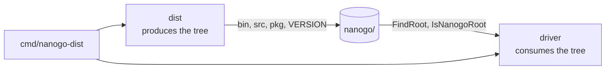

# Distribution

nanogo ships as a tarball with the standard library inside it, in the shape Go's
own distribution uses:

```
nanogo/
  bin/nanogo
  bin/nanogo-dist
  src/...                    the pinned standard library sources
  src/LICENSE, src/PATENTS   Go's licence, beside the files it governs
  pkg/darwin_arm64/*.a       the archives built from them
  LICENSE                    nanogo's own
  VERSION                    the nanogo release, the Go release, and the tally
```

Released as `nanogo<version>.darwin-arm64.tar.gz` with a `SHA256SUMS` file.

Until this, the only way to get nanogo was `go install
golang.design/x/nanogo/cmd/nanogo@latest`, which gives a binary with no standard
library beside it and needs an installed Go toolchain to be useful at all. The
tree here is what [050](050-driver.md)'s `driver.FindRoot` resolves, so a build
takes its standard library from a directory the user can name and inspect
rather than from whichever toolchain happened to be on the machine.

## What is built

`dist/` builds and audits the tree, `cmd/nanogo-dist` drives it,
`.github/workflows/release.yml` runs it on a tag, and
`internal/release` unpacks the result and runs what comes out.

The measured facts, from a build of this commit on darwin/arm64:

| | |
| --- | --- |
| Tarball | 24,196,705 bytes compressed, 88 MB unpacked, 4,431 files |
| `src/` | 57 MB, the standard library without `cmd`, tests and testdata |
| `pkg/darwin_arm64/` | 18 MB, 27 archives |
| `bin/` | 12 MB, `nanogo` and `nanogo-dist` |
| Compiled by nanogo | **0 of 27** |
| Byte-reproducible | yes, across two build directories |

The tally is the number this spec is written around, and the rest of it
explains why a zero is worth building infrastructure for.

## The claim a distribution is not allowed to make

nanogo compiles no package of the bootstrap closure. Not one. So every archive
in the first tarball is `gc`'s work.

That is acceptable and it is honest. What is not acceptable is a tarball that
ships `gc`-compiled archives under a nanogo name with nothing saying so, and
this repository has already been caught by exactly that class of error once: an
allowlist named a package that the `go` command spelled differently, nanogo
silently delegated the whole build to `gc`, and the program printed the right
answer from `gc`-compiled code. Build success proves nothing when delegation is
the fallback. A distribution is a far larger surface for that error than a hand
test was, because it is copied, mirrored and cited long after anyone remembers
how it was made.

### Why the bytes do not already say it

The obvious answer is to read the producer out of the object header. It does not
work, and the reason is a decision taken elsewhere for good cause.

Every Go object starts with a line naming the toolchain:

```
go object darwin arm64 go1.27.0 GOARM64=v8.0 X:regabiwrapper,...
```

`driver.writeOutput` writes that line **verbatim from the installed toolchain**,
because [051](051-build-integration.md)'s build is part nanogo and part `gc` and
the linker rejects objects whose headers disagree. So a nanogo object and a `gc`
object carry the same header by design, and nothing in the bytes distinguishes
them.

The producer therefore has to be recorded, and recorded by the producer.

### The record

Each archive carries a `__.NANOGO` member:

```
nanogo-package 1
path internal/abi
producer gc go1.27.0
```

Three properties, and each one is required:

1. **It is inside the archive.** A sidecar file can be lost, and a manifest can
   be regenerated from what someone expected the tree to hold rather than from
   what it holds.
2. **It is appended, never prepended.** The compiler's importer requires
   `__.PKGDEF` to be the archive's first member and reports `not a package file`
   for anything else, which was found by putting the record first and watching
   `os` stop importing. At the end it is invisible to both readers a build has:
   `cmd/link` skips a member whose name is short and whose extension is not `.o`
   or `.syso`, and the importer has already found what it came for.
3. **Its absence is an error.** An unmarked archive is not assumed to be `gc`'s.
   Defaulting it would recreate the delegation trap one level up: a tree that
   reports what it was expected to hold. `dist.TallyTree` fails on the whole
   tree if one archive cannot account for itself.

`dist.Build` never asserts a producer of its own. An archive that arrives with a
record keeps it, which is the case a nanogo compile will produce. An unmarked
one is `gc`'s, and the release it names is read out of *its own object header*
rather than taken from the release job's belief about the toolchain.

### The tally, and the two denominators

```
nanogo: 0 of 27 packages in the bootstrap closure compiled by nanogo; 27 by gc go1.27.0
```

`nanogo-dist tally` prints it for any tree, and with no argument it reads the
tree the running binary is installed in, so an unpacked tarball answers for
itself with nothing else installed. That is why `nanogo-dist` ships inside the
tarball.

The bootstrap closure is the dependency set of the smallest Go program there is:

```go
package main

func main() {}
```

`go list -deps` reports **29** entries for it. Two of them hold no archive: the
program itself, and `unsafe`, which has no code. So `pkg/` holds **27**, and 27
is the denominator the tally uses. Both numbers are written down here because 27
alone reads as two packages lost somewhere.

The count is measured by `dist/closure_test.go` on every run rather than pinned,
because the closure moves between Go releases and a gate that failed on a Go
upgrade is a gate people switch off.

### The counter is checked, not just written

`VERSION` states the tally:

```
nanogo0.1.0
go go1.27.0
target darwin_arm64
packages 27
nanogo 0
gc 27
```

`dist.VerifyTree` recomputes all three counts from the bytes of every archive
and fails on a disagreement, and `dist.Build` runs it as its last act, so a tree
that builds without an error is a tree whose `VERSION` has already been checked
against its contents. A counter added later is one nobody trusts; this one
cannot be written without being compared.

`VerifyTree` also requires every `gc`-produced archive to name the release
`VERSION` pins. That is not hypothetical. `ci.yml` uses
`go-version: '1.27.x'` with `check-latest: true`, which resolves to whatever
patch release exists on the day, and a release built that way would put
`go1.27.3` in 27 archives while `VERSION` claimed `go1.27.0`. The release job
checks the toolchain against `driver.PinnedGoVersion` before it copies anything,
so the failure arrives in ten seconds rather than at the end of a long job.

## Where `src/` comes from

From the pinned toolchain's `GOROOT`, at release time. **No copy of Go's
standard library is committed to this repository.** It is 126 MB, it would have
to be kept in step by hand, and the pin already exists in
`driver.PinnedGoVersion`.

`dist.IncludeSource` is the filter, and the rule is stated in code rather than
buried in a shell script, because a filter nobody can read is a filter nobody
dares change:

| Dropped | Why |
| --- | --- |
| `cmd/` | a separate module holding the Go toolchain's own source. A nanogo distribution carries the standard library; [062](062-distribution-build.md) is about nanogo compiling a Go *checkout*, which is a different tree |
| `testdata/` and `*_test.go` | nothing in the tree compiles a test, and they are 43% of `GOROOT/src` |
| the top-level `.bash`, `.bat` and `.rc` scripts | they drive Go's own bootstrap and would be run by mistake from a tree that cannot bootstrap anything |

126 MB becomes 57 MB. Everything else is copied, assembly and `.h` files
included, because a package whose non-Go files were dropped is a package that
does not build and says nothing about why.

Go's `LICENSE` and `PATENTS` are copied to `src/LICENSE` and `src/PATENTS`, so
the path says which files they govern. nanogo's own licence sits at the root and
governs everything else. This is a redistribution and the licence travels with
it.

## Prebuilt archives, not build-on-first-use

The open question was whether the tarball ships `pkg/` or ships `bin/` + `src/`
and builds the standard library on first use. Go does the latter for anything
not prebuilt, and has shipped no prebuilt standard library since 1.20.

nanogo ships `pkg/`. Three reasons, in order of weight:

1. **`driver.IsNanogoRoot` requires it.** A tree is a distribution when it has a
   `VERSION` file *and* a `pkg/GOOS_GOARCH` directory. Ship no archives and
   either the tree is not recognised, in which case `FindRoot` falls through to
   the ambient `GOROOT` and the download is inert, or an empty `pkg/` passes the
   predicate and every link fails.
2. **nanogo compiles 0 of 27.** Building on first use would build nothing.
3. **Building them with `gc` needs the toolchain the tarball exists to remove.**
   A distribution that requires an installed Go to become usable is the
   `go install` story with extra steps.

Go's reasoning is sound for Go, and the difference is not philosophical: Go's
compiler can build its own standard library and nanogo's cannot yet. The
tradeoff is a 23 MB download instead of a 6 MB one, and 18 MB of that is
archives that will be rebuilt by nanogo one at a time as
[051](051-build-integration.md)'s allowlist grows. **This decision inverts at
G3.** When nanogo compiles the closure, shipping sources and building on demand
becomes the better answer, and the tally is what will say when that day arrives.

## Reproducibility

[053](053-determinism.md) is a rule about the compiler and a distribution is not
the exception. A tarball whose checksum moves cannot be checked against a
published one.

Three things break it and all three are fixed rather than inherited:

| Source | Rule |
| --- | --- |
| Entry order | sorted by path, never the order the file system reports a directory in |
| Timestamps | every entry carries the epoch. Not the zero time, which is outside a ustar header's range and makes the writer emit a PAX record whose content depends on the Go release |
| File modes | `0755` and `0644`, written rather than copied, so a checkout made under a different umask packs the same |

Two more that are less obvious. The tar format is pinned to PAX rather than left
to the writer's choice, which otherwise depends on the longest path in the tree;
and gzip's level is pinned and its header emptied, because its OS byte has moved
between Go releases.

`-trimpath` is not optional anywhere. `dist.Closure` passes it to `go list`, and
without it every archive carries the absolute path of the directory it was built
in.

The check is the two-directory one, in `internal/release` and in the release
job. Building twice in one place passes even when a path leaked, which is why
`ci.yml`'s determinism job copies to a second path, and this follows it.

What is **not** checked here is that `gc` produces the same archive twice. It
does, by the construction of its build cache, and it is Go's property rather
than nanogo's. What is checked is that the same inputs give the same tarball.

## The seam with the driver

Two packages, one tree, and no import between them.



`dist` imports nothing from `driver`, deliberately: an import either way would
stop the driver from calling `dist.TallyLine`, which is the one function a
`nanogo version -v` needs. The target directory is a string parameter rather
than `driver.TargetDir()`, and the pin is defaulted in `cmd/nanogo-dist`, which
may import both.

## Testing

`internal/release` builds the real tarball and then proves four things in the
order a user meets them:

1. It opens with the `tar` a user has, not only with `archive/tar`.
2. `driver.IsNanogoRoot` and `driver.FindRoot` resolve the unpacked tree from
   the binary's own location, with nothing in the environment and no Go
   toolchain offered as a fallback. The consumer's own predicate is the
   assertion, so the seam is tested from the far side.
3. The unpacked `bin/nanogo-dist` reports the tally with no argument.
4. A program compiles through the unpacked `bin/nanogo` and links against
   archives that come only from the tree, named one by one in an `-importcfg`,
   then runs and prints what it was meant to.

The program uses `println` and not `fmt`, because `fmt` is not in the bootstrap
closure and a distribution that held it would not be this one.

**The delegation is asserted, not inferred.** nanogo compiles no package of this
closure, so its log must record a delegation. A program that ran is not evidence
that nanogo compiled it, and the test says so in the one place where a future
reader might assume otherwise.

## What this does not do

- **The two tool binaries still come from `GOROOT`.** The compile is driven
  through the unpacked `bin/nanogo`, and every *archive* comes from the tree,
  but `go tool compile` and `go tool link` are the toolchain's. That is
  [061](061-toolchain-independence.md)'s work and [045](045-linker.md)'s, and
  the test comment says so where a reader would otherwise assume the tree is
  self-sufficient.
- **`nanogo build` is not this spec.** [050](050-driver.md) owns the command
  that consumes the tree. This spec produces it.
- **One platform.** darwin/arm64, per [000](000-decisions.md) decision 9.
  `ci.yml`'s cross-compile job proves the compiler *builds* from any host; it
  does not make a second target exist, and a release naming one would be a
  download that compiles nothing.
- **`nanogo version` does not print the tally yet.** `dist.TallyLine` is one
  function and wiring it is one line, in `driver`, which this work does not
  touch.
