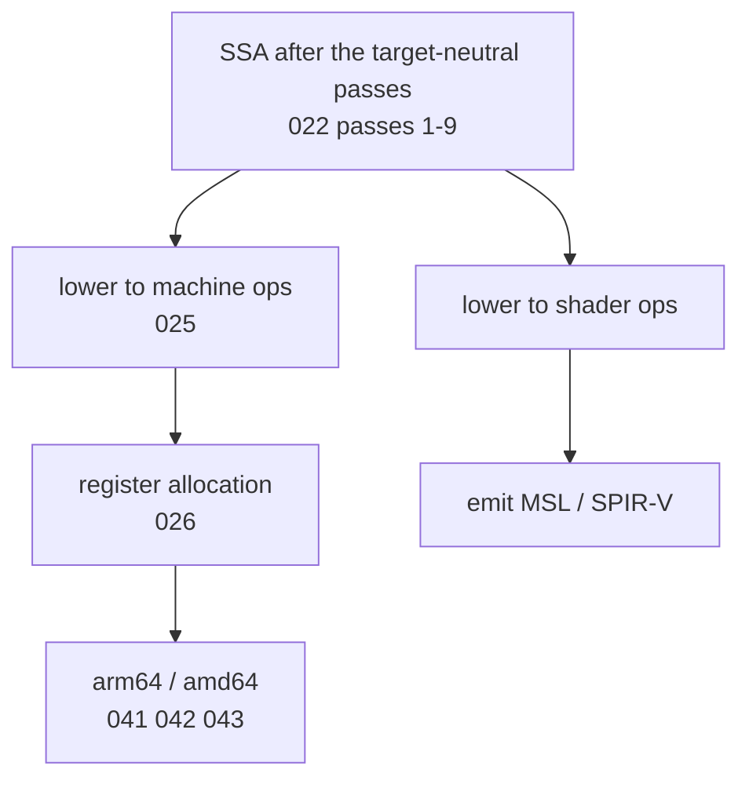

# GPU targets

Post-v1 and unscheduled, and nothing in this spec is built: there is no shader
target, no second consumer of the SSA, and no target-neutral pass list for one
to attach to. It is specified now for one reason: to fix where it attaches, so
that no earlier decision is taken to suit it.

[000](000-decisions.md) decision 5 states the constraint and it is the governing
sentence of this spec: **a GPU backend is a consumer of the SSA and never a
driver of it. No decision in this deck may be taken to suit this target.**

## The context

[`golang.design/x/accel`](https://github.com/golang-design/accel) runs compute on
the GPU from Go with no `cgo`. Kernels are written in a subset of Go and compiled
ahead of time. Its compiler is `internal/kernelc`, with a `front` built on
`go/packages` and `go/types`, its own `ir`, and an `emit` stage producing Metal
Shading Language.

So a Go-subset-to-GPU compiler already exists and works. This spec is not a
proposal to replace it. It is a statement of what nanogo would offer it if the
two ever met: one front end, one IR, and one set of analyses shared between a CPU
target and a shader target, instead of two compilers that must be kept in
agreement.

## The attachment point

After [022](022-optimization-passes.md)'s target-neutral passes and before
[025](025-lowering-and-rules.md)'s machine lowering. A shader target supplies its
own lowering and its own emitter, and it does not reach
[026](026-register-allocation.md), because a shading language does not allocate
registers.

That is the entire attachment. If a GPU requirement ever needs a change above
that line, [000](000-decisions.md) decision 5 refuses it and the requirement is
met some other way.

## What a shader target cannot have

The subset is narrower than Go, and the exclusions are structural rather than
temporary:

| Excluded | Why |
| --- | --- |
| Heap allocation | No allocator on the device |
| Garbage collection, and therefore [027](027-liveness-and-stackmaps.md) | No collector |
| `defer`, `panic`, `recover` | No unwinding |
| Goroutines, channels, `select` | A different execution model entirely |
| Interfaces and dynamic dispatch | No indirect calls in most shading languages |
| Recursion | Not permitted by most shading languages |
| Most of the standard library | No runtime |

The exclusions must be *checked and rejected with a position*, not silently
miscompiled. accel's `kernelc` already does this and its rejection corpus is the
model.

## Why the shared IR is worth something

The argument is the one accel's own spec makes for its CPU lowering: two
implementations of the same computation drift, and comparing them is comparing
two programs rather than checking one.

If a CPU backend and a GPU backend consume one SSA graph, then the CPU result is
an oracle for the GPU result by construction. That is a stronger conformance
position than any test corpus provides, and it is the only reason this target is
in the deck at all.

## Status

Unscheduled, M10 in [003](003-sequencing.md), and dependent on nothing before
G1. Nothing in the deck blocks on it and nothing in the deck is shaped by it.
